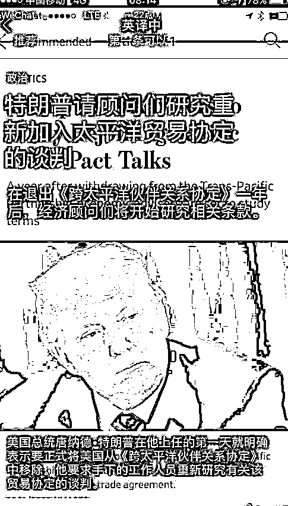
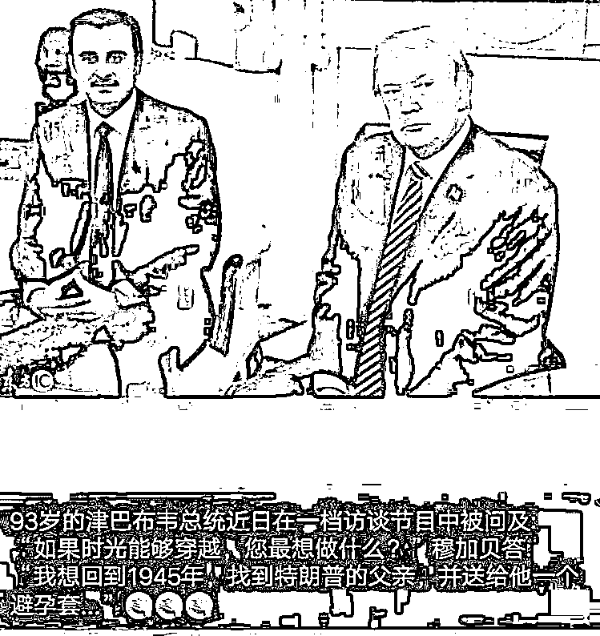
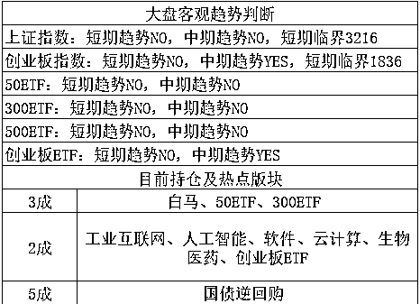

# 特朗普的最新推特直接刷新底线，你需要了解一下

昨天，我已经和大家说过特朗普在 24 小时内发布的 12 条推特，直接让叙利亚化武危机对世界股市的影响产生了大幅波动，否认之前要即将发射导弹的话，让俄罗斯和美股全面高开，直接刷新了人类对大国总统的三观，从未见过如此脸皮厚和不在乎个人信用形象的美国总统。 

但是今天，特大嘴再度发布了一条推特，直接刷新了认知的底线，用朝令夕改都不足以形容这件事的荒谬程度，我觉得大家需要了解一下。

《跨太平洋伙伴贸易协定》简称 TPP，是一项非常重要的经贸组织协定，是奥巴马的重要谈判成果。在特朗普上任的第一天，直接宣布单方面退出这个协定，理由是美国在里面很吃亏。。。。

好吧，你说吃亏就吃亏吧，美国在这个经贸协定里到底吃亏还是受益，的确是错综复杂的，你要硬说美国吃亏，也不太好反驳。但是，在亲自退出而且是上任第一天就高调宣布的东西，一年之后，重新宣布研究加入，这是个什么意思，做人不要面子的啊，何况是大国总统，这种事情既然已经做这么绝了，后面就算要认错也是拉扯一个新的，换汤不换药的经贸组织啊，不能说重新加回，脸都被打肿了啊。

在这种情况下，自己证明自己去年推出 TPP 是对美国经济不利的总统，我不知道美国选民现在心的到底是个什么滋味。在这种情况下，白宫新闻秘书桑德斯今天还宣布：中方提出的开放措施不足以阻止特朗普总统考虑对来自中国的 1500 亿美元进口产品征收关税。

简单的说，中国前几天给的让步和好处，美国不满意，还要更多好处，怕不怕谈崩，不怕，谈崩之后，过了一年，让经济顾问研究一下如何重新和中国和好就行了，面子什么的，无所谓啦。

津巴布韦的总统，是这么评价特朗普总统的

很黄很暴力，我就不多评价了，不过心情和他是差不多的，我现在已经把特朗普的推特当段子看了，股市坚决不能根据他的话进行推断，否则简直咋死的都不知道，现在就是按股市原趋势走，他的话也顶多影响一个开盘价，一切还是以美国官方文件为准，那个至少还能管一年吧，不像现在只管一天。

~~~

今天，领导在海南发表了重要讲话，宣布建设自由贸易试验区和中国特色自由贸易港，发挥自身优势，大胆探索创新，着力打造全面深化改革开放试验区、国家生态文明试验区、国际旅游消费中心、国家重大战略服务保障区。海南要努力成为新时代全面深化改革开放的新标竿，形成更高层次改革开放新格局。

说来奇怪，海南这个地方，改革开放以来就没少给优惠政策，给的政策其实不亚于深圳，但是始终半死不活，无法跳出旅游城市的局限性，而对于今天放出的大型利好消息，我看了一下今天的海南板块，-3.4%

在中国，国家级利好消息是无法保密的，散户肯定不知道，但是大机构大资金肯定是知道，今天跌那么多有点不正常，所以我感觉下周，海南高开低走的概率，比高开高走的概率是要大上许多的。

* * *

关于股市部分我就不评论了，最近每天都在抽时间打磨课程，力争做到绝对精品，非常耗精力，预估耗时非常长，所以也很累，周末再说。

~

创业板今天加了 1 成仓，后面的继续待命，越跌越买，但是因为是全 no，所以总仓位会进行妥善控制，上证还是原计划，涨起来就卖进行调仓。 

紫色的股

经济-金融-投资