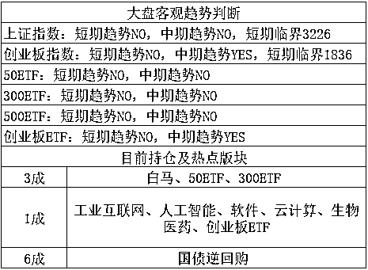

# 全球股市都在特朗普的推特中瑟瑟发抖

**炒股这么多年，第一次见到特朗普这样的总统，也第一次见到特朗普这样的总统+推特的组合威力，**最近十几天，全球股市都在特朗普的推特中瑟瑟发抖，每天的第一关注点都是特朗普今天发了啥，对明天有啥影响，整个技术走势受此干扰非常大，也是醉了。

在过去的 24 小时内，特朗普总统发布了足足 12 条推特，真是惭愧，我自己再各大网站发的短微博公众号之类的合计起来都没有 12 条，特总统这才是标准的网红啊。

还记得昨天的叙利亚化武危机吗？昨天下午特朗普发布推特，让俄罗斯准备好，因为美国的导弹即将抵达。而俄罗斯则发誓要击落任何所有发射向叙利亚的导弹。昨天的推特原文是：“美国和俄罗斯的关系从未如此糟糕，并警告莫斯科做好准备，美国对叙利亚涉嫌使用化学武器的导弹打击随时即将到来。”并声称：“俄罗斯发誓将击落所有射向叙利亚的导弹，做好准备把俄罗斯，因为导弹要来了，是精良、崭新且聪明的，你不该和用毒气杀害自己人民并以此为乐的畜生为伍”

握草，别说是大国总统，就算是街头两个普通人对骂，说到这个份上那都属于撕破脸了，对于大国政治家而言，不管实际关系多恶劣，大部分时间的场面上都是你好我好，不到最后时刻都不会撕破脸，不然为什么书上都说政治家是笑里藏刀，那是政治家所必须的素质。

这位美国总统倒好，还没咋样呢，都比开战还开战了，如此严厉的措辞，以前只有日本偷袭珍珠港，或者美国 911 恐怖袭击的时候才会使用，那是真的急眼了。

而昨天美国总统这种狠话都放出来之后，你知道今天他又说了啥嘛？他发了一条推特：从未说过对叙利亚的打击将在何时开始，可能很快也可能很久之后。

你在逗我吧，既然你今天要这么说话，昨天你干嘛要放那种狠话，就算是为了谈判施压，也没有这样 24 小时不到就改口的吧大国总统的信用和体面还是要的吧。这位总统的脑神经回路真的是奇葩一朵。。。

受这条推特影响，美股跳空高开然后高走，俄罗斯股市更是大涨 4%，现在已经有网友建议 FBI 调查特朗普是不是通过推特操纵股市牟利了。。。全球股市都在特大嘴的阴影中瑟瑟发抖，谁都不知道他明天会说啥，对于这样的总统我也很无奈，只能尽量的取综合中值考虑去规避他发言的剧烈影响，如果跟着他的节奏走股市，骨头渣都不剩了。

~~~

中央军委今天上午在南海举行隆重阅兵仪式，在于炫耀国威，震慑外敌，敏感时期不宜评论过多，一笔带过，对于股市的影响，足够对冲叙利亚危机缓和对军工带来的不利影响。

* * *

今天最热的主题板块是泛金融狂欢，其炒作逻辑是中国即将进行的金融开放改革，有人说进行改革不是利空金融板块吗？的确是利空，但是要看利空谁，利空的主要是正牌银行，那些有垄断嫌疑的金融机构，对于这些机构而言，进行开放是妥妥的利空，这一点没有问题。但是对于泛金融而言，那就不一样了。

什么是泛金融，这名字好听，其实就是金融系统的杂牌军，那些民营的金融机构，就是给银行大哥干苦活累活的，泛金融的大哥大就是支付宝，也只敢做银行不要的小额客户，银行一威压，立马认怂退步，绝对不敢碰银行的饭碗，这就是所谓的泛金融。

那么银行业进行改革开放，不管怎么改，哪怕只改一点点，都是对他们构成利好，都允许外资进来吃饭了，本土资金难道不允许，这是不可能的。

* * *

对于大盘，昨天我和大家的判断是，上证指数经过筑底之后开始反弹，预估是可以补缺口的，我们的策略是看多，但不会追高，反而会在补缺之后，分批卖出，3250-3300 大幅减仓进行调仓换股。对应的，我们会 1806-1826 逢低加仓创业板，首先是创业中期看多，其次是因为 ETF 获得了大额申购，这些昨天都分析过了。

今天的走势，创业板非常强势，最低点没有击破 1826，全天大部分时间都是红的，尾盘才跳水，收盘 1826.89。这一点符合昨天的预期，或者说比昨天的预期要强，我昨天的判断逻辑是因为估计上证在近期几天会补缺，担心卖出之后仓位过轻，所以打算提前布局创业，所以才一口气打算 1806-1826 加仓 2~3 成的。

但是今天上证的走势就有点弱了，刚走二步又要休息下，没有一口气上攻，首先上证只是短期反弹，大势不改这个是预期内的，但是短期没有迅猛上攻，那我们的计划就要修改修改了，修改的逻辑是，不担心上证迅速补缺口，我开始卖出导致仓位过轻，这样我就有足够的时间去等创业板慢慢下跌了。

所以，我决定 1806-1826 区域，择机加仓 1 成，其余的等一等，等局势发生改变，或者上证接近减仓区域，再动手。 

~

继续全 no，我估计明后天就有机会进行创业的首次加仓，然后就是分批进行上证的冲高减仓和创业的逢低加仓，直到一轮波段走完。

紫色的股

经济-金融-投资