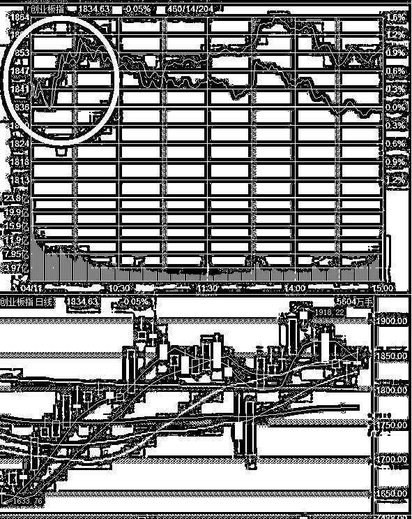
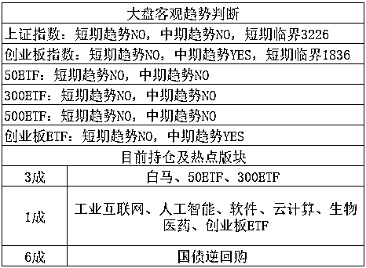
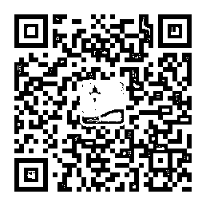

# 俄美在叙利亚掐起来了，美国宣布将进行导弹袭击

今天，发生了一个重大事件，俄罗斯和美国在叙利亚问题上掐起来了，美国官方宣布必将对叙动武，而俄罗斯表示将会全力阻止美国，战争一触即发，让我们来看看事件经过。

今天上午 10 点，联合国进行了叙利亚化武问题表决，英法美否决了俄国的提案，俄国否决了美国等 9 国提案，中国支持了俄国提案，中国对美国提案弃权。美国常驻联合国代表黑莉表示，历史将记录此刻，不管安理会是否履行其责任，美国都将对叙动武。俄罗斯黑海舰队宣布所有舰船进入一级战斗警戒状态，预计 24 小时内美国将对叙动武。

下午，特朗普发布推特，让俄罗斯准备好，因为美国的导弹即将抵达。而俄罗斯则发誓要击落任何所有发射向叙利亚的导弹，双方就在这掐上了。相对应的，俄罗斯股市再度大跌，而这次美股期货也跟着大跌了。

这个所谓的叙利亚化武危机到底是个什么东西，我来给大家说一下，其实这个危机并不是今天爆发的，2013 年就开始了，当时叙利亚搞内战，在政府军即将扫清反对派的时候，反对派指责政府军使用化学武器，引发几千人的伤亡，引来欧美国家的强烈指责，然后欧美决定立刻向反对派输送武器进行支援，插手叙利亚内政，经过调查之后，认定化学武器是有的，但是究竟是何人释放的就不清楚了，没有任何证据能够证明是政府军释放的。

而这一次又是什么原因呢，这一次是因为叙利亚政府军和反对派之间爆发了惨烈的东古塔战役，在持续一个多月的战斗之后，伤亡近二万人，反对派崩溃，通过和平谈判，一部分反对派武装和家属同意撤出战场，乘坐大巴前往土耳其控制区，还剩下几千名武装分子继续战斗。然后，反对派武装又开始举报政府军使用化学武器了，还没开始调查，美国政府表示使用化武必须得到制裁，直接进行武力干涉。

事实很明显了，政府军脑袋被踢了才会在占据绝对优势的时候使用化学武器，但是这个并不重要，就好像萨达姆所谓的化学武器，把萨达姆灭了都没找到一样，只是个由头借口而已。其真实的原因，是因为叙利亚是俄罗斯的睾丸，其战略意义相当对台湾和朝鲜对于中国大陆，或者韩国和日本相对于中国一样，是绝对不容许外来势力干涉的。

美国要插手叙利亚，俄罗斯必然反对，就好像美国要插手台湾或者朝鲜一样，中国是不可能不反对的，但是既然叙利亚已经乱了，就好像朝鲜已经分裂为朝鲜和韩国一样，美国也是绝对不允许叙利亚重新统一的，就好像当年朝鲜差点灭掉韩国的时候，美国也是直接武力干涉。

所以，这就是一场乱战，美国不允许叙利亚政府军消灭反对派，因为叙利亚就是美国遏制俄罗斯的棋子。而俄罗斯希望叙利亚政府军消灭反对派，把美国插进来的眼中钉给拔掉。双方的平衡点，就是叙利亚重归原样，政府军继续和反对派维持平衡，打的热火朝天但是谁也灭不掉谁。

我对叙利亚危机的判断，是打架肯定要打架的，话都说到这份上了，美国不射点导弹炸一炸是绝对不可能的，俄罗斯也会维护自己的面子插上一脚，但是规模应该限制在打架上面，而不会全面开战。俄美都清楚，叙利亚就是双方的棋子而已，争的是面子，属于地区性冲突而已，大家不用过于在意，对于全球局势来说影响不会太大。

对于我们来说，当然是好事，转移了美国的注意力，加上中国已经让步，贸易战短期内就不会再起波澜了，而同时我们也要看到，美国今年上蹿下跳，一会惹这个一会惹那个，根本不安分，说明全球的局势今年是很不稳定的，08 年至今已经 10 年，量化宽松已经到了尽头，美国现在急需找到一个肥羊来承担他的损失，就好像 97 年亚洲金融危机一样，亚洲被美国薅了羊毛，损失的财富让美国安然无恙的顺利度过那一个 10 年，中国本轮危机做的看似强硬，其实还是在韬光养晦，只要不被美国薅羊毛拿来祭天转移损失，中国其实并不怕什么。

~~

今天在博鳌论坛上，易纲表示，中国不会以人民币贬值来应对贸易争端，这个需要关注一下，排除了本币贬值的可能性，毕竟前几天放这个风，本来就是给谈判桌增加筹码来威胁美国而已，并非真心想贬值。

* * *

今天上证指数继续冲高，收盘站稳 3200 点，这一点符合预期，前几天就说过了，上证是筑底反弹形态，既然盘亘了那么久打底，不可能就涨那么一点点就熄火，至少也要补掉上面的缺口，这是最起码的。

而创业板就有点异常了，主要异常表现为，今天上午出现了一次 1%的迅速拉升，盘中最高上涨 1.2%，这就有点异常了，毕竟我们之前分析过，创业板中期还是看多的，但是短期内应该比较疲软。

到了大概 10 点多的时候原因找到了，证券时报发布新闻，4 月 11 日，规模最大的易方达创业板 ETF 份额历史上首次突破 60 亿份，达到 60.55 亿份，较上个交易日增加了逾 1 亿份；紧随其后的华安创业板 50ETF 份额达到 48.86 亿份，较上个交易日增加逾 1.7 亿份，规模也创历史新高；规模第三的广发创业板 ETF 份额为 4.77 亿份，较上个交易日增加约 0.8 亿份。

**大家可能不太理解这个 ETF 净申购是什么意思，我来给大家解释一下，**ETF 的全称是一篮子股票，也就是这个基金经理负责给你按创业板权重成分股的比例配置资产，让基金的净值和创业板的走势几乎完全吻合，这就叫 ETF。这个基金申购之后，是可以拿到二级市场按份额出售的，这就是我们平时所购买的所谓 ETF。

而这个基金被净申购之后，基金就要拿这个钱去机械化的按比例购买各种指数成分股，虽然规模都不大，这些 ETF 合起来大概也就给创业板增加不到 10 亿资金的净多头。但是这里面存在二点，第一这是纯净多头，创业板每天成交近千亿，但是里面的资金大部分都是多空相抵的，10 亿净多头足够把指数生生打高一截才能维持新的多空平衡，我觉得 0.5-1%的幅度是有的。第二，这些净多头的申购，表达了市场的信心，他只是一个缩影，侧面反映了整个市场的资金在变多，这个是很重要的。

所以，**我对市场的判断有三点**，第一点是叙利亚危机会对全球股市产生一定的影响，但是这个影响不会太大，可以无视并趁机取利。第二点是，上证指数目前依然在维持强势，预估会继续冲高，直到补缺为止，自 3100 起飞，我会在 3256-3300 区域分批抛货，希望这个时候创业板能多跌点，不然我也不敢补，如果抛了上证创业板没法补，那也很尴尬，仓位太轻不是好事。第三点是，创业板 ETF 获得大额申购，预估的回调最终底部会抬高，抬高到多少不太好说，但是鉴于上证冲到抛货区域的概率比较大，所以我决定在 1806-1826 区域逢低分批吃 2~3 成，这样的话，我才敢卖上证，不然举个例子，万一我逢高把上证卖的只剩 1 成，创业也只有 1 成，这个时候小概率事件发生了，创业 1800 点就顶住了，就是不跌了，那就很尴尬了，后面的操作就很被动，不会像现在这么舒服。 

~~

今天没啥好改的，最近这个客观趋势表格挺没啥用的，上证马上短期要翻 YES 了，我却要卖，创业却要分批低吸，和本身用法相违背，这是因为最近局势波云诡谲，趋势用法不是很好用，但是这个表格早晚会有大用的，那就是大趋势降临的时候。。。我现在只能用主观判断去修正，但是这个表格也是我的重要参考之一。 

**另外****今天推荐二个小伙伴****，都很有自己的特色，可以关注一下。**

**小飞大侠**，见微知著，从小处着手，捕捉资本新动向；角度新颖，于大处着墨，洞察市场新变幻。从业超过五年，行文洋洋洒洒、通俗易懂；功底扎实，对市场有独到的见解。小飞大侠，每晚带给你不一样的投资理财新启发，值得关注。

可长按识别下方二维码关注：

 

**般若海子**，10 年金融从业经验，对于市场消息有着新颖的见解；自创一套交叉象限交易体系屡屡在市场中获得奇效，每晚复盘跟踪，中期趋势与短期交易相结合，帮你抓住市场的脉搏。

可长按识别下方二维码关注：

