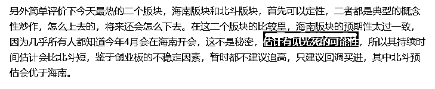
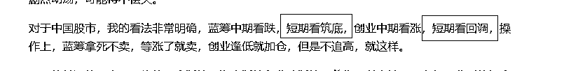
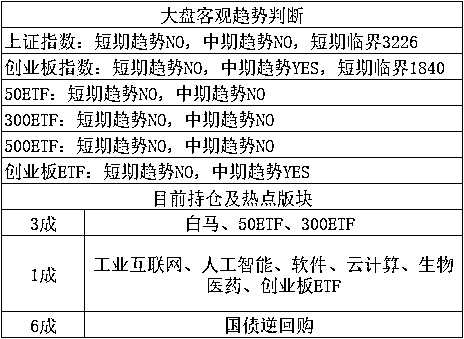
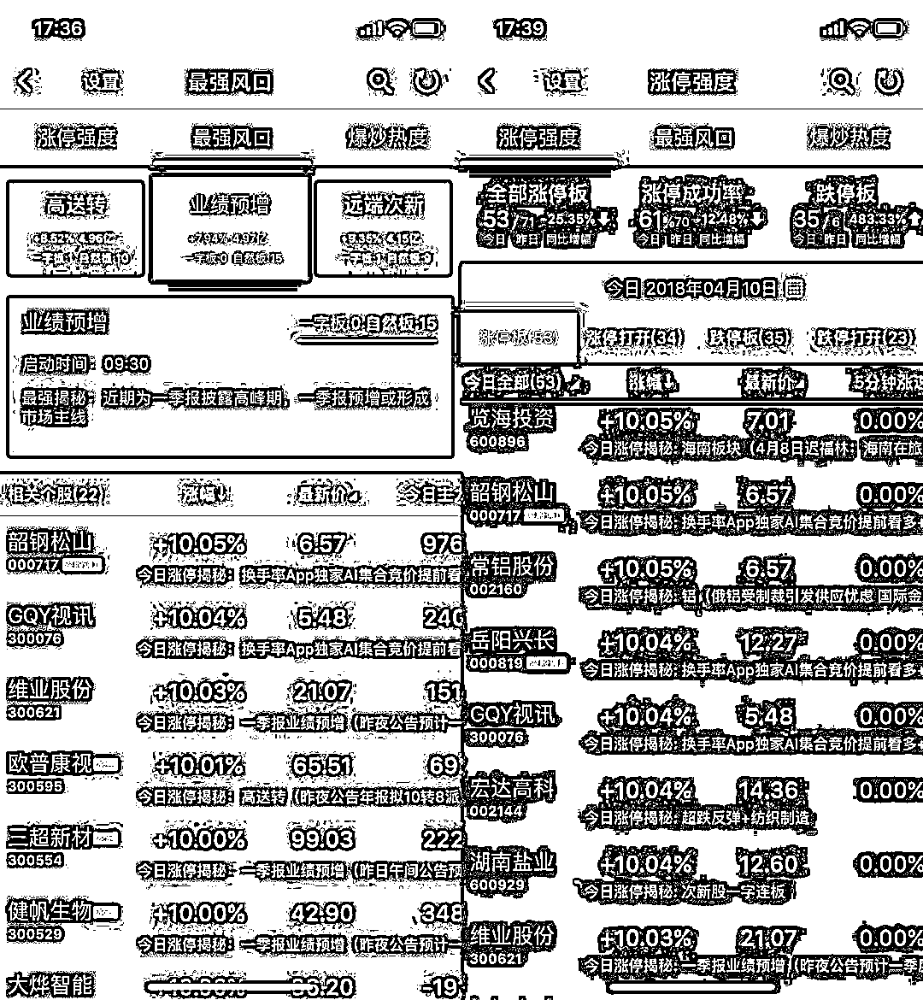
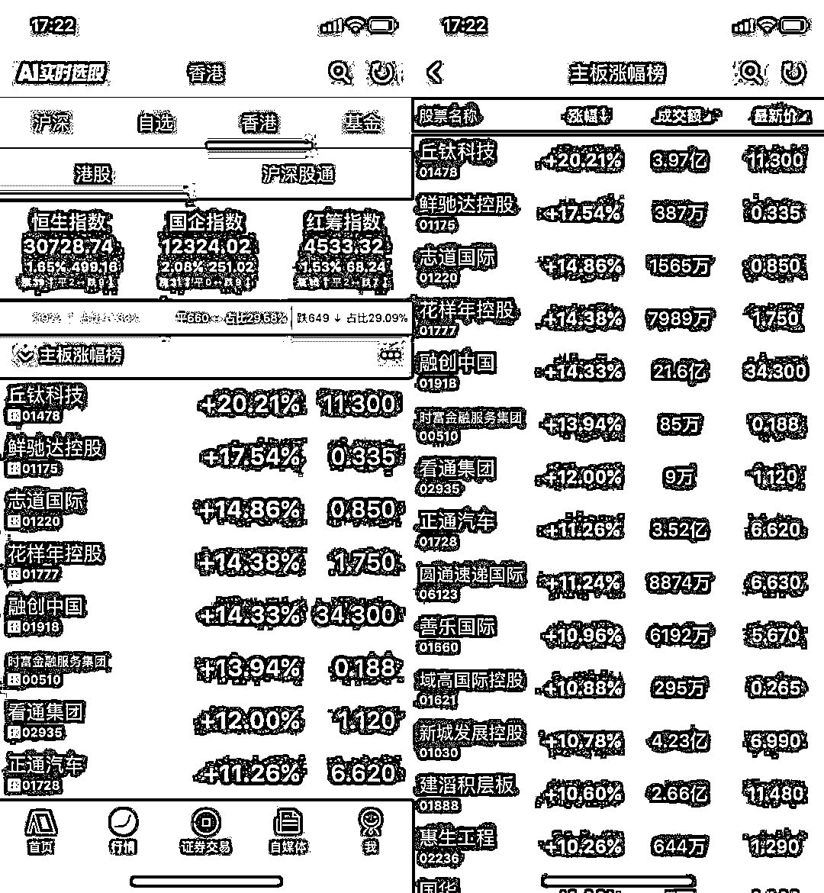

# 贸易战要中场休息了，中国宣布自己获得了重大胜利

今天，随着老大在博鳌上的发话，中美贸易战得到了极大的缓和，估计要中场休息了，同时中美的媒体，都宣布自己获得了重大胜利。

我们首先看看博鳌到底发生了什么事，今天，大大发言，中国将大幅度放宽市场准入，去年年底宣布放宽的银行、证券、保险行业外资股比限制的重大措施要确保落地，同时要加快保险行业开放进程，放宽外资金融机构设立限制，扩大外资金融机构在华业务范围，在制造业方面，目前尚未开放的汽车、船舶、飞机等少数行业已经具备开放基础，下一步要尽快放宽外资限制特别是汽车行业的外资限制，同时，汽车关税将会大幅度降低，中国不以追求贸易顺差为目标，真诚希望扩大进口，促进经常项目收支平衡。。

这估计就是前天特朗普语气突然放缓的原因所在吧，这么多东西足够他拿回去给国内的选民交差了，中美贸易战不打了，对美国经济无伤，同时前几任总统都没有拿到的好处，他出手拿到了，妥妥的政绩，当然需要动用媒体大吹特吹一番，宣布自己获得了重大胜利。

但是，中国媒体也宣布自己获得了重大胜利，官媒宣布，中国一直处在改革开放之中，今天宣布的所有改革措施，都是过去就已经宣布但是还未落实的政策，还有已经制定好，但是尚未宣布的政策，就算没有中美贸易战，这些政策也是会宣布的，开放市场对中国自己而言是有益的，是深化改革的，而扩大进口，是拿无用的美元去换取民生物资，可以平抑物价降低通胀，也是有益国民的。简单的说，这些东西是本来就要实施的，不值钱，如今只是拿来做顺水人情，同时熄灭了这波贸易战的战火，中国没吃亏，在这波谈判中得到了重大胜利。

我在这一波贸易战刚打的时候就说过，双方一定互相喷的热火朝天，过一段时间之后，中国略微让步，给特朗普个台阶下，然后双方都宣布获得了重大胜利，这事就算结了。

如今贸易战还没签协议，也就是没彻底结束，只能算中场休息，不过双方的媒体就已经开始玩这一套了，大家感受下即可，挺有趣的。这一波最终中国的谈判到底是胜是负，如今下定论还过早，因为全部是口头开放，实际的协议还没签订，具体的措施还看不到细节，要看到最终条款才能定，只要中国不让步太多，就算大获全胜。

为什么这么说呢，因为中美经济实力差距太大，正面硬怼是不可能的，中国最终必然让步，区别只是让多少而已，只要不让太多，就算完胜。这和谈判实力无关，和经济实力成正比，相比弱小的俄罗斯，中国已经很硬气了，看看俄罗斯，美国压根都不和他谈，直接制裁，一制裁就崩了，股市断头式下跌，连嘴硬的机会都没有，至少中国这一次在嘴上是丝毫不弱于美国的，改革 30 年来头一次，以前都是抗议抗议完事，可以说中国这次的强硬态度已经标志了自己实力的增强，这已经属于胜利。

* * *

今天，广电总局责令今日头条永久关停内涵段子等低俗产品，同时暂停今日头条的下载 3 周，**幸好今日头条没上市，如果上市了，2 个跌停再说，重大黑天鹅。**

不过我还是支持广电总局的整顿的，一些小视频类的软件，的确很有趣，里面 99%的内容虽然社会意义不大，但是娱乐效果还是有的，具备价值，但是这些视频平台的审核把关能力太差，有那么 1%的确是扰乱视听，格局低俗，导向不正，对社会产生重大不良影响。如未成年妈妈爆红网络，如赞美冰毒的天佑，如经常露点涉黄的大小女主播等等，这些东西当然支持查封他。

* * *

今天海南版块集体跌停，昨天最火的二个版块是海南版块和北斗版块，我昨天晚上特地给大家分析过，海南版块一致性预期太强，太多的人都知道 4 月份会开大会了，这并不是秘密，而北斗虽然也有一定预期，但是相对而言就突兀很多，估计有见光死的可能性，所以昨天晚上判定二者都是概念性炒作，但是海南价值不大，北斗相对而言会强很多，不过鉴于创业板的不稳定因素，不建议追高。

结果今天直接就见光死了，而去是在大大还在海南发言的时候直接打跌停。。。正常来说见光死也没这么个死法，这么走的原因，和创业板今天上午暴跌有直接关系。

今天上午，创业板直线大跌，直接导致妖股万兴科技和七一二炸板暴跌，其中妖王万兴科技从涨停一路被砸到收盘-6%，导致大批妖股跟随炸板，关于妖股的炒作，我的建议是 5 日线为生死线，妖股的特性就是一路涨，一旦不涨基本就死，所以收盘破 5 日就走，不破 5 日就拿着，这么无脑操作，成功概率是有个七八成的，妖股波动性太强，没有什么必胜的办法跟随，5 日线为准，相对而言是比较靠谱的一种方法了。

而随着海南概念的跌停潮，妖股的炸板，个股全面熄火，创业大跌的同时，今天蓝筹白马崛起了，全天飘红，收盘上证大涨 1.66%，一个月始终萎靡不振的大盘，今天终于重振雄风了一把，而今天盘中最低跌了-1.6%的创业，收盘也给带起来了，到了收盘只跌了 0.33%，也还算好，这一切又和昨天晚上分析的一模一样。

既然已经验证了判断，那么理应继续持续下去，上证依然看筑底反弹，创业依然看回调，同时，在操作策略上，维持上证逢高卖出的打算，我会在 3256-3300 区域分 3 批出清，同时调仓换股到下跌的创业中，创业今天跌到 1811 就止了，只差一点点就可以进行第一次回补了，有点可惜，继续等等吧。

* * *

**最近身边很多朋友都在用的“换手率 App”又免费升级开放了很多游资内部功能，我觉得非常实用，比如说，有一个对于踏空资金非常值得看的东西，最强风口！**

**“换手率 App”独家免费开放国内游资专用涨停板操盘指标，每日最强涨停板风口！实时 AI 自动学习展现当日全部涨停板个股中包含最多涨停板数量的题材概念板块，同时展现最强板块中的最强龙头股！涨停板最强风口详细包含板块实时主力资金净流入、板块启动时间、板块一字涨停板数量、板块自然涨停板数量，最强风口领头羊、龙二、龙三！我们必须集中注意力研究当日行情最突出的那些股票！涨停板就是当日行情最突出的那些股票！如果你不能从领头的活跃股票上赢得利润，也就不能在整个股票市场赢得利润！正如女神们的衣服、帽子以及珠宝的时尚总是随着时间推移而变化，股票市场也会不断抛弃过去的领头羊，新领头羊将取代旧领头羊的位置！短线交易你需要时刻保持涨停板盘感！**

**今天“换手率 App”涨停强度有 53 个涨停板，其中有 43 个自然涨停板，10 个一字板，今天什么板块才是最强的涨停板呢？一季报业绩预增！很多业绩预增个股在昨晚预增消息的刺激下，今天出现涨停潮！这个板块在“换手率 App”的 AI 算法中有自动龙头股标志，如果市场情绪好，明天还会出现连板！哪只龙头股，可以下载“换手率 App”免费查询！ **

**最近很多包括小米之类的独角兽都有传闻要在香港上市，加上腾讯在港股创造的传奇，港股持续升温！换手率 App 最新版已经免费支持港股 Level-2 行情，感觉非常不错！****“换手率 App”满足了一切对短线妖股挖掘指标的需求！“换手率 App”最近确实特别火！很多国内一线顶尖龙虎榜席位游资操盘手都在用！专业炒短线妖股非常有盘感！确实很好用！“换手率 App”是目前市场上当之无愧的短线之王！国内最火最热的短线涨停板妖股题材基本都提前发现在“换手率 App”！老铁们可以长按识别图中二维码免费下载“换手率 App”！也可以应用商店直接搜索下载“换手率 App”免费挖掘潜力股！**

**最后说个秘密，我很早就特邀入驻“换手率 App”了！老铁们猛戳左下角【阅读原文】，也能下载“换手率 App”！立刻下载“换手率 App”！在自媒体栏目搜索关注我“紫色的股”，祝老铁们 4 月份把握赚钱行情。**