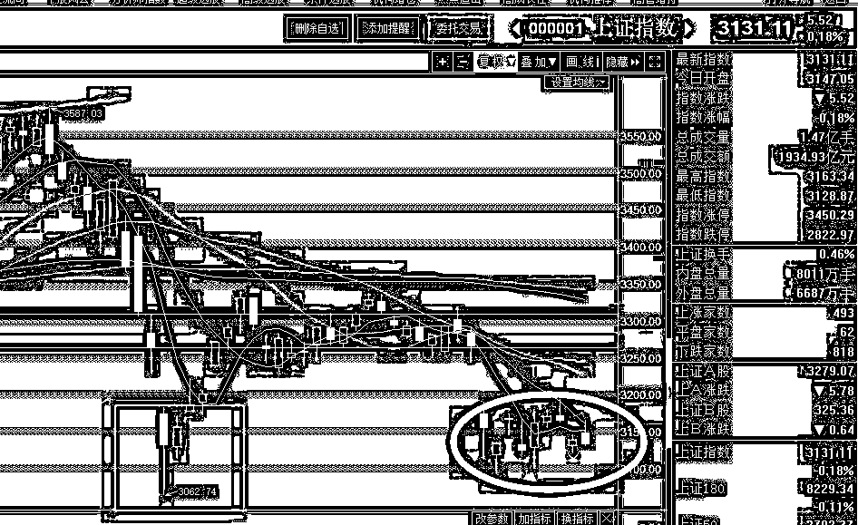
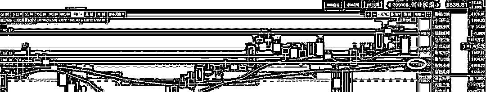
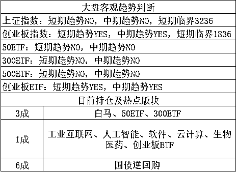

# 这几天要是不休市，中国股民能给震傻了

 清明假期，全球股市一天一巨震，幸好中国休市了，要不然中国股民能给直接震傻了，小心脏都给震出病来。

A 股停牌当天是暴跌收盘的，周三的时候上证指数倒是很坚挺，但是创业板一根中阴线直接打穿 20 日均线且确立了日 K 顶背离，显示投机性资金对清明假期贸易战消息面的走势很不看好。

但是戏剧性的一幕发生了，周三夜间开盘，贸易战紧张局势得到缓解，欧美股市从接近-2%的大幅低开，收盘+1%以上，低开高走收出巨大阳线，如果次日 A 股开盘，很显然会跟风补涨，周三卖出的人要是不想心碎，开盘就得回补。

回补了之后会发生什么呢，**一天之后，美国宣布了 1000 亿美金的新制裁措施，这一下全球又傻了，纷纷下跌，**周五收盘，美股暴跌 2%以上，你说这可真是刺激，暴涨暴跌全部因为特朗普的一张嘴，要是 A 股开盘，估计要被玩死，大家不用看技术面了，也不用看监管层了，每天晚上就是扔骰子猜特朗普了，真是风云变幻。

一开始中国宣布 500 亿美金制裁措施的时候，美国突然哑火，美国一官员表示暂时没有新的针对中国的贸易措施，中国很多媒体欢欣鼓舞，我的朋友圈甚至出现了贸易战美国求和这种文章。。。

当时我还在纳闷，美国那么强的实力怎么刚开战就求和了，特朗普退一步就是万丈深渊他不知道吗？后来反应过来，**估计是美国没有料到中国敢一开始就那么强硬的回击，没有做好预案，被打蒙了**。

为什么这么说呢，因为一天之后，特朗普宣布 1000 亿美金的新贸易制裁措施，之前估计是没有做好预案，压根没想到中国会那么出牌，而特朗普宣布 1000 亿后，中国商务部再度回应，如果美方公布了新增 1000 亿美元的征税产品清单，中国将毫不犹豫进行全力反击。

之前 30 亿跟了，后来又跟了 500 亿，如果这 1000 亿中国还跟了那代表什么大家知道吗？代表中国底牌尽出，我给大家看个数据，2017 年中国对美出口额增长 12%，是 4297 亿美金，美国对中国出口额增长 15%，达到 1539 亿美金。也就是中国对美国实现全面产品封锁，也只有 1539 亿美金的牌可以打，如果是 30+500+1000 的话，那只剩 9 亿了。。。而美国可以打的牌，高达 4297 亿，接近 3 倍。

而中国说的话，又不可能反悔认怂，美国真出了 1000 亿，中国必须跟，所以我这里给中国出个策略，重复制裁，目前的制裁是加征 25%关税，对于某些特定的商品，可以二次征税嘛，再加征个 25%，最后打到底，你加 25%，我加 75%就是了，反正战火超过 500 亿之后，就已经伤筋动骨了，桌子都已经打碎了，后面都是打面子了，既然是打面子，收 25%关税也是没人买，收 75%就是拉，不就扯平了。。

* * *

贸易战对股市的影响其实没那么大，首先对中国经济是切切实实有巨大影响的，但是 A 股并非经济的晴雨表，向来都是赌场，**这次贸易战引起的全球剧烈动荡，对于 A 股而言，更多的是跟风资金进行短期炒作，属于全民娱乐。。。**

而对于整体 A 股的走势来看，我们可以发现，上证指数在经历连续的暴跌之后，始终没有反弹，弱势尽显，但是在前一段时间因为贸易战产生的巨大跳空向下缺口之后，虽然没有短期剧烈反弹回封缺口，但是出现了明显的盘底征兆，相比上一波的 V 型底，这一次的横盘底，才是我们所熟知且认可的底部，所以中长期来看，上证已经不行了，但是短期来看，由于抗跌明显，所以短期走势反而可能强于创业板，在同样的假日预期下，周五的收盘跌幅足以说明一切。

而对于创业板来说，毫无疑问，这一波出尽了风头，直接扭转了强弱预期，28 转换可以确认来袭，这一波必须要做创业板，不过由于短期涨幅太快，投机盘太多，周五确立了日 K 顶背离，所以短期走势应该明显偏弱，正如同我上周创业板暴涨的时候说的，创业什么都好，就是一周上涨了足足 10%，太吓人了，所以宁可踏空也不愿意追高了，结果本周一开盘之后再 1900 之上追高的，全部套山上了，假日期间也过的不安宁，一天一个惊喜，然后接一个惊吓。。。

这一波日 K 顶背离，跌到哪不知道，跌多少也不知道，因为外围波动的太厉害，不过我觉得 1800 附近先来 1 成是很划算的，剩下的我打算越跌越买。没错，我的策略就是，短期上证强，但是我没打算跟，我手头有仓位，等他涨，涨起来我在卖。创业短期弱，但是中期看好，我现在仓位也轻，所以我打算越跌越买加重仓位，我会分 3~5 批进行买入，除非股灾，否则不会出什么事，大牛市的概率虽然不好说，但是股灾的概率几乎没有，这点把握还是有的。

至于版块，我之前说的很明确了，我就听党的话，党说炒啥就炒啥，你说新经济好，我现在就炒新经济，哪天你再提价值投资好，我转手就卖了满仓蓝筹，就这样。。。

* * *

上证临界降低了 10 个点，创业降低了 10 个点，不过最近消息面刺激过于剧烈，所以客观趋势模型不太好用，主观的修正比较重要，1800 附近这个支撑估计扛不住，但是出于分批回补的原则和支撑位的尊重，这里回补 1 成是很合适的，毕竟自高点已经下跌百点了，怎么也值 1 成了。

紫色的股

经济-金融-投资