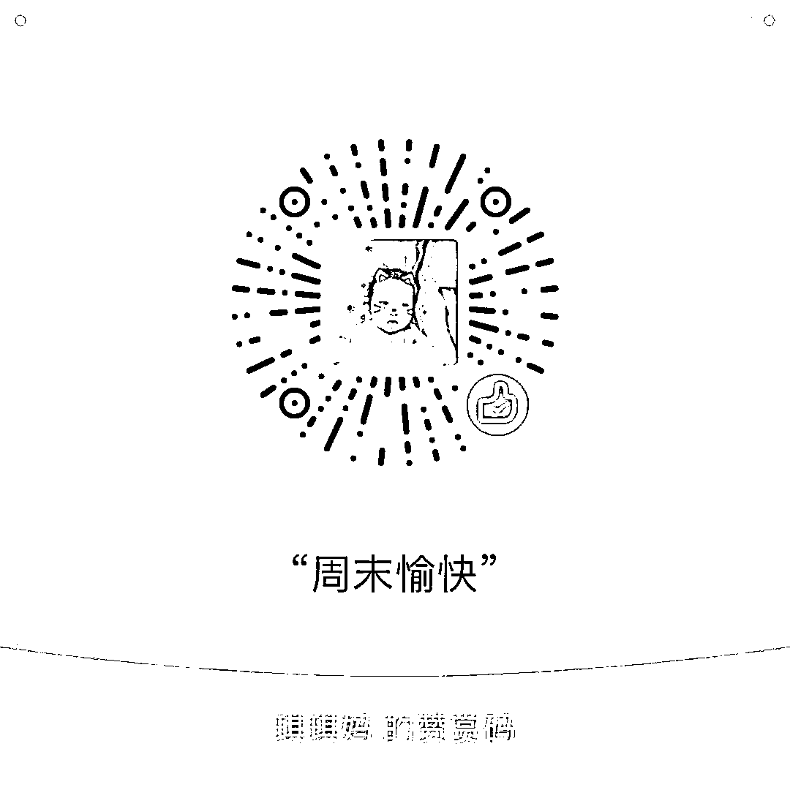

# 外卖和电商必将统治未来

近日，电商大佬阿里以 95 亿美金的代价，全资收购外卖平台饿了么，如此大手笔的现金收购案轰动全国，电商开始全面布局外卖是大势所趋，因为外卖和电商必将统治未来，因为他们都有一个相同的特性，那就是降低了交易成本。

比如**小张是一个烟民**，香烟对他来说是刚需，现在下班回家，在卧室里刷手机，这个时候烟瘾上来了，必须要买香烟，现在知道他楼下售楼部的香烟卖 10.5 一盒，而出了小区步行 15 分钟可抵达的大型超市里，只卖 10 块钱一盒。这个时候小张认为，如果是顺路购买就算了，如果不是，为了五毛钱特地花费半个小时来回跑一趟只为买烟，不划算，于是小张决定在楼下的售楼部购买香烟，这半个小时的时间价值，就是这个香烟的成本之一。

有人可能觉得香烟的例子不够贴切，那就用**菜场的例子**，每个大小区附近，都有一个菜场，但是每个城市，都有一个大型蔬菜批发市场，菜场里的菜，其实都是菜贩子每天去批发市场里批来然后零售的，如果你能花费 2 个小时跑到郊区的批发市场里，你每天买菜的花费至少降低 30-50%之多，每天节约小几十块钱不是问题。为什么没有人这么做呢，因为如果花费如此之久的时间去买菜，把同样的时间拿来做其他事，所赚的钱远不止那么多，所以整个城市的居民，都是去门口的菜市场买，而不是扎堆去批发市场购买。

我们购买一件商品，除了所直接付出的金钱之外，还需要付出的时间，就是我们额外的交易成本，而外卖和电商，降低的就是这部分成本。

对于外卖而言，如果**我们想吃 800 米开外某家店的美食**，我们明确的知道这家店就在这里，来回半小时就可以买到手，但是这个时候外卖平台提供了另外一个选项，花费 3 元钱，请更专业的人送过来你是否愿意，半个小时你做什么工作，所赚都不止 3 元钱，而娱乐休息时间虽然不赚钱，但是本就是人生所必须，他的价值并不亚于工作时间。

而对于更远的外卖，比如 3km，5km 之外的，虽然配送费提升到了 5 元，8 元，但是价值更好算了，因为这些地方步行抵达要花费整个半天时间，几乎是不可能选项，如果乘坐交通工具前往，即便是最低的公交车，来回也要 4 元票价，如果是的士那么是 20 元起步价，如果是私家车，那实际保养成本是数倍于的士，有些城市动不动还贴罚单。。。

所以，**仅凭这个时间成本和路程成本，外卖就是有价值****的，他降低了社会总成本，**更别提网络下单能够有效降低店面的租金成本，随着越来越多的人选择网络下单，店铺所需的面积会越来越小，平摊到每份食物上面的成本也会越来越低，这是大势所趋。

而**对于电商来说，他能降低的交易成本就更多了**，首先是时间成本，很多人在网络选购的商品，如果去商场了找，不仅需要花费往返成本，还要花费大量的选购时间，因为很多小商品并不好找。其次是他能降低商品的直接成本，由于网络具备直销功能，很多人可以只比出厂价略高的代价买到货，这就很厉害了，因为在过去的商品流转环节里，从厂家到消费者手里，单价 50 以下的小商品，其价格可能都会增加 2~3 倍，越小的商品，价格增加越多，因为这些商品是需要平摊商铺租金和人员工资的，举个例子，一个玩具店月销量 1000 件玩具，每个月店铺租金一万元，人员工资一万元，那么每件玩具在进价基础上就要增加 20 元，如果算上各种税费和水电费，估计要 25 元出头，剩下的才是利润。。。

所以，未来电商会统治大量的模板化小商品，网下购物唯一的出路就在于增强购物体验，因为逛街，试穿这些东西是电商很难提供的，网下的商场必须让这些东西的溢价超过网购所节约的交易成本，才能吸引消费者。

还有另外一个知识点，那就是人和人的交易成本是不同的**，**确切的说，他们的时间成本是不同的，**对于退休的老太太而言**，我们经常可以看到，他们为了便宜几块钱，宁可花费的大量时间到遥远的某商场购物，这是因为老太太已经退休，他的时间很多，他节约的时间并不能拿来产生其他价值，当她不需要带孙子和跳广场舞的时候，她为了几毛钱的菜价能和小贩磨上半小时。。。而**对于年轻人**而**言**，有讨价还价的时间不如抓紧时间多挣点钱，这就是区别。

**人类的进化史就是交易效率不断提高的历史，而外卖和电商异曲同**工，都是降低了人类的交易成本，提升了人类的交易效率，现在很多白领每天中午连楼下近在迟尺的快餐店都不愿意跑了，都是点外卖当午餐吃，因为他们觉得中午哪怕抓紧时间多休息 20 分钟，都值那几块钱配送费。所以，外卖和电商必将统治未来，并非个人喜好倾向，而是他降低了整个国民的交易成本，增加了经济运行效率。

此处理应插入一条外卖广告，这样才是一个完美的自媒体文章，然鹅并木有，所以给自己做个广告，如果你看完此文觉得学到了一点经济学知识，那么请多点个赞。 

**友情注释：所有的赞赏都会进入我们家领导的零花钱账户。。。**

紫色的股

经济-金融-投资