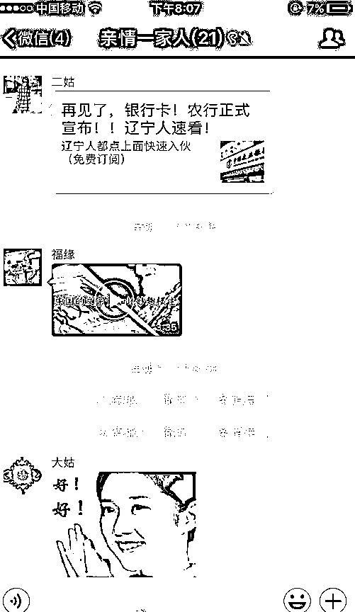
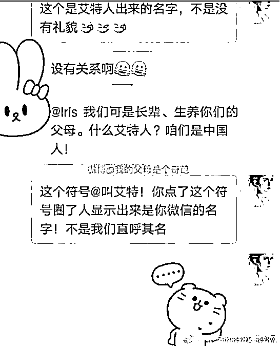
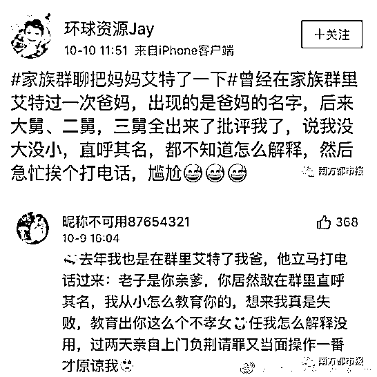

# 如何让你的长辈信你，而不相信鸡汤

喜欢我的都关注我了~

每个人都有一二个家族群，要么叫“相亲相爱一家人”，要么叫“幸福一家人”，这些群里的长辈很喜欢转发文章，但是谣言和鸡汤密布，身为子女或者说晚辈，经常试图规劝这些长辈不信谣、不传谣，鸡汤偶尔可以喝一口，天天喝就没意思了。

但是这些长辈们压根不理你，每天依然我行我素，久而久之你就放弃了，那么你想知道如何才能让长辈们相信你吗？

为什么你的长辈不信你

你的长辈不信你而相信谣言和鸡汤，很多人把这个问题归结为长辈们食古不化，不能接受新事物，这是非常错误的。

如果是因为不能接受新事物，那为什么你的长辈们对那些新型保健产品如此趋之若鹜，还有那些新型骗局，你听都没听说过的东西，他们就中招了，被坑了钱都无怨无悔。

他们不相信你的根本原因，是因为你在他们眼里永远是小屁孩。在你父母和你叔叔、舅舅的眼里，你是他们从小看着长大的，在过去的几十年里，你各方面的能力都一直远远不如他们，所以即便你长大之后能力和见识都反超了父母，他们的印象也依然很难扭转过来。

你听说过第一印象很重要吧，你给别人形成了第一印象之后，要过很长时间，花费很大代价才能扭转过来。那么你在你长辈的眼里，何止第一印象啊，那是几十年的印象，要想改变，难如登天。

哪怕你成长为了医学博士和主治医师，在他们眼里你都是那个穿着开裆裤到处乱跑的小屁孩，你说话的可信度，远远不如街头那个卖狗皮膏药的“神医”。

你和你长辈之间的代沟，除了长期印象对你形成的蔑视以外，还有一个原因，那就是对网络常识的无知，经常有人因为在家族群里@了某长辈，然后被痛骂一番。

按微信的规矩，@之后会直接出现全名，而不会出现姑姑、叔叔等敬称，直呼其名，这会捅马蜂窝的。

总之，你在你长辈眼里，做啥啥不对，别挣扎了，认命把，他们爱发鸡汤就让他们发吧。

长辈爱鸡汤和谣言的根源

但是，我这种人怎么会这么容易屈服呢，我一定要把那些长辈的观点给扭转过来，在动手之前，我要知己知彼，知道这些长辈们为什么爱鸡汤和谣言。

其实原因很简单，那些在你看来很可笑的鸡汤、谣言和无聊视频，在你爸妈等长辈的眼里，既不无聊，也不可笑，因为这些东西对他们来说很新奇，互联网的世界比他们以前接触的老旧世界要精彩太多，在他们刚刚步入互联网世界的前几年，什么都是好的。

不信你可以想一想你刚接触互联网的前几年，你都干了些什么蠢事。到处找聊天室，QQ 群疯转自己刚学会的特效表情，硬拉着好友来偷菜，自己弄个 QQ 空间，里面贴满了好文章吗？不，你贴的也全是鸡汤励志文。

你以为你干的事比你爸妈更有出息？你只不过比他们早步入了互联网世界几年而已，现在你看的文章太多了，智商已经进化了，再回头看这些东西已经腻歪的快吐了，但是你爸妈他们没有腻歪啊。

对于你父母而言，他们看了一辈子读者，在他们眼里，“10 个良好的习惯”、“民国十大才女”、“年轻人必看的 18 条忠告”、“老中医教你不花一分钱治疗颈椎病”这些文章比读者要精彩太多，他们碰到这么“好”的文章，当然第一时间想转给自己最亲爱的人啦，那个人是谁啊，别跑了，就是你。

这些文章，你曾经也经常点开看，现在你只是接触到了更高层的文章，对这些垃圾文章看腻了而已，你父母现在的样子，就是五六年前你的样子，没什么区别。

如何改变你的父母

那如何才能让你父母的品味变得和你一样呢，早点脱离这些低级趣味，这个问题其实也很简单，你当年是怎么脱离这些低级趣味的呢？还不是靠那些更高级的文章，如果你一直接触的都是这些鸡汤，你的审美和品味，还是那个样子。

所以，当你父母兴高采烈的转发给你一篇让你不忍直视的鸡汤/谣言之后，别忙着打击和顶撞他们。他们的行为是很幼稚，但是你小时候不一样幼稚？现在不过是强弱颠倒了而已，你小时候干了蠢事你父母怎么对你的，你现在就应该怎么对他们。

所以，你应该先假意顺应你的父母，先哄着他们，千万不要说“这东西很无聊”，“这东西很没营养”，“你怎么老转发谣言啊”等等，快速扫一眼，然后发个大拇指表情就可以啦，如果你电话里顺口再表扬一下你父母，他们会更高兴。

然后你要怎么做呢？你要在朋友圈和你的爸妈群里，用比他们更猛烈的速度，转发更多优质的文章扔进群。

相信我，你长辈们都有自己的智商和辨别力，他们只是不擅长互联网搜索而已，只要他们读多了好文章，吃惯了好东西，再回头看那些鸡汤和谣言，他们自己都会感到腻歪。

你在互联网上当年是怎么进化的，他们就会怎么进化，你多转发好文章给他们看，他们的进化速度丝毫不会亚于你。

比如紫竹张先生的文章，平时多转发一点给他们看，很快鸡汤和谣言就会绝迹了。

觉得此文的分析有道理，对你有所帮助，请随手转发。

长按下方图片，识别二维码，即可关注我

近期精彩文章回顾（回复“目录”关键词可查看更多）

华为员工都这么穷，怪不得拼多多能火 | 房价跌 20%就会全面崩盘，地产杠杆远比你想的要脆弱 |  为什么碧桂园的质量那么差 | 清醒点，放弃全面开征房产税的幻想 | 央行和财政部隔空掐架，我支持央妈 |中国土地制度源自香港，但是香港却是劏房密布 | 为什么中介哄抢租赁房源，因为贩毒都没它来钱快