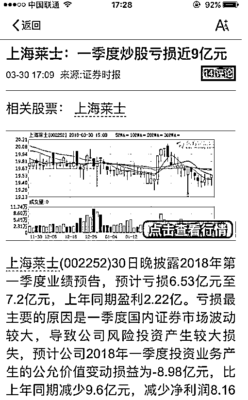
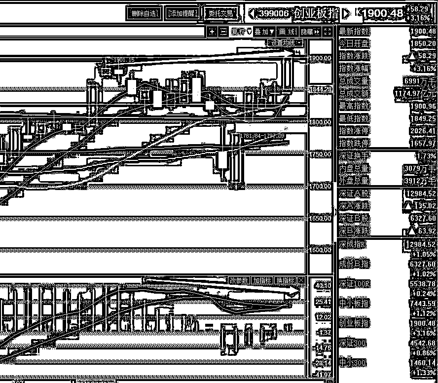
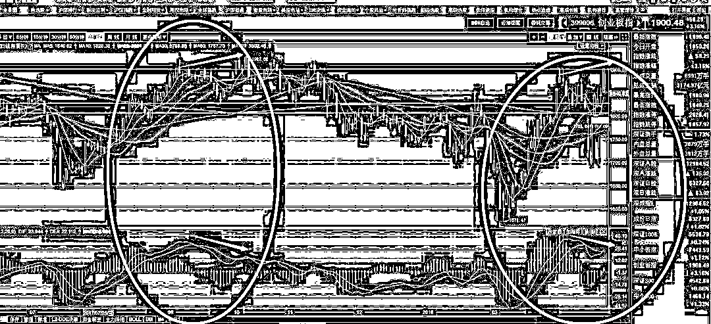
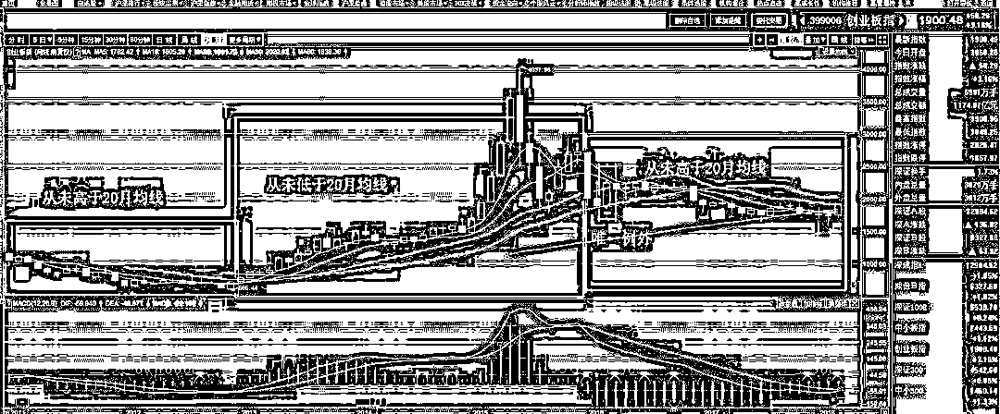

# 创业板本周上涨 10.11%，打碎一地眼镜

<link rel="stylesheet" href="view/css/APlayer.min.css">

今天，创业板再度大涨，收盘于 1900 整，至此，本周创业板暴涨 10.11%，如此涨幅刷了 2 年的新高，即便从 1 月 1 号开始计算，创业板的一季度涨幅也达到了 8.43%

和创业板大涨所对应的，就是一季度公私募机构净值普遍下滑，回撤幅度还不少，机构哀鸿遍野，就在今天收盘之后，还有一家上市公司宣布自己一季度由于市场波动炒股亏损了 9 亿元，一看就知道他们的持仓还没有切换过来，还在玩价值投资。

我之前认为创业板会涨，看好新经济以及新经济代表的创业板的，但是短期不会收盘高于 1900 点，今天说一下当初为什么这么判断。首先就是短期涨幅，如果收盘高于 1900，代表周涨幅达到 10%以上，这种级别的暴涨已经 2 年没有过了，全球又加息又贸易战的，欧美市场一副死样，而且 1900 还是标准压力位，不敢期望。

另外，创业板一旦收盘价高于 1900 点，就会触发潜在顶背离，这个时候要么连续上涨，把 MACD 也拉出新高，顶背离要素就不存在，估测一下，大概是要一口气涨到 1980-2000 点，中间不能出现中阴线，只要走势弱了一点，就会形成创业顶背离，到时候创业顶背离，上证底背离，还都是日 K 级的，那就有意思了。

我们可以看一下，去年 7 月创业板的上一波连续大涨突破 1900 触发顶背离之后的走势，几乎一样，都是一波大涨+一个浅回调然后就直接再创新高。。

最后，还有月 K 图，创业板的月 K 图呈现大波动型，2011 年 1 月到 2013 年 1 月的整整 2 年里，从未高于 20 月均线，之后上破 20 月均线开启牛市。

2013 年 1 月到 2016 年 1 月的整整 3 年里，从未低于 20 月均线，之后下破 20 月均线，中间仅有 2016 年 3 月出现唯一例外，然后从 2016 年 3 月到 2018 年 3 月，从未高于 20 月均线。

看时间倒是挺对称的，232，今年 3 月的确可能变，但是如果变了，那就是说以后都不会低于 20 月均线了，这就有点屌了，不就是开启大牛市的意思，所以我之前说，如果收盘高于 1900 点，那就有可能意味着开启牛市，20 月均线的价格是 1901，我为了取整，直接说了 1900，这个概率是很低的，属于牛熊之判，在走出来之前，当然默认维持原趋势，也就是不会上破。

结合以上这么多，大家可以自行判断一下其概率有多低，当然，临界值是 1901，不是 1900，不过就冲今天这么猛的单边走势，这 1 个点并不是什么问题。我在前几天就感受到了凶猛的势头，不过我的补救措施就是不再售出手里的剩余仓位，宁可冲高回落也一动不动，因为仓位不够我折腾拉，总体而言 4 成仓位还是可以的，而且也一直看好创业板，没什么问题，不过就是逃顶一半仓位之后没有及时抄底，想多贪一点，冲高的时候又减了 1 成，导致创业板仓位反而少了。如今也只能嘲笑一下始终重仓白马或者下跌割肉的了，哎，真是没想到创业会涨这么猛，我是看好新经济和创业，但是说实话，我真没料到他能涨那么快，因为身边很多机构还是很看好蓝筹白马的。。。

今天这个 1900，是 2 点 57 分集合竞价最后一刻才拉上去的，颇有故意的意思，不过我之前说过，如果收盘高于了，要吃巧克力味鼠标。。。收盘后一堆人凑热闹，虽然这么低概率的事情都被我碰上了，但是既然说了就要去做，我收盘之后就去淘宝搜了，本来以为淘宝卖这玩意的肯定很多，结果**居然没有卖的**！旁边的蛋糕店我经常逛，**也是没有卖的**。

我本来做的预案是要买一个，拍个吃的照片的，结果没得卖，后来我就拿了一块巧克力试图手工切出来一个，但是动手做出来的东西实在是惨不忍睹，过于难看，这玩意哪怕是照片放出去都严重有损形象。咱也不是娱乐主播，我连直播间号码都没注册呢，就不玩这些蹭热点的东西了，把时间浪费在这些事情上还不如多写点好东西呢。要不这样，我把那块被我捏的惨不忍睹的，看起来有那么一丝鼠标韵味的巧克力今天当宵夜吃了。然后给大家一个指定明天选题的机会，我在工种号下面会做一个投票，得票最高的选项，会是明天的选题，你们要我谈啥我谈啥，当直播了。

上了 1900 之后咋办，我周末再说，今天就不谈了，接下来是你们的选票时间，哪个得票最高，明天就写哪个领域的精华文。

紫色的股

经济-金融-投资