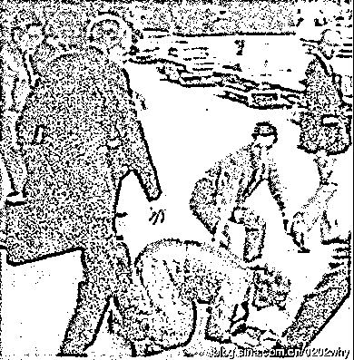
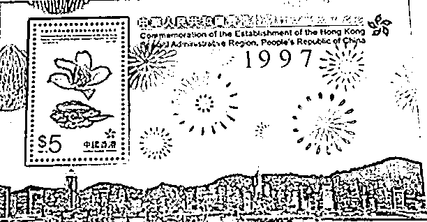
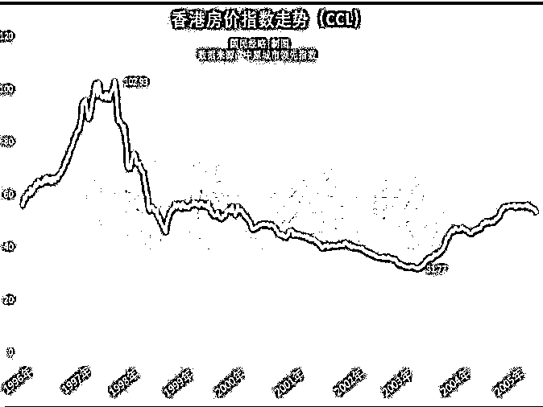
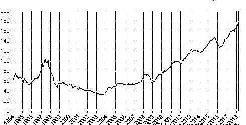
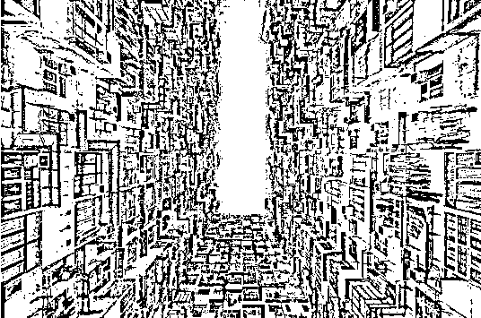

# 回顾百年历史，揭秘香港高房价的根源

喜欢我的都关注我了~

<link rel="stylesheet" href="view/css/APlayer.min.css">

大陆的房价很高，但是世界上房价痛苦指数最高的地方并不是中国大陆，而是中国香港。冰冻三尺非一日之寒，香港的高房价是有历史原因的，而且可以追溯到百年之前。

鸦片战争后，英国人逐渐获得了香港和新界等地，香港远离英国本土，英国想开发香港，但是又不愿意投钱。于是港英政府把主意打在了土地的头上，打算靠土地获取建设资金。

香港的土地，英国并不将其出售，而且采用批租的办法进行拍卖，和我国目前的土地拍卖制度雷同，这一点并不是香港抄袭大陆，而是大陆抄袭香港，因为香港一百多年前，就开始这么拍卖土地了。

由于香港所有的土地只有港英政府有权利拍卖，那么作为一个绝对垄断者，港英政府有充足的动力，为了赚取最大化利润而慢慢的拍卖土地，争取拍出最高价格，所以，香港的土地卖了一百多年，卖到香港都回归了，只卖了一点点土地，到今天，尚有 8 成土地待售未开发。

但是一直到 1984 年以前，香港的房价都未出现过于离谱的上涨，战争时期，香港人口出现巨幅增加，1946 年的香港人口是 60 万，1949 年激增到 186 万，到了 1959 年暴增超过 300 万。人口增速恐怖，港英政府的批地速度也很恐怖，因为政府有维持社会治安稳定的需要，不会过于竭泽而渔。

这一切，终止于 1984 年。

1**撒切尔折戟中国**

按当初清政府和英国签署的协议，新界的租期，会在 1997 年到期，而新界的面积占据全香港 92%的面积，一旦新界被收回，香港岛和九龙半岛根本不可能独立存在。

所以，1979 年开始，英国政府就不断的派遣专员前往中国，试图摸清中国政府的底牌，1997 年之后，应该如何处理香港问题。英国一开始的诉求是，希望中国政府能继续把新界租给英国，条件好商量，英国可以给予中国一定的代价，比如中国最急需的外汇或者物资。

但是在邓小平的示意下，外交部断然回绝这一提议，主权问题没得商量，随后英国轮流派遣多名高官前往中国，带来的所有建议，均被驳回，外交部翻来覆去就一句话，主权问题不容许商量。

1982 年 9 月 23 日，撒切尔夫人访华，这个时候的撒切尔夫人刚带领英国打赢了马岛战争，从阿根廷手中夺回了二国争议多年的马尔维纳斯群岛。携大胜之余威，铁娘子来者不善。

撒切尔此番，以香港的经济为筹码向中国施压，她表示愿意将主权交还给中国，但是中国没有治理资本主义地区的经验，贸然接管香港，会对香港的经济造成灾难性的打击，不如由英国代为管辖，这样可以维持香港的稳定。

而邓小平明确表示，中国有办经济特区的经验，抛出了一国二制来解决香港的资本主义制度问题，收回香港后，维持原制度 50 年不变，港人治港，以此拉拢香港土著对抗英国人。

同时中国不仅要求收回新界，还要求收回香港岛和九龙半岛，因为割让香港岛和九龙半岛的条约是清政府签订的，新中国在 1949 年就明确宣布不承认这一条约。

撒切尔夫人不怀好意的说，如果谈判不成功，香港出现了巨大灾难怎么办。邓小平回答：“中国政府在作出要收回香港的决策时，已估计到了可能出现的各种情况。如果在 15 年的过渡时期内香港发生严重的波动，中国将被迫重新考虑收回香港的时间和方式，如果说宣布要收回香港就会"带来灾难性的影响"，那么中国政府要勇敢地面对这个灾难，做出决策”。

撒切尔夫人离开人民大会堂的时候，面色凝重，忽然，一脚踩空，然后跪倒在地上。

虽然首战失利，但是撒切尔夫人不是那么容易服输的，随后中英进行了艰巨卓绝的下一轮谈判。中英的第二轮谈判历时 14 个月，在北京共举行了 22 轮正式会谈，和无数轮非正式接洽。英国的胃口和条件被一点点压缩，最终基本同意了中国的条件。

1984 年 12 月 19 日下午，中英联合签署《关于香港问题的联合声明》，正式确认中国将于 1997 年 7 月 1 日对香港恢复行使主权。

2**中英联合声明的小漏洞**

看完了上面这段历史，我们会对邓小平领导下的中国取得的成就感到骄傲，这是新中国建国以来最大的外交胜利。但是在这段中英联合声明里，有那么一个小小的漏洞。

在谈判的时候，中国政府非常担心英国政府在 1997 年之前，把香港搬空掏空，留给中国一片废土，所以多次警告英国政府，如果敢于乱来，中国将提前出兵收复香港。

大动作不敢搞，小动作慢慢搞也不行，谈判中，中国对于英国未来 13 年对香港的治理，提出了种种要求和限制条件，以防英国人透支香港的根基换取短期利益，这些限制条款事无巨细、包罗万象，其中有一个条款就是，在过渡期（1984 年－1997 年）香港政府每年拍卖的土地，不允许超过 50 公顷。

中国政府的思路很明确，1997 年之后香港就不归属于英国了，英国政府有很强烈的动机大量拍卖土地，崽卖爷田不心疼，等香港回归之后，大量的土地已被拍卖，会对中国造成很大的损失。

不得不说，这么考虑是很有道理的，也足够体现出中方谈判团的睿智和谨慎，不给英国政府留一丝漏洞。

但是智者千虑必有一失，这个条款，直接诱发了香港地价的暴涨，十多年里，香港地价上升了 20 倍，房价当然也跟着上涨了 20 倍。市场供给被强行限制，当然会引发供需不平衡，再加上资金瞅准机会恶意炒作，价格就开始一飞冲天，制造出了巨大的楼市泡沫。

3**楼市绑架了香港政府**

这个漏洞，在几年之后房价刚开始腾飞的时候，就立刻被中英双方发觉，但是双方谁都没有出手解决这个问题。

从中方的立场来看，顶多就是英国多收一点卖地钱吧，至少土地都还在，绝对不可能为了打压地价让英国人多卖土地的，那简直是在卖国。

从英方的立场来看，找中国重新谈判要多一点土地额度是根本不可能的，消息放出去后，还有可能引发地价下跌，索性不闻不问，甚至还暗中助推让地价飙升的更高，这样自己才可以多收一点卖地钱。

就这样，香港房价一路飙升，全民炒房，一直到 1997 年香港回归。

香港回归之后，高房价问题是第一个要解决的问题，香港人民房价痛苦指数全球第一，整个香港怨声载道，人人都在诅咒高房价。发生这种事情，那是因为香港处于英国政府治下，回归祖国后，怎么还能让这种事情发生。

于是，新上任的第一届香港特首董建华，推出“八万五建屋计划”，提出的执政目标是每年供应不少于 85,000 套住宅，希望 10 年内全港七成的家庭可以自置居所，轮候租住公屋的平均时间由 6.5 年缩短至 3 年。董特首想做一个利国利民的大好事，但是事情的发展，却和他想的不一样。

董特首的八万五计划，大幅度提升市场供应，叠加 97 年金融风暴，立竿见影的打掉了香港的房价，而且是腰斩再腰斩那种，直接打三折出售，香港的房价终于恢复正常了。

但是香港人感激董特首了吗？没有，大量的香港人一辈子的财富都在房子上面了，房价下跌简直是要了香港人的老命，董特首让房价下跌，得罪了全体香港有产阶层。

那些诅咒香港房价暴跌，无法忍受香港高房价的人一夜之间全部消失了，舆论风向改成了拯救香港中产阶级，拯救香港经济。

2003 年，在部分中产阶级的炒房客跳楼之后，香港人爆发了大规模示威游行，要求政府出面维护房价。董特首的八万五，在香港收获了骂声一片。

无论怎么看，董特首上任之后立刻打压房价，都是好事，也应该会得到香港人的拥护，当初的主流媒体也一片欢呼。但是等房价真的跌下来之后，一切就瞬间变了，八万五计划成了董特首的政绩污点和一辈子的笑料，甚至八万五这个词，在香港都成了董特首的外号。经济和政治，有时候就是这么奇妙，不过这些短视的香港民众，很快就付出了代价。

既然爆发了大规模游行要求涨价，那就涨呗，香港政府的供地立刻 180°大转弯，从加速供地变成了几乎不供地，然后香港的房价开始触底反弹，并收复 97 年的最高点，涨到今天，已经涨成了这幅模样，上天了。

董特首对民心民情之所以会发生如此之巨大的误判，纯粹是因为香港人已经被房价给绑架了，董特首刚上任的时候，打压房价是政治正确，香港人也认为他们需要打压房价，但是等房价真的大暴跌之后，香港人突然发现，他们不需要低房价，打压房价成了屠夫行为，拉升房价反而成了政治正确。

香港的房价本来是市场经济，但是在 1984 年的一次乌龙之后，十几年暴涨了 20 倍，在如此巨幅的暴涨之后，香港人被房价给集体绑架了，政府也被绑架了，所有人都憎恨高房价，但是所有人都小心翼翼的维护着他，没有人愿意去戳破这个美丽的泡沫。

香港的土地制度和大陆极度类似，处境也极度类似，而且大陆被绑架的程度可能更大、更广。如果中国无法壮士断腕解决这个问题，不敢正视问题的话，那么这个拥挤的香港住宅楼，可能就是中国人未来的归宿了。

香港电视剧里，主角住的所谓“千尺豪宅”，其实只有 90 平方米而已，在香港人眼里，富裕不过如此，高房价限制了他们的想象力，希望我们的未来，不会变成这样。

觉得此文的分析有道理，对你有所帮助，请随手转发。

长按下方图片，识别二维码，即可关注我

近期精彩文章回顾（回复“目录”关键词可查看更多）

华为员工都这么穷，怪不得拼多多能火 | 房价跌 20%就会全面崩盘，地产杠杆远比你想的要脆弱 |  为什么碧桂园的质量那么差 | 清醒点，放弃全面开征房产税的幻想 | 央行和财政部隔空掐架，我支持央妈 |中国土地制度源自香港，但是香港却是劏房密布 | 为什么中介哄抢租赁房源，因为贩毒都没它来钱快