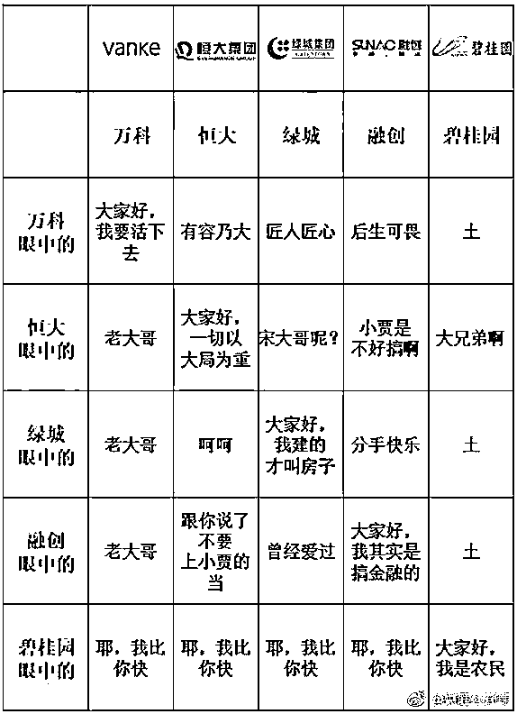
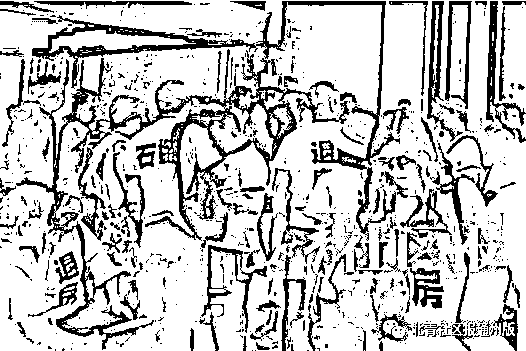
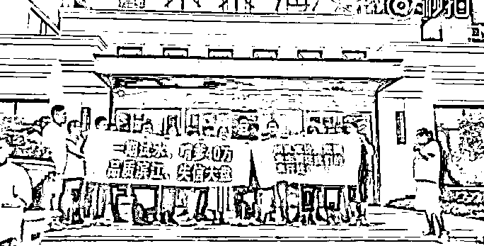
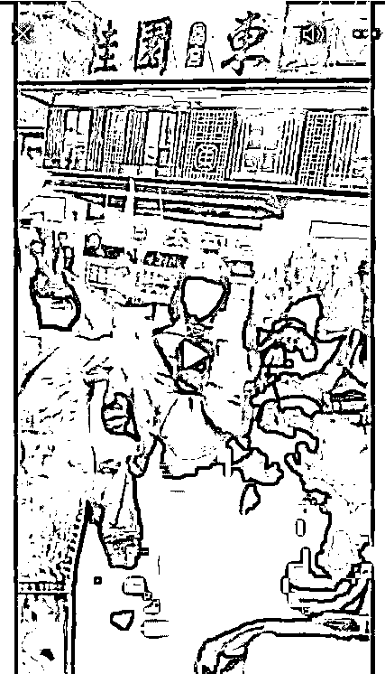
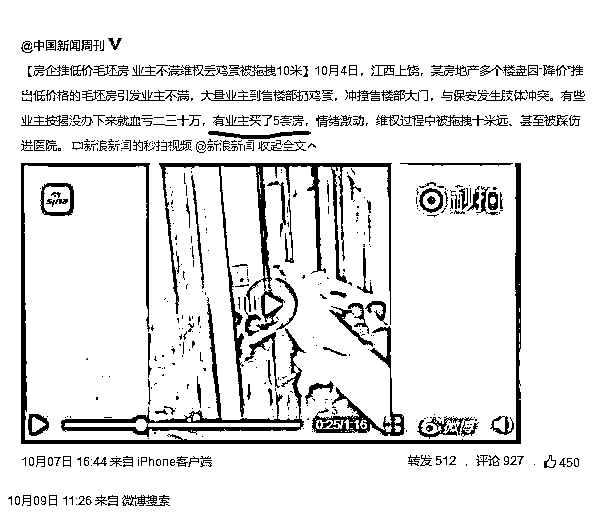
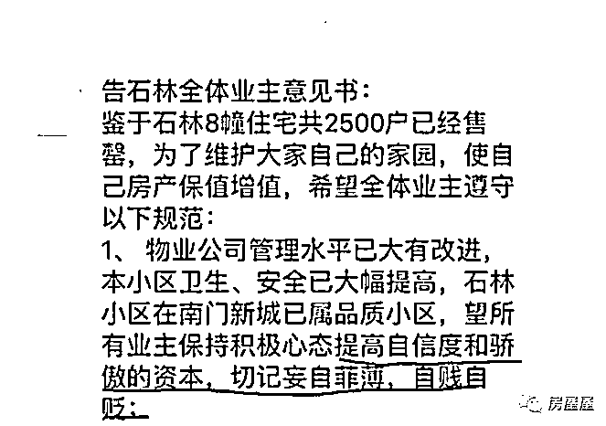

# 载歌载舞，百人退房团当街庆贺

喜欢我的都关注我了~

2018 年的楼市里，碧桂园无疑是最出名的房地产商，因高周转出名之后，它就成为了全国媒体的众矢之的，因为这个“快”，碧桂园已经被网民黑成这样了。。。

我也写了 N 个碧桂园的帖子，不过今天的主角却不是碧桂园，而是碧桂园门前的一群退房者，虽然他们退碧桂园的房子会拿出很多看似正当的理由，但是他们的所作所为我实在是看不下去了，所以我今天站碧桂园这一边，发帖批判这些贪婪且无赖的房闹。

首先，我们看一下这个今天刚拍摄的小视频，退房团当街载歌载舞进行庆贺，看这个高兴劲估计是退房成功了，一眼扫过去就看到了大几十人，实际闹事人数应该百人左右。

他们拿出的标语中，出现频率最高的是“骗子”、“违规”、“退房”，按理说遭到了严重的欺诈，他们应该会很伤心，即便维权成功也应该是愤愤不平，但是你看他们妖娆的舞姿，哪里有一点伤心的样子，快高兴到天上去了。视频的背景是碧桂园售楼处，我暂时没搞清楚是哪个地方的，但是这群退房者肯定不是其他楼盘退房成功了特地跑碧桂园门口拍个视频，所以这个退房案例应该也是碧桂园的。

房闹大军

房闹并不是今年首创，虽然过去 20 年里房地产处于单边大牛市，但是在极其有限的几年回调里，如 2008 年、2011 年，2014 年，2018 年，不管之前涨多少，哪怕涨几万，回调个几千元，房闹大军就会立刻出现，然后不断的要求退房。

2018 年的房闹案例，仅仅写入我文章的案例就有很多，包括但不限于：

北京通州某楼盘，数十名业主身穿统一印有“退房”字样衣服的老业主，要求退房，时间是 6 月份。

进入 9 月，首先开始退房的就是杭州滨江的未来海岸小区。

进入 10 月，退房开始从零星案例，演变成退房狂潮，仅仅碧桂园就有江西上饶、安徽太和和今天刚出的这个摇摆舞退房楼盘，这还只是碧桂园一家被爆出来的，其他房地产商经过友好谈判妥协的肯定更多，图片太多，只取一个贴一下。

房闹大军建立于 2008 年，兴旺发达于 2018 年，今年的房闹大军来势特别猛，特别凶。而这些自称为刚需的房闹，其实都是假刚需，从某种意义上来说，中国甚至不存在刚需这个群体。

买 5 套房的“刚需”

要买五套房才能满足“刚需”的基本要求这个诡异的说法，已经兴起好几年了，一套自住、一套改善、一套给孩子当婚房、一套给父母、一套学区房，合计五套。

听起来似乎很有道理，好像的确是需要，但是仔细想想全是诡辩，按这个逻辑去考虑，你家里至少需要 14 辆车，你一辆车，你爱人一辆车，你孩子一辆车，你 4 个父母每人一辆车，为了单双号需要准备双份，合计 14 辆。

但是即便是非常有钱的人，也不会购置如此之多的车辆，他们不会因为自己具有这个需求，就一定要去无止尽的满足它。按需分配已经被历史证明是不科学的，因为人的需求和欲望都是无止尽的，物质再充沛，都不够用。

在大城市里，有人可以拿出几百万甚至几千万去买房子，也不愿意花几十万买一辆车，因为他们心里很清楚，买房是能保值增值的，未来是可以抛出去赚钱的，而买车是纯粹的损耗，赚不到钱。

所以，买房和买车都是为了满足自己的生活欲望，但是买房是“刚需”，买车就不是“刚需”，这不是很可笑吗，这里面的唯一区别就在于很多人买房除了住之外，还有坐等涨价卖出获取暴利的需求。不知道有多少人，买房的目的里面，有 90%的因素是期望靠这套房子成为剥削者，从此可以靠着从无房者身上吸血过着不劳而获的日子。

例如江西上饶的退房大军里，就有一位一次性购买五套房的人，口口声声坚称自己是“刚需”，这让那些租房都租不起的刚需作何感想。

真刚需买房是为了住的，买了之后直接腰斩，他们也无所谓，而但凡你还在意价格，你就不会是刚需，你里面必然夹杂了投资的目的，你在意的比重越大，你投资的比重也越大。鉴于目前房价之高远远超过普通中国人的消费能力，没有一个中国人能把他看成普通消费品，绝大部分人买房需要掏空六个钱包，不可能不在意价格，所以从这个角度来说，中国没有刚需。

中国目前的所谓“刚需”，房价大跌就立刻开始“维权”，哭诉自己可怜，要求退房；房价大涨就立刻开始沾沾自喜，到处吹嘘自己多么有眼光，多么有魄力，掏空了六个钱包和 60 张信用卡，冒着跳楼的风险买的房，活该自己发财致富，那些怕风险不敢买房的人活该一辈子当穷人。

甚至房价不涨，这些“刚需”也不满，用尽各种手段要求涨价，南京 10 余小区发出“涨价倡议书”，合肥还有小区成立“房价指导委员会”，试图禁止低价卖房的行为。

这种房地产乱象，真是房价暴涨时代的黑色幽默。。。

房地产刚兑必须被打破

中国金融体系的种种乱象，都来源于刚性兑付，让投资者丧失了风险意识，一味的追求高利润，最后是劣币驱逐良币，垃圾债横行，风险不断累积直到最终一次性爆发

而中国楼市的种种乱象，其实也都来源于刚性兑付，如果不打破，那么购房者就会丧失全部理智，一味的追求利润而忽视风险。而风险永远不会消失，只会转移，无非就是最后谁来买这个单而已。

为什么说中国楼市有刚性兑付，那是因为绝大多数购房者都相信，开发商不会允许房价下跌，银行也不会允许房价下跌，政府也不会允许房价下跌，而即便房价下跌了，自己只要去闹事，也能拿到补偿。自己购房只有利润，没有风险，这不是刚性兑付是什么，如此稳赚不赔的买卖，投机资金当然趋之若鹜，你说不让他们去他们就不去了？

从表面上看，购房合同没有承诺房价不会下跌，但是整个社会给予房价的隐形担保实在是太多了，例如 2008 年万科带头降价的时候，就曾遭遇了监管层的多次约谈和特殊对待，当时的确制止了房价的下跌，加上后来的四万亿救市，给予了后来的购房者一个极强烈的暗示，那就是政府不会允许房价下跌，跌到一定程度一定会采取手段的。实际上，他们的判断是极为靠谱的，现在没有一个人敢说房地产暴跌的时候，政府不会采取手段，我也不敢，怎么看都是大概率的事情，所以我看空地产也只敢说横盘，绝对不敢判断说暴跌。

即便是房价面临极大压力的今天，我们对地产的调控依然是“稳”字当头，既要防止大涨，也要防止大跌，这本身就是隐性担保的一部分。

在极端狂热的投机市场中，大众会不断的提出各种匪夷所思的理由来让自己相信这么做可以一夜暴富，人们会相信各种投机奇迹，在泡沫中，人类本性的贪婪和健忘的弱点会发挥到最大。

退房潮的另外一个原因就是，“大闹大解决，小闹小解决”的懒政思维根植于我们的社会土壤之中。所以炒房者理直气壮的对开发商进行道德绑架并以集体闹事的行为诱使政府前来维稳对开发商施压，这一招屡试不爽。在我看来，这是另一种形式的隐性担保，对中国房价上涨的刺激作用，并不亚于货币化棚改。

要赌可以，请愿赌服输，又想学贼吃肉，又不想挨打，这是不可能的事情，契约精神必须被尊重，利润必须和风险同在。像这种通过集体闹事退房成功后当街载歌载舞的视频，我实在是看不下去了。

觉得此文的分析有道理，对你有所帮助，请随手转发。

长按下方图片，识别二维码，即可关注我

近期精彩文章回顾（回复“目录”关键词可查看更多）

华为员工都这么穷，怪不得拼多多能火 | 房价跌 20%就会全面崩盘，地产杠杆远比你想的要脆弱 |  为什么碧桂园的质量那么差 | 清醒点，放弃全面开征房产税的幻想 | 央行和财政部隔空掐架，我支持央妈 |中国土地制度源自香港，但是香港却是劏房密布 | 为什么中介哄抢租赁房源，因为贩毒都没它来钱快