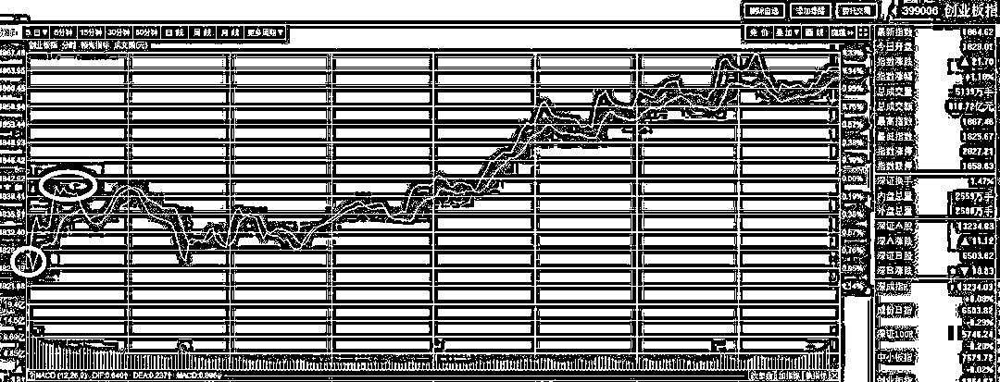
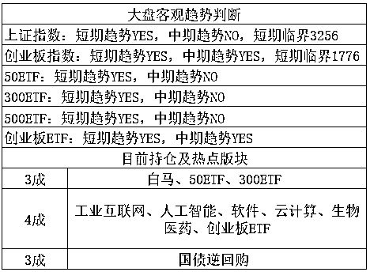

# 震惊，大家的个人隐私是这么被泄露的

<link rel="stylesheet" href="view/css/APlayer.min.css">

昨夜美股大跌，领跌的股票就是脸书，也就是 Facebook 公司，一夜之间市值缩水 60 亿美金，这一惨案的原因是因为纽约时报在一篇报道中爆料称，剑桥分析公司（Cambridge Analytica）通过一定的手段，在 Facebook 平台上获取了高达 5000 万以上的用户资料，要知道美国总人口才 3 亿，1/6 的的人口总量呀，堪称爆炸性新闻。

更过分的是，这些被泄露的私人信息，被人用来经过大数据分析后，辨别这些用户的性格和喜好，精准推送针对性文案来影响他们，以便帮助特朗普当选总统，立马就把性质变的更恶劣了。

他们搜集了这 5000 万用户发表了什么帖子、阅读了什么帖子、对什么帖子点过赞等。进而推导出了这些用户的性格、喜欢，政治倾向等，然后针对性的发送信息来影响他们的投票结果，进而帮助特朗普赢得选举。

看完这个新闻之后我的第一反应是美国人的技术真厉害，居然能用这么少的信息能分析出这么多用户数据，然后居然脑洞大开的拿来干扰选举。第二个反应是，搜集的这些用户资料，对于中国公司来说，不是常规操作嘛。。。仅仅是点赞和阅读了哪些内容而已，真是大惊小怪，要知道我国连身份证号、电话号码，都是成筐成筐的进行出售的。

中国的各大网络公司，你叫的上名号的，哪个没有搜集这些信息，只不过利用率没有美国人那么高效和创意十足而已，美国的 Facebook 本身没有泄露用户数据，是 Cambridge Analytica 利用漏洞来间接获取用户的数据，而且是极少量的数据，仅仅只有浏览过哪些帖子，对哪些帖子点过赞这些数据，都引发了地震造成全国一致性批判，股价暴跌，引发重大危机，中国的信息安全相对而言，还有很漫长的路要走啊。

其实，每天精准的对我广告营销，根据浏览习惯在下面卖卖东西我也就忍了，毕竟有时候的确需要，但是那些连身份证和电话号码都出卖的个人隐私就不能忍了，骚扰电话一个比一个烦，希望中国早点进步吧。

**~~~~~~**

*ST 华泽明日复牌，这家公司已经停牌高达 503 个交易日，而这家公司目前已经亏的接近负资产了，整个公司已经渣都不剩了，明日复牌后，预计会迎来 A 股有史以来的最长跌停记录。

有机构此前直接将他的估值砍到了 0.55 元，而停牌之前他的收盘价是 12.5 元，按此计算，***ST 华泽连吃 61 个跌停才能跌到目标价位**，一个月 20 多个交易日，整整 3 个月每天就在数跌停。。。我就算这家机构有点夸大，而且是严重夸大，给他少算十个二十个跌停，那也都很壮观了。。。

**~~~~~~**

昨晚美股暴跌，我和大家说，如果没有惊天绝地反击这种意外的话，收盘注定暴跌。那么对应的，我国 A 股就会迎来一个低开或者开盘下杀，美股跌那么惨，A 股的低开幅度不会小。

但是很巧合的是，今天是一个很重要的日子，闭幕式，今天无论如何是不适合暴跌收盘的，那是严重的郑智不正确。那么如果 A 股低开个 1%，收盘-2%来迎接闭幕式，像话吗，怎么管理经济的。

所以昨天和大家说，今天的低开是一个很好的盘中 T 机会，买入之后，拉高一点就卖出，是很舒服的一件事情。

今天大盘和创业都低开 0.8%左右，我以创业为例子，开盘买入之后，当接近翻红的时候，就差不多可以卖出了，大概有个 0.6%的利差吧，这个是很舒服的操作。至于后面下午的大反弹，那是另外一波盘中操作了，和开盘买入，稍微拉高之后卖出是两码事。

开盘买入的逻辑，是低开 0.8%，这个时候下杀概率就非常小了，收盘不可能是暴跌收盘的，所以如果还迅速下杀，那还可以再加一波，反抽之后逐渐卖掉，反正不挣钱不走。

而暴跌之后的拉高，按惯例是只吃一小段肉的，通常不会再翻红后卖，一般低于 1%的肉，否则那就不叫 T 了，叫波段操作了。

今天下午的拉升很霸气，明天可以继续观望一天，鉴于今天尾盘很强势，明天开盘还会有一个简短冲高，但是冲的估计不会太多，距离 1900 也很近了，所以明天早上，前几天做 T 买入的可以零碎的全部出掉拉，顺利收肉，剩下的就看冲关 1900 的成败了，按照我们的观点，第二次冲击失败概率是很高的，如果他冲击失败，下来之后我们再抄底就是。

至于非做 T 的仓位，严格遵循趋势交易，我觉得底仓是没必要动的，既然趋势那么好，底仓是必须保留的，顶多是横盘震荡区间内，因为接近了横盘震荡的上缘，所以做 T 方面略微谨慎一下，这样无论怎么走，我们都很舒服。 

**~~~~~~**

适当的资产配置是所有家庭都需要的，今天推荐“**友金所**”，给大家做资产配置的时候多一个选择，让自家的鸡蛋多一个可选择的篮子。它是一款稳健型的理财产品，之前已经推荐过，效果不错。

友金所属于上市公司用友网络（600588）旗下的理财平台。用友是亚太本土最大的管理软件提供商，旗下有 2 家上市公司，实力毋庸置疑。

“友金所”安全运营超 3 年，投资人数超过 138 万，投资交易额突破 296 亿，为用户累计赚取收益 22 亿，本息均全部返还给用户，从未有过逾期纪录，声誉良好，属于一线平台。

【**推荐理由**】最大理由是安全，可以长期信赖；从收益率上来看，历史年化收益 6.2%—12%，中等收益，几乎没有额外费用；对于新手用户，推荐选择年化 12%新手标，一个月到期，100 元起投，限额两万元。用满 2 万的限额，性价比最高。

**粉丝福利：**通过文末“**阅读原文**”：注册送 166 元投资红包；3 月 25 日前，**投资 2 万，送 50 元话费。**（可投新手标）；3 月 28 日前发放。 

友金所已开通上海银行存管，是少数的几个开通第三方银行存管的理财机构，不过并不是上海银行的卡才能投资，支持 16 家主流银行卡的充值。

点击“阅读原文”，立马注册抢 166 元投资福利+50 元话费！

↓↓↓