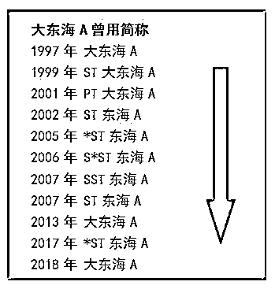
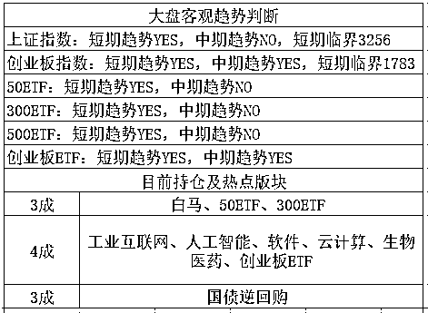

# 今晚木有标题

<link rel="stylesheet" href="view/css/APlayer.min.css">

今天没有啥标题，也不能每天都有一个有趣的核心主题呀，偶尔总是有日子平淡的，今天的确感觉没啥可以特地说的，所以今天大家多留言吧，我会多精选几个上墙并回复的。 

~~~~

**乐视网昨天百万封单封死跌停之后，今天再度封死跌停**，而且是接近二百万手，开板不知道什么时候，乐视这个股票真的是人间悲剧，第一波连续跌停还好说，这一波连续跌停真的是不作不会死。

有一个段子说，乐视网这个票，好似一辆开往火葬场的车停了下来，一堆人争先恐后的上车，都以为自己能提前下车，结果他们上车人数过多，把司机给挤下车了。

孙宏斌看起来是白衣骑士，人家目前持股才 8%啊，犯得着为了乐视网把自己的融创都搭进去嘛，自己在里面玩命，其余 92%的人等他抬轿子，还不如直接下车算了。。。

~~~~

**大东海上了热门，荣获 A 股第一奇葩股**，大东海上市 20 年，淋漓尽致的展示了 A 股所有的保壳战术，ST、*ST、S*ST、S ST，乃至中国只有少数几家公司享有过的 PT 的帽子，大东海轮换着戴了 20 年。

身为垃圾股之最，整个公司就是三亚的一个酒店（仅有 198 套房），在几十年没啥业绩的情况下居然屡屡保命，楞是不退市，且市值还成功维护在 36 亿，简直是价值投资莫大的讽刺，前几天还再度摘帽，股价收获 2 个涨停。

而且，他当初上市还涉嫌造假上市，上市之后被挪用几乎全部资金，公司被掏空，屡屡被证监会警示，然鹅，并没有太大卵用。

让我们**欣赏一下大东海 20 年来的反复摘帽和带帽的旅途**，真是难为他了，666，这种毫无盈利能力的空壳公司，他不铁公鸡怎么可能呢，这种公司留在 A 股反复玩弄退市制度，始终挣扎在退市边缘，真的是耻辱啊。

**~~~~**

今天上午，开盘跳水，蓝筹跳的尤其多，直接打到 3256 警戒线附近，然后拉起，比较亮眼的是创业板，单边拉升，临近中午收盘涨接近 2%，一片红，新经济涨的尤其好，而昨天刚和大家报警+吐槽过的独角兽概念，今天沦为毒角兽。

到了下午的时候，题材股开始小幅回落，而上证开始拉起来，蓝筹带头，今天主要动用中国平安这只股来调节指数，到了收盘，全红。

这种走势，结合周五的诡异下跌，尾盘突然砸盘，让我感觉周五的下跌是不是故意的，留出空间确保周一周二是红盘，毕竟大会马上要结束了。

这么说的原因主要是创业板，创业板上周五尾盘的下跌太猛烈了，连我都认为周一至少要向下暴杀一下才会反弹，毕竟有下跌惯性嘛。结果周一开盘根本什么惯性都没有，直接就单边拉升了，拉升的和周五尾盘的单边下跌一样诡异。

如果上周五不砸，反而拉的话，周一周二就非常容易引来抛盘，因为没人认为会突破 1900 之上，所以可能 1880 甚至 1860 就会有人砸，要维持不绿都很难，别说红盘甚至小阳了。而周五一口气下去之后，故意跌一下，这样周一周二弄二个小红盘就非常容易了。

既然他这么玩，就认为他也不认为能突破 1900，也是按横盘做的，消化一下而已，那么明后天，如果再上拉到 1860 之上，我觉得就可以先 T 掉了，没必要等 1900 了，估计这横盘的时间会略有点久，没必要死等，横盘期间就是做 T 的好时候。

另外，今晚欧美暴跌，跌的是相当的惨，如果明天早上起来看到收盘没有拉回去的话，那么明天 A 股很可能有一个低开，巧合的是，明天是闭幕式，大阴线迎接闭幕式怎么都不合适呀，所以明天如果受外围影响低开或者下跌过多的话，也是一个小机会，不过别贪多，这种 T 吃一点点肉盘中就走。

而整体来看，上证已经快横成一条直线了，超级窄幅横盘，我已经不想看了，超级压舱石啊。创业板也是小横盘范畴，不过还算有点看头。

紫色的股

经济-金融-投资