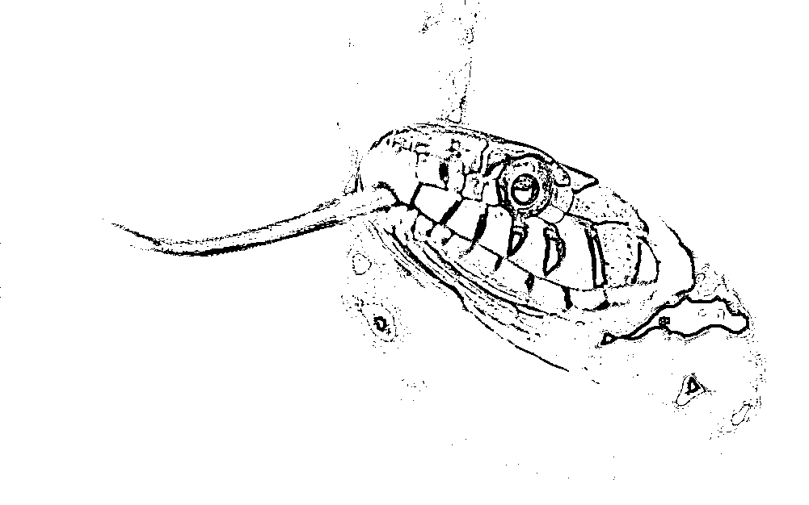

# 人类和外星人之间真的不可能谈道德吗？

（下面带有几个非常有趣的视频，友情提示 WIFI 模式下观看）

 明天休市，轮休一晚。

今晚我们来聊聊外星人的话题，首先我们要谈一谈这个宇宙里有没有外星人，然后才能谈到外星人是敌是友，首先，外星人是肯定存在的，而且种族可能是数亿甚至数千亿之多，先看看下面这个视频了解一下宇宙有多辽阔。 

银河系就有数千亿颗恒星，太阳只是其中之一，假设 1 亿个太阳系能诞生 1 个智慧种族，银河系中应该存在数千个宇宙文明。

而银河系隶属于拉尼亚凯亚超星系团，内含大约数千个大星系，质量大约是 100 万倍银河系，质量代表恒星系数量，按质量计算，智慧种族数量再乘以 100 万倍，那就是 10 亿智慧种族。

而这样的超星系团，又有数十亿个才组成了目前的可观测宇宙，那智慧种族应该是数百亿亿个。

这么一算，1 亿个太阳系诞生 1 个智慧种族明显多算了，少估算点，数千亿个太阳系才诞生 1 个智慧种族吧，也就是假设整个银河系就我们一家，那么可观测宇宙的智慧种族除以数千，那么会从数百亿亿的数量减少到数千亿，这也很多了，密密麻麻。

你以为这就算完事了？别急，可观测宇宙只是整个宇宙的极小一部分，根据宇宙大爆炸理论，可观测宇宙之外，还有更多的星系。

整个宇宙的大小，大概是目前的可观测宇宙的 150*10²¹，密密麻麻一堆 0，也就是说，我们刚才推算的宇宙文明数量还要再乘以这么多倍，这个乘法算完之后你会发现，整个宇宙的智慧文明数量，会比整个地球的蚂蚁数量，都要多上好多好多倍，实际上，地球上所有的沙子的数量，都没有宇宙中智慧文明的数量多。

换句话说，智慧文明这东西是很廉价的，之所以我们很稀罕，是因为我们太低级了，连太阳系都飞不出去，一直没见过而已。

那么我们再**谈谈人类和外星文明能不能和平共处吧**，我们假设这么一个情况，你上山砍柴，砍着砍着发现了一条毒蛇，而那个毒蛇也发现了你，你们距离只有 1 米，你一刀就有可能砍死它，而它也有可能咬死你，在这么近的攻击距离之内，你们互相的攻击速度都是一瞬间就能灭了对方，看谁出手快了。

先别谈什么和平共处，看看下图，假设现在你面前有这么一条毒蛇盯着你，你心里方不方，你觉得它是愿意和你学习一下砍柴刀法，还是你愿意和他学习一下毒液制造技术，大家互相学习，和平共处？

如果能缓缓退却，大家互相远离到看不见的地方，那感觉还好一点，但是如果大家疆域接壤，每天都必须距离 1 米之内，你方不方，害不害怕，这个时候，最好的毒蛇，就是死掉的毒蛇，死了我们才能安心。

宇宙中的智慧文明就是这个样子，凡是有能力飞出自己所在的恒星系的文明，都是有能力毁灭整个恒星系的，我们人类的能力只能短暂离开所在行星，只能算是行星级文明，现有的核武器都能把整个太阳系的所有行星地表摧毁几百遍了。

对于能够进行星级旅行的恒星级文明来说，飞船的范围就是自己的领土范围，因为能达到星级旅行的文明，任何一个星球都是能驻扎的，任何一个星球也都是有价值的，没有巨大无比的能量源和海量的金属物质，以及能够在虚空中独自生存数百年的飞船技术，是不可能离开所在恒星系的，如果能达到这个技术水平，那么每一颗星球，都有利用价值。

所以那么当两个能进行星际旅行的恒星级文明相遇的时候，就代表他们领土接壤了，这个时候，彼此都能给对手造成毁灭性打击，肯定是不死不休，人类和毒蛇，向上数一千八百万代的话，那还算是一个祖宗的呢，以宇宙文明的宽度来说，地球人和地球蛇，那还算是老乡，彼此距离那么近，都忍不住要先弄死对方。

而以宇宙中动辄飞行数千年数万年的距离来说，双方的技术能力达到恐怖平衡，互相不敢动手的概率也是极小的，这概率低于亿分之一，数千年前的人类和今天的人类，和数千年后的人类，是一个概念吗？肯定不是。

那么如果人类在星级旅途中碰到了低级文明会怎么办呢？英国人当年踏足美洲的时候，碰到的美洲野牛，是乖乖退回英国，把美洲让给野牛，还是灭了他们呢，答案很显然意见，留下几百个人种关进动物园，然后再宣布这个外星人是珍惜物种，需要保护就行了。

而外星高级文明遇到了我们，结果不会差太远，碾死一个低级文明，不会比碾死一只蚂蚁困难多少。《三体》里面的黑暗丛林法则，和高级文明各种稀奇古怪的打击方式，大家有空可以看一下，真正超脱了恒星级文明，达到了星系级，甚至超星系团级的文明，灭一个太阳系，一个普通公务员随手发射一个粒子就行了，价格可能和一支烟差不多，别人都懒得去观察一下太阳系里是否真正的有文明，感觉可能有，就足够他发射一个粒子去清理一下了，一个个观察太麻烦，露头的文明太多，忙不过来，反正灭一个恒星系很便宜。

而实际上，只要一个文明超脱了行星级，达到了恒星级，能够进行星级旅行的那一刻，就完成了文明的质变，其意义可能和原始人发明了火种差不多，这个时候，这个文明就有能力，像病毒繁殖一样，迅速的从本土恒星系，扩展到几千个恒星系，不管这个恒星系是否和自己原有星球一样，都可以生存，再差能有宇宙虚空差？虚空旅行都过几千年了，能够到行星表面是多么幸福的一件事，有光，有星球能让机器人挖掘金属和制造能量源的矿石，就足够繁衍了。这个时候，唯一能阻挡这个文明扩张的脚步，就只有大星系和大星系之间突然又大了几亿亿倍的虚空距离了，正如同如今二个恒星系之间的距离我们这种行星级文明觉得遥不可及一样，大星系和大星系之间的距离，恒星级文明也觉得遥不可及，再突破一步，那就是星系级文明了，掌握时空虫洞的存在。

而实际上，所有的文明进化到最后，整个宇宙中只会有一个智慧文明存在，其他的智慧文明，要么被灭亡，要么关进动物园，就好像地球人类对待猴子一样，猴子的进化脚步可能只比人类慢一步，可惜了，结局是他进动物园。这个生存游戏就好像最近很火热的绝地求生吃鸡游戏一样，100 个人空投到一个孤岛上，最后只能有 1 个幸存者，大家都潜伏起来，手持步枪，谁先暴露位置谁死。

而整个宇宙的文明竞赛，是数千亿亿亿亿的文明里，最终存活一个超级文明，可能这个时间会非常的长，就好像人类也是进化了几十亿年才统治地球的，但是最终有一天会到来的，我希望这个幸存文明是人类，我对咱们自己的文明还是比较有信心的=。=

好了，还有时间的可以看下面这个视频，是**讲述地球文明进化史的**，看完之后你会发现，诞生一个文明也不是那么的困难，虽然诞生初始生命的条件比较苛刻，但是在银行系几千亿恒星系的基数条件下，就一点都不困难了。