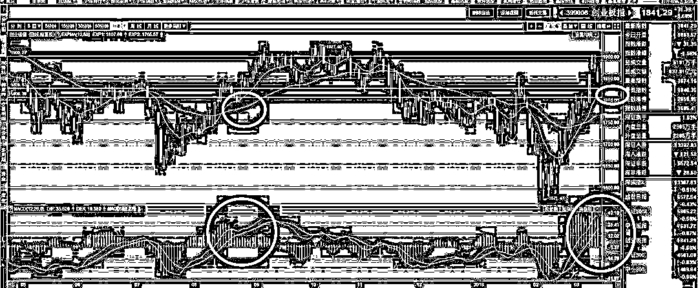
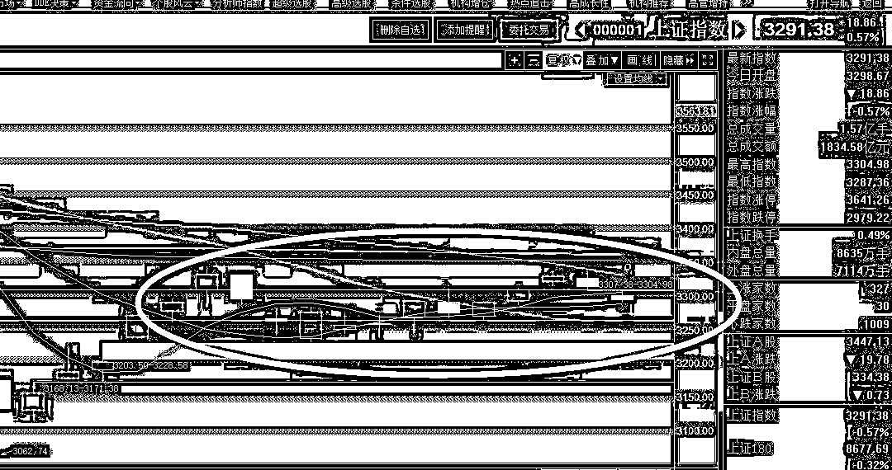
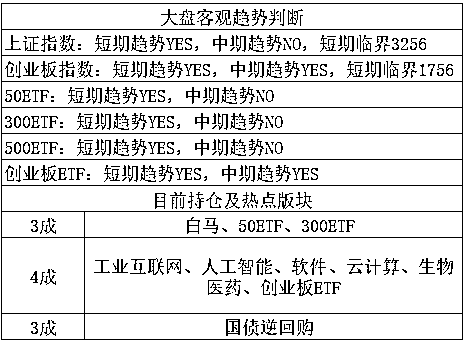

# A 股史上第二大罚单

<link rel="stylesheet" href="view/css/APlayer.min.css">

今天有一个比较大的消息，证监会通报北八道操纵次新股案 开出 55 亿元史上最大罚单，经查明，厦门北八道集团涉嫌操纵的次新股包括张家港行、江阴银行、和胜股份等，操纵期间累计获利 9.45 亿元。该案目前已经过调查审理和行政处罚事先告知程序，证监会将对北八道集团作出没一罚五的顶格处罚，罚没款总计约 55 亿元。这将成为证监会行政处罚历史上开出的最高额的罚单。

这是 A 股史上第二大罚单，仅次于徐翔，其核心原因是张家港行，这只票当年炒作的时候动静太大，各路媒体争相报道，至于其他的票，都是给牵出来的，这体现了目前的指导政策思想，可以涨，但是不能涨停，更加不能以一己之力封涨停，不然有一个逮一个。

而今天**乐视网盘中被特停**，也体现了这个指导思想，乐视网在第 11 个跌停开板之后，又跌了 20%，然后开启了一波大佬自救行情，采用的手段也是封涨停，其实乐视网可以涨，毕竟再怎么跌也不能归零退市，最低点跌到了 4 块钱，离当初大家预测的最差情况 13 个跌停板，价格 3.9 左右也差不多了。但是证监会无法容忍的是以大资金连续拉涨停板来吸引市场注意，如果乐视是慢慢涨，市场合力用半年时间慢慢推上去的，再做出点业绩出来，估计他也不会管。

乐视网今天的特停，可能和孙宏斌宣布辞去董事长职务，并退出董事会，完全撒手不管也有关系，人事剧烈动荡的时候业绩是不太可能有了，纯资金推动封涨停炒作也被特停了，没有业绩的情况下，如果不准封涨停，那就难了，现在看看里面当初活埋的一众大佬如何自救吧。

证监会今天向二会代表透露，已经成立专门关于四新类企业创新型经济业态的专家委员会，对全国独角兽企业进行把关，目前已经统计的结果是，资产 10 亿美金的 100 家左右，20 亿美金的不超过 50 家，接下来准备分批推进 A 股上市。

四新类企业倒是没话说，支持新经济，但是这 150 家巨无霸就有点吓人了，最差的也是 10 亿资产，要是上了 A 股，市值分分钟跑到三五百亿啊，个个都是小二线蓝筹级别的，也不知道打算 IPO 几个，希望速度慢一点，再新经济，再独角兽，也经不起这么抽血。毕竟不管你是独角兽还是独角龙，IPO 就是 IPO，换个名词定向注册制啊这是。

**在全国仅有一个独角兽富士康的时候，独角兽概念也就炒成这个样子，如果大批量上市，估计也就没得炒了，毕竟物以稀为贵。**对于一级投资市场倒是重大利好，风投获得的股权，一旦上市马上身价倍增，可惜那投资门槛都是十亿级别的，我们也参与不了。

**霍金今天去世了，物理学界的重大损失，**不过霍金给我们带来的，主要是精神层面的不屈，以一个如此残破的身躯，还能获取国际一流的学术水平殊为不易。如果霍金年轻的时候就是健康的身躯，说不定可以达到顶尖物理学家的成就。

要知道霍金已经无法动弹三十多年了，三十年来没有体力和精力进行任何科学研究了，吃的是之前的老本，30 年前的霍金无比的惊艳，能吃老本那么久足够体现他的实力，但是同样的高智商顶尖物理学家辛苦做了 30 年科研，怎么成就都超过去了，成就反超的全球至少十几个人。

如果霍金在年轻的时候没有染病，30 年来正常的科研学习，一辈子的成就无法预计，属于被半途抹杀掉的天才。

今天证监会还特别发布了一个风险提示，证监会：由于**次新股**普遍具有发行市盈率低、概念新、流通盘小的特点，很容易成为市场炒新、炒小、短线操作的一个集中领域，积聚市场风险和泡沫。证监会调查人员提醒投资者，有效打击次新股炒作等市场操纵行为离不开理性的市场环境。

评论：**短期估计被压一压没悬念了**，都点名了得给点面子。

 

今天三大指数全天绿色震荡，尾盘还有一波次新小盘的狂杀，到收盘，上证下跌 0.5%，创业板下跌 1.68%，前几天我和大家说，创业板 1900 之上密密麻麻全是套牢盘，外加短期冲的太快，先回调整固横盘一下很正常，要注意做 T。

冲 1900 的上缘 T 做了之后，马上就到了横盘区间的下缘 T 了，1900 的确难以冲过去，尤其是一口气连续暴涨的模式冲过去更不可能，但是趋势那么好，要回调太深也不可能，我们是横盘整固做 T，不能指望 T 出太大空间，我们看看下图。

在强多头区域的第一次回踩，通常都回踩到 EXP 白线之上，然后就会停滞，明天的这个线大概是 1816 左右，而 10 日均线是 1826 左右。今天晚上又是罚款又是警告次新股，明天开盘再杀一下非常正常，加上明天是 315，历来 315 都是点名一个死一个，市场噤若寒蝉，等他点完名了才敢动。所以明天开盘下跌概率大，但是如果杀到这个区域，就可以买了做 T 了，拉高之后再卖掉，然后等均线追上来，横盘区域结束。指望回踩到 20 日均线概率很小，毕竟是首次回踩，所以不用等 20 日，横盘整固区域不能指望做太大幅度的 T。

而上证指数，波动幅度太小，这横盘横的连做 T 的价值都没有，波动小于 1%的 T 我以前很喜欢做，后来发现没啥意思。。。所以暂时就继续当压舱石用。

总的来说，上证继续当压舱石，而在整体为横盘整固行情的背景下，今天和明天的下跌给了一个非常好的机会，这个机会不亚于冲 1900 给的 T 机会，横盘的上缘要做 T，下缘也要做 T，由于 EXP 白线追上来的非常快，所以这一波的横盘区间很狭窄，非常的横，极限高点和极限低点差距最大估计也就七八十个点，如果不能卖极限高点买极限低点的话，T 空间也就五十个点，不过这个 T 已经很可以了，你看看上证那个波动率，几乎纹丝不动，做 T 就是送手续费，他的作用不是做 T，第一个是压舱石冲高打新市值，第二个是版块轮动的时候提供调换仓位的基础，核心有操作价值的，还是那 4 成新经济创业板股票，其余都是配角。

把创业板的临界点一口气从 1736 提升到 1756，上证的还是纹丝不动。

紫色的股

经济-金融-投资