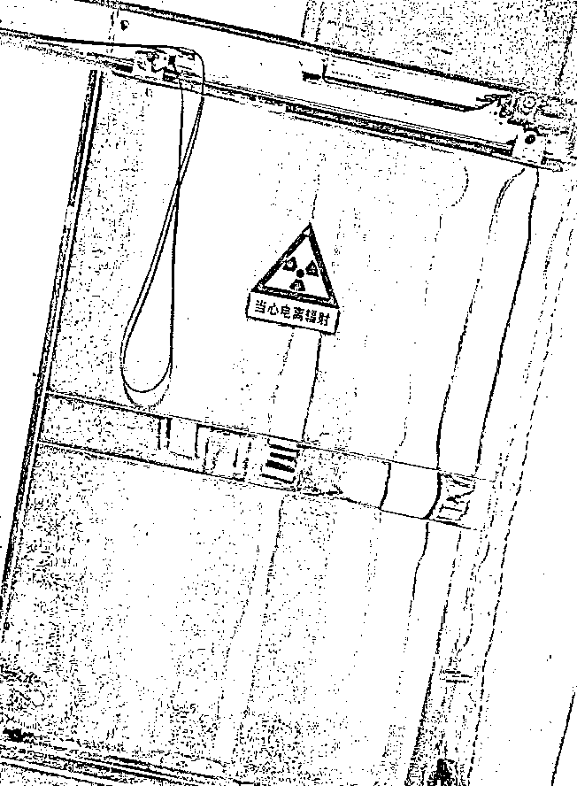
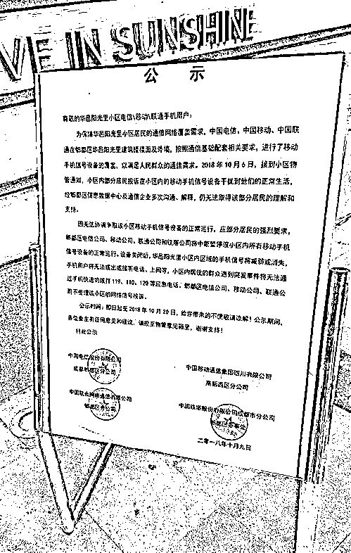
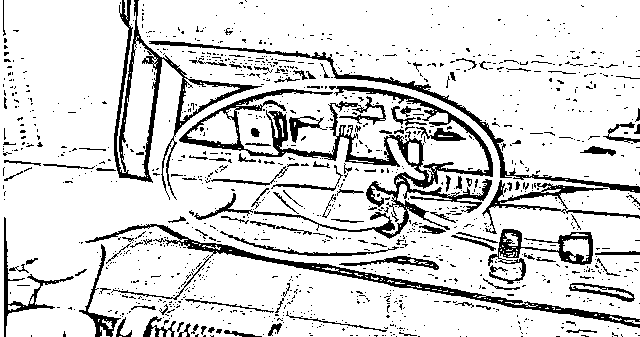
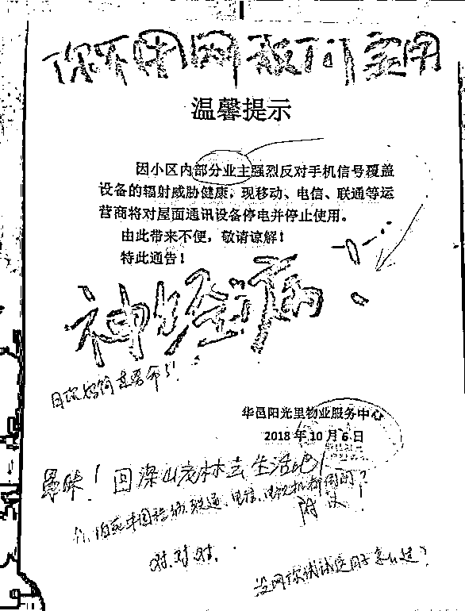
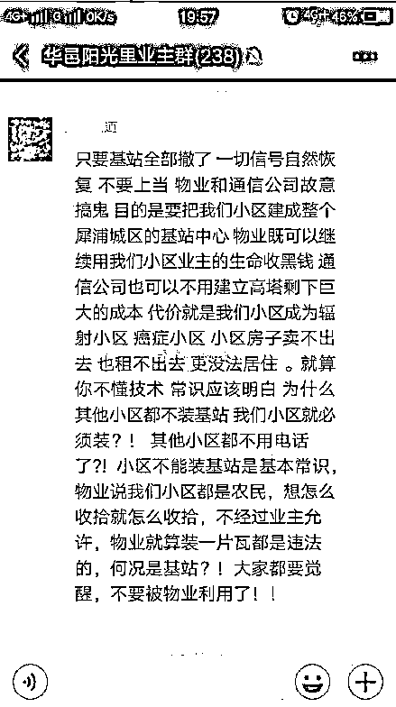
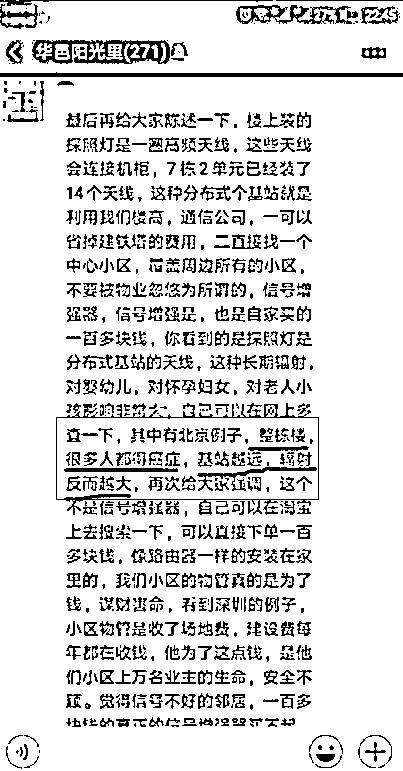
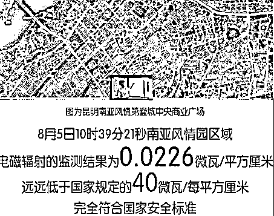

# 通讯基站没有辐射危害，相反它还有美容效果

喜欢我的都关注我了~

在中国，好多人都有这么一个印象，家里的 WIFI 是有辐射的，手机是有辐射的，运营商安装的通信基站那辐射更是不得了，而这些辐射，统统是有害于健康的，基站那种级别的辐射能致癌的，会没命的。

为什么会产生这样的印象，首先任何中国人小时候第一次听说到辐射这个词，基本都会是小学课本上介绍的原子弹，书上清清楚楚的写着原子弹是靠核辐射杀人的，核辐射具备巨大的杀伤力。然后是当你长大了接触到医院后，医院特别喜欢给你拍片子，什么 CT 啊，X 光啊等等，而当你在放射科做这些检查的时候，隔离门上用显眼的大字标志着，当心电离辐射。

电离辐射啊，好可怕啊，医生都清清楚楚的说他有害了，家里的手机、WIFI、电信基站都有辐射，说他们有害，那还有假？压根就没冤枉他们。

看到这里，请自行网络搜索“电磁辐射”和“电离辐射”的区别，电离辐射超过一定剂量后确实是有害的，而且害处还很大，他们是与放射性元素有关，所以给你胸透的医生所属的部门叫放射科。但是电磁辐射不一样，虽然都叫辐射，但是电磁辐射是无害的，实际上整个宇宙电磁辐射无处不在，而经过多国的试验证明，对人体并无危害。

但是广大中国群众不相信啊，他们的直觉和身边的谣言都告诉他们，辐射有害，而且会致命!

拆基站之事层出不穷

开启民智的群众很少，愚昧的群众太多，在这样的科普背景下，通讯行业的基站和电力行业的变电站就变成了恶魔一样的存在，在这些群众眼里，这些东西杀人不见血，靠近一点就会死于非命，完全没思考过天天和这些设备打交道的工作人员为啥还在活蹦乱跳。

最近，四川省成都市郫都区的华邑阳光里小区出现了一件奇葩的事情，小区内外手机信号突然减弱甚至消失，中国电信、中国移动、中国联通三大运营商联手中断了这个小区的基站运作，并且拒不受理该小区的网络信号投诉，于是这个小区内大量业主手机信号瞬间减为 1 格甚至是 0 格。

而这个基站，是当初小区内手机信号特别弱，应广大业主的要求，物业沟通了很长时间之后运营商才终于同意出资在这里设置的。那为什么花钱设置了之后又要中断呢，原来设备进入小区之后，有部分业主认为这东西是强致癌物，不断的故意破坏基站设备，剪断了大量的电缆，运营商修了剪，剪了修，不胜其烦，干脆直接关闭了基站，不劳烦你剪了，我直接关闭它行吧。

而信号减弱后，其他大脑正常的业主都炸锅了，纷纷指责这些无知愚昧的业主是老鼠屎，坏了小区的一锅汤。

但是那些搞破坏的业主可不服，继续在业主群里鼓动无知群众拆除基站，有人说这是物业拿业主的生命为代价赚黑心钱，为什么别的小区没有基站，就我们小区有，我们小区会成为辐射小区、癌症小区！

拜托，别的小区没有基站只有你们小区有，那是你们物业负责好嘛，很多小区的信号差的要死，就希望自己小区能有基站呢。

还有人直接在业主群散布谣言，说北京有活生生的例子，因为安装了基站，整栋楼很多人都得癌症了，而且离基站越远，居然辐射会越大！愚昧到这个程度也真是够了。

这位谣言制造机很明确的说，安装了基站的北京某小区，整栋楼很多人都得癌症了，而且很明确的说，距离基站越远，辐射反而越大。假设他说的都是对的，那中国移动将会是世界上最牛逼的大规模杀伤性武器，安装一个基站，抵达美国辐射会放大万倍，小区内只是大面积得癌症而已，美国是整个国家都没了。

辐射的科普知识

看到这些可笑的谣言有如此之大的市场，而很多人都被其蒙蔽，我觉得我就很有必要进行一次深度科普了。

首先，日常生活中我们能接触到的电磁辐射基本都是无害的，我再强调一遍日常生活中的电磁辐射都是无害的。地球上最大的电磁辐射源就是太阳光，而头顶的那个灯泡，你做饭使用的火焰，也在产生电磁辐射。大自然中的万物，只要不是零下 273 度这种绝对零度冻结了分子级别的震动，都会产生电磁辐射。电磁辐射和核辐射的那种电离辐射，虽然都叫辐射，但是他们是两码事。

由于中国的社会文化背景，很多人都恐惧辐射，所以中国对电磁辐射制定的国家标准非常之严格，中国规定电磁辐射的安全标准是 40 微瓦/平方厘米，而美国的国标是 600，欧盟的国标是 450。

换句话说，在你能接触到通讯基站的任何地方，如果运营商没有做隔离设备且检测到电磁辐射达到 40 微瓦/平方厘米，运营商则涉嫌违反国家标准。

而实际上，在很多小区内检测到的电磁辐射，基本都在 0.1 微瓦/平方厘米以下，翻 400 倍都没超标。

中国企业什么时候这么好了，居然做出这么严格标准的产品，做家具的不是天天甲醛超标吗？之所以会有这样的差异，那是因为电磁辐射和甲醛不一样，电磁辐射的本质是能量逸散，辐射越大，能量损耗越大，不仅对信号质量会产生严重的影响，而且会大幅增大运营商的成本。

所以压根不需要国标压制，运营商恨不能没有逸散辐射，直接 0 损耗把信号传输到你手机里。

假设电磁辐射是有害的

说了这么多科普知识，你将信将疑对吧。没关系，我们先假设电磁辐射是有害的，而且是能致癌的。

在这种假设下，你就更要跪求运营商建立基站了，为什么呢？因为你的手机他自己也有电磁辐射，当小区信号不好的时候，你的手机会自动增大天线功率寻找更远的基站来建立通讯联系，一直达到他本身的功率上限为止。

当基站就位于你身边，和基站和你距离有几公里远的时候，你手机释放的辐射量，会有几倍甚至几十倍的差距，而这玩意是贴着你的脑子的，假设辐射有害，那些小区内没有基站的人早就完蛋了。

所以如果你认为辐射有害的，请千万保护好你们小区的基站，一旦那玩意停电了，请立刻把你们的手机扔出窗外，否则你分分钟会因为巨量辐射而死于非命。

对了，国外为了验证电磁辐射是否有害，曾专门做了一个实验，把电磁辐射强度增大到几个 T（比美国的国标大几十万倍），然后扔了一只实验室的青蛙进去，这只青蛙活的好好的，一点事都没有。而如果是做 X 光的那种电离辐射，增大几十万倍强度，人进去瞬间就融化了，连致癌的机会都不会给你的。

对了，你家的 WIFI 的所谓辐射，和手机辐射是一个道理，别天天买什么仙人掌去防辐射，简直是滑稽，植物能吸收辐射它也是一个大谣言。植物是能吸收二氧化碳，但是电磁波和光是一个等级的，植物能吸收它？让它拐弯？你家植物是属黑洞的吗？

中国其实是个营销大国，很多东西换一个名字效果就大不一样了，同样是电磁辐射，弄点磁石放在鞋底，就可以当养生鞋大卖，喜气洋洋的过年送爸妈。但是小区里弄个基站就不行，也是电磁辐射，居然会被当成致癌物。

所以我这里建议三大运营商对全国的小区通讯基站进行大改名，叫基站太难听了，有辐射呢，好可怕。建议在基站头上加一个小红灯，然后改名叫红外理疗养生仪，因为美容院的红外理疗养生仪就是靠电磁辐射加热皮肤的，辐射量比基站要大了几千倍，而且还要收费，做一次理疗很贵的。

现在多好，移动电信联通三大运营商联手把红外理疗仪送进小区，24 小时服务群众，免费做养生保健，如果你有幸住的和基站近一点，还能获得全身美容效果哦。

觉得此文的分析有道理，对你有所帮助，请随手转发。

长按下方图片，识别二维码，即可关注我

近期精彩文章回顾（回复“目录”关键词可查看更多）

华为员工都这么穷，怪不得拼多多能火 | 房价跌 20%就会全面崩盘，地产杠杆远比你想的要脆弱 |  为什么碧桂园的质量那么差 | 清醒点，放弃全面开征房产税的幻想 | 央行和财政部隔空掐架，我支持央妈 |中国土地制度源自香港，但是香港却是劏房密布 | 为什么中介哄抢租赁房源，因为贩毒都没它来钱快