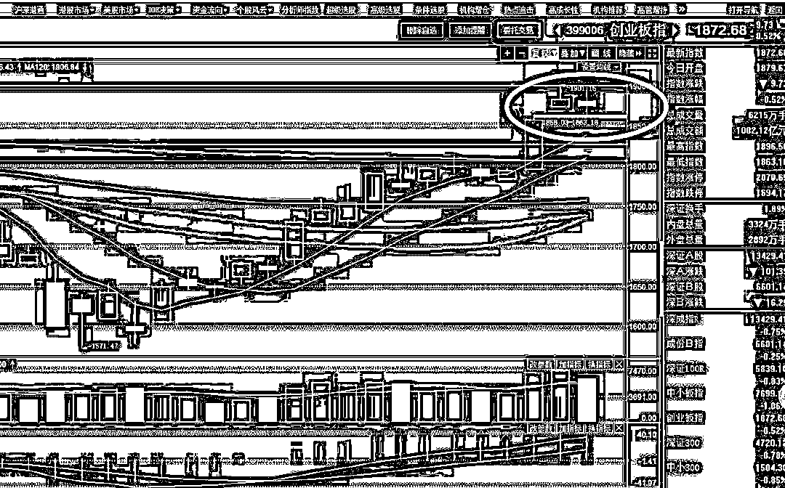
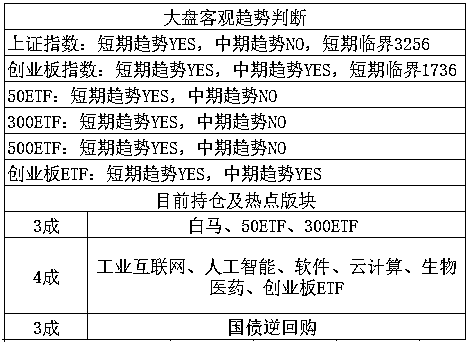

# 没标题，低调发夜报

<link rel="stylesheet" href="view/css/APlayer.min.css">

今天的 EH 上，宣布了大量的重磅级政策，国务院正部级机构减少 8 个，副部级机构减少 7 个，保监会走了铁道部的老路，彻底成为历史名词。。 

保监会消失的正式通告是：将中国银行业监督管理委员会和保险监督管理委员会的职责整合，组建中国银行保险监督管理委员会，作为国务院直属事业单位。**一行三会从今天开始，成为了一行二会**，今天有很多吃瓜群众争相前往保监会大门口拍照留念，以后摘牌了想拍照都没了。

**一行三会的合并是大势所趋**，中央定调，证监会早晚也会合并进去，现在不合并唯一的解释只能是现在的证监会主席干的太好，上头认为他非常称职，暂时不想给他挪位置，要知道证监会主席是一个非常难做的位置，股市成立二三十年来，就没见过一届不挨骂的证监会主席，除非你有本事让股市永远涨，只要下跌，不管什么原因，必然挨骂，抛开别的不说，现在的股市被治理成这个样子，至少中央是很满意的。

所以刘主席目前业绩斐然，暂不合并也是理所当然，毕竟古人云宁为鸡头不为凤尾，等刘主席高升之后，估计才有可能合并。网络神段子，保监会被银监会成功并购，证监会保壳成功。 

除此之外，还有很多其他的重磅政策，但是统统没有引起媒体关注，今天各路媒体直接刷屏的新闻居然是一个 EH 的美女记者，一个 10 秒的美女记者表情包碾压的所有财经大新闻，视频、照片、内幕八卦我都有，但是这位女记者半小时内就直接被吊销记者证了，挺惨的。外加这种不得体的行为有损二会威严形象，所以我就不大写特写了，提一下，大家自己去八卦搜索就行了，她的各种类型的表情包现在是铺天盖地，并不难以找到。

昨天告诉大家，市场进入强阻力区域，创业板 1900 上方密密麻麻的全是套牢盘，外加短期上涨过快，短期压力极大，整体趋势是向上的，但是短期整固一下走势，等一下均线的可能性极大。

今天开盘之后，小票迅速跳水，上证翻红，靠蓝筹撑一下场面，而后在小票的一片跳水声中，创业板突然拉起，从-1%拉升到+0.5%，然后又缓慢回落，到了收盘，三大指数基本都收跌 0.5%左右，全天群妖乱舞，多只股票试图制造热点均没有成功，散乱不成体系。

这个跌幅很正常，昨天已经基本判定短期冲刺过快过猛，1900 不可能一口气突破，肯定要整固一下走势，从今天的走势看，下跌最深的时候居然都没有补掉周一的跳空缺口，预估整体走势是弱回调，回踩到位之后才发起第二轮攻击。这个时候适合做 T，昨天刚说过，不怕回踩，浅回踩做 T，深回踩就是送钱。。。

新经济是创业板这一轮上涨的核心灵魂，新经济的版块走势这一轮也明显强于整体走势，蓝筹白马只能当压舱石用，带头领涨的还是新经济，这几天很多人问我持仓里为什么没有新经济的版块，这个问题简直。。。所以我今天正文里说一下，新经济是一个概念，并没有直接所属的版块，不过领导已经给了明确的定义，那就是**工业互联网、人工智能、软件、云计算、生物医药这几个版块，这个就叫新经济**。

今天夜间，**特朗普在推特上宣布，解除美国国务卿的职务**，这矛盾得有多深啊，美国很注重个人体面的，辞职和罢免是截然不同的两码事，大家看美国电影的时候都见过这样的场景，国会拒绝某人的辞职，坚持要罢免他，虽然都是下台，但是意义是完全不一样的。

至于罢免国务卿对美国经济的影响，暂时还看不出来，对他俩为啥闹矛盾成这样并不清楚，所以不下评判，不过可以通过美国股市的走势来看看，如果明天早上起来美股收盘还是风平浪静，那就和我们没太大关系。

总体来说，最近一段时间，是整固横盘为主，可以顺手做做 T，别闲着，突然深跌的概率微乎其微，而随时都可能再次突击 1900 之上来反复磨损套牢盘，这种行情最适合 T 了。

没什么要补充的，创业板的临界位置飞速提升中，上证原地不动。。。

紫色的股

经济-金融-投资