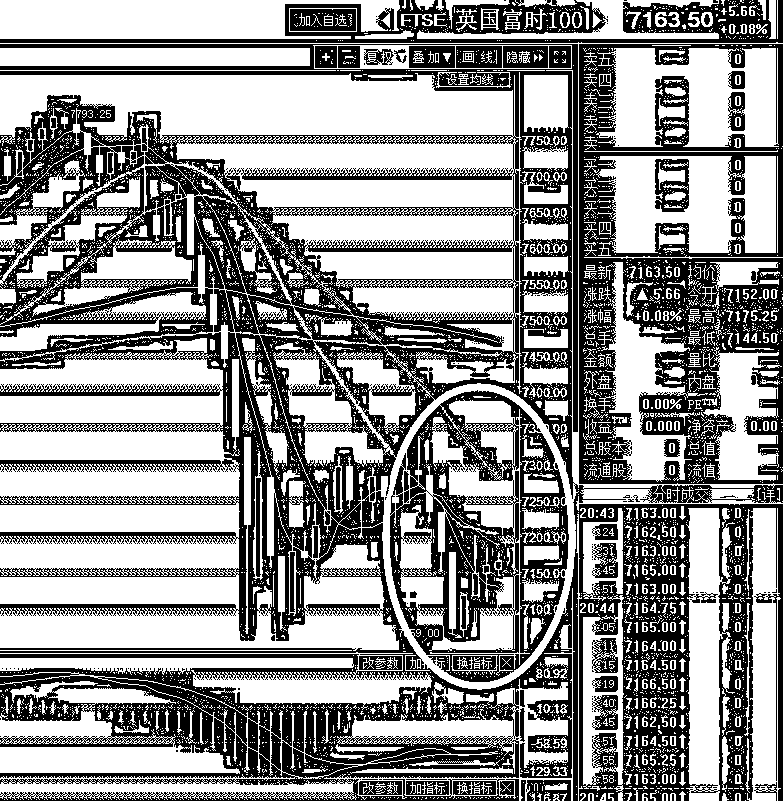
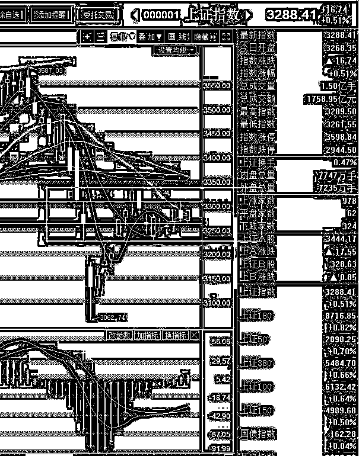

# 刚刚，区块链遭遇了史诗级攻击

<link rel="stylesheet" href="view/css/APlayer.min.css">

昨天晚上，也就是 3 月 7 号北京时间深夜 10 点左右，全球区块链遭到了毁灭性打击。昨夜，全球第二大的虚拟货币交易所-币安的大量客户账户被黑客盗取，虚拟货币交易所被黑客攻击不是一次二次了，日本的虚拟货币就曾多次被窃取，这次币安的客户也是遭到窃贼光顾了吗？你太小瞧这次攻击币安的黑客了，这次他们进行的是一次史诗级的复杂金融攻击。

为什么不简单的提币走人，因为自从日本的虚拟货币交易所多次遭到黑客攻击窃取比特币之后，全球的交易所屡屡升级安全措施，想简单的提币走人已经没那么简单了，这次攻击币安，黑客们已经预料到了无法提币走人的结果，而事实也正如他们所料，大批账户异动之后，在 2 分钟之内，币安平台就触发了自动预警，把所有账户锁死，禁止提币。

只要禁止了提币，所有的货币就还在平台里，别管窃取手法多么高明，你一分钱拿不走，等事后理清了头绪物归原主就是。币安的安全措施做的很到位，无愧币安这个称呼，可惜道高一尺魔高一丈，这种安全措施，在攻击之前黑客已经预料到了，并直接做了二手准备。

在攻击开始的第一时间，所有被黑账户开始疯狂抛售他们手头持有的各种代币，数字货币被市价即时币币交易成了比特币（比特币就等同于虚拟货币世界里的现金，虚拟世界执行币币交换），然后，他们用这些到手的比特币，疯狂拉升一种冷门货币叫维尔币，1 个小时之内用到手的 1 万个比特币把维尔币拉升了接近 110 倍。

按照正常的逻辑，这个时候应该把提前潜伏的维尔币高位卖出套现然后获利离场了对不对，因为交易对手不可查，无法区分良民和恶徒的卖出，混淆在一起了。但是实际上，黑客在这方面只是略作布局，大量的利润是来源于全球大大小小成百上千家交易所提前挂好的空单和多单。

是的，在全球上规模的交易所里，黑客以 20 倍的杠杆，提前挂好了大量币种的空单，包括比特币。而虚拟世界的币值是传导的，币安上各种代币和比特币大规模的暴跌，肯定会影响到其他交易所的散户心理，甚至有些机构本身就在用机器人软件做套利，等下跌到一定幅度，直接平掉空单获利退出，这样就根本不担心币安平台的禁止提现的手段了，不管你有多强的安全措施，统统无视。

据业内人士估计，如此大规模的账户控制，肯定不是一夜攻破的，应该是黑客通过木马获取了密码之后，引而不发，缓慢积累到了一定的账户规模后，经过多交易所空单布局，一次性进行大规模收割。这种攻击手法已经不单单的是黑客偷钱了，利用了复杂的金融手段，不仅抓住了币安客户账户的网络安全漏洞，还充分利用了目前虚拟代币的交易规则和交易漏洞，事了拂衣去，完全没人能追查到这次攻击是谁发起的，谁是获利者，此次攻击开创了黑客攻击的先河，堪称虚拟货币世界的史诗级攻击。

号称安全性最高的虚拟货币，频频出现黑客攻击事件，各类频发的 ICO 也遭到政府打击，区块链任重而道远啊，经过攻击后，目前全球数字货币价格正在持续下跌中，而策划此次史诗级攻击的幕后主使者，现在估计正在开庆功宴。

* * *

富士康今天发审会，毫无悬念获得了通过，而且是全票通过，从报审到通过仅仅只用了 36 天，创下 A 股记录，那些排队 N 年的情何以堪。

贴一个今天富士康上发审会的段子：**发审委：“嗯？”，富士康“嗯？”，发审委：“通过！”**

* * *

今天全天震荡飘红，最后白马发力，到收盘，上证涨 0.51%，深成指涨 1.05%，创业板涨 0.45%，很巧的是，昨天冲击上涨压制线失败，全军收缩绿盘报收，今天三大指数的涨幅，基本上刚好覆盖昨天的跌幅。

总体来看，三大指数都处于横盘震荡区间内，都有拒不回踩第二只脚的征兆，外国股市经过一轮快速杀跌后，直接踩出了第二只脚，目前也基本企稳了，给大家看一下英国的图形，这就是典型的 W 底，如果 A 股也能走出这样的图形，那就太舒服了。

明天是周五，又到了新一轮的 IPO 发布日，明天晚上发布的 IPO 数量非常关键，如果发的少，那么创业板有可能以横代跌，而上证指数又可能直接向上破位。

创业板的走势其实是很漂亮的，短期趋势和中期趋势全部转多了，现在就等一波回调就直接加仓了，而且小回调即可，不需要太大回调。而上证指数虽然走势不是很漂亮，但是这一波到现在么没怎么涨，价格较低，所以只需要周五收阳线，那么只涨 0.01%，周末的消息不是很差劲，下周一有可能开盘就能买。。。而现在手头持有的新经济股票，基本不用动，现在走势依然很强，暂时看不到趋势逆转的征兆。

短期而言，更有投机价值的，还是上证指数，而不是已经形成上升趋势但是还未回调的创业板，如上图所示，暴跌之后，始终在下面横着的，5 日，10 日，20 日即将重合在一起，一旦选择向上突破，短期会非常舒服，所以这几天重点关注上证指数能否突破向上压力线，估计周五或者下周一就能见分晓，要求很低，二天累计涨跌幅为正，就算向上了。

紫色的股

经济-金融-投资