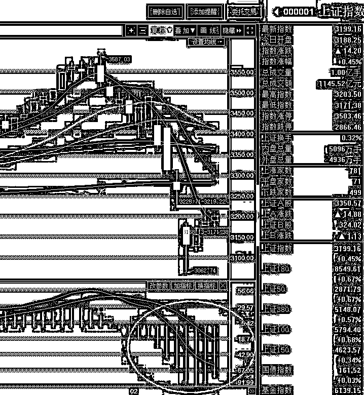

# 春节结束了

<link rel="stylesheet" href="view/css/APlayer.min.css">

今天是假期的最后一天，明天春节正式结束，股市也开始了，春节期间时间虽然长，但是并没有太多的重大新闻，外围市场也很平淡，总体来说，春节假期外围普遍上涨，但是都属于小涨，总体涨幅大概在 1~2%之间。

至于其他的消息，基本没有了，核心重点就是看本周五证监会是否继续 IPO，因为节前他说了，只是因为春节期间才终止的，并非中断。所以综合来看，**节后第一天来个小高开概率较大，总体偏阳**。

但是很明显，这么点利好，还能高开一下，是没有追的意义的，**我并不打算追逐，相反，这里急剧下杀我倒是有兴趣吃一下，**因为就从外围的形势判断，涨多少不好说，不过短期几天内太可能下跌太深，所以唯一的无风险套利机会，就是异常大跌。所以这里唯一能判定的好机会就是大跌的时候果断吃货，除此之外，其他都不好说，收益风险差不多的时候就是看运气，那就没必要参与。

同时，从节前题材股爆发一下就没后劲，以及春节期间香港的国资股再度领涨的情况来看，目前还是蓝筹为主，题材虽然是超跌再超跌，一时半会还是难成气候，至少目前是看不出来他有带头大哥的气质的,虽然我也很希望 28 切换，题材起来了才有普遍赚钱效应。

那么既然目前的重点还是聚焦在蓝筹身上，我们就要以上证指数为准，标的选择以 50 和 300ETF 为准。

大盘虽然节前暴跌了一轮，超跌反弹触发中，加上春节利好，节后保持个稳定或者小阳问题不大，但是我们可以很轻易的看到，目前属于空头区域，很明显的空头区域，波段性上涨机会目前是没有的，所以追涨是很危险的行为，不管他一波涨多少。

所以，我的判断就是，节后只要出现**日内中大阴线**，1.5%-2%那种，直接盘中就可以吃，博个反弹是大概率的，其余所有走势，没有大概率赚钱的把握，55 开就不错了，所以就只能不参与。