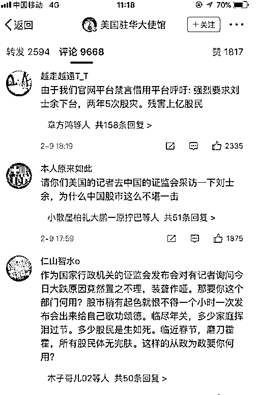

# 价值投资引发股灾

<link rel="stylesheet" href="view/css/APlayer.min.css">

本周五，A 股出现了惊世骇俗的大暴跌，上证指数盘中下跌 6%，收跌 4%，这种跌幅是妥妥的股灾级，因为这种程度的跌幅，只有股灾的时候才遇到过。

至此，利用蓝筹股操纵指数达成安稳发 IPO 的新政被击破，正是因为长期的硬性拉抬蓝筹来控制指数，才会导致清算的时候蓝筹集体性恐慌，从周五我们可以看到，当小票下跌的时候，拉升蓝筹可以造成亏钱但是不亏指数的结局，但是当蓝筹股集体暴跌的时候，就没有任何一种力量还能护盘了。所以，周五的时候收出了一根巨大的跳空阴线，把整个 K 线形态给彻底砸烂了，消灭了一切幻想。这一轮下跌，很幸运的逃顶了，其中一半是被动逃顶一半是主动逃顶，这里我们来回顾一下。

其实从去年年底，我就感觉风口可能从蓝筹转移到题材股，所以元旦的时候第一次抄底，我建议的是蓝筹题材各一半先试试。元旦后的这一轮上涨刚开始几天，由于明显是蓝筹启动，就断定了这是一波的风口还是蓝筹，当时和大家说的是，风头切换到题材只能等下一波了，这一波依然是蓝筹，仓位只能先转移到蓝筹，个人也看好随时可能风格切换到题材，但是至少这一波不是，那就没必要死扛，先做这一波蓝筹，等下一波趋势切换到题材，我们再做不迟，我当时教大家如何识别风口，就是这一波上涨，谁第一个启动，谁就是风口。

既然这一波主做蓝筹，那自然盯紧上证指数，第一次减仓是 2-1 号，这一天上证指数跌破 20 日均线。我当时给大家说的是，跌的全是题材，蓝筹没怎么跌，50ETF 和 300ETF 走势非常良好，按理说是没必要减仓的，但是收盘低于 20 日均线则减仓是我之前写在大盘分析里的策略，既然说了就要执行，所以强行减仓，一旦某一天收盘站回 20 日均线，则买回仓位。

这个时候，我依然是看多蓝筹的，我认为趋势起来了，破位再走不迟，这里属于尊重计划，被动减仓，并非看跌蓝筹。

而二个交易日后的 2-5 号，收盘上证拉回了 20 日均线，当天晚上我建议大家买回，毕竟站稳均线买回理所当然，但是巧合的是，当天晚上美股大暴跌，收跌 4.6%，跌了 1100 个点，这种跌幅对于 A 股来说都很可怕，对于美股来说更是毁天灭地一样的感觉。要知道这种跌幅是极度不正常的，美国总统特朗普曾经说过如果美股一天跌了 1000 个点，总统都应该被炮决。

当然这是他没当选总统之前数的，现在轮到自己当总统了，自然不会把自己炮决，但是这毕竟反映了美国人的普遍思维，美股轻易是不能大跌的。所以那天早上 7 点，我看到美股这个收盘之后，紧急发了一篇通知，立刻取消加仓，转入全面观望，毕竟之前也是勉强才上 20 日的，摊上那么大的利空，和没站上是没任何区别的。

这个时候我从看多蓝筹，转入了观望，但是并未看空，我觉得蓝筹还是可以持有的，只是减掉的仓位暂时不买回来而已，只要不买题材，这一轮会安然无恙，但是到了 2-7 号，我突然翻空蓝筹，那是为什么呢。

这一天的收盘，蓝筹的旗帜漂亮 50，收盘击破 20 日均线，而且是开盘+2%，收盘-2%这种阴线，表示当天 4%的跌幅是无抵抗的，图中我们可以看到，这一天的早上，50ETF 的价格还在历史最高位附近徘徊，盈利盘非常多，到了收盘击破，我当然翻空，直接看空蓝筹。这一天晚上我告诉大家的是，蓝筹有回调迹象，不能再买了，题材有筑底迹象，但是鉴于处于长期下跌趋势，暂时也不敢买。最终的结论就是蓝筹不能买，题材不敢买，纵观整个市场，没有能买的股票了，所以不知道买什么，完全观望，有异常波动的时候自行做做 T 就行了，没有明显套利机会就别动了，当时的原话是这么说的。

这个判断的逻辑也很简单，这一波属于趋势，而且是属于蓝筹的趋势，既然趋势和风口都是蓝筹，那么蓝筹的旗帜 50ETF 的均线就不可能轻易被击破，我连上证指数的 20 日均线被击破都要减仓，何况 50ETF 的均线被击破，更何况前几天美股刚刚大暴跌，怎么避险都不为过，于是全面看空，蓝筹也不买，题材也不买，就观望，只有异常波动明显套利机会才动手，平时啥都不动。

就这样，意外的把蓝筹给逃顶了，前一半属于被动减仓，后一半属于主动减仓。二次减仓都是有理有据的，我觉得有一次减仓行为都可以了，毕竟减的是人人夸赞的蓝筹，还硬减了 2 次，第二次更是直接看空蓝筹。这种成果来源于对均线系统的严格执行，去年和前年均线系统表现并不佳，那是因为趋势太弱，趋势越强则均线效果越强，今年强趋势降临了，所以均线成果看起来有如神助。

* * *

过去一年里，每周五证监会都会发布 IPO，风雨无阻，但是本周五的证监会新闻发布会，没有任何 IPO，只持续了 1 分钟，面对座无虚席的记者，简短的说了二句话就匆匆退场了。我在去年曾经写过一篇文章，记不清哪天发布的了，每一任证监会主席，都是想狂发 IPO 的，没有一个是想终止 IPO 的，停下来全是被迫的，都是被市场逼的。

所以，利用拉蓝筹控制指数就可以狂发 IPO，并不是刘主席的新发明，也不是解决 IPO 问题的秘诀，能如此顺利的高速发行一年，完全是吃了肖钢主席的历史遗产，一旦遗产耗尽，早晚也会碰到历任主席都碰到过的事情，被迫停止 IPO。如今价值投资被当成一个大题材来炒作，当价值投资的泡沫被吹起来的时候，蓝筹就控不住了，看起来涨的很爽，但是当蓝筹开始下跌的时候，就没有任何力量能再护盘了，价值投资引发本轮股灾，如果资金都在中小创，蓝筹价格还趴在地上的话，暴跌的时候拉拉蓝筹指数马上就稳住了，而不像现在，蓝筹价格都涨上天了，获利盘融资盘一大堆，一旦开始下跌犹如泰山崩顶，谁也不敢去拦截。

* * *

本周末，股民把证监会给骂惨了，直接骂到官微关闭了评论，这一点很好理解，官微做出这种事挺正常的，但是令人目瞪口呆的是，中国股民跑到美国驻华大使馆微博去骂证监会了，引起了潮流，于是各大外国使馆都遭殃了，下面的留言全部都是骂证监会的，这下世界闻名了。

股民的愤怒很好理解，如果证监会恪守裁判本份，超然世外的话，股民技术不精，运气不好，怨不得别人。但是过去二年里，只要不是蓝筹，涨一个证监会打压一个，跌的时候随便跌不予过问。在各个渠道提倡价值投资，明里暗里，威逼利诱所有人去买蓝筹，既当裁判员又当运动员，那么蓝筹就代表了证监会，涨了没事，要是跌了，当然去骂他。

* * *

对了还有乐视网要提一下，他开板之前，我就反复强调，连续跌停的股票，首次开板基本都不是最终底部，这个概率是非常非常高的，至少 90%以上。既然不是最终底部，那么这里就是局部反弹，不仅仅是零和游戏，还是个负和游戏，因为最终还是要再下一个台阶的，所以乐视网千万不能碰。

乐视开板当天，差点打出了天地板，收涨 5%，我依然建议大家千万不能碰，你冲进去死亡概率是 90%，幸存概率只有 10%，结果周五，乐视网跌停开盘。。。

当然，乐视网中途撬开了跌停板，如果是周四跌停买入的话，那是有浮盈的，但是大家要注意成交量，周四的时候买单冲进去了 41 亿，周五的时候买单只冲进去了 24 亿，周四有接近一半的买单没有跑出来，周一显然还要跌。总帐一算必然是亏钱的，那么是游资亏钱，还是散户亏钱，这还用问吗？游资就是最顶级的散户诞生的，普通散户哪里玩的过游资，根本不是一个段位的选手。

* * *

目前大盘严重超跌，这个超跌率已经目瞪口呆了，下周随时触发超跌反弹，但是这种超跌反弹，我不敢带着大家做，效果和乐视网首次开板的超跌反弹差不多吧，负和游戏，比拼的是眼疾手快心狠，适合少数人自由玩玩，不集体带队了。

最后做个总结：短期之内，趋势逆转，依然是蓝筹不能买，题材不敢买，公开集体行动只做向上趋势最安全，下跌反弹，横盘等一律不参与，目前属于典型的下跌反弹，不参与，先看几天，观望一下。