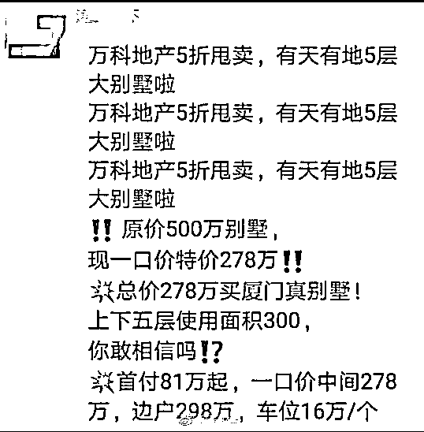
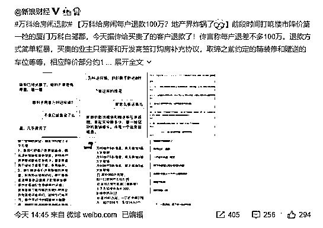
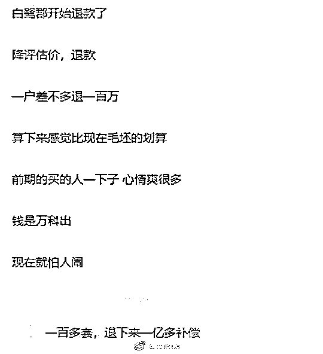
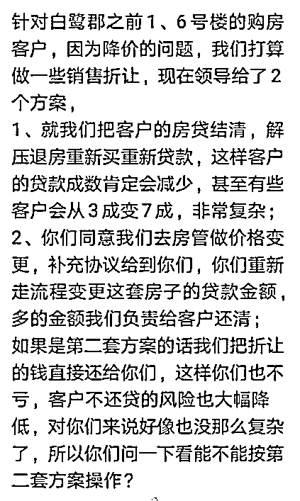
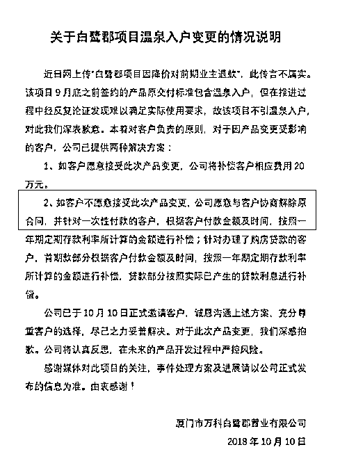
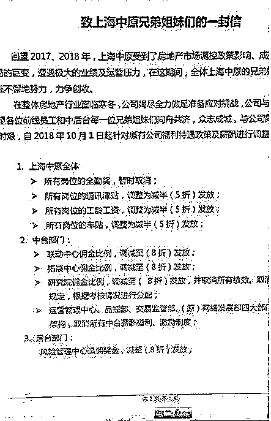
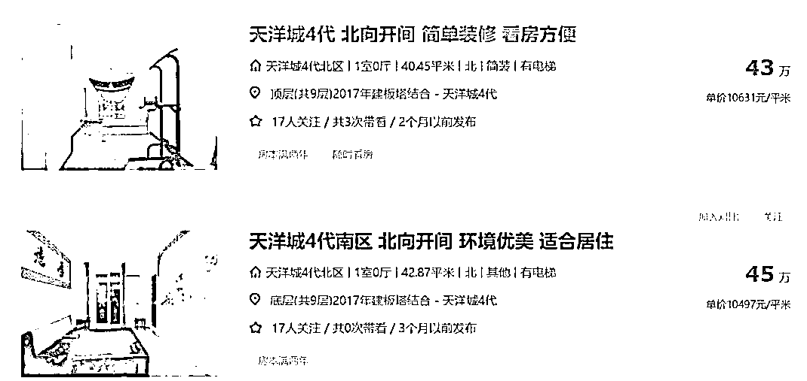

# 房闹真的是有效的，万科退款了

喜欢我的都关注我了~

房闹，注定是一个会载入房地产史册的词汇，买的房子只能涨不能跌，只要跌了就去闹事让开发商退房或者赔钱。

我以前曾经认为，房闹是违法的，严重有违契约精神，而且如果容忍这种现象的存在，会严重助长投机之风。只要买得起房子就要买，因为只要房价跌了，不仅政府会出手，房地产商也会赔钱，所以买房会成为万无一失的投机工具。

当所有人都这么想的时候，人们会把家中的每一分钱都拿来买房，让房价一飞冲天直到再也无法承受为止，最后一波接盘侠耗尽了力量，然后泡沫炸裂。

但是今天万科却上演了一出房闹的好戏，打响今年楼市降价第一枪的厦门万科白鹭郡楼盘，要给房闹业主们退款退房。。。

万科白鹭郡的历史

首先我们来了解一下万科白鹭郡这个楼盘的历史，这可是一个明星楼盘，因为他在厦门上演了一次五折大降价，开启了今年国庆节的降价风潮。

当时有 N 多个媒体报道了这件事，毕竟五折甩卖实在是耸人听闻，当时我仔细的算了一下账，把精装啊、车位啊什么的都去掉，那也相当于是 6 折出手。

大降价之后，这个楼盘瞬间被哄抢一空，毕竟直接腰斩啊。当时我曾很纳闷，一口气降价这么多，怎么会没有人来闹事，毕竟这个楼盘 2017 年就开盘了，已经销售一年之久，当时的开盘价是 450 万元，后来还涨价了 50 万。

当时我认为可能是这个楼盘卖的非常差，一年都没卖出去几套，和存量相比微不足道，后来的涨价是虚张声势，用不断涨价迫使别人前来抢购。

但是从今天爆出来的新闻中我们发现，原来这个楼盘万科已经卖出去差不多一百套了，当时只不过这些业主没有反应过来或者说暂时没组织起来而已，而根据爆料出来的内容，万科已经对那些买贵的业主给予了退款或退房的待遇。

万科退房传言的细节

今天一则小道消息在地产圈流传，说万科白鹭郡给前期高位接盘的老业主，每户退款 100 万，下午大量的媒体疯狂报道此事，并爆出了大量的聊天对话细节，整个舆论都炸锅了。

数量和金额都被曝光了出来，每套 100 万，涉及大概 100 户，金额上亿。。。

而疑似和业主之间互相沟通解决问题的几套方案，也被媒体给爆了出来，方案有多种，很复杂，但是没有脱离退款，息事宁人的核心姿态。

原价 500 万，现价 278 万，业主立亏 222 万，其中取消了精装，值 50 万，取消了 2 个车位，值 32 万，取消了家用电梯，值 15 万，合计 97 万。所以媒体报道说万科给每户补偿 100 万现金，是非常具备可信度的。

万科辟谣了！

今天舆论发酵之后，万科下午紧急发布了一个辟谣公告，我当时一看万科居然辟谣都愣住了，这么大的事情媒体没搞清楚就传这么热？仔细看了公告才发现，媒体没传错，10 月 10 号万科的确是在和老业主沟通退款退房的事情。

万科不辟谣还好，辟谣之后这事直接被坐实了。根据公告我们发现，万科以温泉入户技术上做不到为由，愿意每户退款 20 万，如果业主不接受 20 万的现金补偿，那么万科愿意退房。

这简直是个天才级的解释，怪不得因为降价要求退房的时候，那些房闹打出了旗号一般都是承诺的学区没有了，承诺的绿化没有了，精装修质量差等等。我个人觉得以后小区里的树年份不够，也可以成为退房理由。。。

总之，涨了归自己，跌了你退房就行了，理由嘛，这么多退房理由总能找到几款适合你的，把钱给我，我不玩了。

万科退房的影响

之前有各种房闹，各种退房要求，在我们看来都是非常荒谬可笑的，哪有只能赚不能赔的生意，直接送钱给你好不好。各种楼盘哪怕有些迫于压力私底下退房了，也是羞羞答答的，并没有什么曝光量出来。

而这次的万科白鹭郡，本就是明星楼盘，降价被全国曝光，而这次全体退房的公告又被全国曝光，实际上造成了极为恶劣的影响，那就是全国的房闹人群，会爆炸式增长。以前大家都认为房闹成功率很低，不想去浪费时间，但是现在看来，其实并不低。

而与此同时，这会对其他房地产商造成极为巨大的压力。万科能退房退差价，那碧桂园也能退房退差价，闹得越大，退的越快。而实际上各地碧桂园售楼部承受的压力远大于万科，至少碧桂园已经有好几个售楼部被砸了，万科还没有。

除了万科和碧桂园之外呢？那些中小地产商，他们的资金链更紧张，降价求生的概率更高，他们有很多也会被迫同意退房，全国各地的房闹会星火燎原一样的蔓延开，除非房价停止下跌，全部恢复到最高点原价，但是那可能吗？

万科退房彻底坐实了房炒不住的戏谑之言，买房不用担心跌，敢跌就闹事，不跌就大赚，多么爽的一件事，6 个钱包算什么，这么好的事，60 个钱包也值得去干。

万科这次的事件，不管他的主观意图是什么，客观上他堵死了降价潮，有很多房地产商承受不起退房的代价，就不敢降价，自己的资金链压力只能硬抗，一旦绷不住，持有大量现金的万科将会是最大受益者。

想“活下去”的万科

各地房地产商都在寒冬中瑟瑟发抖，降价求生，恒大发起全国 8.9 折优惠，碧桂园个别项目打到 7 折。房地产中介的日子也不好过，上海中原地产福利减半，佣金八折，其华东区总裁路成对媒体提出，现在地产中介就是“排队等死，看谁有实力排到最后”，这种剩者为王的判断其实比售楼部被砸更让人心惊胆战。

而在其他同行一片萧瑟的时候，高喊活下去的万科，却活的比谁都滋润，手握接近 2000 亿现金的万科，对崩溃的同行进行了大肆抄底收购。三季度，万科的拿地金额接近 500 亿，相当于恒大+碧桂园+保利+融创四大龙头房企拿地金额总和。

三季度是 7 月，8 月和 9 月，而活下去这个口号是 10 月份打出去的，万科是影视学院出身的吗？还是特地开一次大会讽刺一下其他同行，告诉他们你们快活不下去了？

昨天晚上，华夏幸福发布公告，将自己位于环京区域 33.93 万平方米的住宅用地的部分股权转让给万科合作开发，涉及华夏幸福旗下的 5 家项目公司，土地项目分布于涿州、大厂、廊坊和霸州市，交易价款为 32.34 亿元。换句话说，刚到 10 月，万科又大手笔的花了 30 亿出去了，30 个小意思而已。

那么环京区域是个什么状态呢，这里是这几年下跌的重灾区，近一年的跌幅位居全国之冠，腰斩是非常普遍的现象。以燕京大型楼盘天洋城为例，最高价曾达到 3.5 万/平方米，目前报价 1.5 万/平方米，个别小户型甚至跌到 1 万元/平方米，跌幅到底有多少自己看，我都不忍心算了。

首先我赞扬一下环京区域购房人群的高素质，天子脚下，契约精神浓厚，跌这么惨居然都没有房闹事件爆发，其次惊叹一下鸡贼的万科，等别人都扛不住的时候，拿出现金吃掉别人的土地，慢慢的补充库存。

最后，我谴责万科这样的处理方式，这样做不仅仅是对契约精神的极大不尊重，而且对全国的地产生态会造成极恶劣的影响，会大幅威慑那些想降价的地产商，没有老业主全部退房魄力的地产商是根本不敢降价的。

而这样的处理方案，是对投机者的极大鼓舞，也是对无房人群权利的极大践踏，涨了坐收几百万收益，跌了找开发商退房不亏本，连利息亏损万科都妥帖的给包了，这种稳赚不赔的暴利生意仅仅因为家里凑不够首付就无权享受，收益全被投机客拿走了。

我就问一句话，凭什么啊！

觉得此文的分析有道理，对你有所帮助，请随手转发。

长按下方图片，识别二维码，即可关注我

近期精彩文章回顾（回复“目录”关键词可查看更多）

华为员工都这么穷，怪不得拼多多能火 | 房价跌 20%就会全面崩盘，地产杠杆远比你想的要脆弱 |  为什么碧桂园的质量那么差 | 清醒点，放弃全面开征房产税的幻想 | 央行和财政部隔空掐架，我支持央妈 |中国土地制度源自香港，但是香港却是劏房密布 | 为什么中介哄抢租赁房源，因为贩毒都没它来钱快