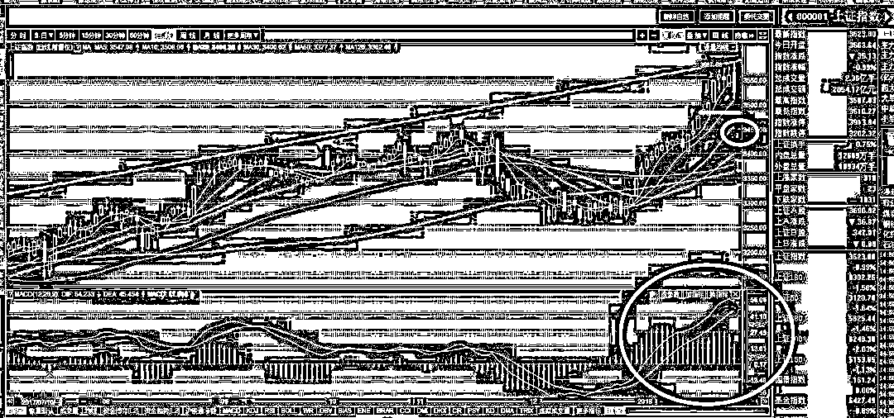
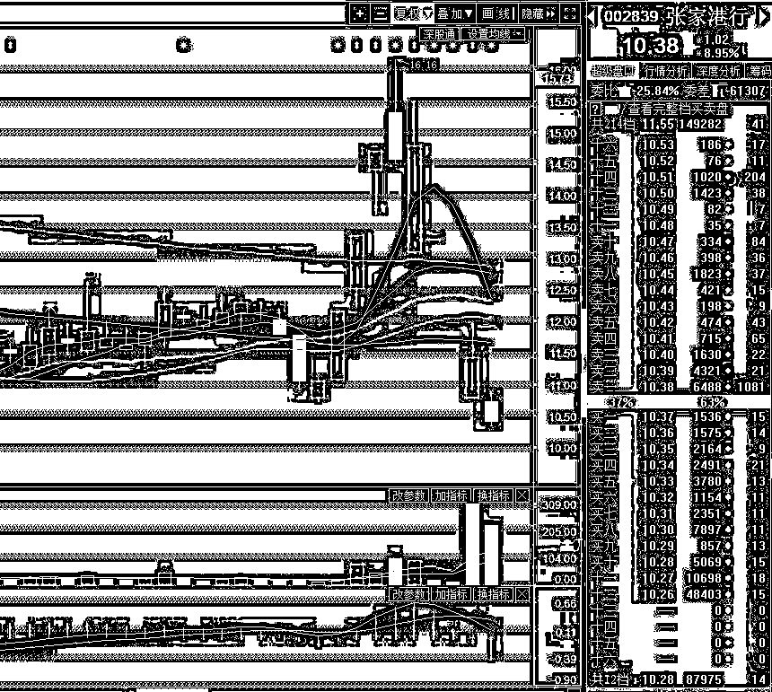
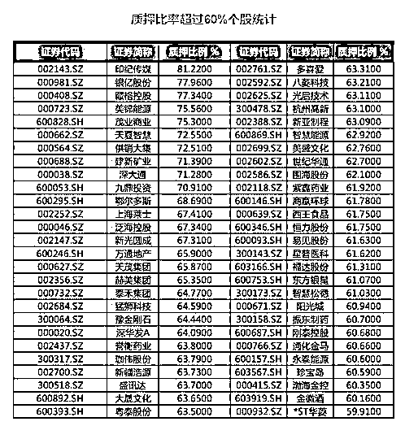

# 今天的中阴是一个加仓机会

<link rel="stylesheet" href="view/css/APlayer.min.css">

今天开盘，上证指数高开高走，其原因很显然是因为上周五的时候美股大涨的刺激原因，而创业板低开低走，这显然也是周末的时候监管层再一次恐吓题材股导致的。

不过由于早盘的时候上证涨的太好，还想尝试一下普涨的感觉，于是有大资金尝试性拉升了一次创业，9 点 40 分那一波吧，从-0.5%，一下子拉倒 0.5%,收盘之后看图形还不明显，早上的时候看那个分时图，人工痕迹实在是太明显了。这说明 XX 资金还是很敬业的，本周随时会回调的时候，逮个机会还尝试性拉升一次，上次说过把创蓝筹划入二线蓝筹可以逢低买入就是这个道理，至少可以陪着做 t，控创业指数最好用的就是创蓝筹，哪怕题材股不涨，创指数的攀升也能涂脂抹粉，并且能吸引来场外资金，毕竟舆论和大妈真的只看指数，创指数补了短板，牛市就没缺陷了。

随后，指数单边下跌，一直到尾盘才有所抵抗，老实说，下跌的幅度并不多，不知道为啥今天有人觉得跌的惨，甚至有人认为要见顶了，只能见红，一个绿都不能见，再大的牛市也做不到啊。

看完下图，我给大家吃个定心丸，当 MACD 处于大红色的时候，市场之前肯定是拉升过一波，不管是不是上涨趋势，当大红色区域首次下跌到 20 日均价线的时候，一定是有顽强抵抗的，大家可以翻阅历史，就算这里转绿了，是否转势也只是 55 之数，如果下方还是大红色，几乎没有转势的。

换句话说，这里的 20 日是非常安全的加仓点，说他 9 成把握一定不夸大，同时我们需要担心的是跌不到那么深，明天的 20 日是 3465，但是我觉得很难跌到，3486-3506 区域都可以接货，目前是 3 成雷打不动的底仓外加 3 成每天做 T 折腾的资金。做 T 资金就不加了，但是雷打不动的底仓可以加 3 成，这一波加仓完毕应该是 6 成雷打不动底仓+3 成做 T，合计动用 9 成资金。

加仓的版块，券商、地产、创蓝筹，大消费类，当然，前期牛气哄哄的几个蓝筹白马，今天是主跌的，也都可以加，他们还没死，至少这一波不会死。

关于券商有一点需要注意，目前已经有 8 家券商发布了 2017 业绩快报，从目前的结果看，出现了典型的业绩分化现象，由于 17 年股市低迷，成交不活跃，中小券商非常难受，规模效应凸显威力，龙头券商业绩普遍好于中小券商，所以如果选券商股，记得选那几个龙头即可。

* * *

此外巨额解禁股的标杆性股票张家港行是要看一下的，限售股解禁后一字跌停，周五的时候放量开板，疑似大资金吃货。这个股在解禁之前暴涨，解禁之后暴跌，控盘痕迹非常明显，一定是有大资金在里面搅风搅雨的。周五开板后我还以为是护盘资金来了，当天市场也有不少资金跟风。

结果今天大幅度低开，全天暴跌，周五的时候最低成交价是 10.76，今天直接给你 10.71 开盘，盘中最高价也才 10.87，超越昨天最低价的时候聊聊无几，从图中可以看的很明显，昨天的资金可以堪称是全军覆没，所以昨天买入的不是护盘资金，是接盘资金，不明真相跟风的全死。

* * *

另外据万达官网消息，今天腾讯控股联合苏宁、京东、融创与万达商业在北京签订战略投资协议，计划投资约 340 亿元人民币，收购万达商业香港 H 股退市时引入的投资人持有的约 14%股份。

这财团大了去了，340 亿的注资也是大手笔，对万达商业构成重大利好，对国内的大消费领域也构成利好，毕竟代表大资本目前依然看好商业消费领域。

老王最近一年很难过，被迫到处卖项目找钱救命，得罪了国家只是这点惩处已经很轻微了，不过还是差点要了万达的命，幸好商业手腕够高，朋友也够多，到处卖卖卖之后资金链断裂的风险算是没有了，今天再得到这 340 亿的资金，基本算是脱离危险了，恭喜老王，下次春风得意的时候记得低调点，不然给自己凭空找麻烦。

* * *

乐视网今天收获第四个跌停，之前预估是 7~8 个跌停左右，毕竟第一次开板是不会真正止跌的，反弹一波后面还得继续跌，这是惯例，所以本周，乐视网有很大可能开板，是本周的下半周，到时候记得看热闹。

乐视大爆仓引发了市场对于高质押股票的担忧，我这有个图，里面列举了 A 股里质押率最高的股票集合，大家看看，应该有点用，质押率过高的票一旦出事基本都是大事，看看乐视网就知道了，所以贴给大家，稍微警惕一下风险。