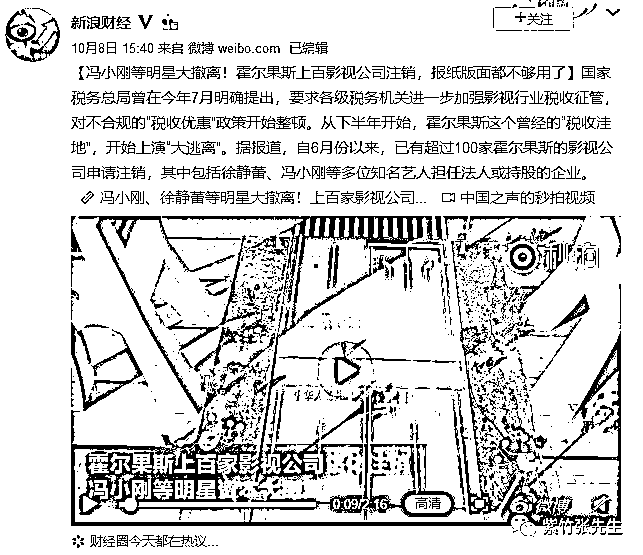
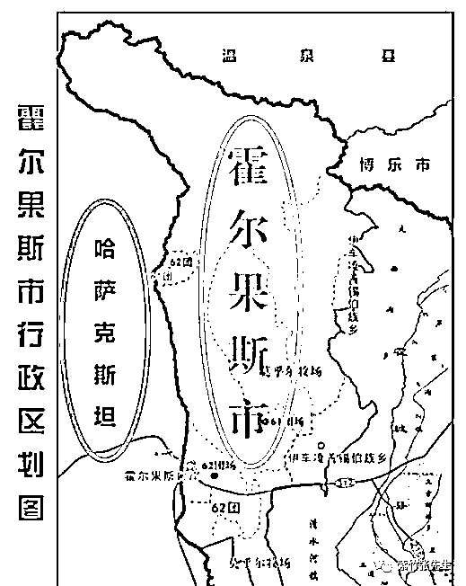
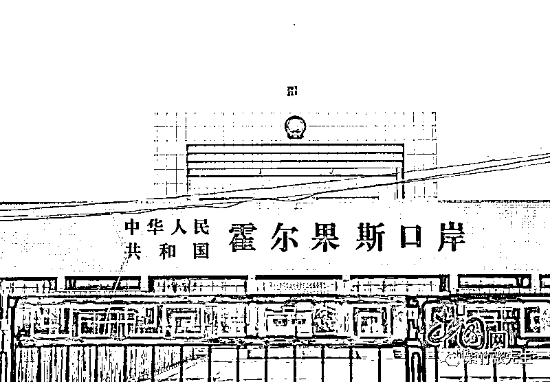
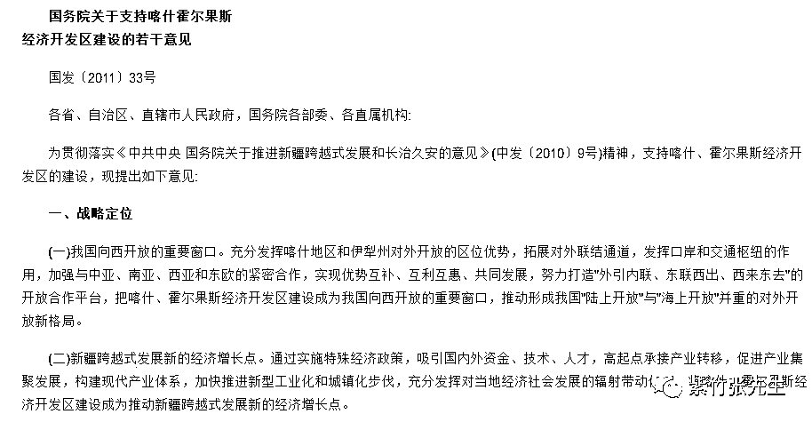
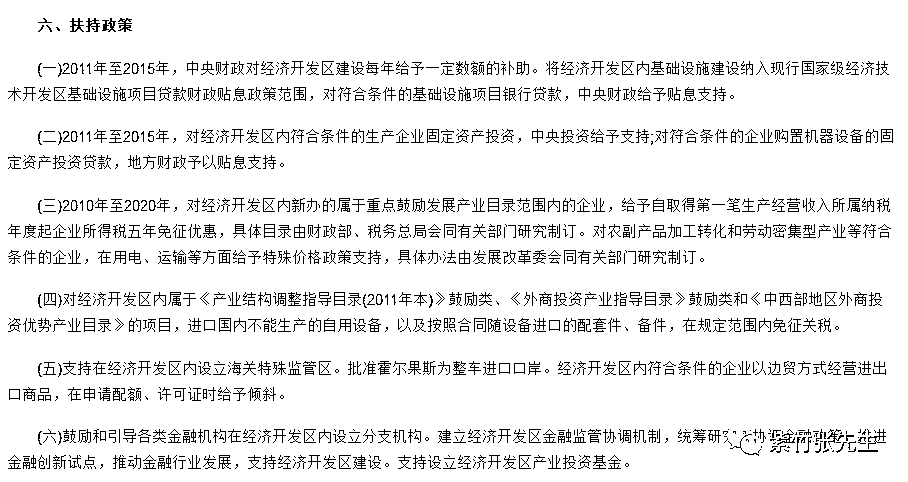
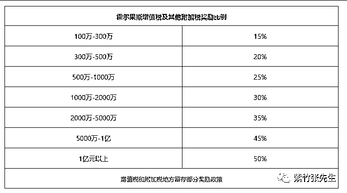

# 霍尔果斯的税收奥秘

喜欢我的都关注我了~

自从影视圈税务稽查风暴开始之后，大量影视明星纷纷注销自己在霍尔果斯的影视公司，这件事经媒体反复报道后，霍尔果斯这个地方也正式印入公众眼帘。 

当年明星既然为了税收纷纷入驻霍尔果斯，那肯定是有道理的，这里面的税收细节奥秘到底是什么呢。

霍尔果斯开发区

在回答这个问题之前，我们先看一看霍尔果斯到底在哪，为啥明星们要去这个名称奇葩，距离遥远的地方。

霍尔果斯位于新疆，是中国地图上公鸡尾翼边缘，毗邻哈萨克斯坦，可以说位于新疆最边缘地区了。 

在这个地方，只要你向前走一点点，你就出国了，从哈萨克斯坦采购东西回国记得缴纳关税哦。 

按理说这么偏僻的地方，远离海洋，远离中国经济发达区域，霍尔果斯发展经济会非常困难，它是怎么样和光鲜亮丽的明星扯上关系的呢？这要从一带一路说起了。

由于霍尔果斯位于丝绸之路，是中国新疆的重要口岸，所以自 2011 年“一带一路”战略提出后，新疆霍尔果斯就被授权成为了新的经济特区，为发展这个经济特区，特批实行免税政策，并提供注册公司快速上市的“绿色通道”。

根据《国务院关于支持喀什霍尔果斯经济开发区建设的若干意见》国发〔2011〕33 号精神，为加强与中亚、南亚、西亚和东欧的紧密合作，各省、自治区、直辖市人民政府，国务院各部委、各直属机构应全力支持喀什、霍尔果斯经济开发区的开发建设。

文件中明确了这些经济开发区的战略地位。 

在扶持政策中，明确写到 2011 年至 2015 年，中央财政对经济开发区建设每年给予一定数额的补助。2010 年至 2020 年，免征 5 年企业所得税，同时还有一系列其他优惠政策。 

除此之外，铁路总公司还立刻兴建了一条高铁线直通霍尔果斯，我以前一个好朋友曾经为了兴建这条线路奉命在霍尔果斯蹲了大半年，我也去过这里，所以和霍尔果斯还是很有渊源的。这里插一个小知识，新疆那边的葡萄特别好吃，完全没有酸味那种，而且价格大概是 2~3 块钱一斤。而新疆的哈密瓜和你平时吃的哈密瓜压根就是二个星球的哈密瓜，口感完全不一样，入口即化，特别甜那种，价格我记得是。。。1 块钱一斤，运出新疆的水果都是很青的时候摘下来的，很难吃。还有西瓜，这个是大路货，但是新疆的西瓜就是好吃一点。。。

所以，大家以后有机会去新疆玩的话，别光顾着吃羊肉串，那边的水果也要多尝尝，另外最好不要碰新疆大城市的水果，因为在产地区域，越小的地方水果越好吃，不考虑摘青果催熟的问题。

霍尔果斯的税收优惠

好了跑题了，我们重新捋一下思路，刚才说到免企业所得税了对吧，时效性是 2011-2020，这就是霍尔果斯五免五减半的政策依据。所谓五减半，是在中央扶持的基础上，地方也给予了大手笔的扶持。

据公开资料，霍尔果斯新注册公司享受五年内企业所得税 25%全免（中央拿 60%，地方拿 40%），五年之后地方留存的 40%以奖金的形式全额返还给企业，时效性也是五年。

增值税（中央 50%,地方 50%），和其他附加税（地方留存 100%），地方留存的部分，开发区拿出来按一定比例奖励给企业，奖励规则如下： 

也就是说，你缴纳了 1 亿的增值税，地方会留存 5000 万，这些钱，地方让一半给你，也就是返还你 2500 万。而只要缴纳满 100 万，就能有 15%的返还比例。

甚至还有个人所得税哦，企业个人所得税（中央分 60%，地方分 40%）的地方留存部分，满 1000 返还 70%，2000~4000 返还 80%，4000 以上返还 90%，收税 2 个星期后打回公司账户。

这些重磅优惠有没有诱惑力，肯定有啊，你看了都心动对不对。但是政策制定之后，没吸引来多少企业，毕竟酒香也怕巷子深，我压根不知道你那边有这回事，你就是税收变成 0 也吸引不来人啊。

所以 2015 年 10 月，霍尔果斯跑到北京开了一次招商推介会，向北京的企业宣传自己那边的好政策，这些优惠政策太好了，好到别人怀疑他的真实性。有某些地方政府以优惠政策吸引招商后关门打狗的先例在，大家都很谨慎，所以响应者仍然寥寥，有一家影视公司经过慎重考虑后愿意试一试，他在霍尔果斯注册了三家公司，那就是霍尔果斯登峰国际文化、霍尔果斯橙子映像、霍尔果斯春秋时代，他们后来出了一部电影，叫《战狼 2》。

2017 年 7 月，《战狼 2》火了，火了肯定赚钱啊，赚钱之后大家发现，原来这个税收优惠是真的啊，居然省了这么多钱。于是霍尔果斯在北京火了，圈内人都知道了，甚至在全国都火了，大家疯了一样跑到霍尔果斯注册公司，霍尔果斯的行政服务中心排队能排到马路上，工商局紧急向其他市工商局借调注册登记用纸，全市的宾馆、饭店长期爆满。霍尔果斯甚至形成了一个奇葩的产业，注册业。以前霍尔果斯只有 2 家财务公司负责代人注册、税收和账目打理，2017 年这样的公司暴增到四五百家，全是新注册的。

由于霍尔果斯过于偏远，98%的公司都是注册来进行财务运作的，只是过个账而已，实际被吸引来的实体公司寥寥无几，可能还没有注册公司的数量多。

地区税收优惠的必要性 

看到这里大家可能会说，霍尔果斯这不是瞎搞吗？开了这么大的一个税收优惠口子，给国家造成多少经济损失啊。

实际上，霍尔果斯的这个操作没有问题，税收优惠政策是国家常用的一个发展经济的手段，这些税收政策都是出于各种各样的考虑，但是总体都是于国有利的。

比如，我国对外国人士，就经常采用税收优惠吸引他们来中国投资建厂，然后通过种种优惠政策吸引他们把赚到的钱继续投资于中国。表面上看，我国通过大幅度的让利损失了很多税收，但是只要这些钱始终在中国里面打转，那么不管外资赚到了多少钱，那都是表面数字，这些钱在中国开的工厂越多，工人就会越稀缺，普通人的薪水也就会越高，国家的收入也越高。让出去的那点小利和实际好处相比，简直不值一提。

对于地方政府也是一样，地方上有低廉的资源，有低廉的人工，但是就是没有资本愿意过来，因为在大城市开公司可以享受到人才资源和公司资源的双重好处，宁愿贵一点也不愿意去“蛮荒之地”。

所以很多地方，就采用优惠政策吸引资本，有的给土地，有的给返税，就是因为在条件相同的情况下，他们根本竞争不过大城市，那么就只能给予优惠，只要这些企业来到了本地，那就是下金蛋的鸡，可以源源不断给地方提供税收，并制造就业，甚至会以这个公司为中心形成产业链集群公司，让一个地方咸鱼翻身的例子比比皆是。

中央愿意扶持某个地方的时候，就让出一部分中央拿的钱，地方想进行招商引资的时候，就让出一部分地方拿的钱，让企业自行选择在哪里扎根，这在某种意义上是遵循市场经济的规律的，于国于民都有利。

其实除了霍尔果斯之外，很多地方都有各自不同的优惠政策，有些地方只是略逊于霍尔果斯而已，但是和霍尔果斯不同的是，这些地方通常都吸引了实体企业入驻，只要企业落地那么这些优惠政策就是划算的，就达到了实际目的。

而霍尔果斯不一样，这地方实在是太远了，所以出现了大量的空壳企业纯粹是为了过来套优惠的，而地方也知道自家劣势，好不容易打出名气，直接严查空壳公司是不合适的，至少先吸引一部分实际落地的公司过来，再清理空壳公司嘛。

所以，在霍尔果斯空转的企业越来越多，这个泡沫是早晚会破的，无非就是被外力戳破，还是自己挑破而已，仅仅从霍尔果斯本地政府考虑，他们想要的也是能落地带动就业和产业链的企业，而不是那些空壳企业。

不过，人性的贪婪，导致了这一幕黑色喜剧的诞生，影星们纷纷跑步注销霍尔果斯的公司，幽默中带着荒诞。

觉得此文的分析有道理，对你有所帮助，请随手转发。

长按下方图片，识别二维码，即可关注我

近期精彩文章回顾（回复“目录”关键词可查看更多）

华为员工都这么穷，怪不得拼多多能火 | 房价跌 20%就会全面崩盘，地产杠杆远比你想的要脆弱 |  为什么碧桂园的质量那么差 | 清醒点，放弃全面开征房产税的幻想 | 央行和财政部隔空掐架，我支持央妈 |中国土地制度源自香港，但是香港却是劏房密布 | 为什么中介哄抢租赁房源，因为贩毒都没它来钱快