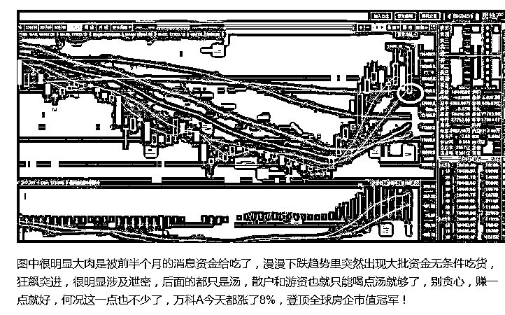
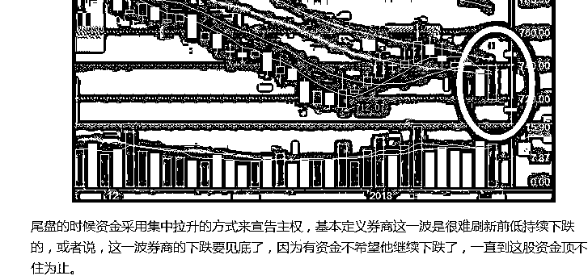

# 刚刚，出现一个重要利好数据

<link rel="stylesheet" href="view/css/APlayer.min.css">

近日，有一家基金开始募集，募集期为 7 天，结果早上刚开始募集，上午 10 点就超过百亿了，直接引来了监管层电话关注，因为百亿级的募集不管在哪年都是轰动一时上新闻的。到了下午结束，募集金额居然突破了 300 亿，对于这家基金来说等于直接小渔船变大军舰了，然后就果断终止募集了，再募集下去变成航母，证监会就要找人喝茶了。

募集情况那么好，是和行情分不开的，去年提倡价值投资，蓝筹猛涨，一改五六年来的股市风格，常年重仓蓝筹的公募基金业绩好的流油，自然募集资金轻而易举。但是蓝筹价值投资不是去年才发明的，第一次喊出这个口号，是 2006 年。

那一年，中国首次成立基金，机构化是证监会的推进目标之一，这些机构有持仓限制，都是重仓蓝筹股。那一年，价值投资的口号红遍中国，涨的全是白马蓝筹股，小盘垃圾股扔地上都无人问津。这种价值投资的风潮，一直到中国石油上市为止。

这种情况和去年很像很像，那你应该会问了，那一年创业板是涨还是跌啊。老股民是不会问这句话的，只有新股民才会问，因为那一年还没有创业板这个东西，只有上证指数和深成指数。

07 年的牛市，是蓝筹的牛市，无论是散户还是基金，都在买蓝筹，大家可以请教一下身边的老股民，回顾一下那段历史。当时抢基金都抢疯了，XX 精选，XX 成长，出一个被抢光一个，那个时候的基金经理简直就是被神话了。

然后蓝筹股炒啊炒，迎来了 08 年大股灾，指数从 6100 点跌到了 1600 点，满屏皆绿，大小盘一起跌，四万亿之后反弹了一波，然后迎来沉闷的行情，散户全在大蓝筹啊，都是深度套牢，实在是拉不动，拉升一点，就哗啦啦一堆筹码砸下来给你。

没有赚钱效应，流动性严重缺失，很多个股一天成交金额才几十万，这咋办呢？穷极思变，搞垃圾小盘股，那个时候很多题材股都跌成渣了，迷你盘市值才 10 亿不到，几个大佬凑个几亿就能开干，套牢盘通吃，你卖多少我接多少，翻个倍就走人。于是开启了轰轰烈烈的游资时代，12 年初到 16 年底，那五年是游资和小盘题材股的天下，讲究越小越美。

这种超大规模的基金募集，要么代表牛市的开始，因为新资金正在入场，要么代表牛市的终结，因为韭菜终于入场。有人说这不是无比正确的废话吗？的确是的，但是这的确也是事实。

单纯从募集资金规模，根本不可能判断是牛市底部还是牛市顶部，不过我有另外一套方案可以判定，那就是如此规模的资金募集，市场理应以逐渐加速来回应，如果市场反而节节下跌，那多半就是到顶了，而且这个到顶，不是一个简单的小顶，蓝筹是巨无霸，要么节节上涨可以覆盖一切问题，一旦开始下跌，未来十年都不用再碰蓝筹了，因为里面充斥着散户，而且全是套牢盘，和 07 年的价值投资行情一模一样。

就以目前的行情而言，我倾向于牛市刚开始的概率比较大，因为翻朋友圈可以发现，几乎没什么人聊股市啊，发房市文章光荣，发股市文章可耻，**这个时候出这种一日三百亿的新闻，当然好事概率大。**

* * *

今天的大盘走势比较搞笑，开盘的时候大盘股拼命拉，小盘股和中盘股拼命跌，上证指数上涨 0.8%的时候，深成指和创业板都下跌了 1.8%之多，分化出了新高度。然后，中小盘股拼命拉，大盘股拼命跌，到了收盘，大盘微红盘，深成指下跌 0.7%，创业板上涨 0.7%

从图形上看，由于今天上证指数的先冲后落，收出了金针探顶，如果能是根阴线那就更典型了。创业板收出典型金针探底，这哥俩简直醉了。

但是，上证指数就算是金针探顶，也宁可等他回调再去买，创业板就算金针探底，也不要去碰，他一定是涨的慢跌的快，07 年的牛市行情那群小盘股就是这个样子，鉴于金针见顶的是大盘，未来几天大盘产生回调的概率很大，至于创业板涨不涨都不关我们的事，看看就好。

现在人民大众闭口不谈股市，很明显还不算牛市，那么这个时候大盘走出了牛市的样子，就飞不起来，涨也是走走停停的涨，一直到最后的韭菜蜂拥入场的时候才会加速见顶，所以偶尔有回调不用着急，偶尔横盘几个月也不用着急，不贪不慌即可。

何谓不贪不慌，本周一晚上爆出房地产行业的中央级利好消息，这个消息足够刺激房地产板块被游资爆炒一波，结果周二直接大涨，周二晚上我就说，这种消息游资进来都是喝汤，后面空间不大，万科都涨 8 个点，够了，先落袋，后面虽然大势没坏，但是无风险套利机会没了，后面就算还要涨，现在也得回调整固一下，一口气赚到接近 10%就不贪，落袋后面慢慢做。

图一

然后昨天尾盘券商股诡异拉升，大资金集中买入，明显有资金不希望他跌，强拉价格，我直接断定券商这一波要见底了，并没有因为他尾盘拉升过多而认为他今天要跌。

图二

切换的后果就是，房地产今天全天都是绿的，而券商今天开盘就一路上涨，巅峰时刻整个板块上涨 6%，板块涨 6%是啥意思，代表一半以上的券商股今天上午都冲刺过涨停板。可惜今天买的不能卖，不然就直接涨停板砸了，因为现在市场还没到加速的时候，社会公众还不认可牛市，最多就是慢牛，绝无可能是疯牛，券商今天放量大涨，见底是确凿无疑的，但是一口气封涨停就有点太过分了，要涨也得慢慢来，这就是今天涨停板被撬开的原因，不过就算是这样，整个券商版块今天也是暴涨 3.5%，涨幅位居所有板块第一。

**连续 2 天直接抓住最强板块，**是因为他们俩的痕迹太明显，确定性太高**，**这种机会也是比较少有的，一般几个月才碰到一次，连续二个凑在一块，就更罕见了。其**分析推理过程见上图，A 股少数几种可以不靠内幕发财的途径之一**。

对于这两个版块后面的走势，确定性就不可能有之前那么高了，我只能说二点。第一他们会随大盘波动，第二点，券商应该走的比房地产强一点，理由是地产里埋伏的消息类资金太多，要等他们套现完毕。二者都需要回调再买，不宜追高，因为短期涨幅过大。

* * *

对了，今天比特币暴跌，区块链概念直接跌成鬼，所有版块，跌幅倒数第一的就是他，跌停板上趴了一堆区块链概念股，关于区块链，我示警了好几次了，这里就不谈了，我示警那么多次，政府也警告那么多次，还陷在里面的，那只能怪自己太贪心了。