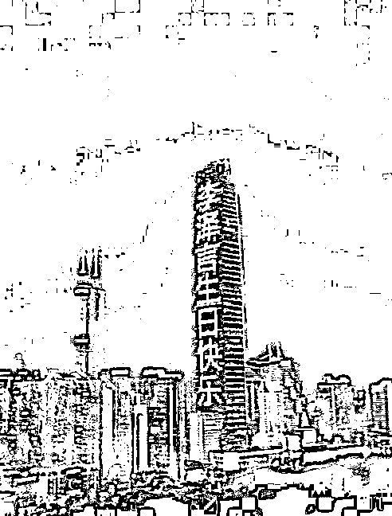
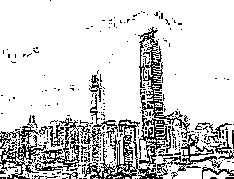
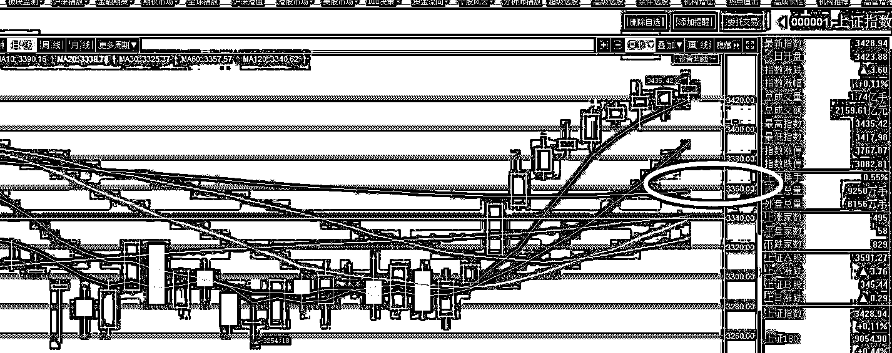

# 这周末碰到了稀罕事

<link rel="stylesheet" href="view/css/APlayer.min.css">

这周末碰到一件稀罕事，属于亮瞎眼睛的那种稀罕。周六刷新闻的时候看到了下面这几张图片，地点是深圳京基 100 大楼的 LED 大屏幕。

第一眼看到就被震慑住了，真有钱啊，滚动播放了接近一个小时，按照京基的价格表，怎么也奔百万花费去了，就为了庆个生日，真有钱。然后想了一下，李泽言是谁啊？我只听说过李嘉诚的儿子叫李泽钜和李泽楷，名字如此相近，出手还这么气派的，一定是李氏族人，可能是李家另外一个我不知道的儿子。作为经济领域人士，这种名字必须记住啊，于是我就去百度了李泽言的资料。

然后亮瞎了，李泽言不是李嘉诚的儿子，尼玛居然是一个卡通人物，是个 2D 的纸片人！一款针对女性的游戏里的男主而已。。。别的李太太只不过是手机壁纸换一下，买几个李泽言装饰品而已，这位李太太直接烧了百万来表达对纸片人的爱慕，真是开眼界了。

* * *

周末，美股再次大涨，美股的这种单边上涨已经突破了中国人的想象力极限，A 股限制了我们的想象能力，对 A 股是小利好。周五，IPO 依然是 3 家，不过融资额增长到 62 亿，比较大，所以属于小利空。二者基本对冲。

另外，中国互联网金融协会发布防范变相 ICO 活动的风险提示，其中点名批评迅雷的玩客币属于变相 ICO，迅雷表示立刻整改，这一新闻导致迅雷的美股股价直接下跌 27%，这一事件说明中国国内目前对于区块链货币的打击是非常严厉的，你做区块链技术可以，但是你几乎 0 成本发行一个区块链货币来圈钱，那就绝对不行。但是现在市场认可的就是区块链货币啊，谁发这种货币谁股价暴涨，因为资本市场知道你能圈到钱，老老实实做区块链技术的，股价反而没什么太大反应。

鉴于中国政府的严格打击，这一波全球区块链题材概念炒作狂欢节，A 股恐怕是要缺席了，央行巨讨厌区块链货币，证监会巨讨厌炒题材概念，二者一叠加，基本玩不出什么风浪了，不太可能成为爆炒热点。

大盘收出 11 连阳，而自本周三开始，整体平均股价就已经有下行的趋势了，只不过是蓝筹硬抗了指数，所以才导致大盘不跌而已。我周五的时候已经分析过，这个 11 连阳是有水分的，但是七连阳或者八连阳的含金量还是有的。

总的策略我们已经定了，那就是下周很有可能迎来一波回调，然后继续上涨，我们的总策略是看回调但不减仓，而且是逢回调加仓。毕竟第一轮整体涨幅并不大，我们是试探，整体市场资金其实也只是试探，从试探结果来看，本轮行情依然属于蓝筹白马，如果说区别的话有，那就是一线超级蓝筹白马的涨幅开始减速，二线蓝筹的涨幅追上了一线蓝筹，说明热度开始扩散。所以总体来说，下一轮我们的目光应该集中在一二线蓝筹，题材概念股，依然没有轮到他们。

那么剩下的还有一个问题，就是回调到哪里加仓，我之前一直说，3356，下面说说为什么。

首先，3356 是 60 日均线附近，而 20 周 K，也恰好是这个位置，就不贴图了，一般来说都是应该回踩 20 日均线买入的，当时是 3336 附近，也是我一开始提出的点，但是在极度看好后市的情况下，当时决定提高到最高的一根。除非你决定回踩 5 日 10 日就买入，否则 60 日真的是最高的一个了。对于连阳来说，决定 5/10 日这种短均线买入，假设是买入的低点，那就代表股市强悍的不像话了，真*大牛市的走势才会这样，如果不是，不管是震荡还是慢牛，那都应该回踩的更深才合理。

故决定 3356，由于又来了三四天绵阳，所以现在 20 日均线也缓慢爬升，估计到了下周的下半周，20 日也差不多是 3356 了，刚好。

总的来说，春节之前的行情都会很不错，不盲目看多，但是 11 连阳不管是不是人造，都至少帮我们排除了大的风险，保证账户一直是红色状态，问题不大。