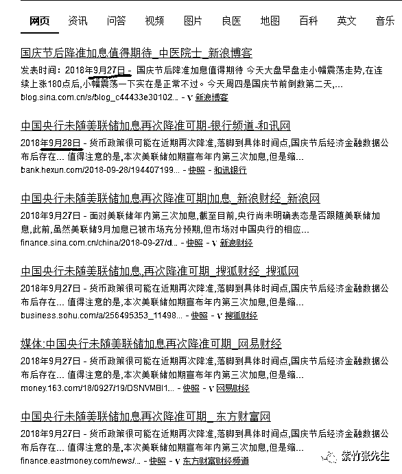
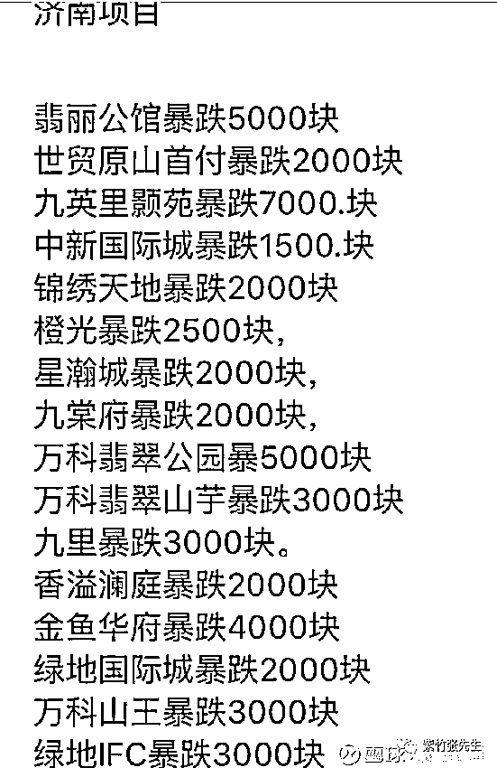

# 不就是央行降个准，有什么好大惊小怪的

喜欢我的都关注我了~

本来今天想讲一点有意思的事情，但是架不住 N 多媒体铺天盖地的报道央行降准的事情，还有 N 多公号发布一些奇谈怪论的文章，实在忍不住了，必须写一篇文章以正视听。这些奇怪的文章主要集中在三个领域，就是股市、楼市和币圈。

股市类的公号纷纷发文弹冠相庆，说央行降准了，对二级市场是个大利好，所以开盘必须涨。

楼市类的公号纷纷发文弹冠相庆，说央行降准了，对楼市是个大利好，打砸售楼处的行为不会再有了，马上房价就会反弹。

甚至币圈的公号都纷纷发文弹冠相庆，说央行降准了，说明经济形势不好，会给虚拟货币带来机会，还是那个结论，马上就要涨！

真是醉了，降个准而已，这些年降的准还少吗，会有啥结果难道自己心里不清楚吗？怎么能整出这么多忽悠智商的结论。

什么是降准和 MLF

10 月 7 日，中国央行宣布自 10 月 15 日起下调各大银行存款准备金 1%，释放资金部分用于偿还到期的 4500 亿 MLF，除此可再释放增量资金 7500 亿元。

在这简短的新闻里，我们首先要弄懂什么是存款准备金率和 MLF。首先，我们知道银行吸收的存款，是不允许全部贷出去的，假如你吸储了 100 亿，你贷出去 100 亿，那么来个几百万的提款要求你的钱就被清空了，然后诱发挤兑，然后你就完蛋了。

但是出于对利润的追求，银行天然有过度放贷的冲动，无非就是这 100 亿里，我是留 5 亿还是 4 亿而已，只要他觉得还算安全，他就会这么干。

但是平时安全的资金储备，一旦碰到风吹草动，超过了平时的提款金额，就会引发剧烈的金融动荡。国家为了避免这种事，就规定了一个法定的存款准备金率，按照这个准备金率，强行把一部分钱冻结，国家替你们保管，以防发生挤兑。

所以当提升存款准备金率的时候，银行手中能动用的钱就会变少，当降低存款准备金率的时候，银行手中能动用的钱就会变多，这次降低存款准备金率 1%，释放出来的资金大概是 1.2 万亿。

降准的意思，就是在不印钞票的基础上，增加社会上的货币供应，他不同于改变利息，没有增减资金的成本，只是单纯的增加货币数量而已，通常用来缓解钱荒。

那么什么是 MLF 呢，因为改变利率或者存款准备金率的动作都过大，不适合频繁使用，那么央行为了熨平经济波动，更频繁的干涉货币市场，就推出了麻辣粉（MLF）。

MLF 的学名是中期借贷便利，他的主体是央行，对象是商业银行、政策银行等，操作手法是以竞标的方式，各银行拿国债或者各种优质债权抵押，从央行获得现金。这个 MLF 的目的是为了方便央行放水和收水，因为他可以自定数量、自定放贷时间，对货币收放由心。

这次的降准说明里也明确说了，这次释放的货币大概 1.2 万亿，其中 4500 亿直接拿来偿还到期的 MLF 了，释放的增量资金大概是 7500 亿。而被央行收回的 4500 亿，他觉得合适的时候，还会直接拿出来再放出去。

降准是一次预期内的操作

这次的降准，是一次预期内的操作，压根不是啥突发事件，美国连续加息而中国不跟，利率存在巨大的压力，但是准备金率却常年过高有很大的下降空间，所以降准加息早就在预期之内，现在只不过是实现了一半而已，9 月中下旬，就有媒体进行过如此的报道，媒体可没那个本事预测未来。

而我国在 18 年已经进行过了 3 次降准，都没有引发什么天崩地裂的改变，也不可能引发什么剧变。因为治大国如烹小鲜，每一个动作都小心翼翼的，不敢用药过猛。

降准对经济是不是利好，肯定是，毕竟是放水了，但是有些人解读为中央整体去杠杆的姿态要解除了，要重新开始大放水了，那就大错特错了，按这个逻辑，2018 年中央已经解除 3 次去杠杆了，然后继续去杠杆，这不是和戒烟歪理一样嘛，我已经成功戒烟 300 次了。。。

所以，我的理解是，降准是一个缓冲器和降落伞，整体去杠杆的时候，不至于降速过快，起一个点刹的作用。

对于股市，中国股市历来不跟随经济形势走，我们可以发现，加息周期居然是牛市周期，降息降准的周期居然是熊市周期，不到牛市不加息，不到熊市不降息，前几年经济会议里已经白纸黑字的把股市二个字给删除了，目前股市不是中央的经济会议重心，几乎没有可能为了股市降准。

所以，股市的涨跌会按照原有的趋势和规律去走，该怎么样就怎么样，目前股市涨跌的核心就是 IPO，没有其他。

对于楼市，最近国庆各地的售楼处可热闹了，到处被打砸，新闻都快装不下了，据不完全统计，各地楼盘降价很可观，一次性跌 20~30%的，几乎都诱发了打砸售楼处事件。

那么降准会不会是救楼市呢，当然不是，这种跌幅完全在中央的预期和容忍之内，现在所谓的降价依然是小范围小区域的，的确出现了，但是没有全国性所有城市蔓延，顶多只能算苗头。

如果真的是想放水救楼市，把银行放贷利率降下去就可以了，或者重新批给房企一笔债，马上就生龙活虎拒不降价了，犯不着改变全国的准备金率。

至于币圈我就不想评价了，能发出那种言论的人肯定是个奇葩，玩币圈的自生自灭吧，本来就是个击鼓传花的游戏，而且是被国家打压的游戏。。。

降准的影响

我们都知道，2018 年的三次降准，都没有啥大的影响，那么这次也不会有。首先，国庆期间，中美关系骤然恶化，主要是特朗普被国内媒体捅爆了之后急于攻击中国转移视线。然后是各地房地产企业终于扛不住资金压力开始回笼资金应对 2018 年的银行还款了。最后外围股市也开始跌，所谓处处冒火。

而且，10 月 15 号，全国大概有 4500 亿 MLF 到期需要偿还，如果在这种经济背景下再抽走 4500 亿，经济形势会更麻烦。所以这次的降准，解决掉这 4500 亿之后，还放出来 7500 亿给全社会，爱去哪去哪，反正楼市调控政策不会松，股市 IPO 也不会停，你们自己看着办吧，全国经济总体不出问题就行。

按照国庆节之前的媒体预期，国庆节后央行会降准，然后加息，这次只是宣布了降准而没有加息，这已经是考虑到不利外部条件，推迟加息的脚步了。

那么降准到底会有什么样的影响呢，这话不应该问我，应该看看历史，这几年降准这么多次了，光 2018 年就已经降准了 3 次，这是第 4 次。发生了什么大事吗？没有，平平淡淡的继续过日子，该怎么样还怎么样。

所以降准根本就不是啥大事，各种利好利空对冲下实际对经济的影响差不多就没有了，国庆堵车对经济的影响可能都比这个大。所以无需过度操心，还是多关心关心怎么从高速上飞回家吧。

觉得此文的分析有道理，对你有所帮助，请随手转发。

长按下方图片，识别二维码，即可关注我

近期精彩文章回顾（回复“目录”关键词可查看更多）

华为员工都这么穷，怪不得拼多多能火 | 房价跌 20%就会全面崩盘，地产杠杆远比你想的要脆弱 |  为什么碧桂园的质量那么差 | 清醒点，放弃全面开征房产税的幻想 | 央行和财政部隔空掐架，我支持央妈 |中国土地制度源自香港，但是香港却是劏房密布 | 为什么中介哄抢租赁房源，因为贩毒都没它来钱快