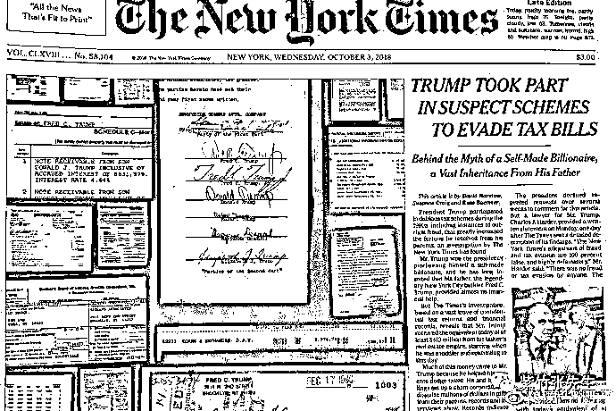
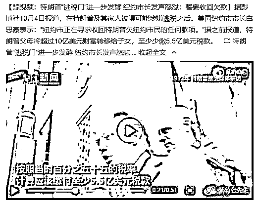
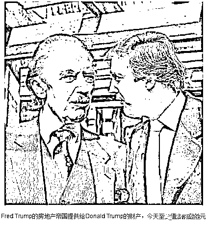
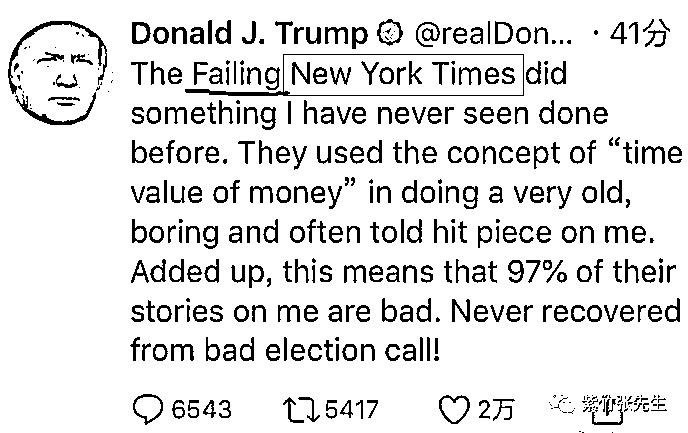

# 纽约时报重磅爆料，特朗普涉嫌逃税 5 亿美金

喜欢我的都关注我了~

近日《纽约时报》发布头版头条，重磅爆料美国总统特朗普涉嫌偷税漏税 5 亿美金，总共用了 8 个版面，图文并茂，并贴出了很多重磅证据，我们可以看到，印入眼帘的第一眼不是文字，而是一大堆票据和文件签名，这次纽约时报拿出了大量的铁证来公开指控总统特朗普，直接引爆舆论。

公开指控总统，这可不是小事，要是被证实是污蔑，纽约时报就可以直接关门了。所以纽约时报的这次调查非常之详尽，出动了大量的人力物力，用了一年多的时间，耗资至少在 150 万美金以上，整篇报道可谓是字字千金。 

纽约时报的调查团队，不止是写出了这一篇报道，而且还把素材整理成了一个纪录片，命名为《家族企业：特朗普与税收》，宣布将于 10 月 7 日晚在美国 Showtime 电视台播出。

这篇报道声称特朗普的父母通过种种手段转移财富到特朗普名下，可查实的规模高达 10 亿美金，按照美国法律 55%的遗产税，特朗普应缴纳 5.5 亿的遗产税，但是特朗普家族实际缴纳 5220 万美金，偷税漏税的金额达到 5 亿美金之多。

调查人员引用了超过 10 万页的公开数据和上万页的机密数据对特朗普父亲数十年的经济活动进行完全调查，要知道特朗普的父亲已经去世 30 年之久了，这个调查活动的难度可见一斑。 

这篇报道证实特朗普的父亲在数十年的时间里，慢慢通过各种手段把财富让渡给特朗普，首先是打破了特朗普宣称自己白手起家的光辉历史，然后通过历史数据累积，证实了特朗普有至少超过 10 亿美金的财富规避了遗产税。

美国其实很少有超级富豪是按照 55%的遗产税进行缴纳的，美国人也是人，合理避税的方法他们也是不亦乐乎，外加这篇报道使用了大量的重量级证据，可信度极高，如果没有自己掂量清楚，纽约时报也不敢公开指控总统偷税漏税，我个人认为，这事是真的。

其实特朗普自己也知道这个指控很棘手，不好处理，自己摘不清楚。所以最近几天特朗普政权绕开美国媒体的指控，集中全部火力攻击中国，而且是上纲上线的攻击，政治、军事、经济、文化全方位的攻击中国，列出中国的“九宗罪”，就差点没把中国描绘成灭世魔王了。其中公开指控中重点提到了一句，中国政府出资购买美国媒体版面，利用舆论干涉美国内政，其意图很明确，暗示纽约时报的指控是中国政府所为，利用美国人的仇外情绪来摘清自己，缓解自己的政治压力。

特朗普还愤怒的发了个推特，用 Failing（失败的，衰弱的）来形容纽约时报（New York Time）。 

而实际上，这件事根本就是美国媒体自己弄出来的，中国的确是有购买媒体版面的事情，但是发布的都是一些官方文章，像这种纽约时报动用了一个大团队，耗时一年多制作出来的大片，中方不可能会有任何插手，因为这事是瞒不住的，只要被特朗普拿到一星半点证据，就是严重的国际事件，而且会导致中方的谈判处于非常不利的位置。

那为什么纽约时报会搞这种事情，难道纽约时报和特朗普是死敌吗？你说对了，纽约时报和特朗普还真的是死敌，闹崩好久了。

特朗普之所以能当上总统，根本就不是依赖媒体的支持，而是靠美国去工业化、全球化过程中利益受损的中下层工人的支持才上位的。

实际上，在特朗普和希拉里竞选的时候，美国的媒体和精英阶层，大部分都支持希拉里。这个比例悬殊到什么程度呢，据尼曼新闻实验室的调查，在报刊中，支持希拉里的日报达 229 家、周刊为 131 家；相较之下，支持特朗普的日报只有 9 家、周刊只有 4 家。

鉴于媒体不是自己的朋友，特朗普在竞选过程中就大肆攻击美国媒体，称美国媒体“不诚实”、“报道假新闻”，“恶心和腐败”等。总之，竞选完毕后，特朗普差不多把本来关系就不好的美国媒体几乎都得罪光了。

特朗普就任美国总统以来，依然多次攻击美国的主流媒体，而美国主流媒体对特朗普的负面报道远远超过正面报道。特朗普不喜欢和主流媒体打交道，新闻发布会能不开就不开，有什么消息要公告，直接发推特，反正就是不通过主流媒体发布，懒得和你们这帮“坏人”见面。

而对于那些不得不召开新闻发布会的正式场合，特朗普也经常给那些看不顺眼的媒体下马威，例如 2017 年 2 月 24 日，白宫将《纽约时报》、CNN、《洛杉矶时报》等几个传统大牌媒体拒之门外，不让他们参加白宫的记者吹风会，次日特朗普宣布不参加白宫记者协会晚宴，中断了一百多年的媒体传统。

在特朗普眼里，反正这些主流媒体也不喜欢他，大家都已经撕破脸了，而他也有推特这个舆论传播利器，索性就把主流媒体全部抛弃，压根就没打算缓和关系。

而受够了气的美国主流媒体，自然酝酿着报复，于是，耗时一年多之后，纽约时报的这篇重磅新闻就出炉了。

特朗普会不会感觉自己很冤？会的，因为其他超级富豪也是这么干的，凭什么来抓我小辫子，这是媒体赤裸裸的报复。但是他不敢说是媒体报复他，这样只会把自己推进深渊，所以他只能拿中国当替罪羊，话里话外暗示这个报道是中国指示的，是中国操纵美国内政。但是实际上，特朗普已经和美国媒体闹崩好多年了，这完全是自找的，关中国什么事。

那么特朗普冤不冤呢，其实也不冤，毕竟法律摆在那里，要是说潜规则是怎样那么就应该怎样，那范冰冰也不应该被处罚啊，因为当时的娱乐圈“行规”就是那样的，其他大影星都是这么操作的。

法律就是法律，哪怕潜规则里几十年都是这么玩的，只要被人曝光出来了，就要按明规则办事。

所以，特朗普这次摊上大麻烦了，别拿中国当挡箭牌，我们不背你偷税漏税的锅。

觉得此文的分析有道理，对你有所帮助，请随手转发。

长按下方图片，识别二维码，即可关注我

近期精彩文章回顾（回复“目录”关键词可查看更多）

华为员工都这么穷，怪不得拼多多能火 | 房价跌 20%就会全面崩盘，地产杠杆远比你想的要脆弱 |  为什么碧桂园的质量那么差 | 清醒点，放弃全面开征房产税的幻想 | 央行和财政部隔空掐架，我支持央妈 |中国土地制度源自香港，但是香港却是劏房密布 | 为什么中介哄抢租赁房源，因为贩毒都没它来钱快