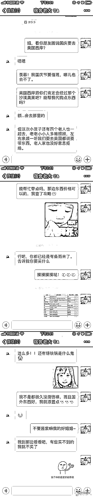
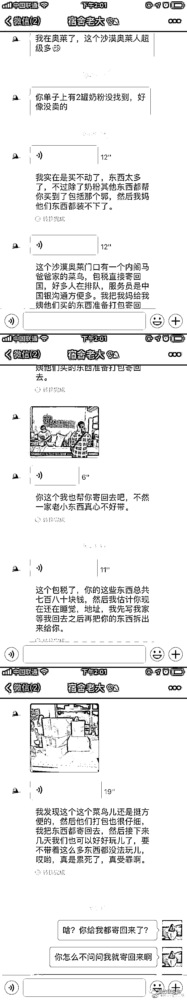
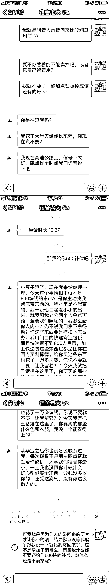
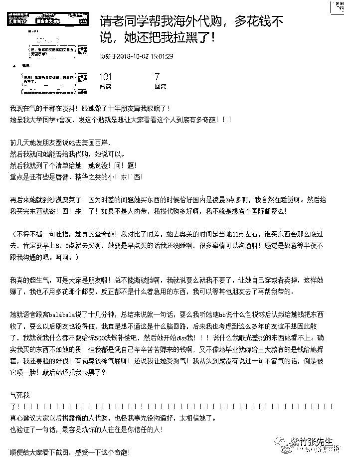
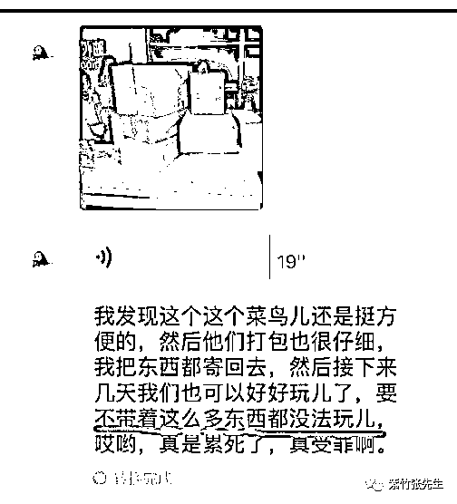

# 不尊重知识的朋友，也不会尊重你的时间

喜欢我的都关注我了~

朋友之间，难免有互相帮忙的情况，有素养的人会讲究礼尚往来，没有素养的人则喜欢单边占小便宜。对于那些实物和金钱的往来则非常好衡量这一点，但是对于一些涉及知识和时间的领域，则很多时候是老实人哑巴吃闷亏。设计师和出国代购，属于知识和时间领域最典型的例子。

1**设计师的烦恼**

很多设计师，最头疼的事情，就是一个朋友找到自己，让自己帮忙“随便”设计一下，小到 logo 大到建筑设计，都在这个“帮忙”的范畴之内。

如果朋友上门求帮忙，我送他一堆物资或者一笔钱，他会感恩戴德，但是如果我帮他设计，他非但不认为你的帮助值得感恩，反而吹毛求疵，说的时候是“随便”设计一下，但是当你耗时几个小时甚至几天帮他设计完之后，他又觉得这这要改一下，那那要改一下。

饭店打折，大家说：“这个朋友真好”

文具打折，大家说：“这个朋友真大方”

服装打折，大家说：“这个是真够朋友”

设计打折，大家会觉得“这个朋友有点小气”

饭店说：“以后来我这吃饭，全免费！”大家说：“不行！你是做生意的”

文具说：“以后来我这买文具，随便拿！”大家说：“不行！不合情理的”

服装说：“以后来我服装店，全部任穿！”大家说：“不行！哪好意思啊”

设计师：“以后有什么设计就找我帮忙！”大家说：“好的，谢谢啦！”

对于很多月薪上万的设计师来说，设计就是他们吃饭的家伙，他们之所以能获得这么高的薪水，是因为他们的设计真的具备市场价值，是长期的训练得到的技能，为了这个技能他们付出了大量的代价。他们宁可送你一顿饭，送你一套文具，也不愿意帮你“随便”设计设计。

下次找设计师朋友帮你免费设计设计的时候，不如换一个词汇，直接找设计师朋友借 500 块钱，然后找市场上其他的设计师设计，我觉得这样更公平一点。

很多设计师不好意思说我给你 500 你找其他人这样的话，显得对方很没有素质，所以一般采用的托词是自己最近工作很忙没有时间，或者说这个设计很复杂自己搞不定建议另请高明。

如果你是设计师，你这样做之后会失去几个朋友，还有人会说你小气，但是这样的朋友不是真的朋友，早走早轻松，你维系着这样的朋友，纯粹是在给自己找麻烦。

君子之交，凡是提出让对方帮助的时候，必定慎重考虑自己的这个帮助会给对方造成的麻烦和损失，并能礼尚往来，绝对不会轻易占别人一分钱便宜，也不会将别人当成免费劳动力。

2**出国旅游的烦恼**

如果说设计师的问题还只是小众人群的烦恼，那么出国旅游被朋友要求“随手”带点小东西则会被很多人所头疼。

有些人一听说身边有人要出国，不管是旅游还是留学，哪怕已经几年没联系了，都会马上跑过来要求给顺便带点小东西，当你勉为其难的答应后，立马塞给了你一个长长的清单。

更无语的是，当你费尽千辛万苦，冒着被海关罚款的危险回国之后，他还嫌弃包装不完整，磕碰了什么的。

有一个妹子曾让朋友出国代购一个眼影（一分钱都不加那种），拿到之后还一脸嫌弃，这怎么碎了一块啊，还要自己压盘，早知道自己买算了。

对于这种人，我想说的是，你早点自己去商场买好吗，还能七天无理由退换货。

昨天，一位女网友在论坛晒对话记录称自己的大学室友是奇葩，自己不过让她“顺手”代购一点东西，居然没能完美完成。

看完了吧，看完了你知道这件事是咋回事了吧，这是最奇葩的吗？不是，最奇葩的是，被老同学拉黑之后，这个女奇葩气不过，自己上网发帖把所有的对话记录都给贴出来了，说自己眼瞎了，气死了，被人坑了等等。

大家可以看一看，这就是那些找你帮忙的人的嘴脸，你一家七口出口，休闲的假期全部浪费给她到处选购东西上面了，连铸铁锅都要帮忙买，最后因为多付了七八百邮费就破口大骂。

这说明什么，说明你付出的时间和精力，在她的眼里全是免费的，连八百块钱都不如，她找你帮忙也不是因为看重你，而是觉得终于找到一个机会从你身上占小便宜了，哪怕能占二三百的便宜，她都不介意你遭受二三千的损失。

图中说的很清楚了，我找你代购，就是要你人肉背回来的，这样可以省我几百块钱，至于你会承受什么样的损失，那是你的事情，所以你擅自加了 800 块钱邮费，那是大不敬，我当然选择不要，这批货你自己拿回去卖掉吧。

看看这张图旁边那个人的高度，就能猜到这些物品是何等的多，而且里面至少有一口铸铁锅，重量自然不用提，猜都猜的到，这么多东西你让别人给你人肉背回来？你背一个给我看看？别人带着这么多东西，剩下的几天你让别人怎么旅游？

这件事情最大的错，就是这位同学一开始没有明确拒绝她这位奇葩舍友。有句话说的好，舍得为难你的人，往往也不值得你为他们这么操心。

而很多时候，这样的人一般都处于社会的中下层，他们自己的知识和时间不值钱，也会认为其他人的知识和时间都不值钱，几百块的小便宜，在他们眼里非常的多了，因为他们的知识和时间实在是太廉价了。

他们越不重视知识，自己的收入就会越低，自己的收入越低，就越不重视知识，然后形成恶性循环。

而对于我们的朋友圈，那些不尊重知识的人，自然也不会尊重你的时间，这其实不怪他们，因为他们自己的时间也很廉价。

对于这样的朋友，我的建议很明确，敬而远之，把你宝贵的时间节约出来，和那些尊重知识的人多交往交往。

觉得此文的分析有道理，对你有所帮助，请随手转发。

长按下方图片，识别二维码，即可关注我

近期精彩文章回顾（回复“目录”关键词可查看更多）

华为员工都这么穷，怪不得拼多多能火 | 房价跌 20%就会全面崩盘，地产杠杆远比你想的要脆弱 |  为什么碧桂园的质量那么差 | 清醒点，放弃全面开征房产税的幻想 | 央行和财政部隔空掐架，我支持央妈 |中国土地制度源自香港，但是香港却是劏房密布 | 为什么中介哄抢租赁房源，因为贩毒都没它来钱快