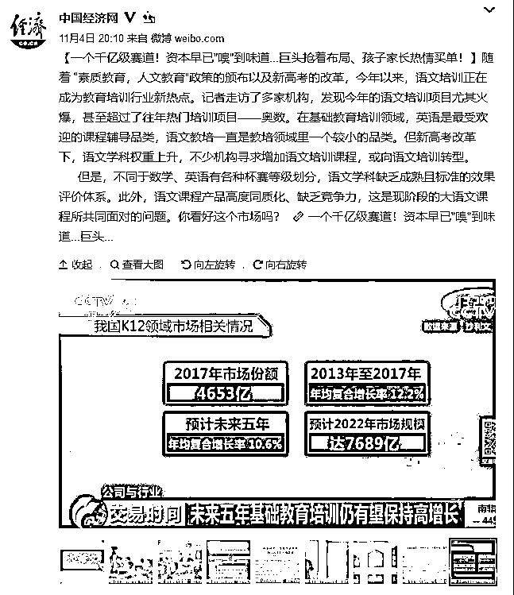
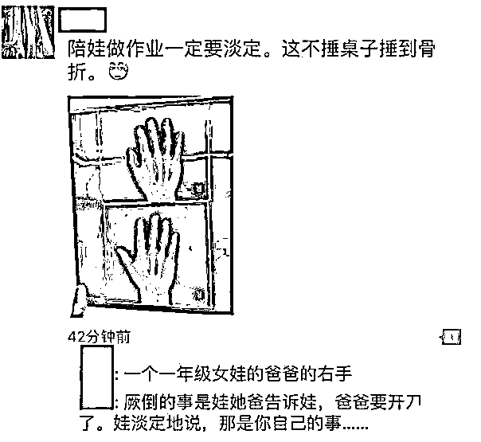
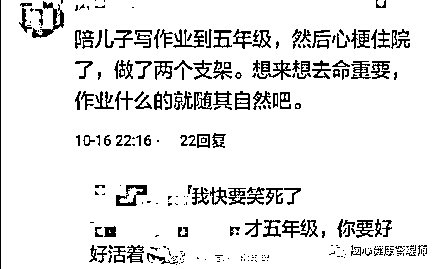
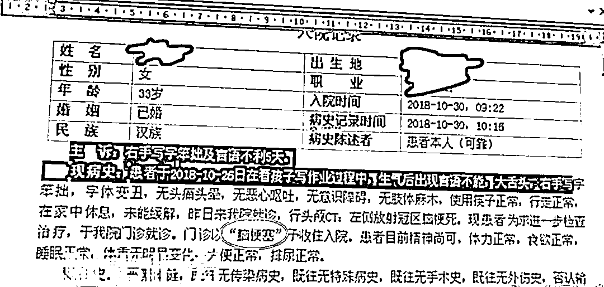
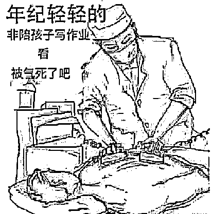
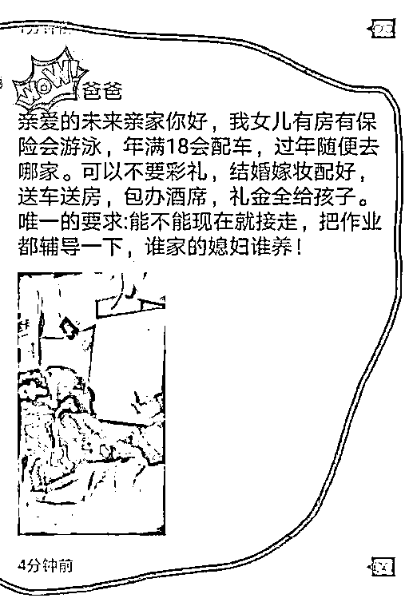
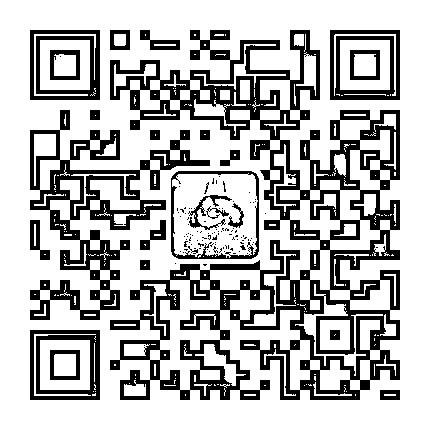

# 红火的培训市场，是中国教育的耻辱

在中国，有一个新兴的赚钱领域非常红火，2017 年营收达到 4653 亿元，预计 2022 年会达到 7689 亿元的市场规模，是标准的千亿级赛道，各路资本疯狂涌入，前往淘金。

资本抢着布局，家长热情买单，是什么原因催生出了如此庞大的课外培训市场。如果是课外游泳、舞蹈、跆拳柔道、围棋这种“素质教育”，那我还可以理解，因为这些东西不是学校提供的教育服务，课外培训市场红火，只能说明中国教育的强大，强大到所有的孩子都不愁升学，愿意投入大量的课余精力去做这些闲情逸致的事情。

但是很明显，红火的课外培训市场，并不是由这些内容组成的，的确有一些家长有钱有闲不愁前途，愿意为这些课程买单，但是绝大多数家长都只是花一点钱让孩子体验一把“贵族”生活，真正能让家长不惜血本愿意花大价钱买单的，还是语文、英语、数理化等基础学科，由于这些课程的巨大需求，导致课外培训市场热火朝天。

但是这些课程内容的火爆，让人非常迷惑不解，这些事情不是应该由学校来做嘛？如果学校教的好语数外，那还要这些课外培训机构干什么，如果学校教不好语数外，趁早解散算了，让这些培训机构上位当学校，集中批量教育，成本会大幅度下降。

但是现状是，学校的教育质量还是很好的，很多课外培训机构的老师质量参差不齐，乱象频出，有的甚至把新老师包装成“名师”按照一小时 200 元的费用玩一对一辅导，简直误人子弟。

既然课外培训机构的教育质量并没有碾压常规学校，那为什么他还能这么火，这么多家长趋之若鹜的把孩子送过去。那是因为，现阶段学校提供的教育服务，远远不能达到家长的要求，一方面是教育局拼命的要求素质教育，给孩子减负，一方面是应试教育的巨大压力丝毫不减。

除非全国的高校都被清华北大收编，实现教育领域的彻底平等，大家共产共和，谁都可以上清北，宁可付出教育成果大幅度衰退的代价也要追求教育平等，否则教育的竞争压力就永远不会减少，应试教育的压力就永远存在。

所以，当教育局开始执行素质教育减负的时候，孩子的负担丝毫没有减少，学校的负担却减少了，现在很多学校直接把学校应该负担的任务，直接移交给课外，让家长负责，至于你这个家长是自己亲自上督促孩子学习，还是找课外培训机构帮家长辅导，那就是你家里自己的事了。

就这样，学校提供的教育服务和实际的教育需求之间产生了巨大的断层，一开始还有很多老师想课后赚这个外快，负起课后辅导的责任。但是随着教育局严打教师课后收费培训，这方面很快没人敢做了，成效斐然。

严打的结果，就是这个教育断层出现了市场空白，既然学校老师不敢碰了，那课外培训机构就开始粉墨登场了，虽然他们的平均教育能力是低于学校教师的，但是他们可以合法的去收费培训，如果你不想参加课外培训班，那么请你自己客串教师来辅导孩子。

学过市场经济学的人，都知道专业分工有多么重要，你让一个工薪族来当教师，那必然效率低下，吃力不讨好，这是对资源的巨大浪费。很多家长，宁愿自己加班赚钱，然后付钱聘请专业教师来辅导孩子，因为这样更加的经济实惠。

就这样，原本应该由学校做的事情，转交给了课外培训机构来做，中间伴随着大量的资源浪费和无数苦不堪言的家长。

老师交代下了各种任务要求课后完成，老师不愿意帮你辅导孩子，早早的就让孩子回家，那么要么你家长来辅导，要么就要找培训机构来辅导。

你不舍得花钱找培训机构，要亲自辅导是不是，那就来看看亲自辅导的后果吧，首先，陪孩子写作业，有骨折风险。

然后，还有生命风险。

对了，还有一个孩子妈妈因为辅导孩子写作业，被气到中风了。

要么花钱，要么送命，仔细想一想，还是花钱划算，这就是课外培训机构火爆的原因，因为它可以救命啊。

现在有很多家长因为不堪重负，已经开始送女儿了，希望未来亲家能早点接走当童养媳。。。

这么可爱的女娃娃，要求现在就立刻接走，还宁愿倒贴钱，多大怒气值啊，好歹自己亲生的，淡定。。。

致未来亲家书的刷屏，表面上是中国家长被写作业折磨的苦不堪言，实际上是学校基础教育的巨大缺位，同样也催生出了火爆的课外培训市场。朋友圈掀起一股送儿送女的狂潮，是学校把教育责任转嫁给家长的直接证据，也说明我国目前教育管理的混乱和不足。

培训市场火爆程度与基础教育的失败程度成正比，中国目前热火朝天的培训市场，是中国教育的耻辱。

~~~~

今天推荐一位很擅长用最少的钱把自己打扮的最好看的时尚博主哦，大家可以关注一下，每天的干货非常多，我第一次见到能把时尚写成干货的。。。

> 很多人觉得时尚离自己很远，
> 
> 但你都这么有内涵了，
> 
> 外表再上升一点点那不得了。
> 
> 在这里每天听听我胡扯，
> 
> 扯好看的难看的男人的女人的，
> 
> 用最轻松的话语讲最实用的秘诀，
> 
> 相信我，
> 
> 时尚和吃饭睡觉一样简单。

扫描上方二维码关注