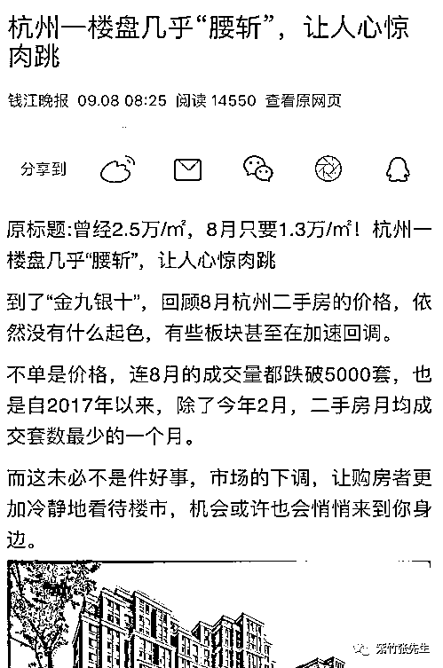
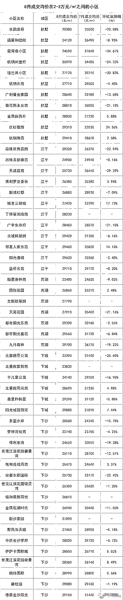
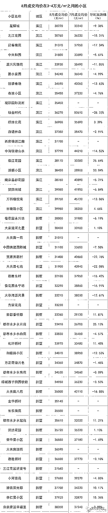
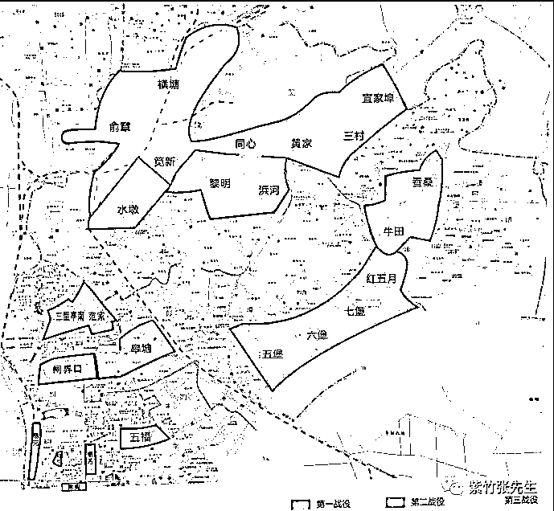
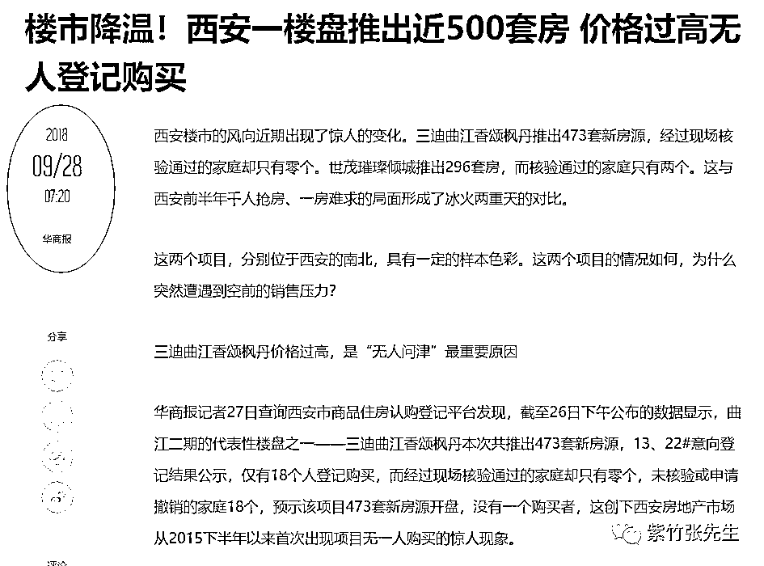
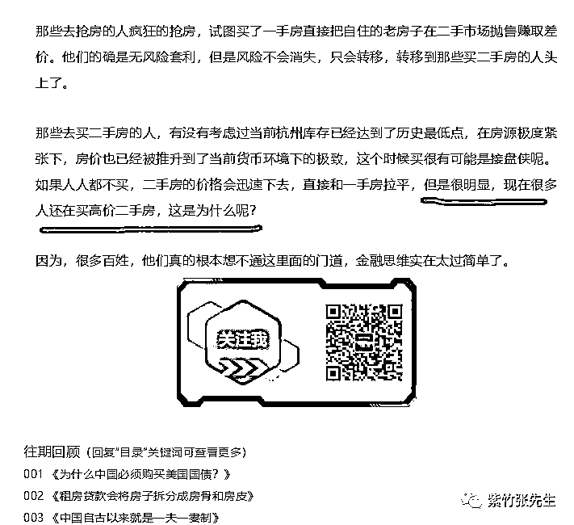

# 万人抢房的杭州，开始有人拉横幅退房了

喜欢我的都关注我了~

杭州，是一个房价暴涨的城市，就在 4 个月前，杭州楼市充斥媒体的字眼还是万人抢房。仅仅几个月后，杭州楼市急转直下，价格出现大幅度的下滑。 

杭州本地报纸钱江晚报对此在做出了专门的报道，为求准确还特地搜集了大量楼盘的成交价进行对比，原始数据很多，我只贴其中 2 个图做个示意。

均价 2~3 万的楼盘 

均价 3~4 万的楼盘 

原媒体用的标题是崩盘、腰斩等词汇，我观察了数据之后，认为改为大跌比较合适。因为图中的数据我们可以发现，2~3 万的楼盘跌的反而厉害点，3~4 万的楼盘跌的较少，有的还有涨的，而杭州主城区的楼盘均价有 6 万以上的，可以认为那些可能跌的更少。

但是不可否认的是，杭州的房价的确下跌了，至少是停止上涨了，尤其是我今天看到杭州再次出现拉横幅退房维权的视频后，更是证实了这一判断。下面是杭州滨江区未来海岸二期大降价之后，业主跑来“维权”的视频。 

为什么杭州的楼市突然急转弯，其实我之前多次写过杭州楼市，5 月 30 号的时候就专门谈过杭州万人抢房事件，后来的货币化棚改也拿杭州举例说明过。

杭州这一次的楼市波动，涨跌都是因为货币化棚改，17 年杭州共进行货币化棚户拆迁五六万户，每拆一户几乎都是千万级货币起步，这直接导致了大量的货币涌入了杭州的租房和住宅市场，而杭州大手笔拆迁的规划图更是引来房产投机者的无限遐想。 

图中我们可以看到，杭州政府规划了三大战役，第一战役就是拆掉 567 堡，我们找到了杭州七堡的现状图，可以看到被拆成了一片废墟。 

图中也可以看到，仅仅第一战役就拆了那么大的面积，整个杭州才多大，这么大面积的人口被拆迁，还是货币化拆迁。这五万户居民，自家房子已经被拆成一片废墟，是必须要买房住的，买新房要等二年才能入住，何况还买不到，没办法只能买二手房，于是杭州的二手房被迅速的抢购一空，杭州房价不涨才怪。

而实际上，今年上半年杭州的楼市已经到了很变态的地步，杭州中心区的房价已经接近上海中心区的房价了，均价 6~8 万一平米。。。杭州没有在经济上超过上海，房价倒是快接近了。

所以，在货币化棚改降温之后，楼市上涨的源动力立刻就消失了，去年各种调控都没有控制住的房价，今年全部熄火了。

当货币化棚改的动力失去之后，不仅仅是万人抢房的杭州房子卖不动了，今天媒体报道，曾出现千人抢房的西安房子也卖不动了。 

而今年 4 月份的时候，杭州商品房的库存仅剩 3 个月了，整个杭州马上就无房可卖了，整个楼市一片沸腾，但是等抽掉货币之后，同样还是杭州，房子马上就没人要了，很多人看着房子很眼馋，就是手里没钱买。

所以说，房子的问题，本质上就是金融问题，再本质一点说，就是货币问题。房价涨不涨，其实问银行的人就知道了，房贷一宽松，很快就会涨，房贷一收紧，很快就不涨了，房价=货币÷房源。

今年 5 月 30 号的时候，我曾针对杭州万人抢房事件发布过一篇文章《杭州新房摇到立赚一倍，为何政府不愿打开限价》，里面详细的对 5 月份杭州万人抢房的问题根源做出过解释并详细分析，分析的结论就是万人抢房不仅不能表示杭州楼市供大于求，反而预兆着杭州楼市可能就此见顶，因为为了解决库存不足问题，今年上半年杭州政府的土地供应太大了，而货币化拆掉了一大片土地，未来 2 年之内也肯定要入市，所以这批人很可能买在山顶上。

不过反转来的如此之快，是我在 5 月 30 所想不到的，中间所夹杂的变量，就是 6 月中旬货币化棚改突然减速降温了，如果货币化棚改不降温，杭州楼市 2 年之内也一样要反转，而且泡沫会更大。

## 而我在 5 月 30 日的《杭州新房摇到立赚一倍，为何政府不愿打开限价》文末曾警告过他们，不知道有几个看到的幸运儿躲过去了。

## 还在 6 月中旬，预测 P2P 暴雷潮即将开始，建议大家无脑撤出 P2P 领域等半年再来，当时的文章是《一个 800 亿的地雷爆炸了，网贷平台后面可能会连环炸雷》，如今这二个预测都应验了。

## 如果有兴趣看的，可以点击上面的蓝色字体，回过头去再看一看这二篇文章里面的分析逻辑。

## 很多人想知道之后的房价怎么走，我的判断很简单，当前房价的租售比已经达到 70 了，靠租金 70 年才能回本，所以租金不变的情况下，房价再涨 50%，达到 100 倍的 PE，几乎必然会崩盘。而现阶段直接锁定房价，让他慢慢阴跌消化泡沫，还有可能达到软着陆的效果。

## 所以大家不要指望房价暴涨了，涨上去就崩，不涨缓和几年，还有可能再涨，而实际上政府手中还有很多牌储备着没打，直接崩盘还是有很多子弹可以救场的，所以横盘弱阴跌是大概率。

在这弱阴跌的过程中，影响房价的因素和政策其实很多，但是最关键的一个，就是货币，盯紧他就可以了，如果有什么异动，我会再发文的。

这里有一款售后评价非常好的按摩披肩，可以点进去看一看，限量 1000 件<mp-miniprogram class="miniprogram_element" data-miniprogram-appid="wxc976ad09f28869cb" data-miniprogram-avatar="http://mmbiz.qpic.cn/mmbiz_png/vq8qicHgf3Fmaz0BtaQHQTmkRAQvpdGt4NwwlRibfY2db1DxLtYwye2Oib42ia3ibibu1IuCkKnsBErQBdoKPwCC5L1g/0?wx_fmt=png" data-miniprogram-imageurl="http://mmbiz.qpic.cn/mmbiz_jpg/vVoVQ59VnF4RAn7SC3nqLXIcEYjEPBibb4uNJkbBHQ6tialM7BKs0VIYLWnT7eWr72dCn1kk6vugFctt4OTeXI8w/0?wx_fmt=jpeg" data-miniprogram-nickname="好物小店 plus" data-miniprogram-path="pages/home/dashboard/index" data-miniprogram-title="好用的仿真人揉捏按摩披肩"></mp-miniprogram>

觉得此文的分析有道理，对你有所帮助，请随手转发。

长按下方图片，识别二维码，即可关注我

近期精彩文章回顾（回复“目录”关键词可查看更多）

华为员工都这么穷，怪不得拼多多能火 | 房价跌 20%就会全面崩盘，地产杠杆远比你想的要脆弱 |  为什么碧桂园的质量那么差 | 清醒点，放弃全面开征房产税的幻想 | 央行和财政部隔空掐架，我支持央妈 |中国土地制度源自香港，但是香港却是劏房密布 | 为什么中介哄抢租赁房源，因为贩毒都没它来钱快