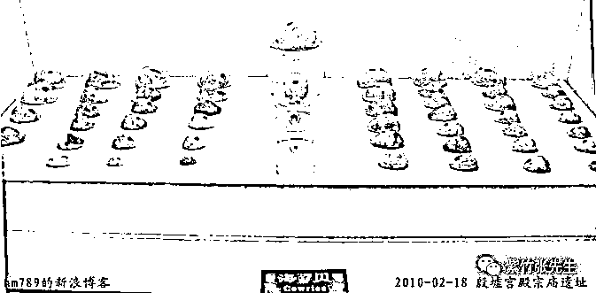
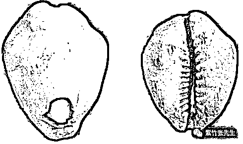
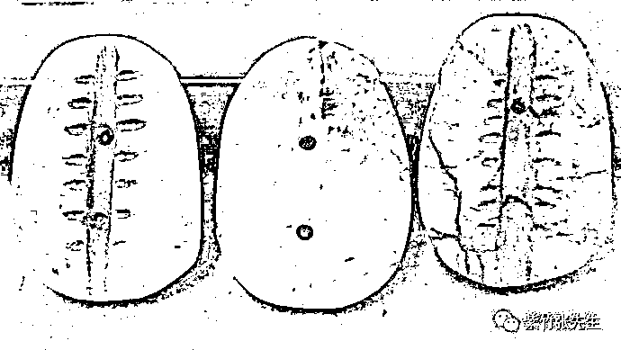
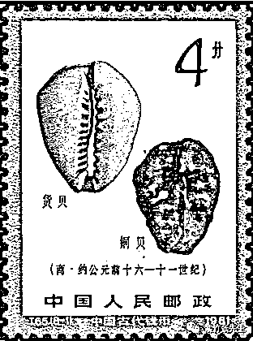
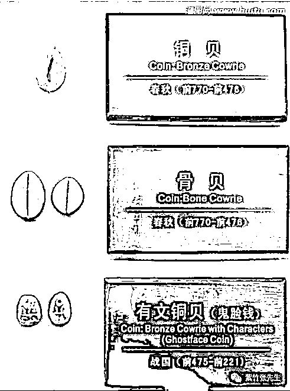
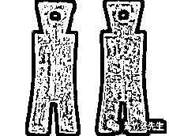
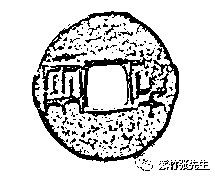

# 为什么全球古人都选择金银作为货币

喜欢我的都关注我了~

马克思有句名言，金银天然不是货币，但货币天然是金银。在人类的文明史中，金银一直作为主要货币使用，一直到上世纪七十年代布雷顿森林体系崩溃，美元宣布和黄金脱钩，这才进入了信用货币时代。

但是这里有一个疑问，世界各地这么多国家，这么多种族，几万年的漫长时间里彼此互不相认，为什么会不约而同的选择金银作为货币，要知道货币的本质只是个中介而已，任何物质都可以成为货币，哪怕只是一张纸。

实际上，世界各地的人类，一开始的时候使用的货币是五花八门的，什么东西都有。例如中国，一开始使用的货币就是贝壳，你会发现在汉字里和货币有关的领域绝大部分都带有贝字旁，如贩贯货购贮账贸贾贿赂赁赃贼贽资赊赔赏赌赙赚赘赠赝等等。

看晕了没，看晕了没关系，因为后来的汉字，统一修改为了金字旁，典型的例子，就是钱。中国不再使用贝壳作为交易媒介了，而是使用了金银，全球几乎所有的人类种族，后来都心有灵犀的统一使用了金银作为货币，哪怕几千年都从未交流过。所以马克思才说，金银天然不是货币，但货币天然是金银。

金银被全球人类不约而同的选中为货币，是具备必然性的。首先我们知道，货币本身要具备一定价值，他才能充当一般等价物进行交换（纸币是因为国家信用注入了价值，所以全部称之为法币）。而货币还必须具备储藏性、稳定性的特点，你拿一堆肉干作为货币，价值的确好衡量，但是这玩意不能放啊，顶多一年就坏掉了，我这有一块 82 年的腊肉，你要不要尝尝味道？

今天我拿中国的货币变迁史来说明一下，为什么全球各地的人类，都会选择金银作为货币。在原始社会，中国选择了贝壳作为货币，贝壳易于保存，相对不易损坏。但是并不是你去水边随便捡一堆贝壳都能当货币的，货币作为一般等价物的一个重要特点就是他必须具备价值，里面要蕴含劳动成果。

贝壳之所以能成为货币，那是因为它是中国古代为数不多的装饰品，戴在脖子上具备美观作用，同时在贝壳上钻孔是非常困难的事情，尤其是在没有金属工具的古代。所以制造出一个合格的钻孔贝壳是非常耗时耗力的，那么理所当然，这种钻孔贝壳是可以拿来交易的。

在商代的时候，人们依然在使用贝壳作为货币，《本草纲目介部贝子》曾明确说：“古者货贝为宝龟,用为交易,以二为朋”。意思就是货币的单位为朋，每朋由两串各有十个或二十个玛瑙贝组成，在学术界，海贝作为华夏先民最早使用的货币已经得到了普遍公认。

不过其实到商代，已经是贝壳货币的尾声了，在商代有各种各样的货币，除海贝外，还有骨贝、石贝、玉贝和铜贝，今天我给大家找齐实物图，饱一顿眼福。

商代海贝，可以明确看到，每一个海贝上面都是带孔的。

这是在陕西西安出图的商周时期的骨贝，可以明确看到，这是骨头上面硬生生钻个孔作为货币。 

这是考古出土的，商周时期的和田玉质贝币，大家可以看到，这简直就是把和田玉打磨成贝壳的形状，然后钻个孔。。。

连玉都能被仿制成贝壳的形状，作为拥有青铜器的商周，自然也会把青铜给浇筑成贝壳的模样作为货币。 

这个黑乎乎的看不清楚，我们换一个春秋时期的铜贝看一看，大家可以看到，和玉贝一样，模仿成贝壳的形状，然后中间打孔。

商周之后进入春秋战国时期，青铜货币统治全国，但是样子稀奇古怪，每个国家都要弄一个与众不同的外表，所以不再局限于贝壳形状，啥样子都有，什么刀币、铲子币、珠宝龟贝币一律禁止。 

秦朝统一后，只留下二种货币，一个是上币，也就是黄金，一个是下币，也就是铜钱。铜钱必须是大秦中央统一生产的货币，上写“半两”，重量也正好是半两，所以被人称之为秦半两。 

看到这个大家就很熟悉了，后世所有的铜钱，都是这种样式的，典型的中国铜钱，其中间打孔的传统，就是从贝币那里承袭过来的。

看到这里，我们会发现，用铜作为货币不挺好的嘛，为什么把铜币称之为下币，而黄金称之为上币呢，黄金具备什么优势呢？

我们都知道，贝壳之所以能成为货币，是因为他打孔之后蕴含了劳动价值，所以他能充当交易媒介，而金属的熔炼，也一定蕴含劳动价值，所以金属当然可以替代贝壳充当货币。

而金属相对于贝壳具有极大的优势，金属相对稳定易储存，金属可以熔炼成各种想要的形状，金属的开采便于受政府控制，所以当中国人具备金属开采熔炼的能力之后，金属货币取代贝壳货币就是必然的结果。

那么在各种可熔炼的金属里，我们需要选出一个美观、稳定、数量不会太多导致泛滥，也不会太少以至于无法日常交易的金属作为货币。

青铜是人类熔炼出来的第一个金属，青铜器是作为国之重器来进行崇拜的，青铜作为货币具有先天优势，但是他却在货币的竞争中失败了，最主要的原因，就是青铜很容易生锈。生锈的青铜不仅不美观，而且很容易损失重量，也许你的毕生财富，储存个几十年之后，一半财富都变成铜锈了，哭死你。

那么后来发明的铁，也是一样的道理，铁更容易生锈，所以铁币只是在中国历史上短暂的出现过，生命力还不如铜币。

银的稳定性就远远强于铜，但是银储藏久了，依然会“生锈”，和空气中微量的硫产生反应导致表面发黑，这种损失远远小于铜和铁，但是依然是有损失的。

但是黄金就不一样了，在各种金属里面，黄金稳定的可怕，你如果用黄金造一个东东出来，哪怕过了一万年，他还是完好如初。而且黄金非常美观，黄金的美是跨越文明的，并不是因为他值钱，而是他纯粹的金色，真的很美。

黄金在稳定性、易携带性，数量适中这几个条件中完美的碾压了其他所有金属，所以人类文明进化史中，不管你是哪里的人类，不管你曾经选择什么作为货币，当你进入金属时代后，最后都不约而同的选择了黄金作为你的货币。之所以会采用白银作为补充，那是因为黄金数量太少，不足以支撑日常频繁交易使用，而铜钱，那更是候补中的候补，黄金为王，白银其次，铜钱最差。

丘吉尔曾说过，黄金这种元素是人类能想到的最糟糕的货币——除了其他所有金属元素之外。

~~~~

昨天的文章，好多人留言问为什么被删除了，这个就不要问了，那篇文章影响力太大了，然后你懂的。

所以我今天要贴一下我的复活号二维码，如果我不见了，可以来这里找我。

觉得此文的分析有道理，对你有所帮助，请随手转发。

长按下方图片，识别二维码，即可关注我

近期精彩文章回顾（回复“目录”关键词可查看更多）

华为员工都这么穷，怪不得拼多多能火 | 房价跌 20%就会全面崩盘，地产杠杆远比你想的要脆弱 |  为什么碧桂园的质量那么差 | 清醒点，放弃全面开征房产税的幻想 | 央行和财政部隔空掐架，我支持央妈 |中国土地制度源自香港，但是香港却是劏房密布 | 为什么中介哄抢租赁房源，因为贩毒都没它来钱快