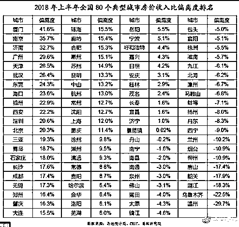
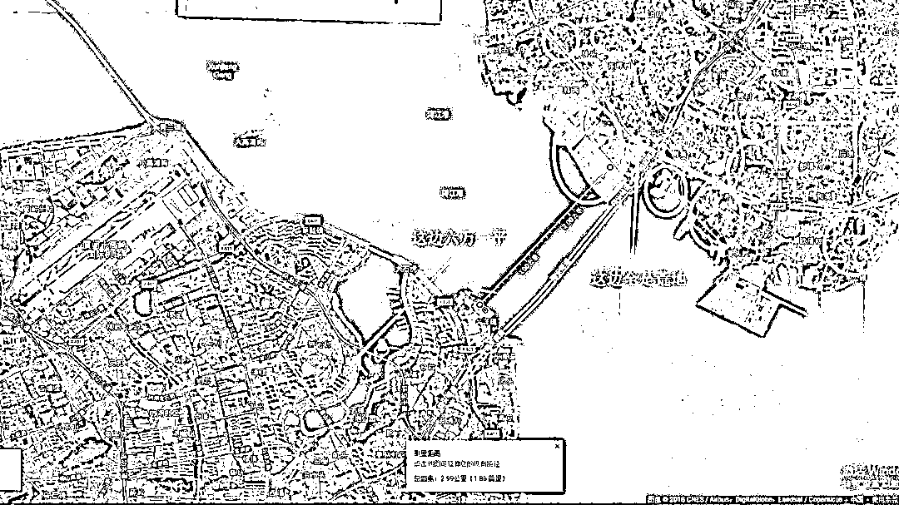
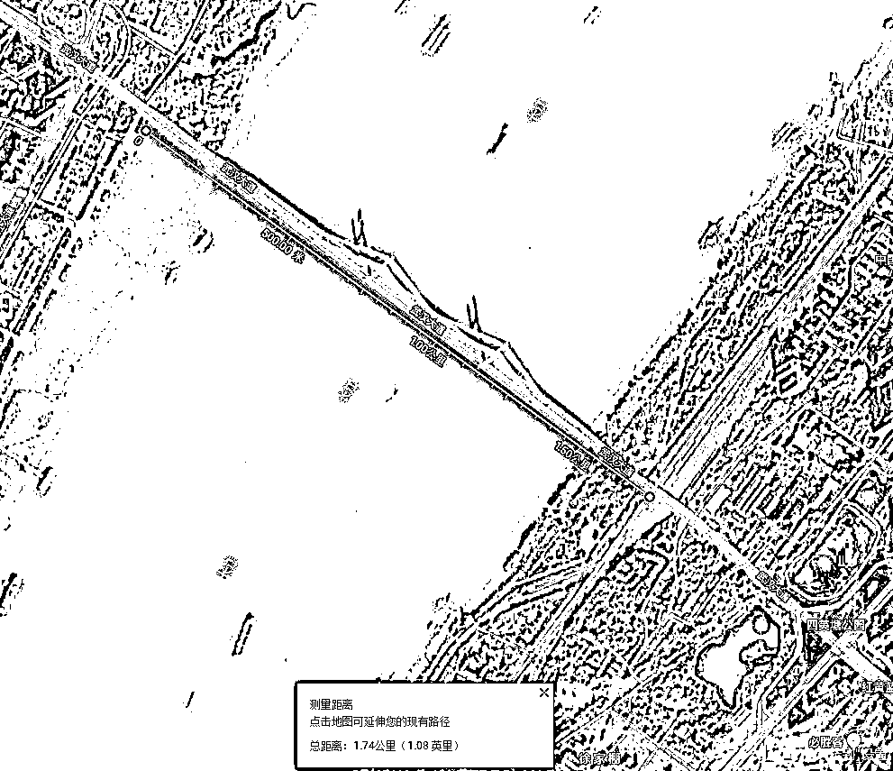
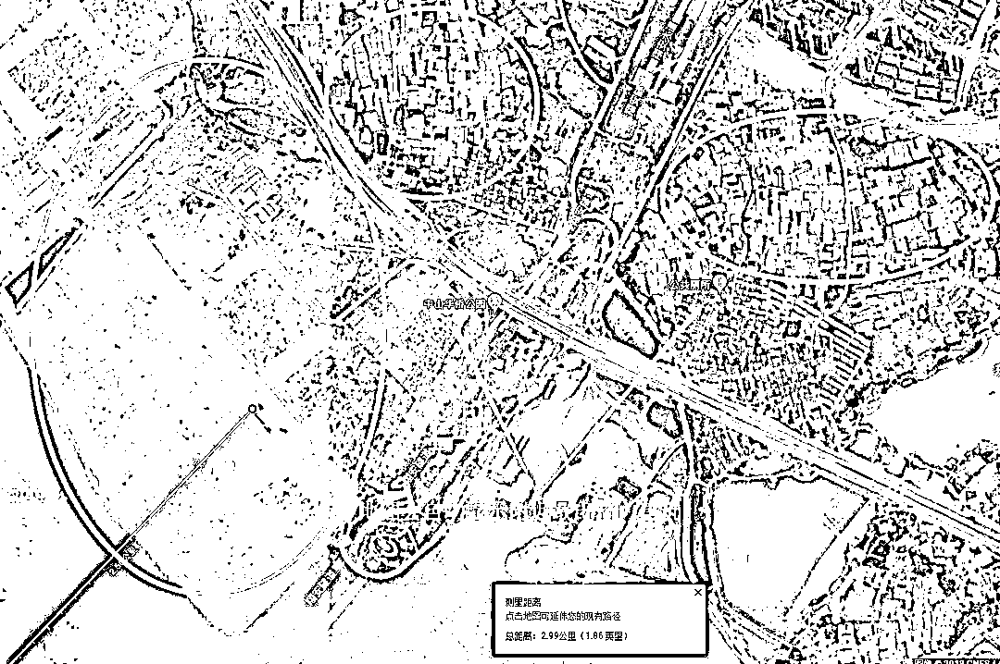
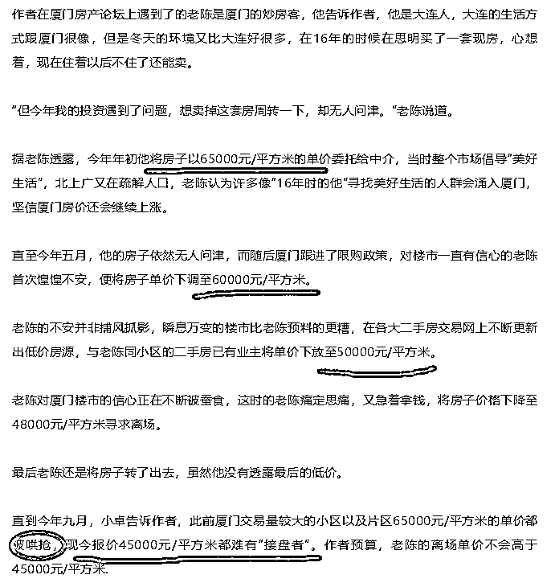
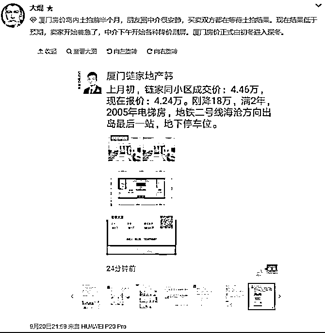
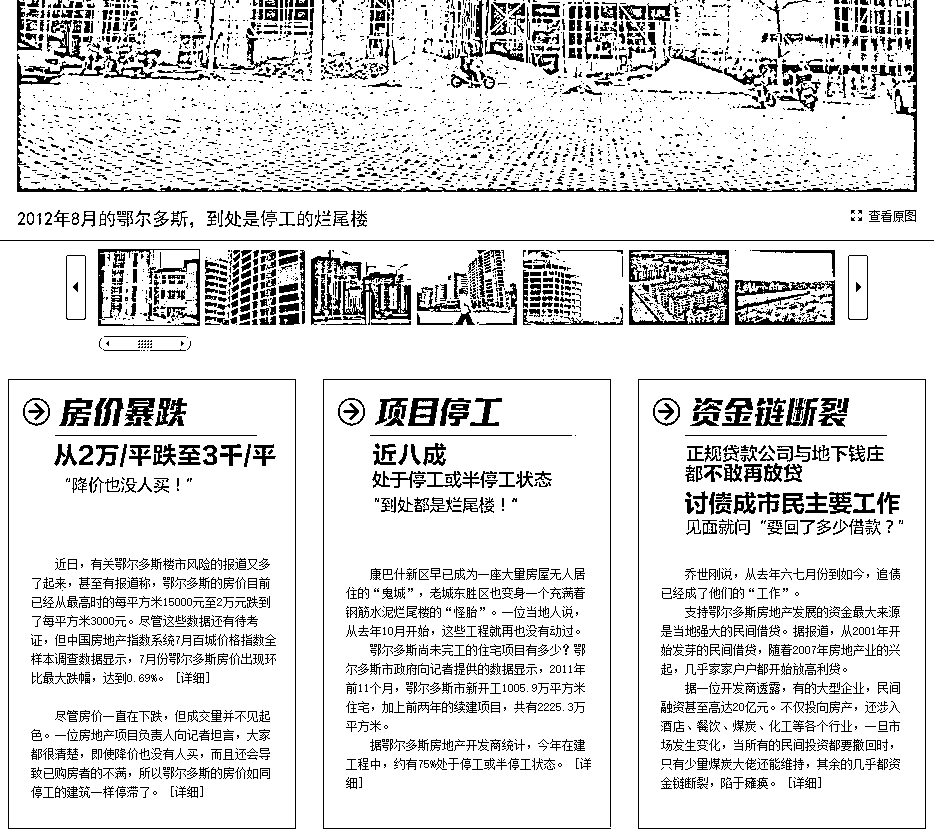
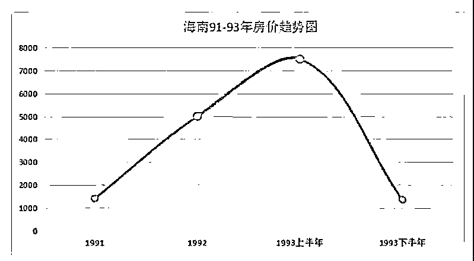

# 地球最大泡沫的厦门房价终于跌了

喜欢我的都关注我了~

8 月开始，关于厦门房价下跌的消息就不绝于耳，但是也有很多反驳的信息，真假难辨。而最近几天，各路数据终于证实了这一消息，地球最大泡沫的厦门房价，终于下跌了。

首先我们谈一谈，为什么说厦门的房价泡沫的地球最大。大家都知道，中国房地产有泡沫，这是根据房价和收入的对比来判定的，但是很不幸中国几乎所有的城市，房价都远远超过普通居民的收入负荷能力。中国的房价并不是全球最高的，但是鉴于中国人的平均收入，完全可以认为中国的房价泡沫是全球最高的。

而厦门，则是中国各大城市里面房价泡沫的佼佼者，出类拔萃并远超过同僚，多个渠道，多个媒体，早在多年前，就不约而同的认定厦门房价泡沫为全国最高。我们来看一看房价和收入比值的偏离数据。 

厦门是全国“楼市杠杆率”最高的城市，厦门是全国房价泡沫最大的城市，各大主流媒体和经济学家都曾表达过类似的观点，厦门岛内的平均房价，曾逼近 6 万元一平。厦门身为三线城市，价格却紧追一线城市，仅仅比上海深圳低一档，这简直可怕。

2017 年 3 月为厦门房价峰值，当时厦门市面在售的房源极为稀少，只有少数大平层，全市无房可售，均价 7 万，二手楼盘最高曾冲到 11 万/平，而岛内整体二手房的均价，则逼近 6 万元。 

那么，厦门的房价为什么这么贵呢，厦门房价的多军有很多理由，其核心理由是厦门岛区域狭小，土地供应不足，但是环境优美，气候宜人，适合整个东南沿海的富豪居住。

但是实际上，这个理由是站不住脚的，厦门岛的确很狭小，但是厦门并不是一个远离大陆的孤岛啊，他和最近的陆地仅仅只有不到 3km 远，但是厦门非常奇葩，岛内全盖满了，房价飙升，岛外全是荒地，房价超低。 

全国都没有这么离谱的现象，厦门的离岸距离并不大，顶多我给他算长江宽度的一倍把，这对于城市内交通来说是没什么过于致命的差别的。唯一能导致房价差距这么大的原因，只能是政府故意把所有的城市资源全部集中在岛内，岛外不进行任何基建投资，导致一片荒凉，所以房价上不去，其目的，就在于炒作地价。 

刚才那个图，很多人可能不知道厦门岛外有多荒凉，我放大卫星图给大家看一看。

放大之后大家可以很清晰的看到，我和你们说这是荒地，那真的是荒地，荒成农村那种，这仅仅是刚下大桥就这么荒凉了，再远一点那更荒凉。地图会自动显示附近最出名的建筑，整个截图这么大的区域，一个是中山华侨公园，一个是公共厕所，我用地图这么多年，这是我第一次看到有厕所在级别上和公园相提并论的，不知道是这个厕所太大，还是所处的村落太小。

所以，厦门土地少，这是伪命题，因为厦门市内有大片的荒地，只不过是政府专门卖岛内的地而已，换成股市术语叫炒概念炒题材。因为说道环境优雅，沿海大宅，旁边大片的荒地可以随便开发，拿出一部分出来，厦门房价就会剧烈下降。

厦门的做法，和中国各地政府捂地惜售爆炒地价其实是如出一辙的，只不过厦门玩的更 6 而已。

多年来，厦门政府一直对外界通过各种渠道释放房价必涨的暗示信息，政府利用各种手段来保房价，导致每次全国调控各地房价都下跌的时候，厦门房价都安然无恙，给各路投资人士一个大大的定心丸，这让厦门房市持续升温，最终成为了全国泡沫冠军。厦门的房价和收入呈严重偏离现象，和房租也出现严重倒挂，厦门岛内既然如此之好，富人修养最爱，为什么房租这么对不起房价。厦门全市的 GDP 没有深圳一个区高，增速在福建省内也并不出彩，但是厦门的房价却直追深圳，真是奇怪。

厦门每次土拍，就挂几幅地出去，制造饥饿营销，而本轮厦门房价的暴涨，就是从地王频出开始的，2016 年 4 月厦门首个地王诞生之后，第二天一睁眼，厦门所有楼盘加价 5000 元，从此正式开启了厦门楼市的疯涨之路，地王单价频频刷新，房价也跟着刷新。

我们都知道，散户是无力引发价格剧烈变动的，散户的买卖行为通常都是互相抵消的，纯散户参与的市场，要么慢慢上涨，要么慢慢阴跌，核心特征就是一个慢。而庄家参与之后，通常是暴涨暴跌，因为庄家手中有足够多的筹码和资金来干涉市场，造成价格剧烈波动。任何一地的房价暴涨，都有大资金和政府联手参与的迹象，而厦门做的更加明显而已。

厦门的房价高峰数值出现在 2017 年 3 月份，从 17 年开始连跌不止，从 6 万多哄抢到 5 万没人要的小区在厦门并不是孤例，下面是一篇报道，我们可以看一看里面的房价数据。 

而今年土拍遇冷之后，厦门房价的下跌开始骤然加速。

这个图里，厦门链家一个中介的信息显示某小区上月初成交价是 4.46 万，而现在的报价是 4.24 万，差价 0.22 万一平米。这个数据看起来好像不起眼，但是这其实是 5%啊，而且只是一个月的时间就降价 5%。另外我们注意到，4.46 万是成交价，而现在这个 4.24 万是报价，从实际经验来说，实际成交价一定是低于 4.24 万的，市场冷暖环境摆在那里。

全国的房价大体都保持平稳，只是不涨了而已，跌也都跌，但是跌幅很微弱，为什么厦门跌这么狠。其核心原因就在于厦门的房价之前炒的太厉害了，政府一心想抬高地价，做的很成功，但是脱离了经济基本面的爆炒必然会回归本源。其实厦门政府真的没捞到太大好处，地价是上去了，看起来很爽，但是你土拍的地数量也少啊，政府其实从地产市场捞的钱是不多的。

这种惜售虽然看起来是为长远做准备，留着慢慢卖，但是中国房地产不可能永远繁荣，即便政府控盘也没用，当租售比达到 70 的时候，要么经济上行租金提高，要么再涨 50%直接崩盘，这个时候不多卖点地，以后就没那么好卖了。

厦门房价泡沫虽高，但是并不是中国历史上最高，历史上温州房价、鄂尔多斯房价、海南房价，都曾出现巨大泡沫以及随着而来的暴跌，而同期全国其他城市的房价波动并没有那么明显。

温州炒房团炒高全国房价，也把自家的房价炒上了天，2010 年，温州最高豪宅报价超过了 10 万元/平米，当时深圳都没有出现过 10 万元的盘子，而厦门，直到 2017 年的巅峰状态，才有个别楼盘超过了 10 万元。当然，2011 年温州房价泡沫破灭，这个楼盘二手房报价跌到了 5 万元一平。而同期，全国其他城市的房价都是横盘微跌而已，温州在这次房价崩盘之后，始终没有恢复元气，再也不敢轻易出手炒房了，一朝被蛇咬十年怕井绳。

当然，温州比鄂尔多斯还是要好一点，鄂尔多斯的泡沫更大，跌的也更惨。温州只是腰斩，而鄂尔多斯可以称之为是腰斩再腰斩，2012 年的鄂尔多斯，到处都是停工的烂尾楼。

当然，要是说起烂尾楼，那肯定首推海南，1991 年海南房价暴涨，从 1000 多涨到了 8000 多，大家月薪几百块的时候，海南的楼王开盘价破万元，制造了中国楼市最大的泡沫，破裂之后海南房地产公司倒闭了 95%，"天涯，海角，烂尾楼"的奇特景观伴随了海南十几年才借助地产大牛市恢复了过来，如果是熊市，可能三五十年都没办法处理这些烂尾楼。 

所以说，政府对房价的控制力有，但是那是有极限的，中央说调控就是怕全国房价崩盘，个别区域哄抬房价玩脱了，那中央是管不了的。

在全国房价大体平稳的基础上，海南、鄂尔多斯、温州等都前后崩盘过，这次环京区域的房价也都腰斩过其实也算崩盘。

所以并不是说，全国房价总体保持横盘微跌，之前不管房价炒多离谱都能维持横盘不跌的，房价永远和经济水平相匹配，如果和你对应差不多经济发展水平的城市房价普遍低于你的城市，那不是他们有病，八成是你的城市有病。 

觉得此文的分析有道理，对你有所帮助，请随手转发。

长按下方图片，识别二维码，即可关注我

近期精彩文章回顾（回复“目录”关键词可查看更多）

华为员工都这么穷，怪不得拼多多能火 | 房价跌 20%就会全面崩盘，地产杠杆远比你想的要脆弱 |  为什么碧桂园的质量那么差 | 清醒点，放弃全面开征房产税的幻想 | 央行和财政部隔空掐架，我支持央妈 |中国土地制度源自香港，但是香港却是劏房密布 | 为什么中介哄抢租赁房源，因为贩毒都没它来钱快