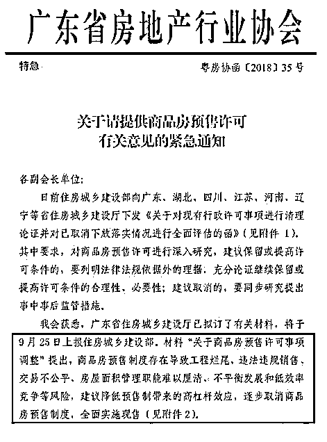
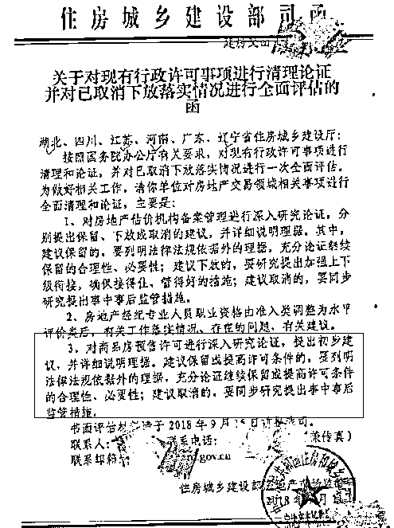
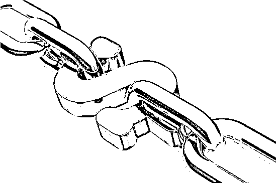

# 预售制度被取消会对房地产市场带来重大连锁反应

喜欢我的都关注我了~

近日，房地产领域一个重磅消息引爆网络，广东省发布通知酝酿取消商品房预售制度！ 

而很多媒体，瞬间挖出了住建部刚发的公函。

我对比了一下广东省的紧急通知和住建部的公函，大概意思就是住建部向各地问一下：“商品房预售制度有风险，能不能取消啊”。广东省回复说：“有风险，干脆直接取消预售制度只卖现房吧”，然后还发了个紧急通知。。。

那么我们今天就来理一下资料，商品房预售制度在历史上是如何产生的，执行的过程中对中国房地产市场产生了什么好处，又带来了哪些风险和隐患。

商品房预售制度的诞生

商品房预售制度起源于香港。1953 年，香港住房不足，但需求庞大，香港著名商人霍英东从中发现商机，提出了期房预售方式。由于中国房地产领域的绝大多数政策都是照搬香港而来，所以商品房预售制度也被一并学来。

中国自己的房地产预售制度建立于 1994 年，当年出台的《城市房地产管理法》确立了预售制度并对预售条件、监管作出了原则性规定。目前主要城市的商品房预售面积占总面积的 80%，个别城市甚至 90%以上，大家向周围的朋友打听一下，有几个人有幸买到现房的，绝大多数都是期房。

房地产预售制度的设定是有客观条件的，房地产是一个典型的资本密集型产业，需要耗费的资金非常庞大，但是 1994 年的时候，中国并没有拿得出手的房地产企业，如果不采用预售制度，则地产商回笼资金的速度太过缓慢，从而会拖慢商品房和城市建设的发展速度。

而当时的政策主基调，是进行住房改革，推进商品房市场快速发展，在这种背景下，执行商品房预售制度是很正常的事情。

商品房预售制度的好处

商品房预售制度执行这么多年，对中国的房地产领域建设起到了非常大的帮助，他最大的作用实际上是在杠杆之上，再加了一层杠杆。

我们都知道，地产商拍下土地之后，会将土地抵押贷款，进行下一步的建设，当刚建一小半的时候，就开始预售回笼资金，然后还会拖一笔建设单位的钱。

开发商的钱都是银行借来的，这一点没错，杠杆率很高，但是同时，开发商还有一层杠杆，那就是把还未完成的商品提前预售给消费者，这其实是杠杆+杠杆。所以这种制度极大的提高了开发商自有资金的利用率，高到什么程度呢，高到民间一致认为开发商是空手套白狼，盖楼不需要用自己的钱，要么是银行的钱，要么就是购房者的钱，所以开发商的实际债务，绝对不止明面债务那么多。

高杠杆带来风险，但是也分时候，因为杠杆是一把双刃剑，在过去的 20 年里，中国的房地产市场在飞速的攀升，声音只有一个，那就是涨涨涨。

在地产大牛市里，预售制度的风险被隐藏了，凸显的全部是他的优点，他的优点是什么呢，他最大的优点就是大幅度的增加了地产商的开发效率，在地产商资金不足的早期，带来了充沛的房源供应。只要有地，哪怕开发商手里没钱，也瞬间就能变成房。

所以，预售制度解决了开发商资金不足的问题，导致中国地产商 20 年来从未被缺钱所困扰，看看那飞速攀升了土拍价格就知道了，开发商只愁没地，从来不愁没钱。商品房预售制度对土地拍卖价格的推升，不亚于货币化棚改。

商品房预售制度的风险

那么商品房预售制度有没有风险呢，当然有，而且还很大，商品房预售的本质是杠杆，而杠杆一定是双刃剑，之所以没有大规模爆发问题，只不过是因为大牛市里杠杆只凸显双刃剑有利的那一面而已。

预售制度最大的问题，是地产商如果恶意利用房产预售制度，会捅出天大的篓子。商品房预售制度是先收钱后交货，开发商拿到了全部的钱，但是并没有完成施工，所以全国各地，都存在开发商拿了预售款跑路的事情，还有更恶劣的开发商，甚至在跑路之前，故意一房二卖，套取更多的资金，然后留下一地鸡毛。

而即便开发商遵纪守法老实做生意，他也存在巨大的问题，这个问题在于预售制度打破了一手交钱一手交货的商业模型，而是提前收钱，延后交货，这就对开发商的良心提出了极大的考验。

一个房子的价格，绝对不单单是地段、规划、模型能够推断出来的，房屋本身的质量，内部隐蔽工程建造等都对房屋的使用功能产生重大的影响，这都会影响房价。

但是在预售制度下，只要开发商把房子卖出去了，就毫无动力把后面的施工搞成精品，凑合凑合能用，购房者无法找出大毛病向法院索赔就可以了，再多一分钱的投入，开发商都不愿意做，那都是利润。

交钱之前是爷爷，交钱之后是孙子，这在中国绝大多数领域都存在，房地产当然也不例外。所以，过去几十年，中国开发商建造出来的房屋质量都很粗糙，完全对不起他们的价格。

若取消预售制度会产生什么影响

 随着 20 年资本积累的，现在的开发商普遍不差钱，更善于利用高杠杆，因为在大牛市里，不敢加杠杆的地产商，会从大鱼变成小鱼，而那些疯狂加杠杆的地产商，会从小鱼变成大鱼，然后吃掉其他的小鱼。

所以现在活下来的地产商，清一色都是喜欢高杠杆的，在大牛市里占尽便宜，但是当房价涨不动之后，就会带来巨大的风险。

如果一家地产商因为杠杆过高，没抗住房价下行的压力而导致资金链断裂的话，那么就会留下一地烂尾楼。你以为房价暴跌后扛着牌子去售楼部要求退房的人很惨嘛？不，那些交了预售款但是碰到烂尾楼的购房者才最惨，连止损都做不到，只能天天祈祷政府想个办法出来堵住这个大窟窿。

但是对于这一家就动辄几十亿，放眼望去全国数百上千家的大窟窿，哪个政府有钱去填，只能指望房价上涨后另外一家开发商来接盘，这对房价上涨的要求，至少也是翻倍，能够覆盖掉之前的成本才行。

所以，在房价下行期间，取消预售制度，是一种典型的防风险行为，和去杠杆的本质如出一辙。对于政府来说，取消预售制度等同于去杠杆，那么对购房者来说这意味着什么呢。

首先，在短期来看，可购买房源会迅速减少，即便是在不缺资金的情况下，预售和不预售，也有一个巨大开发周期的差距，这个周期，一般是 2 年左右。换句话说，如果今天晚上立刻全国执行取消预售制度，那么 2 年之内就不会再有新房源上市了，只有之前取得预售证的人能出手卖房。这么做会带来二个后果，第一个后果是短期房价支撑非常强劲，供不应求导致房价不会下跌，甚至还会略有上升，第二个后果是很多高负债的开发商，原本是按照预售制度做出的还款安排，一旦取消，那么很有可能发生资金链断裂从而倒闭。

然后，就长期来看，在执行现房政策后，开发商对房屋的质量会非常上心，拿到预售款之后就不管不问全凭良心做事的恶习会一扫而空，只有让人震惊的好房子才能卖出好价钱，而不是一个让人震惊的好模型就能卖出好价钱。可以明确预计，如果全面执行现房销售制度，那么造出的房子会是 20 多年来中国最好的房子，他们会极具投资价值，而以前的老房子因为本身质量较差会相应贬值，类似于电梯商品房和老破小的价格区别。

我们是否应该支持取消商品房预售制度

商品房预售制度，把开发商的风险转嫁给消费者，而且带来了低劣的房屋质量，那么我们是否应该支持政府**立刻取消**商品房预售制度呢？未必。

因为事情要分二面看，商品房预售制度的确带来了一系列风险，但是他也的确减少了开发商的资金压力，压低了房屋价格，在大环境不变的情况下，预售房一定比现房便宜，因为占用开发商资金的利息，2 年都不止 20%了。

然后，立刻取消商品房预售制度，会带来房源的严重供不应求，这个道理上面也说过，商品房的建设是需要时间的，哪怕不缺资金他也不可能一夜建成。而供不应求的房源市场会立刻推升房价，带来新的金融不稳定因素。

但是，商品房预售制度的历史使命已经完成，中国的城镇化率已经飞速提升，即便还没有到顶，剩余的空间也有限，犯不着使用预售制度来大幅度提供房源，剩下的日子，让开发商慢慢盖房，盖精品房，才是符合社会利益的行为，过去 20 年盖的垃圾房已经够多了，尤其是最近一二年很多房企使用高周转策略赚钱，预售完了管他洪水滔天，对预售制度提出了严正的警告，所以预售制度是**早晚要全部取消的**，他已经不再适合中国现状。

那么折中一下，最佳的策略，应该是先放风看民意，几个月之后推出，给 1~2 年缓冲时间执行，这才是最稳妥的做法。

之前上面说的取消预售制度对房价是一个短期的刺激行为，其实也分情况，如果搞突然袭击立刻执行，那肯定是一个短期的刺激行为。如果是有预告然后给与缓冲期的话，那反而会是一个短期的房价打压行为，因为大量的开发商会疯了一样开发自己手头的土地，赶在大限之前拿到预售证把房源变现。

所以，不管是从控制房价的角度，还是从降低购房者风险的角度，还是从提升购房者房屋质量的角度，我都**支持取消**房地产预售制度，不过是 1~2 年后**延期执行**的那种。

等取消商品房预售制度后，新出的房源质量一定会远远超过现在的房子，羡慕。 

另外这个新闻其实还有另外一层意思，那就是政府认为预售制度开始存在风险了，变相的说明政府人士认为房价开始处于下行通道，至少是不会再上涨了，加上去杠杆的大环境，双刃剑的另外一面开始凸显，所以才会出现这种政府公函。

而这个通告，其实就是房价指示器，他告诉我们，短期而言，房价风险大于收益，房价至少会横盘或微跌个二三年，然后才能再看新情况。

觉得此文的分析有道理，对你有所帮助，请随手转发。

长按下方图片，识别二维码，即可关注我

近期精彩文章回顾（回复“目录”关键词可查看更多）

华为员工都这么穷，怪不得拼多多能火 | 房价跌 20%就会全面崩盘，地产杠杆远比你想的要脆弱 |  为什么碧桂园的质量那么差 | 清醒点，放弃全面开征房产税的幻想 | 央行和财政部隔空掐架，我支持央妈 |中国土地制度源自香港，但是香港却是劏房密布 | 为什么中介哄抢租赁房源，因为贩毒都没它来钱快