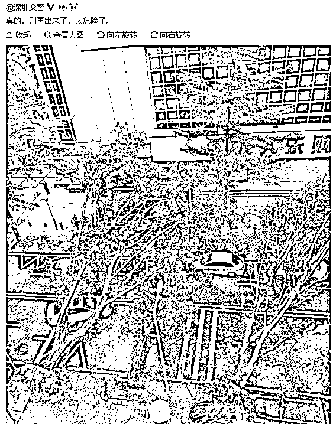
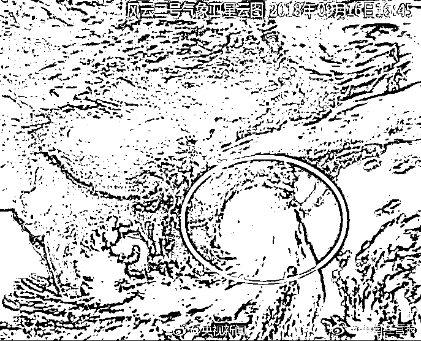
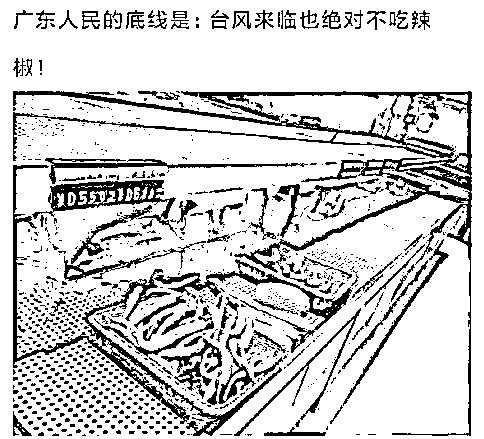

# 明天我的飞机不会被山竹给吹走吧||夜报

喜欢我的都关注我了~

 今天全网都是台风山竹，受到超强台风山竹的影响，广东等地停工、停业、停课、停市、停运，启动红色警戒应急。

很多内陆人无法理解台风的恐怖，大风大浪俺们内陆人也见过，不就是起点风吧，有啥子大不了的，最多把雨伞给吹跑呗，但是实际上，台风登录的时候效果是这样的。 

看完这个视频，你就知道为什么今年警方上街呼吁所有行人回家了，因为这种天气出门真的是会出事的，广东的所有交通全部瘫痪了。 

山竹被称之为今年的台风之王，意思就是今年最强台风，今天 17 时登录广东，登录时中心最大风力为 14 级，超过很多建筑的最大设计抗风能力 12 级，所以视频中出现了部分高楼晃动的镜像。

 台风登陆的短短时间内，部分地区降水量甚至将达到 1204 毫米，气象北京向公众介绍说，这一会下的雨，大概相当于北京 2 年的降水量。。。

而通过这件事，也测出了广东人的口味，台风来临之前，广东市民哄抢超市物资，囤点食品在家里看电视上网吃美食，整个超市食物被哄抢一空，唯独辣椒无人问津。 

当年谁说广东人天上地下无所不吃的，据说连福建人都敢吃，这真的是谣言，今天台风一来测出真金了，有本事你天天吃四川火锅呀。

今天下午，武汉也开始起狂风了，远隔千里气象都受到了影响，真的很厉害，我明天早上 10 点的飞机，不知道会不会在空中直接被吹跑。。。

不过幸好我的飞机是向北飞的，要是向南飞，真的不敢动了，那是在玩命啊。

今天趁这个机会给大家讲一下我对飞机的看法，飞机很薄，远远比普通人大脑中认为的飞机厚度要轻薄很多。很多人没坐过飞机前，大概认为飞机和火车的厚实度是差不多的，只不过能飞而已。但是你坐过飞机就知道，飞机天然又薄又轻，而且这是设计所追求的目标，并非缺陷。

飞机的学名并不叫飞机，而叫飞行器，你在航空安全条例中到处可以见到飞行器这个词，相对于飞机，这个词更完美的体现出了它的本质，那就真的是飞行器。

什么叫飞行器，就是这个器的唯一目的就是飞行，所有的一切围绕着最大效率的飞行来运作，做那么厚实干嘛。。。所以坐飞机的时候经常感觉飞机在震颤，来阵风飞机都震三震，就是这个道理，航用飞机设计的理念就是在尽量满足安全标准的条件下，尽可能的轻薄来省油，使飞行变得经济有效率。

所以坐飞机挺吓人的，尤其是那种小飞机，更感觉没有安全感，虽然只是心理因素。其实我平时，出行 4 小时以内的距离，我基本都是选择高铁，超过 4 小时的选择飞机，我仔细的计算过候机时间等因素，高铁 4 小时能到的范围内，飞机一点优势都没有，我这次是跑太远了才选择飞机的。

不过好消息是，台风来得快去的也快，一旦登陆，能量衰减的很快，所以我被台风吹飞这种事情，是不会发生滴。

~~~~

对了还有一件事要插一句，最近苹果发新机了（XS/XR/XSMax）三大版本。很多人又在热议买不买，苹果的三大新款手机我都不建议买。

为什么呢，首先摆明个态度，我不是果黑，实际上我是果粉，当然并不是宗教信仰果，而是思维正常的果粉，我买过很多部苹果手机，果 X 一出炉我就给老婆买了（她升级了我才能升级旧手机。。。）

但是果 X 手机，真的是苹果系列里面性价比最差的一款手机，注意我说的是性价比，而不是性能，他增加的那一点性能真的对不住它的价格。

这里我不摆出什么参数作为证据，仅仅只写一个普通消费者的感受，尤其是那个取消主按钮的设计，真的是反人类。。。

因为买果 X 感觉被坑了，而以前买 6S 等后缀也感觉被小坑，所以条件反射的排斥果 X 后面带一切后缀的产品。

换句话说，XS 和 XR 和 XRMAX，我连试都不想试，虽然里面搭载了我很看中的 A12 芯片，但是我就是讨厌苹果一切带后缀的产品，果 9 再说吧。

~~~~

今天大概就这么多，明天 7 点就要起床，8 点之前必须出门赶飞机，否则大家就不用担心我的飞机被台风吹走了，因为我连上都没上去。

机场过远，安检时间过长，准点率太差，导致浪费的时间过多，这是他相对于高铁而言最大的劣势。

今天我要早点睡了，大家晚安哈。

觉得此文的分析有道理，对你有所帮助，请随手转发。

长按下方图片，识别二维码，即可关注我

近期精彩文章回顾（回复“目录”关键词可查看更多）

华为员工都这么穷，怪不得拼多多能火 | 房价跌 20%就会全面崩盘，地产杠杆远比你想的要脆弱 |  为什么碧桂园的质量那么差 | 清醒点，放弃全面开征房产税的幻想 | 央行和财政部隔空掐架，我支持央妈 |中国土地制度源自香港，但是香港却是劏房密布 | 为什么中介哄抢租赁房源，因为贩毒都没它来钱快