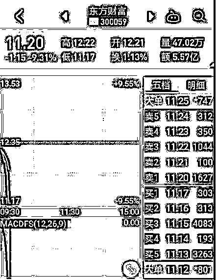
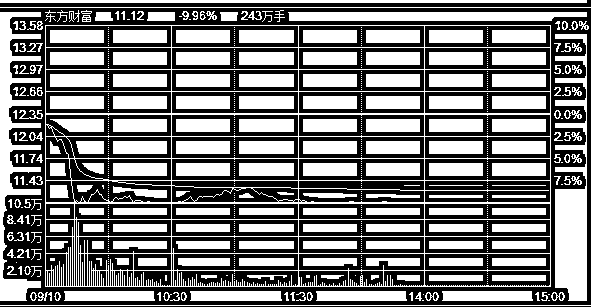
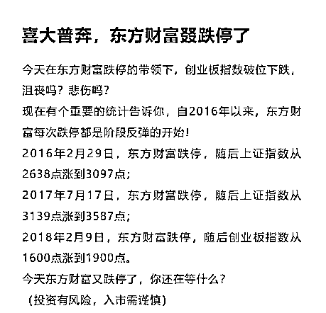

# 夜报|东方财富闪崩跌停了！

 今天早上一开盘，创业板大蓝筹东方财富直线跳水逼近跌停，当时的图形是这样的。 

灰常牛逼的走势，不计代价的下杀出货，最终封死跌停。 

这种开局走势，根本不是正常的交易，和之前的庄股崩盘极度类似，都是闪崩，大量筹码不计代价的卖出。这肯定是有大量强平单涌出来了，反正有保证金，以最快速度出货为原则，不计代价下砸。

东方财富肯定不是庄股，这么大的盘子没人控的住，还是一个大蓝筹，但是东财里面的融资盘却是非常的多，出现这种走势只有一种解释，里面有某个大机构被强平了，或者有大量的散户被连锁强平。

现在东财的跌停板上封死 17 万手，价值 1.87 亿元，而今天东财的总成交为 27.39 亿元，这个数据表明，东财今天封死跌停之后，明天必然不会连续跌停，这和以前的庄股盘中闪崩之后会连吃六七个跌停是不一样的。东财明天的走势，极有可能是一个低开就完事了，甚至有可能反弹来弥补今天强平盘打出的部分空间。

而今天东财的跌停导致市场一片恐慌，科技股大跌，大盘也大跌，直接被打出了一根中阴线。而盘后，就立刻有好事者统计了除股灾期间千股跌停之外，历次普通行情下东财跌停后的走势。 

当然，这只是个好事者统计的数据，历史可以参考，但是未必一定有效。而实际上，周一大跌还有一个最主要的因素，就是毛衣站 2000 亿还没着落，特没谱又威胁来一个 2600 亿的事儿，这是一把梭哈的节奏，加上东财自己砸跌停诱导了一下，市场就全面恐慌了。

而实际上，2700 之下都是空头陷阱，下跌已经很久很久了，8 个月了吧，一次像样的反弹都没有，可以说是单边下跌，这个时间跨度足够久了，可以说随时可能都有一波大反弹，只是不知道啥时候爆发而已，跌不可能无止尽的跌，涨也不可能无止尽的涨，这个道理其实非常明显，只不过实在是没办法，熬不住了而已，这个真的很难熬。

而通常，在漫长下跌的末端，都会有一次诛心的最后大跌，我觉得这一次就算不是，也比较接近了，毕竟连风平浪静的时候，东财居然都能被盘中闪崩给砸跌停。。。