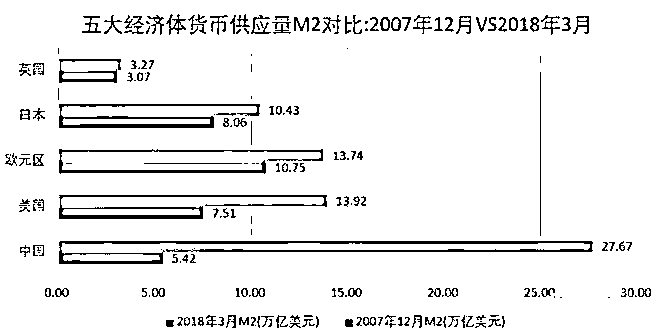

# 当一个国家穷的只剩钱的时候，它的人民一定不幸福

喜欢我的都关注我了~

 委内瑞拉是一个最近很火的国家，其货币贬值的速度旷古绝今，一年贬值一万倍那不是传说，而是现实，委内瑞拉的孩子们，从小就**不缺钞票**， 大家不是从小就梦想躺在钞票堆上面嘛，下面这个就是了。

我们可以看到，委内瑞拉穷的就只剩钱了，整个国家没有物资，全是钱，一斤钞票也换不来一斤大米。当一个人穷的只剩下钱的时候，他是很幸福的，但是如果**一个国家穷的只剩下钱了**，它的人民一定是不幸福的。

为什么委内瑞拉通胀率这么吓人

委内瑞拉不知道通胀率如此吓人会有损于经济吗？他知道，那为什么他死活不愿意改呢，因为他没办法改了，他被货币给绑架了。

委内瑞拉前总统**查韦斯**掌权时，认为资本家没一个好人，所以大力推行国有化运动，把所有重要和赚钱的领域全部改为国有，然后再把经济果实分配给底层人民。 

查韦斯的国有化，是彻彻底底的国有化，上到能源交通电力，下到超市和面包房，都属于被国有化的范围，这套国有化方案大受底层群众的欢迎，而私企和外资只能逃出国门流亡海外。当国有化完成之后，查韦斯兑现诺言，开始给穷人**发钱、发面包、发房子、发土地**。

所有的基层民众都拥戴查韦斯，查韦斯的支持率变得异常可怕，每一次都能轻松连任，看起来委内瑞拉的经济模式简直是完美无瑕。

但是实际上，查韦斯没办法杜绝官员的腐败，也没办法提升国企的效率，所以委内瑞拉的整体经济成果远远低于国有化之前。但是委内瑞拉是一个资源大国，当石油价格高高在上的时候，查韦斯可以通过出售石油获取外汇来购买所需的各种物资填补经济缺口，所以日子还过得下去，民众得到了他们想要的幸福生活，而查韦斯得到了他想要的支持率。

但是当石油价格下行的时候，委内瑞拉的经济就崩溃了，没有石油的巨额盈利，查韦斯没办法填补巨大的经济缺口，但是他不可能收回对民众的福利，由俭入奢易，由奢入俭难，如果查韦斯敢降低福利，他会马上被民众掀翻。

所以查韦斯只有一个选择，那就是偷偷印钞票来弥补缺口，查韦斯的想法很简单，先饮鸩止渴，拖时间，拖到石油价格上涨的时候，国家经济就会恢复平衡。

但是好日子始终没有等来，由于国家经济始终存在缺口，所以委内瑞拉的货币玻利瓦尔始终在逐渐贬值。鉴于委内瑞拉的形势，查韦斯一直到死，都没敢削减民众福利及取消国有化来恢复经济。2007 年，查韦斯推出“强势玻利瓦尔”，用 1 比 1000 的比例，兑换原货币“玻利瓦尔”。

2013 年，查韦斯身患绝症撒手人寰，临走之前他把自己的关门弟子马杜罗扶上了总统宝座，马杜罗和查韦斯同出一脉，天然继承了查韦斯的政治遗产，也继承了查韦斯的历史包袱。 

马杜罗并非没有意识到委内瑞拉的经济炸弹，但是他比查韦斯更不敢取消国有化、降低民众福利，如果他敢于那样做，愤怒的穷人会立刻把他掀翻，因为现在的委内瑞拉，什么都缺，就是不缺穷人。 

所以马杜罗更加依赖的通过印刷货币来续命，哪怕知道这样是死路一条，也是多活一年也是一年，总比现在立刻死了便宜别人好。

8 月 20 号马杜罗宣布发型全新货币“主权玻利瓦尔”来替代 10 年前查韦斯发行的“强势玻利瓦尔”，多少比例呢，1 比 1 万。。。

但是不管这个货币怎么发，它始终是和全国的商品总量对应起来的，饮鸩止渴是可以的，但是它不可能永久的饮鸩止渴，一旦累积到了某个临界点，民众对货币的信心完全丧失，那结果就只能是经济全面失控，货币成为废纸一张。

我国也出现了通货膨胀的苗头 

 这一波货币放水以来，我国新增的货币量远远超过 GDP 的增长量，委内瑞拉有他不得不印钞的理由，我国也有自己不得不印钞的理由。

在不断的货币供应之下，我国出现了严重的脱实向虚，金融和实体出现了巨大的不匹配。原因也很简单，实体行业拿到钱之后，投到哪里，其收益都不如投到金融行业收益高。于是很多钱进入实体行业后，转手就被拿去买银行理财，然后就沉淀在金融系统里空转，大家都维持一个表面的高收益率，而没有任何实体商品产出，一直玩到最后轰然倒塌。 

为了不让金融系统垮台，我们需要源源不断的印刷出更多的钞票，只要有新的货币供应，银行的空转就能继续玩下去，收益可以用新货币来支付。但是只要空转停止，整个体系就会轰然倒塌，然后我们就会发现，我们手里拿着一堆钞票，但是这些收益并没有变成实体商品，我们变成了第二个委内瑞拉。

如果只依赖印钱可以解决问题的话，委内瑞拉应该是世界上最幸福的国家，在委内瑞拉成为亿万富翁简直太简单了，但是没有任何意义，因为一杯咖啡都能卖 3000 万元。 

在成为制造业大国之前，我们先成了金融大国，银行业的收入冠绝全球。委内瑞拉穷的只剩钱了，所以人民生活在水深火热之中，但是如果我国富的只剩金融业了，我想我们的命运也不会比委内瑞拉强多少。

实体制造业，才是国之根基，没有实体做支撑，货币就只是一张纸而已。所以，货币放水可以停一停了，要适可而止啊。

觉得此文的分析有道理，对你有所帮助，请随手转发。

长按下方图片，识别二维码，即可关注我

近期精彩文章回顾（回复“目录”关键词可查看更多）

华为员工都这么穷，怪不得拼多多能火 | 房价跌 20%就会全面崩盘，地产杠杆远比你想的要脆弱 |  为什么碧桂园的质量那么差 | 清醒点，放弃全面开征房产税的幻想 | 央行和财政部隔空掐架，我支持央妈 |中国土地制度源自香港，但是香港却是劏房密布 | 为什么中介哄抢租赁房源，因为贩毒都没它来钱快