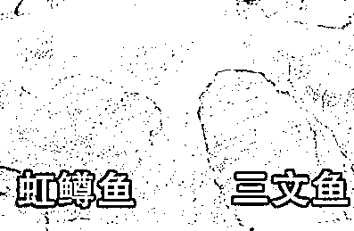
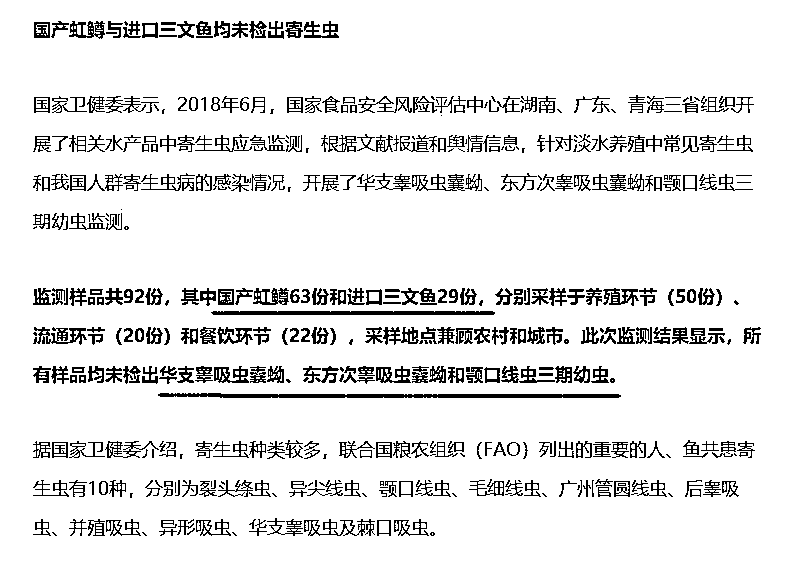

# 生吃三文鱼，千万小心寄生虫

喜欢我的都关注我了~

三文鱼刺身在我国很流行，这款食物口感非常嫩滑，而且很小资，也是西方发达国家流行的一种吃法，所以哪怕这玩意蘸芥末巨难吃，销量依然不错，很多宴席上都有上这道菜，不少人捏着鼻子吃进去后装作很懂行的赞美道：嗯，味道真的不错。

一开始，中国的三文鱼全是进口的，都是北欧那边运过来的大西洋鲑，是一种深海鱼类，但是随着近来很多中国人的“创新”，不少国产淡水虹鳟也开始冒充三文鱼在市面上出售，为什么他们能冒充三文鱼呢，因为虽然二种鱼外观上长的完全不一样，但是偏偏鱼肉的颜色和花纹非常相似，只吃鱼肉的消费者很难分辨出来。

国人的创新山寨精神在这里展现的淋漓尽致，由于国产虹鳟鱼远远比进口三文鱼便宜，所以自从有人发现国产虹鳟鱼的鱼肉能以假乱真之后，国产虹鳟鱼就再也不叫虹鳟鱼了，而是改口叫国产三文鱼，面对消费者的时候连国产二个字都省了，直接叫三文鱼。由于国产虹鳟价格便宜一半都不止，所以迅速的占据了大量的市场。

看到这里大家可能会想，国产三文鱼就国产三文鱼呗，我又不崇媚洋外，反正鱼肉长的都一样，拿出去也很气派，至于味道，蘸了芥末这玩意一样的难吃，有什么区别呢。

有，而且区别大了去了，所谓的三文鱼刺身，其实就是生吃三文鱼，鱼肉未经任何加热直接食用。生吃国产虹鳟鱼有极大的寄生虫风险，而生吃真正的三文鱼则没有。

当国产虹鳟鱼席卷中国三文鱼市场的时候，引来很多专家的攻击和质疑，虹鳟鱼行业利益者为了给自己洗地连质监局都请出来了，我们看看下面这个新闻。

看完这个新闻简直想笑，这里只取了几十份样品检测，而且只检测三种寄生虫，因为几十份样品中没有检出这三种寄生虫，就得出所有的国产虹鳟鱼和进口三文鱼均不含寄生虫，所以是安全的结论，简直是荒谬。

实际上，任何海鲜、任何动物，体内都有寄生虫，别说区区虹鳟和三文鱼了，就算精细喂养、一有头疼脑热就有医生诊疗的人类，大街上随便找一个人抓出来，你敢拍胸脯说他体内一定不含寄生虫？

连人类都不敢说体内 100%不含寄生虫，你凭什么敢说虹鳟和三文鱼不含寄生虫？实际上，国产虹鳟鱼和进口三文鱼，体内都有寄生虫，这是绝对不可避免的。

看到这里你可能奇怪了，你反对国产虹鳟鱼冒充三文鱼，说他有寄生虫我信，怎么说所有的海鲜都有寄生虫，既然进口三文鱼体内也有寄生虫，那些生吃三文鱼的欧美人难道不怕死吗？

实际上，任何海鲜体内都含有寄生虫，只有加热才能彻底灭杀所有寄生虫，急速冷冻这个方案，只能灭杀大部分寄生虫，依然会有少量残存。

那为什么大家敢生吃三文鱼呢，因为所有的海鲜，都是海水环境，天生就和淡水鱼不一样，其体内寄生虫生最喜欢的繁殖环境，人类体内无法提供，所以很多沿海居民都有生吃海鲜的习惯，而很多内陆居民，打死也不敢生吃河鱼。

但是单纯的海鲜，依然不够安全，生吃依然具备一定的风险，首先是沿海的浅水海鲜，和人类生活的较近，有些细菌和病毒是可以共存的，很多寄生虫在浅水海鲜体内可以长，在人类体内只是很难长而已，但是并不是完全不能长。

在日本超市，供制成刺身生吃的鱼肉，与供完全加热后食用的鱼肉，基本根本就不会放在一个柜台。鱼类海鲜等产品的包装和柜台都会注明，供生食还是请完全加热后食用。在需加热的鱼类柜台，甚至会有提示：鱼类可能含有寄生虫，但是只要您完全加热了再食用就不会有问题。

那么什么样的鱼肉才能做成刺身生吃呢，是不是检疫特别严格，养殖特别安全的鱼肉呢？不是的，再严格的检疫也不能 100%的排除寄生虫和细菌的风险，要保证彻底安全，只有一种途径，那就是这个鱼肉，来自于深海。

如果说海水鱼还有一定的概率传染人类的话，那么深海鱼类就几乎不会有任何可能，因为深海鱼体内的环境和人体内的环境差距实在是太远了，深海鱼类适应的海水压强，和浅水鱼天壤之别，和人类更是不同。

我们都知道，潜水员深入海底的时候，是不能迅速浮出水面的，如果快速上浮，由于压强改变剧烈，血液及组织中的氮气会形成气泡，这些气泡会因人体内部压强过大而爆裂而导致死亡。。

深海鱼类也是一样，常年生活在深海的鱼类，体内所有细胞已经适应深海压强，如果被人类捕捉，带到水面之上的时候，由于水压的迅速减少，内部细胞几乎全部损害，看起来表面丝毫无损，其实内部已经五脏破裂而死了。故，你不可能在市面上买到活的真正的深海鱼来吃，都是死的，你想吃活海鲜，必须买浅水海鱼，至少也要是浅水深海两头跑的鱼，常年深海生活的鱼，渔民捞出水就死了，再怎么小心都救不了他的命。

所以深海鱼类捕捞船，鱼捞上来的一瞬间直接就塞船上的冰库了，渔民根本就不考虑能不能把它活着带到岸上，因为那是不可能做到的。相反，其他的浅水海鲜，渔民就尽量把它们活着带到岸上，因为售价会贵上几倍甚至十倍。同理，这些深海鱼捞出水之后受不了剧烈变动的压强，它们体内的寄生虫一样受不了，直接就破裂而死了，就算有个别虫卵残存在体内抵抗了剧烈改变的压强勉强不死，转移到人类体内的时候，也根本没有孵化的机会，因为环境严重不合适。

所以说，深海鱼做刺身，是可以生吃的，其他的鱼类，不管检疫再严格，都没人敢生吃。而大西洋鲑，正是深海鱼的一种，深海生长，捕捞出水的一瞬间就死了。但是国产虹鳟鱼是典型的淡水鱼，体内寄生虫的生长环境和鲫鱼并无区别，这根本不是严格饲养环境和严格检疫可以避免的，我生吃他还不如生吃普通浅水海鲜，那个不需要检疫中招概率都低很多。

哦对了，还有一个误区要和大家说一下，就是芥末可以消毒杀菌，这是一个典型的以讹传讹，很多人把生鱼片蘸 3 秒芥末就以为里面的病菌寄生虫死光了，然后就可以大胆的生吃了，简直是无知者无畏，就 3 秒时间，你蘸浓硫酸也不敢说能给彻底杀菌了，能把表面一层灭了就不错了，里面的就别想了，除非彻底加热。所以蘸芥末唯一的作用就是尝尝芥末味道，如果你不喜欢，建议直接生吃，靠他杀菌就别指望了。

国产虹鳟和大西洋鲑的三文鱼称号之争，根本不是王老吉和加多宝之争，我认为就是康帅傅和康师傅之争，国产虹鳟鱼，蹭大西洋鲑热度，放弃虹鳟鱼的名称，对外强调自己是三文鱼，这是严重的欺骗消费者，既然虹鳟鱼这么好，你就和以前一样还叫虹鳟鱼不行吗？为什么非说自己是三文鱼，现在弄的真正的三文鱼都不好意思叫自己三文鱼了，怕掉价，都自称大西洋鲑。

喜欢吃三文鱼的小伙伴们，请仔细阅读此文，下次消费之前请千万问清楚鱼肉是产自深海，还是淡水。没有任何人能保证任何肉类不含寄生虫，唯一靠谱的就是因为环境的剧烈改变内部虫类 100%死亡的肉类，这样的肉类才敢说自己是 100%可生吃。

当产自深海的三文鱼都自称大西洋鲑之后，你还在国内生吃三文鱼只有一个结果，那就是随时可能感染寄生虫。

觉得此文的分析有道理，对你有所帮助，请随手转发。

长按下方图片，识别二维码，即可关注我

近期精彩文章回顾（回复“目录”关键词可查看更多）

华为员工都这么穷，怪不得拼多多能火 | 房价跌 20%就会全面崩盘，地产杠杆远比你想的要脆弱 |  为什么碧桂园的质量那么差 | 清醒点，放弃全面开征房产税的幻想 | 央行和财政部隔空掐架，我支持央妈 |中国土地制度源自香港，但是香港却是劏房密布 | 为什么中介哄抢租赁房源，因为贩毒都没它来钱快