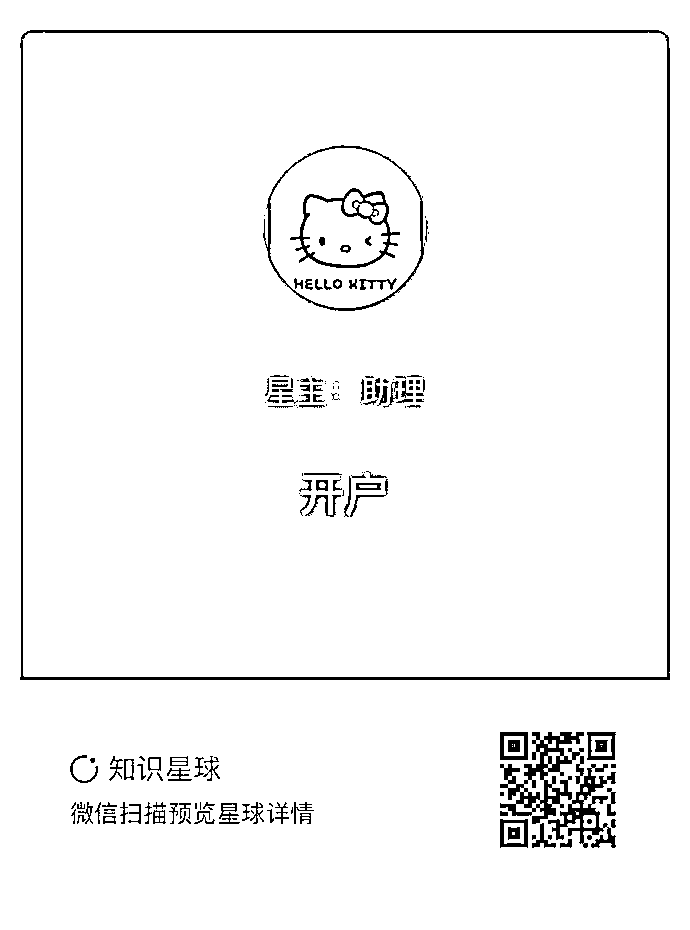
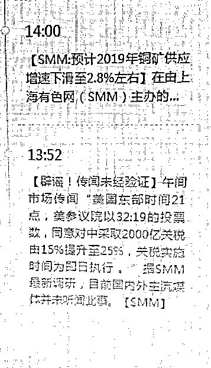
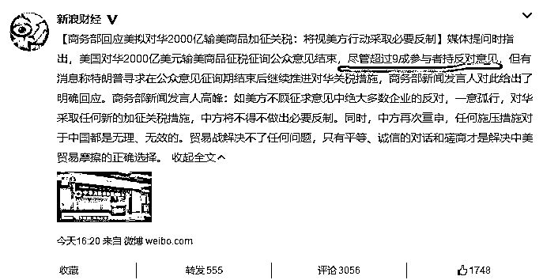
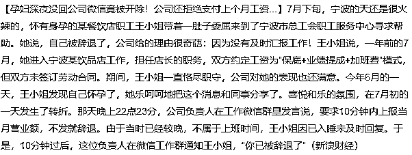

# 夜报| 今天送粉丝福利，万 1.5 开户

今天给大家推一个福利，万 1.5 开户，堪称全市场最低价，很多人问这个 1.5 是真的还是假的，因为很多人打着 1.5 的旗号，在你开好户之后过个一年，就偷偷的改到万 2.5 甚至更高，否则他们赚不到钱，万 1.5 只是拉客的手段而已。

但是我这里和券商谈好了，必须永远保持万 1.5，说多少就得是多少，如果被我发现偷偷把佣金调高了，我会立刻通知所有人离开，而实际上，如果有人调高，这么多人用，肯定有人立刻发现通知我，而我会立刻发现，券商不会，也不敢做这种杀鸡取卵的事情，毕竟蚊子腿再小也是肉，总比没有好。

所以大家可以放心，这个万 1.5 不是闹眼子的，是真的 1.5，绝不会偷偷改高，这是有信用保障的，所以是粉丝福利。

而实际上，很多人一年交的佣金高达几千块，这可不是一笔小钱。扫下方二维码加开户星球，万 1.5 开户可以在 7*24 小时都可以，全程约 3 分钟即可搞定。扫描下方二维码查看。

~~~~~~

今天市场流传一则 2000 亿的谣言，说美国已经通过法案，对中国 2000 亿商品征收 25%的关税，而且是立即执行，吓坏了市场，但是回过神来，可以看出这明显是一个谣言，最大的漏洞，就是这里面写的，立刻执行，各大媒体也立刻给予了辟谣。

甚至商务部也出来澄清这个谣言，不过是侧面辟谣，因为今天商务部的声明中暗指美国 2000 亿美金投票中，9 成参与者是反对的，而不是今天的谣言里声称的 32 比 19.

所以可以断定，今天早上的为谣言，目前已经在互联网上找不到了，被删的一干二净，但是今天上午出现了病毒式传播，并吓坏了市场。

关于 2000 亿这个事，我简单说一下，这事已经酝酿的差不多了，如果最后不执行 2000 亿那肯定是利好直接拉起，如果落地了，那也是利空出尽，股价暂时下跌一截后，后面就没啥利空可担心了，所以不必过于担忧，市场总是会提前反应出来。

大盘如今反复在 2700 盘旋，看今天走势，明天还要下探一下，但是 2700 之下都属于空头陷阱，即便下去，没有几天也会拉起，这里软绵绵的不反弹已经一二个月了，始终趴在那不动，不涨也不跌，这是典型的反弹不是底，是底不反弹，发动牛市是不可能的，发动中期波段给市场来一波续命行情还是会有的。

~~~

今天我还看到一个新闻，一个餐饮店的店长小王，怀孕之后兴奋的发了一个朋友圈，被领导看到了，当天晚上 22 点 23 分，公司负责人在工作微信群里发言说，要求 10 分钟内上报当月营业额，不发就辞退。由于第二天要早起上班，王小姐睡着了没看到，10 分钟之后，领导在微信群里通知王小姐，你已经被辞退了。

怎么说呢，这典型的是公司惧怕王小姐的带薪产假，以及生产期间带来的店铺管理波动，索性提前随便找个理由穿小鞋辞退。

这就是我前几天发文章说的，女性承担了太多生育的责任，生育会付出巨大的代价，但是社会不认可，企业不认可，家庭不认可，法律还强行要求企业补贴，最终会导致一系列光怪陆离的事情，例如今天这个新闻这样。