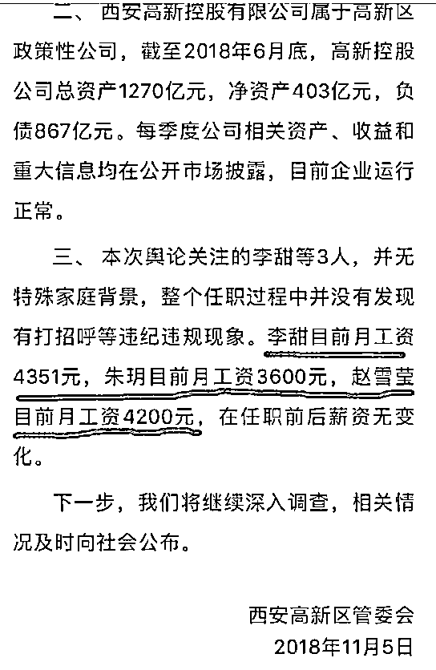
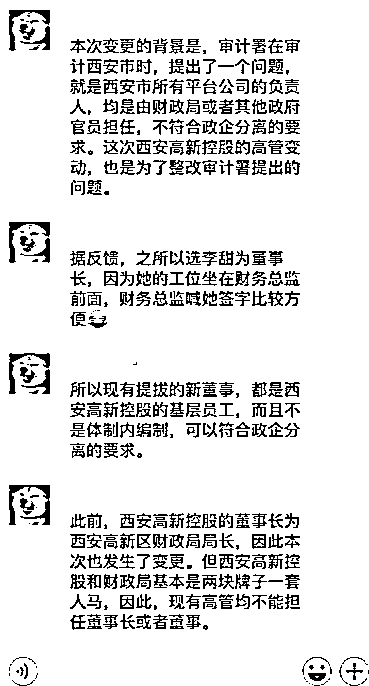

# 只要换个工位，你就能当董事长

喜欢我的都关注我了~

西安有一家国企，资产达到 1270 亿，这么庞大的公司，成为它的董事长和总经理，或者成为它的董事，进入董事会是不是一件特别风光的事？

肯定风光啊，没看过电视剧嘛，里面的董事会都是资本暗战，刀光血影，能进董事会的，一定是上流社会的精英。不过现在有一条捷径可以成为这样的人上人，那就是换一个工位，搬到财务总监对面去坐就可以一步登天了。

80 后的董事长和 90 后的董事

西安这家庞大的国企，名叫西安高新，他最近发布了一则公告，说经过全体股东表决，选举李甜为董事长+法人，赵雪莹、朱玥为董事，同时李甜兼任总经理。

媒体深挖之后发现，李甜只是一位 80 后（84 年），而其余二位新晋董事只是 90 后（93 年和 95 年）而已，这里面有什么不可告人的秘密吗？李甜是某位官二代下来镀金的吗？怎么能升到如此高位，还是说西安高新一下子发掘了三位天才。

结果舆论发酵之后，今天西安高新出来解释，说这三位董事不是什么官二代，只是普通员工，为了证明他们身份普通，没有打招呼等腐败现象，还细心的贴出了她们的工资。

这个工资真的不高，尤其是她们还都是至少本科毕业出来的，对得起这份工资，那既然没有徇私舞弊现象，为什么会选举她们为董事、董事长呢？

那是因为目前中国现行制度有巨大漏洞，这次事件至少涉及到地方融资平台使用壳公司、法人只是签字机器、以及董事会形同虚设等三个问题。

地方融资平台

首先，这次的主角西安高新，是一个典型的地方性融资平台，它压根就是一个壳公司，这样的公司在中国多如牛毛，一点都不罕见。

什么叫地方融资平台，那是因为按照中国现行的规定，政府这个主体，只能发行政府债券，没有资格使用多项企业融资工具，地方政府为了获得大量资金来进行基建，就自己注册一家公司，表面上是公司，实际上就是地方政府自己。

有了公司之后，地方政府就可以绕开政府监管，直接以公司的名义发行企业债，这个审批就松多了，还能直接贷款，使用杠杆成立产业基金等等，各种五花八门的融资手段都能用上，操作起来比以前简单太多了。

所以，中华大地上，作为地方政府融资平台的壳公司遍地开花，为什么说地方债规模很难统计，那是因为这些债务都不是地方政府发行的，都是这些壳公司发行的，但是实际上他们都是地方债。

但是当中央统计的时候，从账面上看，这些公司和地方政府一毛钱关系都没有，你查实到这家公司了，会立刻爽快的承认，如果你没有查实到这家公司，那这家公司的债务就和政府没关系。没有地方会积极主动上报这些债务资料的，你让中央怎么汇总这些债务信息，中国那么大，神仙也无法统计啊。

因为这种地方融资平台壳公司的官方身份，它们的实际控制人通常都是政府官员，例如这个西安高新公司，实际控制人是西安高新区管委会财政局的局长，这家公司实际上就是西安高新区管委会财政局直属的公司，而如果再进一步说，实际控制人其实是当地政府。

在各种地方融资平台上面，类似的操作非常普遍，所以对于这样的公司来说，谁当名义控制人压根无所谓，就算表面的实际控制人财政局长，那也是代持代管这些财产而已，你敢挪用这些资产试试，立马就会把你送进大牢。

法人压根没啥用

这件事引发如此巨大的波澜，其实还和公众的第二个误区有关，那就是对于法人的理解出了问题。

在公众的眼里，法人是什么？那是法定代表人啊，这家公司在法律上的唯一代表人，法人一定是这家公司的老大，整家公司肯定是听法人的啊。

其实你们错了，法人压根没啥用，法人不一定是公司实际控制人，甚至不一定是公司的股东，法人唯一的作用，就是在工商局办理某某手续，法人到场签字，税务局办理某某手续的时候，法人到场签字，需要法人亲自出面办理的行政场合是非常多的。

这就导致一个结果，很多公司的法人，都是公司推出来的一个财务部或者人事部的小姑娘，这个“法人”唯一的作用就是帮老板跑腿去办理各种手续，这种行为和风气蔓延所有公司，国企民企全部不能免俗，只有特别大型的央企，因为法人有特殊意义，会和官位挂钩，可能还算名副其实。

这种现象是如此的普遍，以至于当公司出现问题的时候，办案人员压根不会去找法人，都是直奔实际控制人去的，法人就是个傀儡而已。

大家看新闻的时候，通常都会发现报道是这么写的，某上市公司的大股东和实际控制人打起来了，双方发生剧烈冲突。

看见没，实际控制人和大股东，压根没有提法人一句话，法人就是个签字机器。

董事会也没啥用

在港台电影里，董事会是刀光剑影的地方，里面的董事争权夺利、合纵连横，精彩程度堪比宫斗。

但是在大陆，董事会就是个摆设，按我国现行法律规定，股份制公司都需要设立董事会，但是实际上，除了上市公司的董事会还有点用，其他类型公司的董事会形同虚设，董事长的话，和法人的话差不多，都是废话。

离谱吗？不离谱，除非上市公司的股份因具备流通价值所以大家都很慎重，普通公司的股份，和玩具是差不多的，别说董事长没啥用，大股东都没啥用，因为股份是可以代持的，代持股份是一种非常流行的行为，普遍到你们不敢想的地步，你把你公司的股份从 100%变成 1%，到工商局跑一趟办个手续就可以了，一点都不复杂。

连股东都没啥用，你说董事会有啥用，至于那啥董事长，你要不要当三天爽一爽，这位置送给你玩一玩。

目前的社会现状是，有事别找法人，也别找董事长，应该去找公司实际控制人，如果不是上市公司，连大股东的话都是废话。

哦对了，这种恶习某些公司上市了也没有杜绝，在这些上市公司里，当了大股东进了董事会，你的话也还是废话，有事还是要去找实际控制人。

国家要求政企分离

除了上述社会现状之外，还有一个东西是你需要了解的，那就是我国正在推进国企改革，要求政企分离，政府的意图非常简单，既当裁判员又当运动员肯定是不行的，政企必须分离。

这肯定是没错的，但是政企分离哪这么容易，自己手底下的国企，难道还能卖给私人不成，政府想卖，也得能找到人接盘啊。国企的垃圾资产，买了就亏，自然没人愿意买，优质资产，买了之后赚钱又说窃取国有资产，这种事以前发生过很多案例的。

所以政企分离，说起来简单，做起来非常困难，但是你不分离那是违规的，哪怕你是方便融资的壳公司那也得分离。而要能称之为分离，至少你也得做到政府官员不在企业内任职吧，如果企业的法人和董事长都是政府官员，你政企分离个鬼哦。

这次的西安高新公司，只属于当地财政局，按照制度要求，不允许公务员担任企业内任何职务，这就尴尬了，实际控制这个公司的不可能不是体制内的公务员，所以他们就找了几个体制外的小姑娘来当这个董事长和法人，实际目的就是糊弄工商局和上级检查人员的，公司原有的管理体系丝毫不变，实控人仍然是财政局长和地方政府。

为什么我认为实控人是财政局长呢，因为这次媒体曝光之后，地方政府颜面无光，这种事情其实很普遍，但是拿到台面上说就很难听了，往轻了说你是无视法律法规，往重了说你是无视中央精神。

所以地方政府非常果断的在 11 月 5 日凌晨宣布，高新区财政局长王进杰同志违反国家相关规定，擅自变更企业法人和董事，免去局长职务。

看到没，有事找实际控制人。。。

可怜的临时工

这次被媒体曝光的“官二代”小姑娘，真的很可怜，按照规定，体制内的公务员是不能担任企业职务的，所以这些被推出来当董事、法人的，肯定不是公务员。

在一个纯公务员控制的企业里，不是公务员身份的人意味着什么，意味着他们是临时工啊，没有编制的那种，在上级领导的眼里，谁当董事，谁当董事长，那都是无所谓的事情，为什么这个李甜被指定为董事长+法人，原因很简单，她的工位离财务总监比较近，总监喊她过来签字比较方便，仅此而已。

换个工位，你就能当董事长了，这是一起黑色幽默，虽然不涉及贪污腐败，但是足以折射出中国目前地方操作上的种种不规范之处，以及社会整体风气和制度的不完善，你想当董事长吗？换个工位说不定就可以了哦。

李董事长，这里有十几份文件，拿去签了，明天送到工商局，然后下楼帮我收一下快递。

觉得此文的分析有道理，对你有所帮助，请随手转发。

长按下方图片，识别二维码，即可关注我

近期精彩文章回顾（回复“目录”关键词可查看更多）

华为员工都这么穷，怪不得拼多多能火 | 房价跌 20%就会全面崩盘，地产杠杆远比你想的要脆弱 |  为什么碧桂园的质量那么差 | 清醒点，放弃全面开征房产税的幻想 | 央行和财政部隔空掐架，我支持央妈 |中国土地制度源自香港，但是香港却是劏房密布 | 为什么中介哄抢租赁房源，因为贩毒都没它来钱快