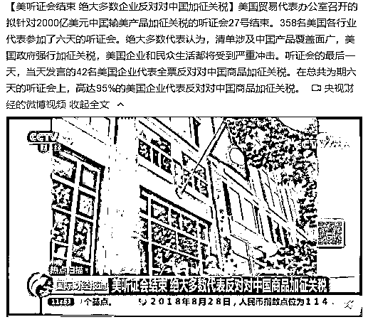
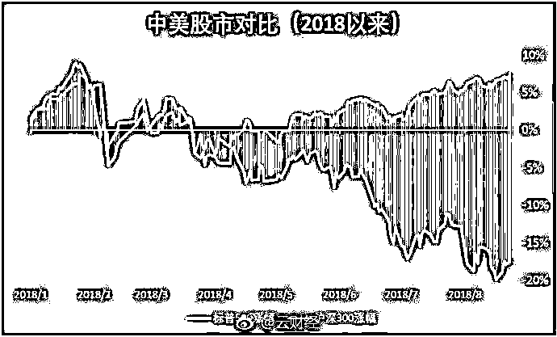

# 夜报| 创投基金税负暴增七成个税，部分基金补税数亿元

喜欢我的都关注我了~

今天创投圈迎来重大黑天鹅，创投基金税负暴增七成，部分基金补税数亿元，有机构大佬称行业迎来至暗时刻。

怎么回事呢，中国税务征管机关就股权转让的指导意见显示，部分地方政府就投资类合伙企业的优惠税率将被更高的税率所取代。这意味着，投资类合伙企业自然人出资人的税负将有所增加。在个人所得税方面，地方政府就“合伙企业转让股票收入分配给自然人有限合伙人”征收 20%个人所得税的方式将被纠正。

创投基金今后将必须按照个体工商户的标准征收累进税，最高税率为 35%，并且还需补交历年的税收。从 20%到 35%，有些创投基金需要补税数亿元。

为什么这么玩，首先是因为创投基金账目清晰，造假困难，因为本来就是风险投资，股权投资别人，如果账目不实，国家不保护，那一分钱摸不着，既然坐实了账目，那么收个人所得税，自然就简单起来，这是中国目前最容易收到富人个人所得税的地方了，其他地方的富人，都没收入的。。。

还有另外一个因素啊，最近几年由于 IPO 的大量上市，创投基金太赚钱了，很多人形容为一级市场吃肉，二级市场喝风。风投大佬天天回家和老婆吹牛说自己赚了大钱，自家老婆信没信我不知道，税务局反正是信了。

这个事件对成功 IPO 退出变现的基金造成了毁灭性打击，对于那些还没来得及 IPO 的创投基金则暂时不需要补税，因为只要不变现，则不计入收入。

我想，这大概表达了另外一个含义？

~~~~

美国企业听证会结束，高达 95%的美国企业代表反对对中国商品加征关税。

这个话题敏感，不深入，反正美国资本和企业是和中国利益高度捆绑的，现在只是美国中下层人民的选票在吸引特朗普处处刁难中国。

~~~

市场走势弱，撑 2 天，还是回踩 20 日线了，这一回踩，就代表了示弱，短期内没动，继续拿着，总感觉要有行情，今天很弱的原因，大概率就是工商银行盘后发布的公告，非公开发行优先股，募资金。。。1000 亿！！！

不说啥了，上次 CDR 才搞二三千亿大盘都玩崩了，这次一口气募了 1000 亿，没崩已经很对得起大家了。

既然又继续抽血，那就抽吧，顶多地上再躺几天，铸大底都比较磨人。那些天天抽血的，麻烦看一下不抽血的美股。

