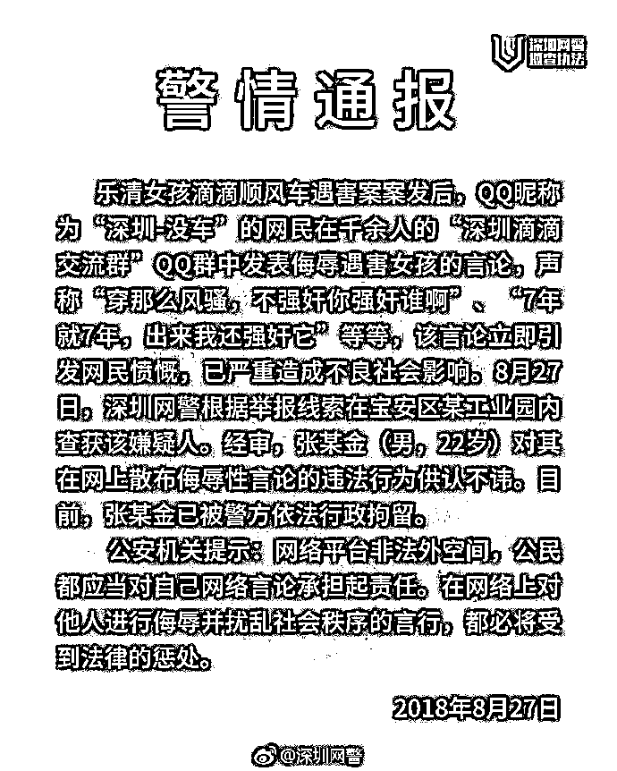
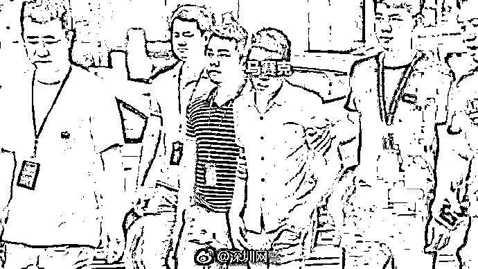
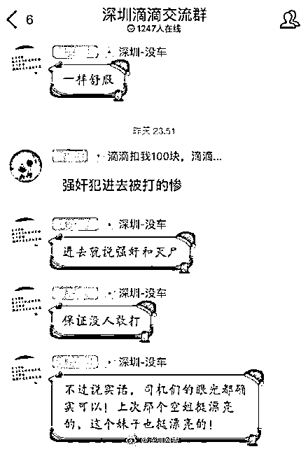
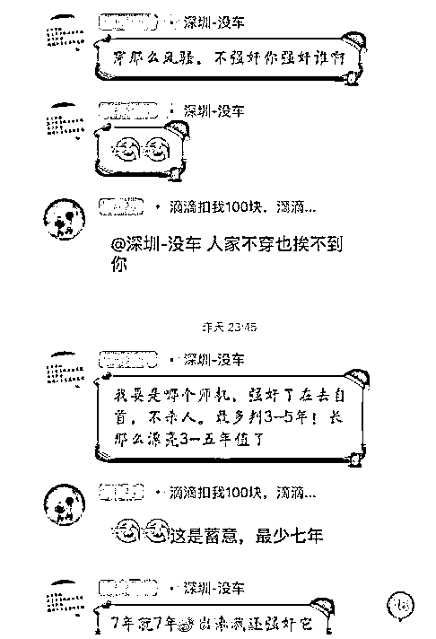
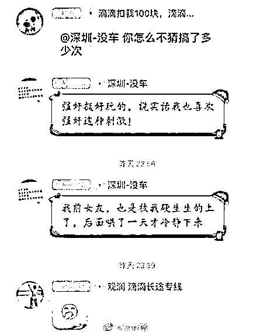
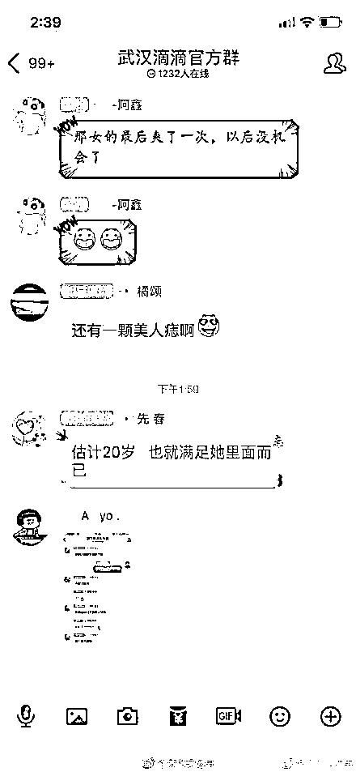
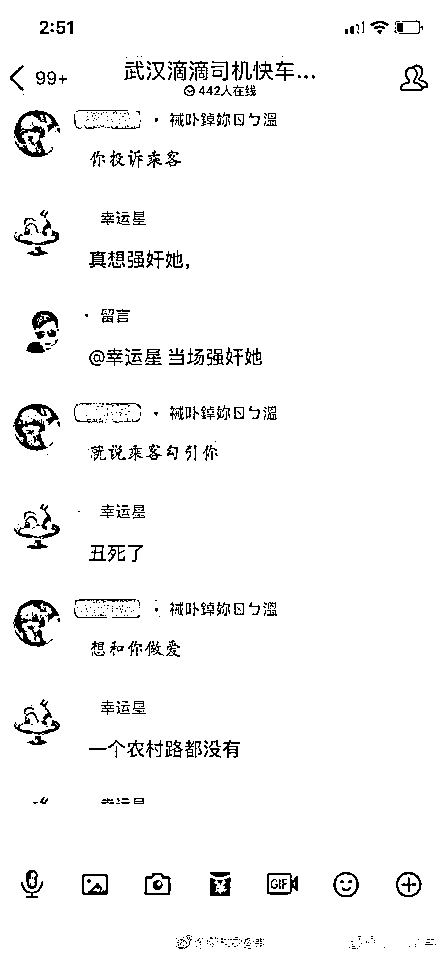
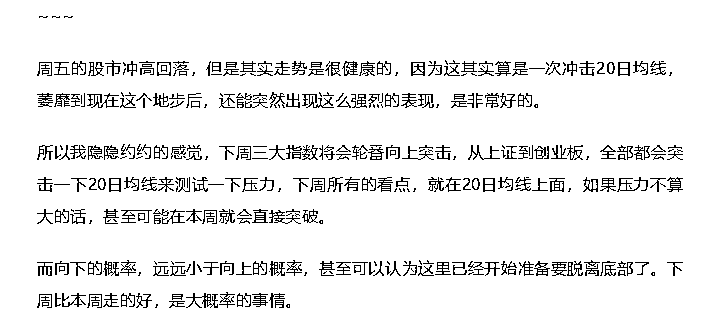

# 夜报 | QQ 群散布侮辱遇害女孩言论的滴滴司机被拘留了！

这几天，在乐清女孩打滴滴顺风车遇难之后，武汉滴滴司机群和深圳滴滴司机群均被网友爆出有司机发布侮辱遇害女孩的恶性言论出现，造成严重不良影响。

今天深圳警方宣布，已经在宝安区某工业园内查获该嫌疑人张某金（男，22 岁），目前已被警方依法行政拘留。

犯罪嫌疑人被拘捕

犯罪嫌疑人侮辱言论如下：

总的来说，抓的好，人人都应该对自己言论负责，哪怕只是 QQ 群，武汉还有一群更过分的，建议武汉警方早点抓捕，注意是一群，不是一个。

不想放太多图了，下面只是一小部分。

~~~

昨天关于 SG 的文章**被删除了,**不过今天股市的表现，完全符合昨天的预期和判断，折腾了这么久，上周五走势突然开始转强，这明显不对劲，脱离底部是大概率。

今天上市公司们没什么新闻，净看大涨去了，全国一片红。关于股市没啥好说的，还没完，继续等一等。

不过，昨天说的是本周开始轮番上涨冲击 20 日均线，结果今天三大指数全部收大阳线直接击破，简直是 666，明后天极有可能要略微回踩巩固一下。

不过很明显，在这么大的阳线直接击破压力位面前，这都是非常短暂的行为，可以忽略不计。

~~~

昨天的文章又被和谐啦，怕见不到大家，下面是复活号，如果找不到我，可以去这里看一看。长按下面二维码即可关注

