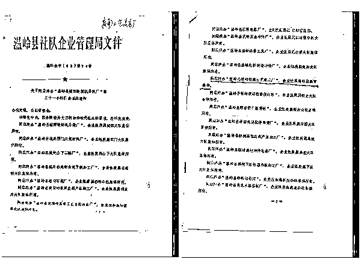

# 私营经济的艰难成长史

喜欢我的都关注我了~

到 2017 年，民营经济为中国提供了 80%的城镇就业岗位，吸纳了 70%以上的农村劳力，新增就业岗位 90%在民营企业，来自民营企业的税收已经占据全国的 50%，部分省份这一数据高达 70%，经济成果不可谓不巨大。

硕果累累的同时，很少有人会知道，中国的民营经济发展到今天是多么的不容易。

改革开放后为什么你不敢当老板

自 1978 改革开放后，私营经济迅猛发展，创造了经济奇迹，第一批下海的人更是赚的盆满钵满，这批人是躺着赚钱，你在沿海区域闭着眼睛买，倒卖到内地就能赚大钱。

很多人说，第一批下海的都是没出路找不到工作的人，迫于无奈才经商的，有点出息的人那个时候都不会选择下海，一直到现在，都有人污蔑第一批下海的人很多都是劳改犯、小流氓，他们发财真是老天无眼等等。

现在我们把时钟拨回到 1978 年，回顾下历史，你就会发现，天道有常，一份付出一分收获，那个时候你只敢在国营工厂里当工人也不敢辞职当老板，是有原因的。

1966 年，文化大革命爆发，全国屈死之人无数，资本家已经杀了一轮又一轮了，找不到资本家可以“革命”的时候，家门口种点青菜充饥都能被当成资本主义走狗大肆批斗，这种行为叫“割资本主义尾巴”，资本主义都已经被收拾干净了，只能找一点尾巴来批斗了。

1976 年 10 月，文化大革命结束，邓小平用了 2 年的时间，结束了全国的混乱状态，并以极大的魄力和领导力，在 1978 年 12 月的十一届三中全上，宣布中国进行改革开放，这位船长带领中国做出了改变命运的一次大转舵。

好了，现在改革开放了，允许下海发财了，**你下不下海？愿不愿意拿出家底出来开企业工厂当“资本家”。**

别幻想了，你不是能预知未来的神仙，在当时那个状态，借你 10 个胆子你也不敢这么做，老老实实活着不好吗？赚一份工资够温饱不就行了，下海赚钱当走资派？你是活腻了想去乱葬岗报道吧。文化大革命被称为十年浩劫，这不是说着玩的，**“浩劫”**二个字当之无愧，那是拿累累尸骨奠定的凶名。

800 万盲流下海创业

文革期间被下放到农村的知青，文革结束后被允许返城，数量高达**800 万**，但是城内无法提供相应的就业岗位，这些在家待业的知青，被称之为“盲流”，没有事做，天天在城里晃荡，滋生出了巨大的社会问题。

政府无法提供这么多的安置岗位，只好让这些人自谋生路，于是中央发布了一个文件，“各地可根据市场需要，在取得有关业务主管部门同意后，批准一些有正式户口的闲散劳动力从事修理、服务和手工业者个体劳动。”

从此，个体户诞生了，这些个体户几乎都是有正式城镇户口，但是没有正式工作的**“盲流”**，那些有正式工作的人是绝对不可能辞去铁饭碗下海创业的。

所以，现在很多人说，第一批下海的人都是找不到工作的“小流氓”，“劳改犯”，这句话有部分是对的，那就是第一批下海的个体化，的确都是找不到工作的人，出于无奈才下海搏杀的，如果找的到铁饭碗，那是没人愿意干这种“低贱”而且可能会“要命”的生计的。

高达 800 万的盲流成为了个体户，里面必然会冒出个别出类拔萃的人，这些人天赋和头脑特别强，很快就脱颖而出，然后他们会选择扩大经营规模，招聘雇工。

你可能会很高兴，这是好事啊，扩大经营规模能促进社会发展，增大税收，招聘雇工能解决就业，多好的事情，这些个体户的精英应该鼓励表扬，他们是中国经济的希望。

那是你从今天的眼光去看，回到 80 年代初期，那些招聘雇工的小老板可不会这么想，因为国家开放了个体户的口子，是为了解决 800 万盲流的就业问题，让你们自谋生路去的，不是让你们当**资本家**的，雇工和剥削，那是可以划等号的，政策一有风吹草动，这些人会第一批被拉到乱葬岗。当时的你，焉知十年之后会不会被秋后算账？

广东农民陈志雄在因承包鱼塘，招募了 5 个雇工，以及临时用工 1000 个工日，广州高德良开办的“周生记太子鸡”有了 6 个雇工，而傻子瓜子的年广久，居然雇佣了高达 12 个雇工。

而 1980 年中央发布的文件里，明确规定“不准雇工”，换言之，这些招聘了雇工的“资本家”全部是违法行为，他们是顶着违法乱纪的帽子生长出来的。后来中央把雇工的限制放宽到 5 个，又过了一段时间放宽到 7 个，但是这都是事后的事情了，在当时，这些人全部都是违法行为，只不过无人追究而已。

一直到 1987 年，中央才对雇工问题解禁，人们才能放心大胆的去雇工。这是在这种背景下，改革初期野蛮生长出来的第一批企业家，通常都充满原罪，如果不敢冲破法律法规的束缚，他们是断然不敢开办企业工厂的，如果敢于冲破法律法规的束缚，那么他们一定充满了各种原罪，敢于突破雇工数量这件事，事后被证明是正确的，但是这并不代表所有突破法规束缚的领域全都是正确的，各种灰色领域简直是无处不在，有些事，那是真的在违法乱纪。

那段时间是中国混沌初开的时间，这些企业家**连身份都是非法的**，做事当然会处处都有问题。

红帽子的黑色幽默

在那一段时间里，有胆子当年广久的人并不多，绝大多数人想办企业和工厂，但是怕被秋后算账当资本家给处理掉，于是都纷纷想找一顶“红帽子”，来规避专门为资本家准备的投机倒把罪。

什么叫红帽子呢，个体户扩大生产，招募雇工是非法的，但是国有企业、集体企业等扩大经营、招募雇工却是合法的，为了让自己合法合规的生产经营，很多人把自己的企业挂靠到其他所有制经济名下。

今天的台州，99%的企业都是民营企业，这些民企创造了全市 92%的税收和 77.5%的 GDP，可以说台州人的经商嗅觉非常敏锐，但是改革之初，这里依然无人敢于下海经商。

1982 年，陈华根和王华森这二名青年打算用自己的房子做厂房，自己出资买机器进行生产经营，他们决定以大队集体所有制的名义申办企业，也就是说，这个企业法律上是属于大队集体所有的，但是实际上大队没有出一分钱，也没有实际经营。

这种行为就叫**戴红帽子**，戴上这个红帽子，你就不是资本家，但是所有的资产都是集体经济名下，要是你亏钱了那就算了，要是赚钱了，来一个大队干部，分分钟可以把你所有资产收走，再给你安一个贪污盗窃集体财产的罪名。

台州市敢于为天下先，在温社企字（82）第 74 号文件将这种企业特批为“社员联营集体”性质，明确了所有权，正是因为这种创新，浙江才成为了改革后第一批富起来的省份，台州的民企如此发达，不是历史的偶然，而是政策的必然。

但是并不是所有的企业家都如此幸运的，台州市给了你好政策，专门开了口子，其他地方可不是这样。1983 年，吉林省扶余市农民杨雨田组织“运输合作社”，吸收待业青年当雇工，挂在了集体的名下，给自己找了个红帽子。所有的设备、厂房、资金都是杨雨田个人所有，但是 1986 年，有人举报杨雨田“侵吞”集体财产 7 万元，虽然这些钱实际都是杨雨田私人财产，但是名义上的确都是集体的，说杨雨田私吞集体财产一点问题都没有，于是杨雨田惹下了大官司，到处喊冤喊了好多年。

还有更倒霉的，河北省邯郸市的冯连印，用街道办事处的名义开了一个商店，投入资金进行经营，虽然大家都知道是挂靠，但是还是被法院以诈骗、贪污罪判处死刑，家属处处喊冤惊动高层后终于捞回一条小命，从鬼门关里走了回来。

这些事件，现在看来都是黑色幽默，但是当时的人可不觉得它有什么幽默的地方，**家破人亡这种事一点都不好玩**。浙江省的私营经济全面超越东三省和河北，这和制度改革是有必然联系的，一步慢步步慢，何况某些省份，到现在还在裹足不前，歧视私营经济，处处吃拿卡要。

从历史的经验看，当时哪个省份先拿掉红帽子，给私营经济一个合法的名分，哪个省份就在后来的经济竞赛中领先全国。

搞原子弹的不如卖茶叶蛋的，现在看来很荒谬可笑，但是如果这个茶叶蛋是拎着脑袋去卖的，加上这个**卖命钱**，我觉得卖茶叶蛋的就应该高收入。卖茶叶蛋的搞不了原子弹，所以他没办法去搞，但是搞原子弹的随时可以出来卖茶叶蛋，他当时为什么不敢去搞，这自然是有原因的。

主流媒体只会告诉你一半的事实，另外一半的事实，你要自己在故纸堆里挖掘。

第一批小老板的落幕

正是因为这种残酷的背景和动荡的局势，第一批干企业开工厂的老板，比拼的不是谁能力强，而是谁胆子大，谁愿意冒着夜不能寐的压力把所有家底投入生产，谁就能发财。

所以，第一批的私营企业主，是注定会退场落幕的，他们的退场方式有二种，第一种是顶不住压力自行退场，第二种是被能力更强的人所取代。

先谈谈第一种，每天做梦都会梦到企业被查封，自己被抓去坐牢枪毙，这种压力不是一般人可以长期承受的，所以很多小企业主，选择见好就收，享受生活。

1987 年，河北省有一个非常红火的私营钢管厂，年产值 200 多万元，热火朝天迅猛发展的时候，老板选择洗手不干，把工厂交给了政府。济南的一个作坊主，赚了点钱，怕政策多变没收财产，赚来的钱丝毫不投入扩大生产，而是大手大脚花钱，几个女儿出嫁，一人给 8 万嫁妆，分散转移财富，80 年代的一人 8 万哦。

所有，那些敢于不断投资扩大生产的私营企业主，真的是把脑袋系在裤腰带上干这事的，他们发财真的是理所当然。因为他们不仅冒着政策多变被收回财产的风险，还冒着经营不善彻底破产的风险，这实在是太难了。

因为第一批的老板仅仅是胆子大而已，实际能力可能并不强，于是到 90 年代，私营经济有了合法的身份证之后，大批体制内的人开始下海，这些人学历高、能力强、见识广，唯一的缺点恐怕就是胆子小，在风向没有明确之前，不敢抛弃铁饭碗冒险第一批下海。

但是这批人下海之后，其管理能力和生产效率根本不是第一批的小老板可以比拟的，在市场经济的优胜劣汰下，第一批 800 万盲流个体户，很快被消灭殆尽了，虽然他们发芽早，但是成长为参天大树的，几乎没有。能够仗着先发优势，赚一个小富的生活，已经很不错了。

看到这里，你还觉得改革开放后第一批下海的人很幸运吗？我觉得他们只是拿了自己该拿的那份钱而已，这是提着脑袋赚来的卖命钱。如果能给他们一份正式工作，这 800 万盲流，当初还愿意下海的，应该百不存一。

私营经济发展到今天，崎岖坎坷，中间有太多次夭折的可能，一直到今天，都有让私营经济退场的声音存在，一篇文章能惊动中央最高层连续发言稳定私营经济的军心，一方面说明中央对于私营经济的重视，一方面也说明体制原因下，私营企业主的信心有多么的脆弱。

什么叫改革开放，就是从纯国有经济里改出来一部分私营经济，几十年的经济硕果告诉我们，**这条路是正确的**，先人费劲千辛万苦才做出了如今的成就，希望大家都能珍惜，不要开历史的倒车。

觉得此文的分析有道理，对你有所帮助，请随手转发。

长按下方图片，识别二维码，即可关注我,每天一篇 10w+

近期精彩文章回顾（回复“目录”关键词可查看更多）

华为员工都这么穷，怪不得拼多多能火 | 房价跌 20%就会全面崩盘，地产杠杆远比你想的要脆弱 |  为什么碧桂园的质量那么差 | 清醒点，放弃全面开征房产税的幻想 | 央行和财政部隔空掐架，我支持央妈 |中国土地制度源自香港，但是香港却是劏房密布 | 为什么中介哄抢租赁房源，因为贩毒都没它来钱快