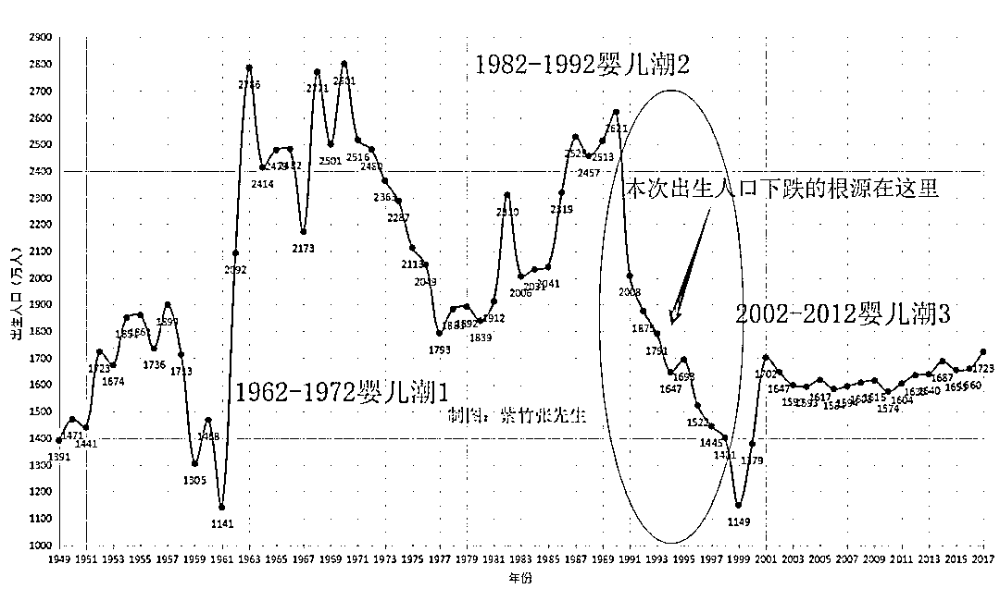

# 中国上半年各地已公开出生数据汇总

为了提振中国出生人口数量，2014 年中国开放单独二胎，2016 年实行了全面二胎，根据中国人口协会会长翟振武教授与其学生合写的一篇论文《立即全面放开二胎政策的人口学后果分析》，如果中国全面开放二胎，出生人口会飙升到 4995 万人左右。

但是实际上，2017 年中国出生人口仅为 1723 万人，不仅没有和人口专家预测的那样飙升到 4995 万人，甚至比 2016 年的出生数据 1786 万人还下降了 3.5%。换句话说，当年的人口专家在恐吓我们，提出了一个非常离谱的数据来干扰二胎政策的推行。

那么，2018 年会有多少新宝宝出生呢，我们已经等不及到年底了，先把目前已经公告的各地公开数据汇总一下看一看。

下面，我们来逐个分析列举已经公布的，网络可查的各地出生人口数据。

生育率最高的山东数据

2017 年全国生育率最高的地区为山东，生育数量最高的地区也为山东，但是今年上半年，山东的生育率出现了下降。

山东省烟台市卫计委公告显示，烟台 2018 年上半年出生 26902 人，同比下降 16%左右。

山东省潍坊市公告显示 2018 年上半年出生人口为 64428 人，而 2017 年全年出生 157400 人，折合半年 78700 人，故同比下降 18.1%。

山东省淄博市卫计委召开 2018 年媒体座谈会上透漏，今年前 5 个月，临淄共出生婴儿 1.82 万人，速率不变的情况下估算全年为 4.37 万人，而 2017 年全年临淄出生人口为 5.65 万人。我折算了一下，同比下降达到 23%。

山东省德州市卫计委宣布 18 年上半年出生 35564 人，而 17 年同期的半年数据为 45533 人，同比下降 22%左右。

换句话说，17 年全国出生人口的主力军团山东省，普遍下跌 17~23%左右，如果要拉升出生人口，山东省需要更多的类似二胎的人口刺激政策。

富裕省份的出生数据

中国三大老龄化省份，江苏、辽宁、四川，这里面生育形势最严峻的其实就是江苏，因为江苏属于富裕省份，有源源不断的外来年轻人口在输血，这些小年轻生在江苏医院的全算江苏的出生数据，在有输血的情况下，老龄化一路上扬，而出生人口持续下跌。

江苏在 2017 年只出生了 86 万人，这已经很少了，人口出生率低于日本，而且是远低于日本。但是今年出生的更少，根据公告显示，今年上半年江苏共出生 38.3 万人，折算一下，同比降幅是 11%，原本生的就少，现在居然还在下降。

江苏省是中国排前列的富裕省份，这是典型的越富越不愿意生。

穷困省份的出生数据

既然越富越不愿意生，那么穷困的省份出生数据应该还可以把。

我们来看一看贵州省的数据，贵州省是全国 GDP 倒数第三的省份，那么贵州省是不是出生数据继续攀升呢。

在贵州 2018 年度上半年计划生育服务管理工作形式会上，计生委没有直接公布贵州的出生数据，而是提出了上半年贵州省出生人口“稳中有降”,这个词用的很巧妙，大家自己体会下，究竟降多少，我也不知道，但是肯定不是涨的，是降的。

其他省份的数据

除了生育率最高的山东，富裕的江苏和穷困的贵州全部下降之外，其他省份的数据如何呢，没公布的不知道，但是已公布的，我们来汇总一下。

**天津：**

今年 1-4 月全市建册孕妇人数降 17%，孕妇怀孕前三个月内去医院完成建册，虽然 1~4 月的建册孕妇，大概要 11 月才能生出来，但是我们可以简单的通过建册人数推测上半年的出生人口，应该也是下降的。

**浙江省金华市：**

2018 年 1－5 月，全市出生 21879 人，同比减少 4779 人，减幅为 17.93%，其中二孩出生 12650 人，减幅为 23.96%。

**福建省惠安县：**

从去年 10 月 1 日到今年 6 月 30 日，惠安县新出生人口为 9672 人，较 16 年 10 月到 17 年 6 月的同比数据，大概下降了 18.7%，卫计委的公告宣布这个数据后，认为生育形势趋于平稳。。。

那么是不是把最差的人口数据给报出来了，后面没披露的全是好数据呢。应该不会，去年的这个时候，媒体上铺天盖地都是报道 17 年前半年的出生人口，以此来证明全面放开二胎政策产生了应有的效果。而今年几乎全体缄默，全网所有公开的数据，都被我上面给搜罗出来了，就这么多，而且今年的新闻媒体，清一色的在提及鼓励生育和奖励生育，甚至还有专家开始提出收取生育基金来进行惩罚式生育，种种迹象表明，没公布的那些，数据好看不到哪去。

为什么出生人口下滑这么厉害

为什么出生人口还在下滑呢，因为二胎红利是一次性的爆发的，堆积了很久的二胎需求，在政策放开之后，全部涌现出来了，随后会迅速的回复到正常值。正常值和这个爆发值的数量，很显然是差距巨大的，所以当开始的爆发完成之后，二胎数量迅速下滑是必然的。

但是在二胎数量下滑的同时，一胎数量不仅没有增长，反而更迅速的下滑。本来开放二胎就是为了弥补断崖式下跌的一胎数量，所以一胎继续下滑，结果并不奇怪。

一胎数量下跌的问题根源，在于 1989-1999 年这十年间，中国的出生人口迅速下跌，上一个我上次制的中国出生人口图。

如果没有二胎政策，那么很明显，对应的出生人口应该是这样的。

在 2014 年，开放二胎对冲人口下跌，2016 年，开放全面二胎再次对冲人口下跌，如今是 2018 年，二胎政策红利已经全部耗尽，全国人口出现了平均 17%左右的跌幅，如果没有新的人口政策，那么很明显就会参考 89-99 年的人口趋势图。

而实际上，国家已经意识到人口即财富，出生人口节节下跌不仅不会带来人均资源的增加，反而有可能让中国未富先老，断绝强国之路。

所以，新的鼓励生育政策出台来维持人口稳定，是势在必行的。