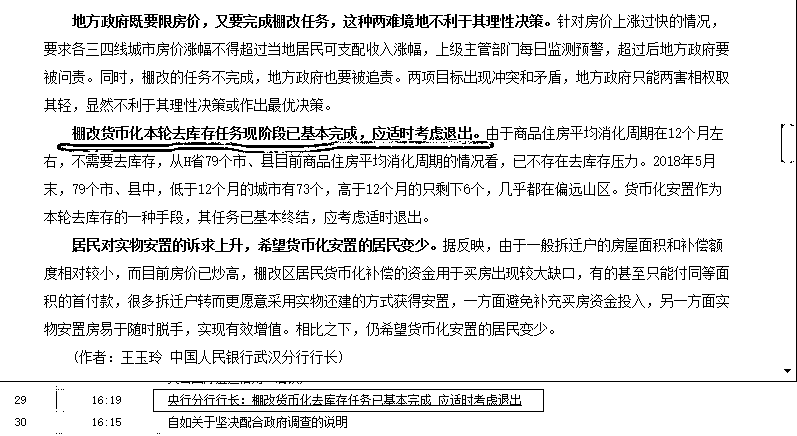
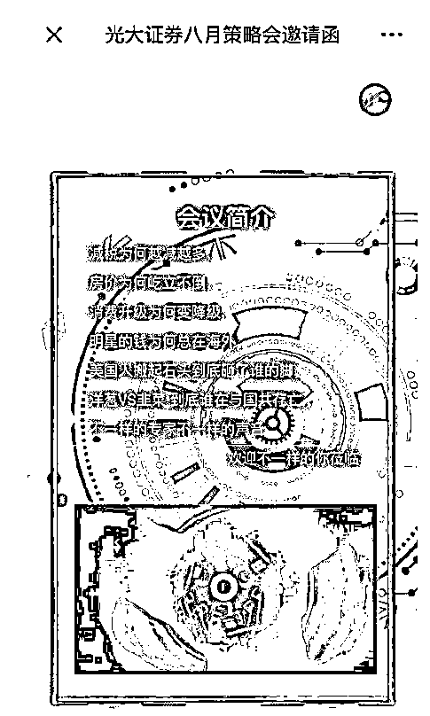

# 夜报|| 央行分行行长：棚改货币化去库存任务已基本完成

中国人民银行武汉分行行长王玉玲今天公开发文，称棚改去库存效果显著，部分城市商品住房供不应求，房价持续走高，局部地区出现过热。

而棚改货币化本轮去库存任务现阶段已基本完成，应适时考虑退出。

这个媒体用的标题是央行分行行长，的确一个字没错，中国人民银行武汉分行行长的确就是央行分行行长，但是这么写，感觉怪怪的。。。

当然，这个分行长这么说，基本也能代表官方态度，如果没有内部文件，这种方向性的话，一个分行行长哪里敢说，能爬到行长位置的都不是乱说话的人。

所以，未来实物安置的比例会迅速提升，而货币化安置的比例会迅速下降，对应的，这一批靠货币化拆迁热起来的城市，要冷一冷了。

~~~~

今天中午 12 点 01 分，160 亿美元进口 25%关税落地，没有引起任何波澜，市场早有预期，只是上午跳了一波水，下午又拉起来了。

另外，中国在世贸组织起诉美国对 160 亿美元中国产品的征税措施，这个当然鼓励，不过就是口水仗而已，道理不用讲，大国对拼到这个份上，世贸组织没啥大用。

今天总的来说，先拉后跳水然后再拉，但是总体上涨，涨的还不少，主要是个股，目前来看，这里就是底部，而且可能是 18 年难得的一次底部，日 K 级底背离，少说一个月好日子过。.

更何况，这连续大半年单边下跌了，差不多跌了 8 个月了，再弱的股市，他也得来一波反弹了。

最后，给大家看一个不怕死的券商，光大证券。

你看看这七条标题，个个都是作死的标题，稍微谈深一点就 404 了，这光大证券居然敢正大光明的开策略会，真是不知道死字怎么写。

9 月份加急名单已经出了，光大证券策略会的主持人排第一个，其他人靠后站站。