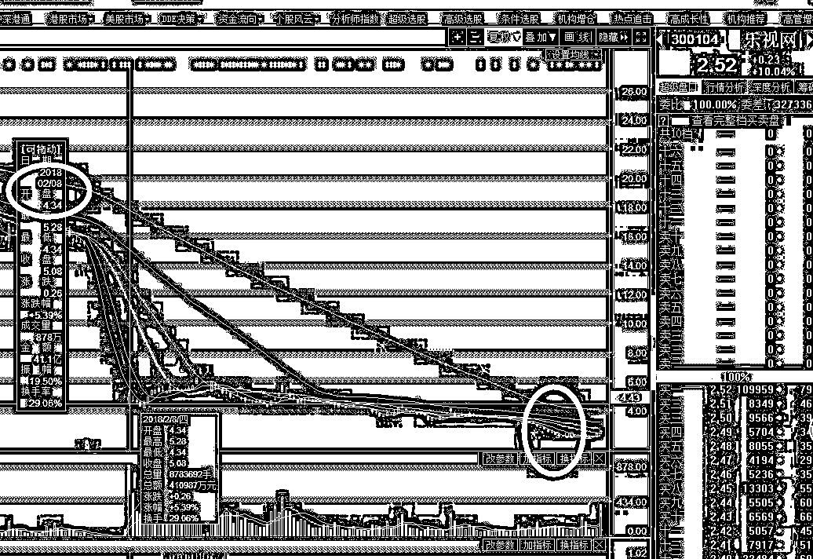
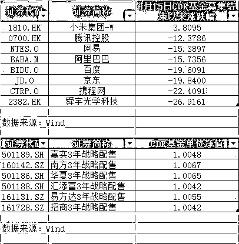
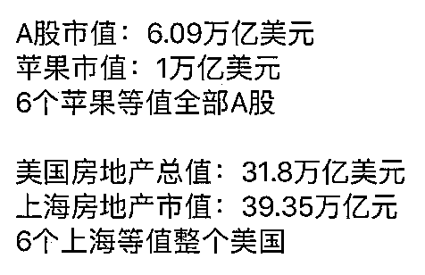

# 夜报||乐视网居然 2 个涨停了

昨天开盘之前，市场疯传贾跃亭承诺兜底乐视网十几亿的债务，乐视控股和乐视网也达成了 40 亿的偿债协议，所以开盘就涨停了。

但是收盘之后，乐视网澄清：上市公司未因债务解决获得现金流入，目前上市公司与非上市体系债务处理小组已形成的债务问题处理计划，并未通过现金方式偿还，基本以债权转让、资产处置等方式来抵消非上市体系对上市公司的现有债务。

简单的说，就是乐视体系的 7 个葫芦娃，和上市体系的乐视网之间，通过账面划转一下，来解决这个债务问题，但是没有外界一分钱现金流入，只是内部做账问题。

此外，乐视网还公布：除公司已披露信息外，并未与非上市体系关联公司达成任何偿债计划。就媒体报道中所称“乐视控股已偿还了 2.63 亿元的债务，并与乐视网达成了 40 多亿元的偿债方案”事项，公司也已及时向非上市体系债务处理小组发送邮件问询，截止目前尚未得到对方回复。

换句话说，视控股和乐视网也达成了 40 亿的偿债协议这回事，乐视网自己都不知道。这该跌了吧，这么大的利空，没有，乐视网今天开盘他又冲涨停了。。。

为什么会这样呢，当年乐视网连续跌停的时候我曾说过，第一次开板的地方，一定不是底，后面还有得跌，因为连续暴跌首次开板不是底这是非常大的概率，历史经验已经多次证明了。

但是 4.37 开板后，短暂下挫到 4 块最低点后，乐视网发动了一波大反弹，反弹到了 6 块多。当时好多人喷，说乐视这里就是底，没有下跌了，但是实际上，那一波反弹是因为乐视网里套的大佬太多了，这些大佬联手拉升股价试图自救，否则的话乐视早下去了。乐视想复活只有一个可能，那就是把贾跃亭的股权都转让给孙宏斌，然后孙宏斌出钱来解决乐视的问题，因为只有孙有钱，贾跃亭已经完全没钱了。但是孙的股权太少，贾跃亭股权太多，就算冻结，监管也不允许把贾跃亭的股权转让出去，这让孙宏斌完全没有救乐视网的兴趣。

所以，贾跃亭的股权问题不解除，乐视网永远是一条咸鱼，所以乐视网的股价，在前几天，最低跌到了 2 块，然后连续拉升了 2 个涨停，出利空也涨停，很显然是里面的大佬，又开始自救了，做一波赚一点小钱来慢慢回血，只是可惜那些跟风的散户了。

至于贾跃亭能够救乐视，他这次承诺给十几亿兜底，贾跃亭放的空炮还少吗？宁可相信世界有鬼，也不会相信贾跃亭的那张破嘴。没有任何现金，只有承诺的协议等于一纸空文，连孙宏斌都被承诺给坑了，何况普通股民。

乐视网在 15 年，卖到了 44 块钱，3 天前的最低价已经跌到了 2 块钱，下跌幅度高达 96%，买 100 块的乐视网，现在只剩下 4 块钱了，真是顶天的厉害。

2 块钱是不是乐视网的底，比当年开板的最低价都还又腰斩了，不好说，乐视网本身就是个纯资本运作的公司，实际盈利业务极少，如果没有大股东的换人，给予彻底清洗，基本是没救，除非极小概率发生，那就是贾跃亭在美国翻身了，赚了几百亿回来了，一次性清理掉乐视网的债务，那是可以的，这个概率可以自行估计一下到底有多小。

对了，那些上次开板之后炒作的，如果是 6 块钱买入的散户，拿到 2 块钱，是亏了 77%，提醒一下哦。

~~~~

这里还要谈一下 CDR 基金，这个基金募集完毕之后，就直接冷冻了，没有买入境外的独角兽，所以这些钱全部躺在账上吃利息，当时我就说这个基金不能买，不是说不能赚钱，而是风险大于收益。

不过幸好这个基金停止运作了，如果当时买入境外的独角兽的话，大家可以看一看同比涨跌幅，比 A 股跌的还惨。

6 个苹果公司，等同于整个 A 股的市值，而 6 个上海，就等同于整个美国的房地产市值，你说这个对比图，好玩不。

目前，股市全部指数，均构筑了底背离，形态非常好看，而且已经逼近脸面底，刘主席但凡有一丝希望，都不会让这个底破掉。日 K 底背离构筑之后，应反弹一个月左右，整个大势属于超跌反弹，不会一口气一涨上去。

我不认为 18 年会出现牛市，但是更加不认为 18 年会出现一口气不见底的单边大跌，多少年了股市也没有这么走的，我从来不激进，但是更不悲观，股市就是慢慢玩的。

这次的中级日 K 级反弹，吃完了再说。