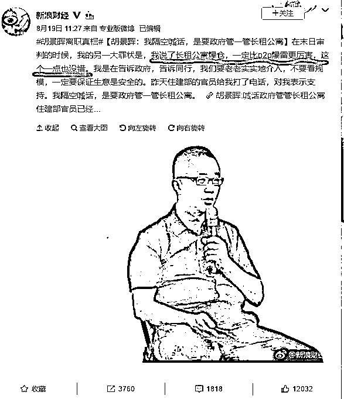
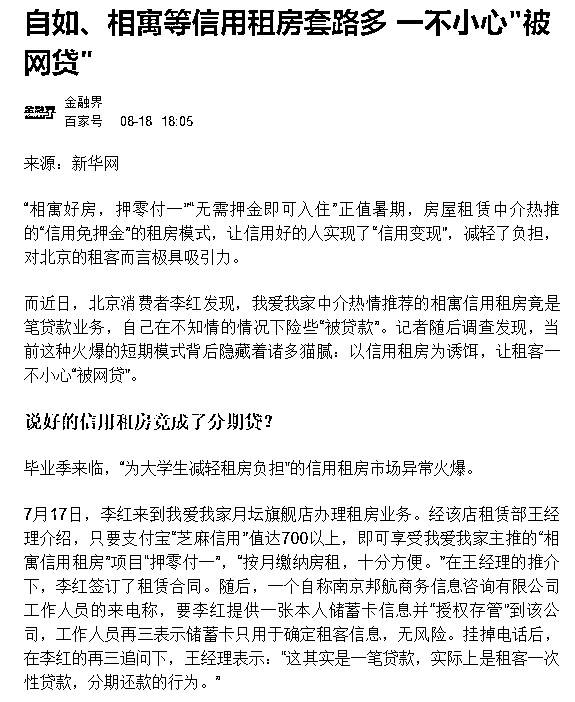

# 为什么中介哄抢租赁房源，因为贩毒都没它来钱快 || 紫竹张先生

这几天，原我爱我家副总裁胡景晖炮轰自如、蛋壳等长租公寓运营商以高出市场价 20%-40%的价格争抢房源的言论引爆网络，掀起全社会对房租上涨的大讨论，人们纷纷感叹，这帮中介太有钱了，完全是不计成本的扩张，烧钱换市场。

但是很少有人知道，这些人的钱是哪来的，其奥秘就隐藏在胡景晖在媒体发布会的一句话上，“我说了长租公寓爆仓，一定比 P2P 暴雷更厉害，这个一点也没错。”

很多人纳闷了，中介就是中介，哪怕盘下了很多房源他也是中介，房子租不出去顶多亏点钱呗，实在抗不下去大不了付个违约金，不计代价扩张有可能会亏钱，但是远远谈不到爆仓。爆仓和暴雷是有严格定义的，指的是原本繁花似锦的形势，一夜之间突然全部归零，这才能叫爆仓，如果是慢慢亏下去的，那是不能使用这个词汇的，比如中国的实体制造业，你可以说他亏损，但是不能说他爆仓。

所以，中介生意在任何时候都和爆仓是联系不上的，P2P 那种一夜垮台的事情和中介是无关的，毕竟一个是玩金融的，一个是玩服务的。那么是胡景晖专业知识不足，表达错误吗？不是的，胡景晖的表达完全正确。

从目前的种种迹象看，这些长租公寓涉嫌利用法律盲区侵犯租客和房东的权益，以空手套白狼的形式套取大量贷款资金用于自身发展，把风险转移给房东和租客以及全社会，而把所有的利益留给自己。这些长租公寓，真的可能一夜爆仓，从而引发剧烈的社会动荡。

1**中介是如何空手套白狼的**

首先给大家介绍一下中介空手套白狼的玩法，按照正常的交易流程，中介只负责房东和房客之间的信息撮合，所有的租金，是由房客交给房东的，中介只负责拿他的中介费而已。

按这个玩法，市场很健康，所有人都赚一点小钱，但是有些中介并不满足与这一点，动起了歪脑子，想赚大钱，采用什么方式呢，就是侵吞租客的租金。

看到这里你可能纳闷了，租客哪来的租金给你侵吞，下面，我给大家详细讲一讲中介的套路：

首先，中介和房东联系，承诺包租，钱由中介按月支付，房东一听好事啊，收租是个麻烦活，由中介统一包办放心多了，这就是长租公寓的前身，中介代管的租赁房源，而现在的长租公寓，实际上也是这么个玩法。

然后，中介和租客联系，号称押一付一甚至押 0 付一来吸引客源，只需要一点服务费就可以，通过种种诱导让你签了合同后，你突然发现，你和一家 XX 金融公司产生了联系，每个月的租金不是打给房东的，甚至也不是打给中介的，而是需要打给这家金融公司的，然后你的服务费，也是交给这家金融公司的。

这是为什么呢，原来中介诱导你签下的，是一份贷款合同，你以个人信用做承诺，通过绑定身份证和银行卡获得了金融公司一年的租金贷款，金融公司一次性把你 12 个月的租金全部打给了中介，然后你一个月一个月慢慢的还给银行钱，同时还要支付 5.8%的“服务费”。

这个时候，你欠下了金融公司 12 个月租金，然后一个月一个月的还，你和金融公司构成借贷关系，这是你自己签字的。那么中介拿了你的贷款之后有没有全部给房东呢，没有，中介一般是按季度付给房东租金，也就是三个月一次付给房东，其他的钱全部扣在自己手里。

2**租金贷模式隐藏的巨大风险**

看到这里，相信吃瓜群众们已经看出不对劲了，中介凭空手里突然多了巨额的资金，关于这笔钱怎么用，那只能靠中介的自我良知了，这里没有任何政府监管，和共享单车的押金一样，属于监管盲区，但是金额要大的多。

每一个租户，就算月租 2000，也要向金融公司贷款二三万，如果要整租，则高达七八万，这些贷款大部分都扣留在中介的手里。而租户的规模则非常庞大，仅仅北京城，链家的自如 2 个月内就能推出 8 万套房源，那么他一年能推出多少，全国累计呢？仅仅这一家公司，全国至少也是百万级别规模的租户数量。

更可怕的是，这个资金是可以裂变扩张的，中介利用租客的信用向银行套取了 12 个月的租金，然后只支付给房东 3 个月，扣在手里 9 个月的钱，他用这些钱，可以再发展 3 个新房东，即便价格高一点，亏一点钱也无所谓，等市场全部占领了，都是可以赚回来的。

换句话说，他每扣下一个租客的钱，就能发展出 3 个新下线，而这 3 个新下线的钱全部扣下，可以再发展出 9 个新下线，于是规模就像滚雪球一样发展起来了，扩大市场规模就有新钱入账，而入账的新钱可以拿出来继续扩大市场规模，这就是今年各大中介疯狂抬价争抢房源的原因，因为这是一个无本套利的买卖，非常类似于 P2P，当年 P2P 处于扩张期的时候，也是疯狂砸钱到处争抢客源，只要有源源不断的新客户进场，P2P 则永远辉煌。

而一个 P2P 用户的投资额，其实平均也就几万元而已，这这种空手套白狼窃走租客贷款资金用于自身发展的行为，其实就是换一种模式的 P2P，而且所有资金，用于自融，一旦资金链断裂，则瞬间归零，这的确就是崩盘，用爆仓或者暴雷这个金融机构的术语来形容长租公寓的这种融资模式，非常恰当，因为他里面的钱都不是自己的钱，甚至也不是投资机构的钱，而是从租客那里骗来的钱。

所以很多长租公寓对媒体吐苦水说自己不赚钱，只是为了抢市场，当然这样了，P2P 当年亏损都能继续干下去，何况长租公寓。每多一套房源，就代表一笔新款项入账，所以扩张市场规模，远远比当下是否赚钱要重要。按这个节奏发展下去，当长租公寓占领了城市的每一个角落之后，他才会停止扩张，没有新房源可套取现金的时候，大清算才会来临。

如果自己赌赢了，那么一切收益归自己，如果赌输了，则全社会来负担这个损失。

3**一旦风险暴露，会有什么后果**

那么我们现在要考虑下，一旦风险暴露会有什么后果呢？当租房市场处于上行期的时候，中介们这么玩是没有任何问题的，涨价可以解决一切问题，那些违规利用租客贷款资金发展自身的企业，反而能获得最大的市场份额，消灭竞争对手。

但是一旦房租停止上涨甚至下行，中介的资金链就很可能断裂，一旦中介无法继续支付房东租金，引发资金链断裂之后，就会引发巨大的社会动荡。

本来和房东约好，每 3 个月付一次房租，但是某一天中介突然宣布倒闭，无法继续支付房租，那么房东肯定是要收回房子的。

但是当房东收房子的时候发现，租客已经提前支付了一年房租了，现在只住了 6 个月，还剩半年。就算这个时候把房客赶出去，房客也要继续按月向金融公司支付房租来归还贷款，因为这是白纸黑字的贷款合同。所以房客肯定不愿意搬出去，除非住满一年或者你替他把剩余的贷款还了。

房东愿意帮房客还这个钱吗？当然不愿意了，凭什么啊，但是房东愿意让房客白住半年房子吗？当然也不愿意了，凭什么啊。那么这个钱哪去了呢？很简单，中介偷走了，看似势不可挡，滚雪球一样发展起来的中介公司，当资金链断裂的那一刻，所有未归还贷款全部成为坏账，人间蒸发了。

而这个坏账，每家公司少则几十亿多则几百亿，如果让他们这样病毒式的再繁殖个几年，可能高达几千亿甚至上万亿，没有任何公司能长盛不衰，只有一家倒闭，可能会引发全行业的连锁崩盘，就好像 P2P 一样。

当崩盘之日来临的时候，产生的恶劣影响会远远超过 P2P，毕竟很多玩 P2P 的人是贪图高回报，高回报就有高风险，本金全无是正常的投资后果，政府的责任有，但是非常小。但是租赁市场崩盘就不一样了，租客的贷款资金被卷走，这是政府严重的监管失职，租客冒着这么大的风险，不仅没有高回报，而且他本身也是最可怜的穷人，选择月租甚至贷款去月租的一般都是经济实力非常有限的年轻人，这是极大的道德风险。

这种压榨欺骗社会底层贷款资金的漏洞风险一旦全面爆发，毫无疑问会产生巨大的风波，中介的账面上已经没钱了，那么压力会全部转移到政府的头上。

4**我们应该怎么办**

各地房租持续被推升，和这种空手套白狼的运营模式密不可分，毕竟每抢到手一个新房源，就代表几万块钱直接被打入了公司账户，有新资金源源不断的输血，公司就永远不会死。但是一旦出事，就会有几十万甚至几百万房东和房客互相打架，引发剧烈的社会矛盾冲突。

首先，如果你是房东，要长点心，中介公司动辄抬价 30~50%来收你的房，还要签长约，这不是白白送钱给你，这个钱肯定是你负担风险换来的，如果将来某一天中介公司倒闭资金链断裂，而你的房子被某个租客一次性签下了 5 年的贷款租金，那你就傻眼吧，这个钱到底是你来赔呢，还是你来赔呢，赶租客要是那么容易，法院拍卖的房产就不会那么便宜了。

而同比之下，另外一个选择就划算很多，这片区域，任由中介抬价，同样的房型，他抬到 6500，我就 6300 挂出去，永远比中介便宜 200 块钱，但是你和租客建立单对单联系，所有租金由租客直接打给你，债务关系极其明确，将来不会扯皮。

然后，如果你是租客，那么你也要长点心，找中介公司租房可以，中介公司让你贷款交房租也可以，但是一定要搞清楚，这笔贷款是打给谁的，是直接打给房东，还是中介公司自己拿去了。

要知道中介公司是没有产权的，即便是租赁权，他们也是不是一次性全部支付的，开头支付一笔后，后面都是按季度打给房东。一旦资金链断裂无法支付房租，房东肯定要收房，而你住的房子，是房东的，不是中介的。像这种房东房客都是受害者，而中介跑路拿不出钱的案例，按中国惯例都是各打 50 大板和稀泥，一个人负担一半损失，但是哪怕是一半那也是万元级别的损失，你有必要去负担这个风险吗？

所以，贷款直接全额打给中介公司的合同，一律不签，反正房子这么多，换一套租就是了，那些坑人的霸王合同，让不知情的傻冒去签好了。

最后，我们要呼吁政府，中介公司签下房源之后代收房租不是不可以，但是这笔资金本质上和共享单车押金无异，而且规模体量远超单车的押金，所以必须要从严监管，专款专用，每一个房东托管给长租公寓的房子，不管改造成几间房，对应租客的租金，都要全部对应到这个房东的子账户里去，绝对不应该打入中介公司的账户，由他们随意支配。

现在你知道为什么中介公司突然那么财大气粗，宁可抬价 50%也要抢房源了吗？因为他们能够靠房源窃取租客的贷款资金，如果一切顺利那么所有收益归自己，如果不顺利那么全社会来承担他的风险和损失，真是一个无本万利的买卖，贩毒都没它来钱快。

觉得此文的分析有道理，对你有所帮助，请随手转发。

长按下方图片，识别二维码，即可关注我

近期精彩文章回顾（回复“目录”关键词可查看更多）

华为员工都这么穷，怪不得拼多多能火 | 房价跌 20%就会全面崩盘，地产杠杆远比你想的要脆弱 |  为什么碧桂园的质量那么差 | 清醒点，放弃全面开征房产税的幻想 | 央行和财政部隔空掐架，我支持央妈