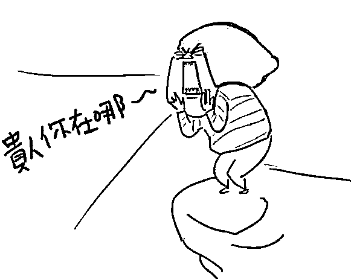
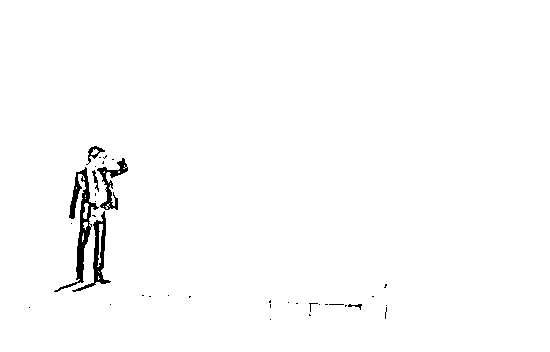
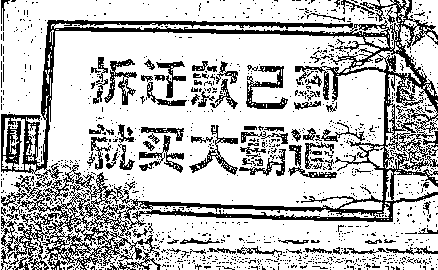
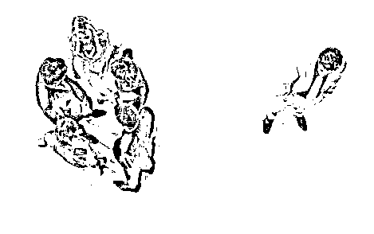
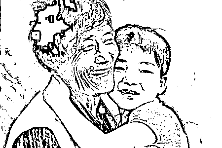
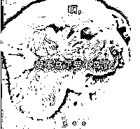
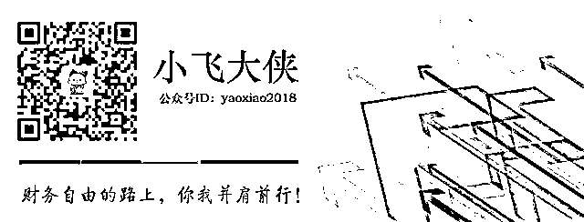

# 不改变自己，你就会一直贫穷

改革开放初期，孤掷一注下海的人几乎都赚的盆满钵满。于是就有人说，还不是搭上了改革的春风。

互联网发展初期，又有不少敢于吃螃蟹的人成功跨越阶层。这时候又有人说，站在风口处就算是头猪也能飞上天，都是运气好。

再后来，不断地有人成为富豪，也总有人将其归于运气好。

要我说，哪来那么多的运气啊，要是没点真本事，就算被运气砸到趴下，也未必就能趁势而起。换句话说，真正的穷人，就算被同样的运气砸到，也未必就能逆袭。穷人，还是会越来越穷。

富人区的乞丐

有一名乞丐，每天都在富人区乞讨。有一名富翁每次见到他都会施舍给他 10 美元。

有次，富翁施舍完后打开车窗跟他说，从你在这乞讨的第一天起，我每天都施舍给你 10 美元，如今已经满 3 个月了吧。

乞丐说是。

富翁说，希望你并没有将这些钱挥霍掉。

乞丐表示一分都没有挥霍。

富翁接着说，我曾经也在这里乞讨过。后来攒了些钱就去批发了些皮鞋倒卖，慢慢地才有了如今的身家。你明白了吗？

乞丐点点头，表示明白了。

然后乞丐消失了一个月。一个月后乞丐又回来了，见到了富翁，非常可怜地诉苦，攒下的钱都拿去批发皮鞋了，结果全部亏了，血本无归。

富翁没有再说什么，只是后来再也不施舍给他任何东西了。

我们或多或少都有抱怨过自己怀才不遇，抱怨过自己没有贵人赏识。

但却没有反省过自己究竟有什么过人之处，究竟怎么引起贵人的关注，又有哪里值得让贵人赏识。

就好像故事里的乞丐一样，贫穷、无助，每天为了生存奔波。

就算因缘巧合，引来了贵人相助，但也没有改变自己的命运。

因为他一直都是穷人思维，如果没有发生改变，就注定了这辈子只能当乞丐。

**穷人思维很可怕，可以说基本上我们每个人都有**。

炒股时基本不研究基本面，喜欢追涨杀跌。理由还很充分，A 股是投机不是投资，那被当成韭菜真的不冤枉。

为了便宜总是等着“双十一”下单，囤满一年的生活用品。看起来是省钱了，只是几万一坪的房子，用来当生活用品的仓库心不痛吗？

买任何东西为了买到性价比最高的，货比三家能耗费一下午甚至一整天。合算是合算了，但是这些时间用来看看书充充电陪陪家人不是更好吗？

**穷人的穷，在于缺少眼界和格局。看起来的划算，其实浪费了更多。**

我们千方百计地省钱，无非是想要降低生活成本，让自己生活得更好。但是却忽视了提高生活质量的另一个途径——**提升自己的眼界和格局。**

如果说，扣扣索索的省钱方式是在给生活质量做加法，那么提升眼界和格局就是在做乘法，甚至是平方。

你以为，那个乞丐光靠省钱就能过上好日子吗？别傻了，如果只会省钱，他只会越来越穷的。

拆迁户的昙花一现

如果你有十万元，你会做什么？

如果你有一百万，你会做什么？

如果是一千万、一个亿呢？

货币化安置一夜之间催生出了大量的拆迁暴发户，原来天上是真的会掉馅饼的。

话说有一小姑娘去相亲，问男生有房有车吗？

男生说，都没有。

姑娘转身欲走，结果男生来了一句，我家马上要拆迁了。

于是成就一段美满姻缘。

这样的事情曾经看起来是多么的不可思议，到如今大家也已经见怪不怪了。

我们也不止一次幻想过中个头奖多好，一夜暴富多好。

但是却没有想过，自己的能力能不能守住这些财富，自己的本事能不能让这些财富发挥出最大的效用。

不少拆迁户在有了钱之后就买房买车，却极少有人能对这笔钱好好地做个规划。

在他们的观念里，房子车子才是一个人财富的象征，而且他们周边的朋友可能都是这么认为的。还有不少人，不仅买豪宅豪车，还极其挥霍。没两年，拆迁款就花光了，又被打回贫穷状态。

好一点的，多买几套房，其他方面继续维持着之前的生活，该上班上班、该干活干活。他们的朋友或许也都是这样的，保守、安分，希望维持着岁月静好。这样的状态不能说不好，只能说总会“坐吃山空”的。财富到了这样的人手上便只会沉淀下来，发挥不出效用。并且会随着日子的推进，慢慢贬值、缩水。

当然还有一些例外。

这些拆迁户中的例外会对这些钱进行规划，会进行合理的资产配置。并且你会发现他们周围的朋友质量都很高，他会和朋友互相交流最近的行业发展，他会和他的伙伴探讨近期的市场动态。在交朋友的过程中，也顺便挖掘了各种商业机会。

可以说，这样的人具备了足够的财商，为今后的事业腾飞奠定了基础。

在这个变幻莫测的时代，穷人之所以越来越穷，说白了就是因为没有财商、不懂经营人脉。

不知道如何去吸引资源，如何去聚集信息，如何利用信息挖掘价值。

可以说，要看一个人会不会一直穷下去，只要看他结交的朋友就知道了。同样是花时间和金钱去结交朋友，穷人想的只是吃喝玩乐，而富人想的更多的是信息交换。

不然你以为，一夜暴富的拆迁户，每天和那群猪朋狗友混在一起花天酒地，能一直富有下去吗？少天真了，是金子总会花光的。

环卫工的大房子

我母亲认识的一位环卫工前两年搬家了，从城中村搬到了市区的高档小区。不是拆迁，是她儿子付首付买了三房。典型的寒门出贵子，让全家的生活都得以改善。

另一位环卫工也有一个一样大的儿子，家庭条件相差无几，他俩是同事也是邻居。但是现在还是一家人挤在租来的房子里。因为家庭原因，儿子的女朋友走掉了好几个。

同样的家庭环境、同样的教育环境，一个的儿子就能出首付买房，另一个到现在还在啃老。我觉得问题出在情绪上，或者说是心态。

儿子买房的环卫工，每天心情都很好。在她看来，天永远是蓝的、空气永远是清新的，阳光永远是灿烂的，生活也总是美满的。

她儿子说，他母亲从来都是笑容满面，家里虽然拥挤，但是却感觉很明亮。

而另一位环卫工，从早到晚都在抱怨。在她看来，家永远那么挤，工作永远那么累，天气总是那么糟糕，路人都会丢垃圾，儿子永远跟自己对着干。

在她的抱怨中，家里的人没一个能有好心情，本来就拥挤的屋子显得更加暗沉。

她儿子我没见过，听说不怎么爱回家，现在也是三天两头地往外跑，家对他来说如同旅馆。

我们总抱怨生活的不公、命运的不平，却少有人想过，其实生活已经给予了我们够多的东西了。

我们还有健康的身体、我们还能工作养活自己、我们还有努力向上的机会。我们更应该做的是感恩，而不是抱怨。

有一个吸引力法则，大意是说，你生命中所发生的一切，都是你吸引过来的。你嘴上经常抱怨，心中满是负能量，那么吸引过来的必定不会是什么好东西。

就像第二个环卫工，抱怨居住环境、抱怨工作，抱怨生活，于是她吸引来的是越来越悲催的家庭。

对了，听说她现在又多了一个抱怨的话题：看看 XX 家的儿子，人家都买房了。你看看你能干嘛，就只会找我要钱！废物。

老实说，我要是她儿子，可能也会变成一个废物。呜呼哀哉。

也就是说，穷人的穷，更多的时候是因为情绪和心态。

负面情绪和不好的心态，会将你不愿意发生的事情吸引过来。而你关心什么、你在意什么，就会体会到什么。

你关心爱，你就会体会爱。

你关心健康，你就会享有健康。

你关心钱，你就有很大的可能脱贫。

没有谁是生来贫穷的，一开始穷只是因为起点太低。社会变动越大，脱贫的机会越大。

如果周围的人都富有起来了，而你还那么穷，不妨找找自身的原因。

不找原因也不愿意改变的话，那就只能穷到天荒地老了。

