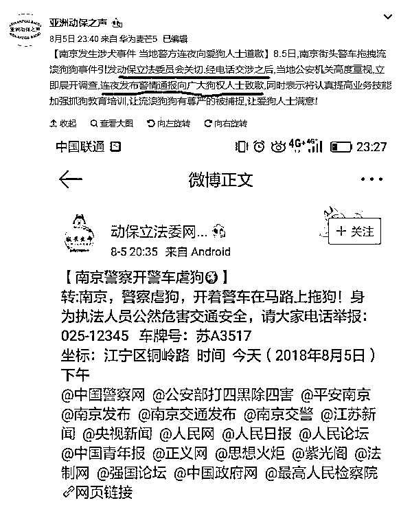
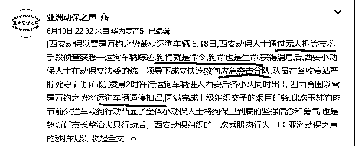

# 撤销打狗办，成立爱狗办，可有效杜绝恶犬咬人

2018 年 1 月 1 日，数十名动保人士聚集长沙街头为前一天被长沙民警棒杀的流浪犬献花圈、点蜡烛，以严重败坏长沙警方形象的方式施加压力，试图迫使长沙警方道歉。在长沙警方拒不道歉的情况下，1 月 5 日，北京数十名动保人士围堵湖南省驻京办，再次要求长沙警方为打死的流浪犬道歉。

长沙警方认为自己出警处置流浪犬合情合理合法，所以拒不道歉，结果招来了大祸，惹出了二起聚众闹事，差点引发群体性事件。所以 2018 年 8 月 5 日，南京警方出警处置流浪犬的时候，虽然手段合情合理合法，但是在遭到了动保组织的攻击，瞬间打爆南京警方的报警热线的情况下，没有丝毫抵抗，干脆利落的选择了道歉。南京警方不想惹麻烦，所以狗霸王取得了对公安系统的碾压性胜利，这是中国警方在合法出警处置流浪犬的情况下对狗权组织的**首次公开道歉**。

长沙警方估计是中国警方对狗权组织的最后一次公开抵抗了，南京警方不抵抗直接道歉后，全国警方对流浪犬的群众报警基本都处于瘫痪状态，没人敢出警捕杀。为什么他们不敢依法办事了呢，因为在历次关于流浪犬的冲突中，警方都遭遇了舆论攻击的线上打击和聚众闹事的线下打击。

**1.靠宠物行业赚钱的各路老板，是舆论攻击的主要实施者**

为什么和狗相关的事情，屁大一点事都有人带头组织闹事，因为这些人从狗身上获得了巨大的利益。而和人有关的事，就算被咬死了也不见他们出头。因为被咬伤咬死的人，正是宠物特权的奠基石，没有这些人的凄惨怎么能凸显宠物狗的特权，没有特权怎么能推升宠物狗的地位，而不推升宠物狗的地位，怎么能诱导更多的人养狗，没有人养狗，他们吃什么。

靠宠物行业赚钱的各路老板，就是一群**靠狗吃饭的人**，他们是宠物狗行业的巨大既得利益者。

不管是把狗当货物四处贩卖的狗老板，还是给狗洗澡的、贩卖狗粮的，他们都会对外宣称自己非常爱狗，而且这些人为了招揽生意，通常都会注册很多营销号，名字的标志性特征就是带有**宠、萌、犬**字样，日常发布内容带有典型营销号特征，基本都是以发布各种狗狗可爱瞬间的照片或者简短视频这些**不需要动脑子**的资料吸引同情心，以**攻击**各地依法捕杀流浪犬的警察获取影响力，然后扩大他们的宠物生意。

历次警方被舆论攻击事件，带头攻击者，均是这些含有**“宠、萌、犬”**等字样的营销媒体账号，不管这件事违不违法，是否辱警，都无所谓，只要人多势众，达到了法不责众的标准，那么就可以疯狂攻击警方吸引眼球，因为这属于无风险套利。

这些证据截图简直不要太多，成千上万，我这里就不赘述了，大家网络随手一搜就可以了，我在前几篇文章中，关于宠物行业老板对警方舆论攻击的描述已经很详细了，所以今天这篇的这一段就稍微短一点。

所以，这些打着爱狗名义的宠物犬行业既得利益者如果得不到解决的话，中国警方处置流浪犬遭到的舆论攻击就会**源源不断，永不停息**。

**2.不闹事，假动保组织靠什么骗钱**

宠物行业的老板们，虽然有钱有闲，但是顶多发动舆论攻击，而不会到现场搞什么事情，狗霸王四连击**“断章取义、造谣抹黑、人肉攻击、聚众闹事”**。他们只能使用前三种，因为家里还有狗生意要做，抽不开身，所以他们顶多只能算大狗霸王，最喜欢干的事情是蛊惑洗脑小狗霸王来当枪使，而不是聚众闹事。

那么聚众闹事是什么人组织的呢，那就是**终极狗霸王**-假动保组织，注意我这里使用的词汇是**假动保**。中国每个市都有一个动保组织，甚至很多县级都已经开设了 XX 动保，XX 小动物保护等组织，换句话说，中国的动保组织，已经有数千个，这里面**有真动保**，但是我可以负责任的说，**绝大多数都是假动保**。

真正的动保是一们极为严谨的科学,里面涉及到生态平衡、环境保护、物种多样性等多个方面，很多真动保人士冒着恶疾和蚊虫的风险在非洲丛林长期从事动保工作，甚至还要和持枪的偷猎人员对峙，这才是真动保，因为他们保护的是所有的濒危动物。

动物保护这个名头，按理说应该**保护的是濒危动物**，地球上濒危需要保护的动物至少几千种，他们是迫切需要动保组织出面保护的，动保的人力物力应该优先投入到濒危动物身上。

但是中国大多数动保，在中国很多列入濒危名录的动物都无人保护的情况下，把全部精力和资源都投入到流浪狗身上，其他濒危动物完全当做不存在。为什么他们这么做呢，很简单，打着动保旗号之后，**救流浪狗能挣钱，救其他濒危动物挣不到钱**。

假动保组织需要资金，而他们的资金来源于民众的捐款，所以他们的一切行动，都围绕着能**获得更多的捐款**而运作。

那么怎么才能获得更多的捐款呢，只有靠狗才可以，其他濒危动物都不行。因为持有狗的人数是最多的，**靠狗讲故事很容易挑逗狗主人的感情**，靠其他动物就很难获得狗主人的共鸣，所以聚拢狗主人之后，就获得了捐款人的基数。

然后，就是要**靠闹事**了，为什么要闹事，因为聚众闹事才能凸显组织的力量，才能让你心甘情愿的捐款，高速非法拦截运狗车辆你一个普通的狗主人敢做吗？带头围攻公安局要求公安给流浪狗道歉你一个普通的狗主人敢做吗？不敢，但是假动保组织敢，而且他们还成功了，但是活动需要经费，为了天下流浪狗的幸福生活请慷慨解囊，从几十上百个群里，捐款源源不断涌入动保组织的公司账户甚至是**个人微信账户**。

不聚众闹事，怎么能凸显组织的强大；不聚众闹事，怎么能扩大自己的影响力；不聚众闹事，怎么能获得捐款经费。所以我们可以看到，哪里有流浪狗死亡，哪里就有他们的身影，而且是第一时间响应，第一时间行动，因为这就是他们的饭碗。

各地动保协会遍地开花，基本上都是没有经过政府审批的，可以说绝大部分都属于非法民间组织，以赚钱为第一目的。同行之间也有竞争，虽然都一致对外，但是为了能吸引更多的捐款，这些同行经常互爆黑料，揭发对方**贪污善款**的行为。

山东省泰山动保中心曾被人实名举报**骗捐**，瞒报收容犬只数量，降低伙食标准来**贪污善款**。

这家机构每个月收取的**善款达到数十万**，全部进入组织账户，资金是如何被使用的，一直都是**糊涂账**，贪污多少根本就个是迷。

在举报视频中，人们清晰的看到了几只鸡在啄食死亡狗狗的尸体、而喂给狗狗的食物被形容为“**蛆都不会吃”**。

警察前往调查情况时发现，在资金账本上和宣传资料上均显示的 1200 只狗狗，实际清点只剩下了 620 只，也就是说，在不降低伙食标准的情况下，**有一半的资金轻而易举的从账面上就被贪污了**。至于伙食标准，宣传资料中给狗狗喂的鸡排没看到，倒是看到了鸡吃饿死的狗狗，具体贪污多少，**根本无从查起，**而很多善款，甚至是**直接流入个人账户**。

而神反转发生在十天之后，泰山动保组织不仅没有就虚报基地内活犬数量的骗捐指责做出解释，反而告诉媒体实名举报的人也是同行，激情对骂，并互爆黑料指出**视频发布者曾勾结境外组织用虐狗视频骗捐并抹黑中国政府**，果然同行是冤家。

实际上，全国各地的流浪狗救助中心，基本都是死亡集中营，去了那里的狗狗，生命都只剩下了倒计时，而且都是在凄惨的状态下死去的，凶猛的藏獒能**被跳蚤咬死**，你说这环境得有多恶劣，用**生不如死**都不足以形容那里的狗狗存活状态之惨。

所以，全国各地关于动保组织为假动保的指责从未停息，即便是各地的动保组织内部之间，也经常**指责对方为假动保，自己是真动保**，以此来吸引更多的捐款，那么怎么才能证明自己是真动保呢，是不是去救助濒危动物的算真动保呢，不是的。

从实践中我们可以看到“真动保”的鉴定标准，**谁敢高速拦车救狗谁是真动保，谁敢为人狗同权辱骂政府谁是真动保，谁能经常第一时间发布出虐狗虐猫视频谁是真动保。。。**

为什么会出现这么**荒谬**的鉴定标准，因为只有以狗为幌子，才能博取爱心，只有激进的极端行为，才能吸引眼球。当你看到假动保组织**拍摄的各种可怜狗狗的照片和极端行动的视频**之时，望着自己怀里可爱的狗狗，一激动，20 块钱就打过去了。

各地争抢“真动保”的名头，其实不是为了真动保，他们是为了更多的捐款，所以你才会看到令人瞠目的各类高速拦车救狗，各种名目的动保募捐，结果**狗没了，钱也没了，但事搞大了**。

例如下面这个动保组织，专门配置了无人机和应急突击分队，专业高速拦车抢狗，为什么对合法狗肉车这么感兴趣而对其他濒危动物不感兴趣，很简单，高速逼停运狗车可以拍出很刺激的视频，堪比美国大片，能吸引捐款，**成本低赚钱多**。而救其他濒危动物费时费力，还没啥太大的捐款效果。动保组织之所以变为狗保组织，其核心原因，就是为了**骗捐款**。

为什么动保组织这么喜欢聚众闹事，很简单啊，**不闹事，他们靠什么去骗钱。**

**3.假动保组织的舆论工具也是一害**

如果说宠物产业的老板只能使用舆论攻击的话，那么假动保组织既能使用聚众闹事，他也能使用舆论攻击，因为他们也有各类的舆论账号。

公众号、微博名字里都带个**动保或者小动物保护**字样的账号简直是铺天盖地，他们基本都是以骗捐为终极目的的假动保，其中**真动保账号寥寥无几**。我这里就不点名了，因为实在太多，给大家说一下鉴别方法。

而分辨真假动保非常简单，看他发布的内容就可以了，假动保是打着动保的名义，实际上做的是**宠保，或者说是狗保**的事情。中国需要保护的濒危动物千千万万，**鲸鱼、穿山甲、中华豚、黑熊等等都需要动保出面保护**，但是这些假动保人士只保护一种不濒危的动物，那就是狗，**其他濒危动物的死活一概不问**。当你查看这些**挂着动保、小动物保护等字样的营销号**的时候，会发现他们所有的文章，**全部是为狗说话的，没有任何其他动物的容身之地**。

这样的组织，这样的账号，还能叫动保组织吗？这是在侮辱这个高尚的词汇吧，如果**改名叫狗保组织**，我认为倒是名副其实的。

如果不愿意投入资源保护濒危动物，只愿意保护狗，那是你的自由，不过请**不要伤害真正动保人士和动保组织的名誉**，麻烦自行改名叫狗保组织。

而狗保组织的这些舆论账号，在每次的流浪狗事件中，都能为其壮大声势，**扩大募捐的影响力**，并能当做舆论攻击工具，毕竟舆论攻击始终是提前与聚众闹事的线下攻击的。

如 7 月 28 日，绵阳市公安局接群众报警处置流浪犬时，面对一只高度疑似患病的大型流浪狼犬，不顾生命危险捕捉控制带离现场，而这个狗保组织（小动物保护组织）不问青红皂白直接污蔑绵阳警方打死一条流浪犬，试图搞大事情，**瞬间吸引了大量的注意力**。

绵阳警方立刻出了通告，说我们没有打死这条高度疑似患病的流浪大型狼犬，是捕捉带回去的，你这是在造谣。

于是，**因为这条狗没有被打死**，所以这个狗保组织被新浪认定为发布不实信息，给予处罚。

这次幸好绵阳警方**没有打死**这条流浪大型狼犬，不然真的**跳进黄河都洗不清**，任由狗保组织泼黑水，然后开始狗保组织的狂欢盛宴，线上舆论攻击、线下聚众闹事，不管警方最后怎么应对，都不耽误他们**博取同情心最终可以收取捐款**。

但是我这里弱弱的问一下这个“小动物保护组织”，难道当街打死无主流浪犬不是警方的**权利**吗？这是法律所规定的，哪条法律说不允许警方当街打死流浪犬了？相反，根据法律规定，**这是警方的义务**。

而 2014 年，一条“广西玉林狗贩虐狗逼爱狗人士高价买狗”的新闻经动保组织媒体账号发布后，直接引爆舆论。

在被精心录制的视频中，我们可以看到在玉林大市场，狗贩现场虐狗，大声喊话：“你们买不买？**不买我就夹死它！**”狗贩子**三次用铁叉叉起狗**，高高举起，爱狗人士以 350 元**含泪买下**，狗贩拿得钞票，向围观人群挥舞。围观者起哄叫好。

当街虐狗卖钱事件发生后，记者逐一采访了玉林大市场诸多摊贩，所有的卖狗摊贩都表示在此多年做生意**均未见过这位同行**，附近的钢材店和杂货店老板也表示从未见过，在照片和视频中，多名网友表示这位狗贩的**衣着太过干净**，和卖狗为生的人平时穿着存在巨大反差，而且正常的狗老板都不会**去路中央高调卖狗**。

于是在整个网络群众的检索下，发现虐狗的老板为“动保人士”充当演员假扮的，被人翻出了照片，和 2012 年山空市场**故意下跪博眼球的“爱狗人士”为同一人**，还直接曝光了他的真实姓名，人肉搜索在 17 年宣布入刑，我这里就 P 掉了他的真实姓名。请问这位爱狗人士，如果你真的爱狗，怎么忍心在视频里如此凶恶的虐待那个可怜的狗狗。如果你不爱狗，你这么多年为爱狗到处跑来跑去，到底是为了什么？看你视频里把狗叉到天上时**笑的那么开心**，你是为了爱狗从事这一行的，还是**为了赚钱从事这一行的**。

甚至，连背后的围观群众，也在同一张照片中出镜，估计也是**同一个动保组织的**，而视频中花费 350 元购买犬只的人被证实为**天津小动物救助中心的刘女士**。

这么一出**自导自演**的大戏，除了给玉林泼黑水，污蔑中伤玉林的合法狗肉产业之外还有什么作用呢，没错，就是扩大自己组织的影响力，这样可以获得更多的捐款，**没有钱，谁会千里迢迢跑过来做这种龌龊的事情**。

这些的舆论工具掌握在宠物老板和假动保组织手里，任何**损害他们利益**的行为，都会被他们**疯狂攻击和谩骂**，例如这样。

所以，**狗保组织的舆论工具也是一害**，和宠物行业老板们的营销号相辅相成，互相呼应。

**4.法律对这些狗霸王无能为力**

通过上述资料我们可以知道，如果不能解决掉这些源头，那么不管怎么做，**在利益的驱动下**，宠物行业老板和假动保组织都会**源源不断的复活**出来搞事情，政府部门和警方会承受**源源不断的攻击**，任何舆论风暴都只能解一时之困，而**不能根治问题**。

那么有没有可能通过改进法律来解决这个问题呢，不好意思，不止是现行法律对这些人无能为力，就算这个法律你怎么改，对他们也是**完全无效**的，因为他们**披着爱心的虎皮**。

道理很简单，我是宠物店老板，我卖狗卖狗粮给狗洗澡有错吗？我爱狗，注册几个账号发布爱狗视频照片有错吗？我就是同情流浪犬，我写几个帖子监督下警方有错吗？

我是动保组织，我就是关心小动物，我就只喜欢去救狗，哪条法律规定动保组织必须救濒危动物了，狗不属于动物吗？我负责救狗，其他动保组织负责救其他濒危动物就是了，中国是有几千种濒危动物，但是也有几千个动保组织啊，一个人负责一个动物就是了，**我就负责狗**。

所以你能单凭他只发布狗的内容就定义他是假动保组织吗？民间是可以直接这么定义，但是法律上不行，法律是非常严格的，讲究证据，你有证据证明他是假动保组织吗？没有，从法律上，只救狗是没有任何问题的。。。

所以，在这里宠物店老板和动保组织是钻了法律一个大大的空子，所以才会形成如今这么恶劣的局面，**城市宠物犬被污名化妖魔化**，动保组织也从一个高大上的组织变成了臭名昭著的**狗保组织**，**真动保组织被连累的都抬不起头**。

至于舆论账号，那就更没办法了，我们也是公民，哪条法律规定我们不能说话了，不知道言论自由吗，我就是爱狗，**我爱狗快爱死了，是天生的**，和我从事的行业一点关系都没有，**我就发爱狗言论犯法了？**

所以，穷尽所有法律，对这些人都是无可奈何的，他们**把自己的私欲隐藏在爱心的外衣**下面，**以爱心为保护伞，他们无可匹敌**。

那么是不是对他们没招了呢，我思来想去，还真的有一个办法可以解决这一切，那就**成立爱狗办**。

**5.撤销打狗办，成立爱狗办，可以从根源上解决这一切**

大狗霸王和终极狗霸王，违法乱纪的事实是非常多的，之所以能逃脱法律制裁，只是因为**披着爱心的虎皮**，让各级政府束手无策，那么要从根源上解决乱象，只能**以爱心对爱心**。

中国各地的政府，为了解决城市犬患，都成立了**打狗办**这么一个组织，但是实际效果惨不忍睹，在狗行业相关利益群体宠物老板和狗保组织的冲击下，连警察都不敢打流浪犬了，你这个打狗办，**打条狗给狗保组织试试看？**

而打狗办的成立目的，并不是为了打狗，而是为了**解决城市犬患**，这才是真正的目的，那么我们完全可以**换个思路来进行城市管理**，从源头解决这一问题。

首先，各地打狗办全部撤销，按动保人士的话说，光看打狗办这个**名字**就透露出一股浓浓的冷血和邪恶的气息，肯定不会干啥好事。

然后，政府应成立**爱狗办**，爱狗办主要从事什么工作呢，**第一是负责救助城市流浪狗，第二是负责提升城市宠物狗的生活质量，**只做爱狗的事情。

只要爱狗办做到了这二点，那么就可以从根源上解决城市养狗乱象，让恶犬不再咬人。

**6.救助城市流浪犬是爱狗办不可推卸的义务**

首先，城市流浪犬是非常可怜的，各地狗保组织收容流浪犬的行为应得到政府的支持和鼓励，但是各地的狗保组织贪污普通民众捐助的善款是非常普遍的现象，民众为了救助流浪狗捐助的善款，没有用到流浪狗身上，却被狗保组织拿去花天酒地了，这是**严重侵害城市流浪犬和捐款群众权益的行为**。

所以，爱狗办应**成立流浪犬慈善专用账户**，专款专用，严禁任何组织和个人**私下收取善款**，每一笔款项的进出都**应在政府监督之下进行**，现在很多善款甚至是用红包的形式**发给狗保组织个人微信账户上**的，他到底拿去干嘛了，谁也不知道，指望他全部用于流浪犬的难度，**不亚于指望他是个圣人**。

所有民众的善款，都收集起来之后，**由爱狗办统一分配，谁救助的流浪狗多就给谁多**。绝对不能按照之前那样，谁募捐的能力强大，谁拿的钱就多，这样只能**诱惑狗保组织去闹事来吸引捐款**。

然后，爱狗办应成立**爱狗督察大队**，每星期都不定期检查本市所有流浪犬收容基地内犬只的生存状态，核对犬只数量，核对伙食标准，确保专款专用，实报实销，善款不会被人大肆贪污，**确保每一分钱，都用在流浪犬身上，**坚决杜绝贪污，一分钱都不行。

所以，你是动保组织也好，狗保组织也罢，那是你的自由，我们不管，但是你所募捐来的善款，政府**有权且有义务去监督**，所有募捐资金必须**进入政府专用账户**，由爱狗办监督统一使用，确保专款专用全部用于流浪犬只，鼓动群众，**使用私人账户吸纳善款，以诈骗罪论处**。

当年有医闹专业户，是因为**以医闹为职业可以赚钱**，今天有狗闹专业户，那是因为**以狗闹为职业，也可以赚钱**。一旦掐断了他们赚钱的途径，我可以保证，那些口口声声爱狗的人，瞬间就会**消失掉九成九**，只留下一些愿意常年做义工，一分钱不要都愿意救助狗狗的**真正爱狗之人**，这样的人，根本不用担心他会为了得到更多的捐款而四处闹事，因为**他本来就不爱钱**。

所以，这个监管条例推行之后，可以保证不会发生**有组织有预谋的线下聚众闹事**这种恶劣的事情，各地公安机关可以恢复运转，城市的流浪犬，依法办事，该捕杀捕杀，该送收容就送收容，爱狗办只需要**监督好狗保组织别非法闹事**就行了，打狗的事情，让公安机关**依法办事**就可以了。

众生熙熙皆为利来，你想赚钱可以，也支持，但是**请去其他行业**，不要**披着爱心的虎皮来骗钱**。

**7.提升城市宠物狗的生活质量也是爱狗办不可推卸的义务**

解决掉线下聚众闹事这件事，那我们就要解决掉线上舆论攻击这件事了，怎么解决呢，也有办法，那就是爱狗办应该**全方位提升城市宠物狗的生活质量**。

我们都知道，现在的宠物行业，是一个**无门槛的行业**，什么人都可以参与，什么人都可以进来做狗的生意。

**素质参差不齐的从业人员**，注定**无法保证**城市宠物犬的生活质量，如何保证初生狗狗的安全，如何保证狗粮的质量，如何保证给狗狗规范洗澡，如何确保从业人员不黑狗主人的钱，这些都是问题。门口的早餐店还被食品卫生监督管理局天天查呢，凭什么**狗狗就要吃来路不明的狗粮**，谁敢保证**里面不渗假**。

所以，我建议**爱狗办**应该从提升城市宠物犬生活质量的角度出发，**对整个宠物行业，建立行业准入制，实行严监管**。

从事宠物犬行业的人，每一个都应该考试，确保其理解城市养狗规范条例，确保其知晓狗狗的各项养护要点，确保其知道给狗洗澡的科学姿势，确保其知道狗粮制假贩假的惩罚严厉程度。经爱狗办考核后发放**宠物犬特许营业许可证**，然后才可以从事宠物犬行业。

然后，这个特许营业许可证不是无限发放的，而是**限额发放**的，每年爱狗办都要进行巡查，如果发现有违法行为，则取消许可证。另外，宠物行业**严禁网络售卖，只允许线下售卖**：

任何宠物犬活体网络售卖，这是对狗狗生命的极大不尊重，狗是人类的伙伴，**不是一件邮来邮去的货物**，快递运输活体**死亡率高**，难道你不知道?所以如购买宠物犬活体，请到**线下爱狗办指定的合法商店**去购买。

任何网络狗粮的售卖，都是**对狗狗生命的不负责**，狗粮极难辨别真假，优质狗粮和伪劣狗粮成本相差百倍，但是几乎分辨不出来。狗狗这么金贵的生物，怎么能吃劣质狗粮，为了**彻底杜绝制假贩假**，所有的狗粮，应该**由爱狗办指定并经常抽查的线下商店**进行购买，确保每一包狗粮都是货真价实的狗粮，确保每一条狗狗，都不会吃到劣质狗粮，这是爱狗办经常线下抽查的功劳，所以**必须严禁网络销售**。这个道理同样可以推演到狗笼子、狗绳子等一切狗用商品。

这样做有什么意义呢，有的，首先是**大幅度提升了城市狗狗的生存质量和生命安全**，其次就是那些靠爱狗和骂政府累积客源的**宠物行业营销媒体账号**，就没什么存在的价值了。

**8.以爱为名，一样可以解决城市犬患**

中国犬患治理难的最主要原因，就是中国有了一批靠狗吃饭的利益阶层，这些人为了**捍卫自己的利益并赚取更多的利益**，无所不用其极。中国从来就没有人狗矛盾，也没有太多的狗主人矛盾，最大的矛盾是**不养狗的合法公民**和**宠物狗利益链条既得利益者**的矛盾。

所以，解决犬患的着眼点在狗身上是很错误的，中国没有人狗矛盾。着眼点在狗主人身上意义也不大。我们首先要做的，就是把**着眼点放在宠物狗行业既得利益者**身上。

**爱狗办的存在，以爱为名**，一样可以解决城市犬患，而且他能得到全社会的拥护：

首先，他对流浪狗的善款进行了专款专用的操作，**解决了目前的大肆贪污问题**，能得到捐助善款之人的欢迎。

其次，他对鱼龙混杂的宠物犬行业进行了规范整治，在发放特许经营许可的威慑下，制假贩假的成本一下子提升了，宠物狗再也**不用担心花优质狗粮的钱买到劣质狗粮了**，会受到已经拥有宠物犬的狗主人的欢迎。而他对贩卖宠物犬活体的严格规范，也**能避免很多幼犬的死亡**，这一点也是符合动保组织和爱狗人士的宗旨的。

最后，当爱狗办杜绝了以聚众闹事骗捐，以舆论攻击吸引顾客贩卖狗用商品的利益链条之后，**对公安局的舆论攻击和聚众闹事打击就会瞬间减轻很多**，公安局可以按照法律自由执法之后，城市基本不会有太大的犬患，可以**得到广大深受犬患困扰的普通公民的拥护**。

对于真正有实力的商家而言，从严监管，只会清洗掉小老板，**对他们的生意是一个巨大的促进**，唯一代价就是要服从政府监管，不能乱闹事了。

那么什么人会从中利益受损，而疯狂反对这个方案呢，**你猜？**

而政府，在重大民生领域，尤其是引起了巨大民怨和冲突的民生领域，本来就**有加强监管的义务**，它也有这个权利。

一味的暴力解决不了问题，换个思路即可，**打狗办做不到的事情，爱狗办可以做到**，以爱为名，城市犬患不仅可以得到解决，而且可以得到根除。

撤销打狗办，成立爱狗办，可有效杜绝恶犬咬人，**还能杜绝恶人咬政府**。

*（本文不标原创，不放打赏，放弃版权，欢迎转载）*

> 往期精彩文章回顾
> 
> 中国狗伤人的数据触目惊心，狗霸王们却视若无睹
> 
> 他们连警察都不怕，难道还会害怕你？
> 
> 遛狗不栓绳，应参考醉驾入刑

