# 他们连警察都不怕，难道还会害怕你？

昨天我写了一篇文章做了一次法律科普，其中描述了各地推出的养狗规范条例全部变成一纸空文的情况。然后遇到一位警察的留言，说基层民警工作不易，遇到群众报警处理流浪犬必须要前往捕捉，冒着被咬的风险完成工作后，不仅没有奖励，而且还曾有同事被狗霸王举报免职，所以基层民警不是不想贯彻落实法律法规，而是没有办法。

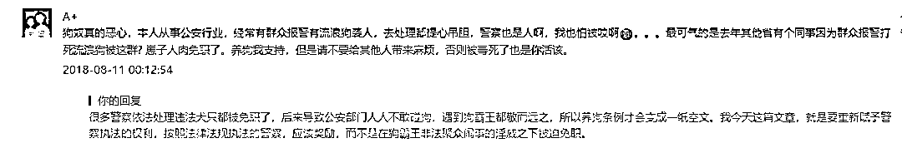

而今天上午，我接到杭州市公安局的电话，问我是不是写了几篇关于文明养狗的文章，我问怎么回事，他说接到很多报警电话，热线快被打爆了，所以找我了解一下情况。于是我把这件事原原本本的告诉他了，把自己的想法和态度全部告诉了他，说自己是要推动全国文明养犬。

他和我聊完之后，忽然压低声音劝我不要再写了，我很好奇的问为什么，他说我不是以公职身份和你说的，而是以**私人身份**和你说的，别写了，不要再刺激他们了，过几天这事就过去了，你不是公安系统的，不知道他们的厉害，你是**惹不起他们的**，我这么说是**为你好**，然后就把电话挂了。

于是我就去搜索了一下过去几年公安系统和狗闹们的冲突新闻，发现全部是完败，形势特别恶劣。鉴于以上二个事件，我决定今天单独为公安警察写一文，**为警察发声**，重新树立警方的执法威严。

首先，我以今年 1 月的长沙警察打狗事件为例，来看一看警方在处理狗闹事件中的无奈。

2017 年 12 月 31 日，一只金毛犬在街头不断攻击路人，10 分钟内连续咬伤 4 人，长沙民警接到群众报警后抵达现场，依据《长沙市城市养犬管理规定》，未佩戴犬牌且无人牵领的户外犬只，一律视为野犬，由公安机关予以捕杀。

故民警决定依法捕杀金毛犬保护民众安全，但是由于民警未配备麻醉枪，且短时间未找到狗主人，手枪射击又容易跳弹伤人，为防止该狗伤害更多行人，民警遂用木棍对狗进行扑杀。

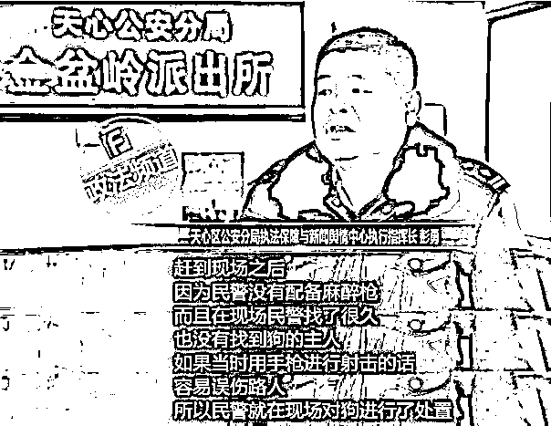

这名民警出警迅速，处置果断，在装备不足的情况下，冒着被咬的风险采用简陋工具消灭安全隐患，保护了人民群众的安全，那么这名民警是不是应该被嘉奖呢。

没有，这名民警捅了天大的马蜂窝，他很快遭遇了狗霸王的专属四连击：**“断章取义、造谣抹黑、人肉攻击、聚众闹事”**。

当天晚上，一则 9 秒的短视频疯狂流传，这个短视频把长沙民警出警的全过程**掐头去尾，断章取义**，只留下棒杀金毛犬最血腥的那一个瞬间。

当天晚上，某些宠物利益领域的带头人，开始对长沙民警进行了舆论攻击。

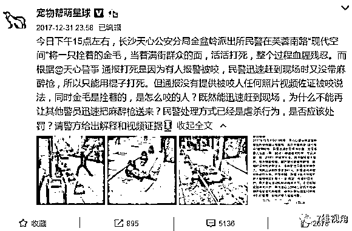

一个大狗霸王的发言，引来了很多小狗霸王的跟风，反正狗狗任何时候都是对的，狗狗任何时候都不会咬人，警方一定是错的。

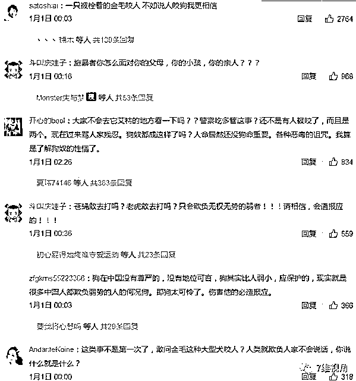

而实际上，连训练有素的警犬，警察都一刻不敢松开狗绳，很多场合还要带上口罩，没有丝毫信心自己严格训练的狗狗不咬人。不知道那些普通人是哪来的自信我家狗狗不咬人，只有文明养犬，才能确保狗狗不咬人。

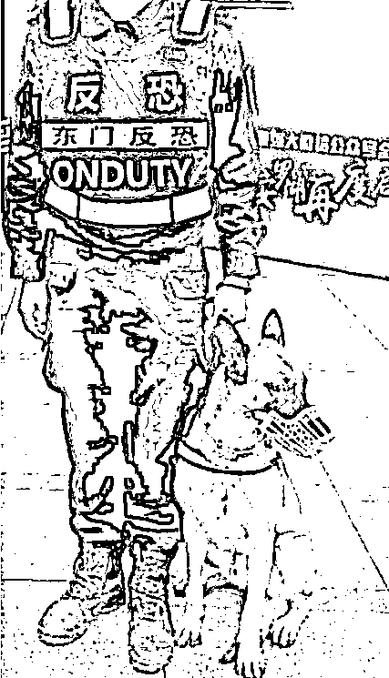

次日上午，一则**谣言**疯狂流传，说长沙民警故意虐杀金毛犬，明明可以迅速捕杀的金毛犬，硬是要虐杀 4 个小时。

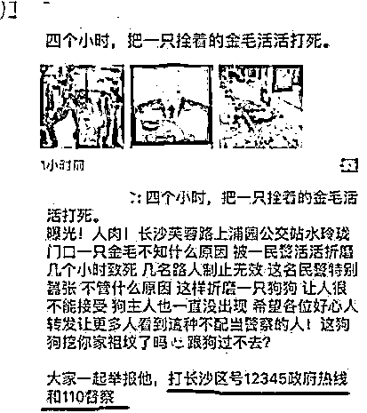

然后，造谣抹黑的**高潮**来了，某些打着动物保护旗号的流氓组织，里通外国，迅速翻越我国网络防火墙，在美国用推特发布恶意抹黑中国警察和中国政府形象的新闻。

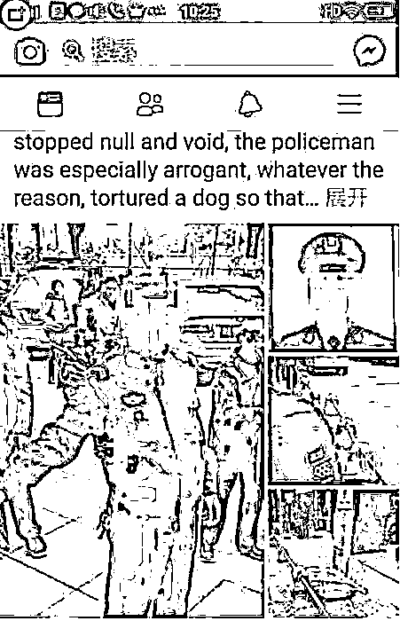

看完这些图片你的第一感受是什么，长沙民警是个人渣啊，恶意虐杀狗狗 4 个小时，美国是个非常爱狗的国家，媒体迅速就燃爆了，这可是中国人自己爆料的，至于这个新闻素材是真是假，美国媒体才不关注呢，正愁找不到中国黑材料呢，送上门的东西当然要大肆宣传，抹黑整个中国警察乃至整个中国的形象。

看到有人大规模的造谣抹黑后，长沙警方迅速澄清事实，向公众说明真相。

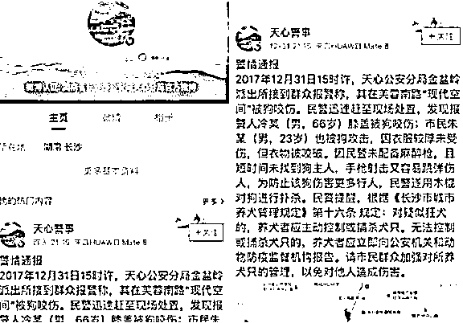

按照正常的法治社会，警方澄清真相之后，按照对应法律条文，看一看处置是否合法，这事就算结束了。但是长沙警方碰到的是不讲理、不讲法的对手，也就是**狗闹大军**。

1 月 1 日下午，数十名狗闹来到长沙街头，无视长沙民警是**依法办事的事实真相**，公然给咬人金毛犬当街送花圈、点蜡烛，严重败坏长沙警方形象。

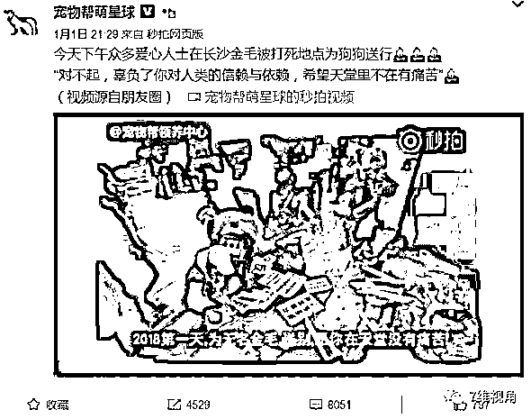

然后开始了大规模的**舆论攻击**，当时的狗闹们要求长沙警方开除执法民警，并向棒杀的金毛犬公开道歉。

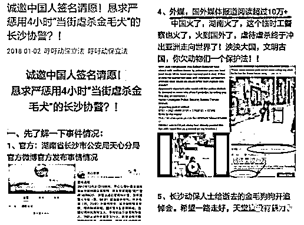

更有甚者，要求把执法民警**送进监狱**才能平息此事。

你以为这就完事了？完成**造谣抹黑****和****舆论攻击**这二个步骤后，立刻开始下一步，大规模的**人肉攻击和聚众闹事**。

首先，是发动了对长沙执法民警的疯狂人肉攻击，在找错人的情况下，一天之内，一民警的电话被打爆，收到近万条**辱骂、恐吓**短信。

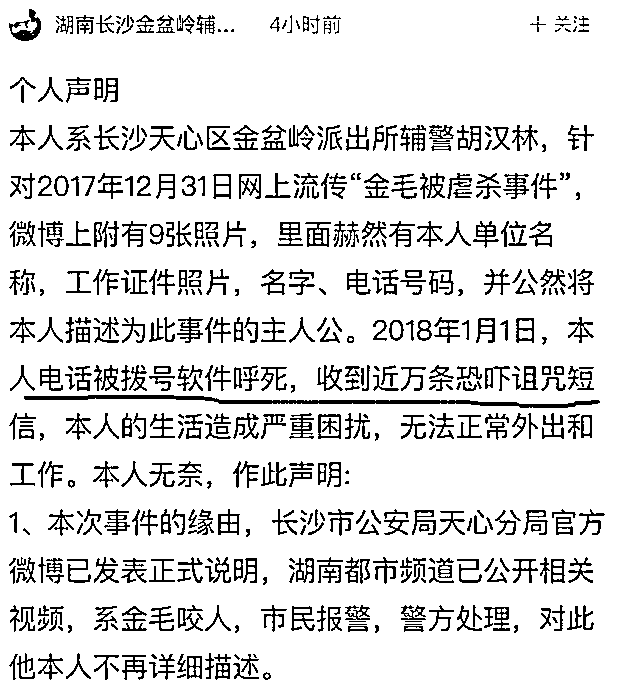

这些**辱骂警察**短信的内容，我猜应该大部分都长这个样子。

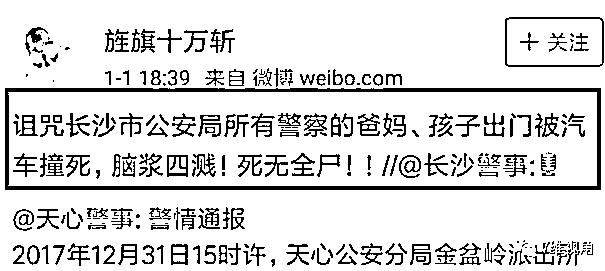

然后，甚至有“爱狗人士”找到该民警的家，上门**“理论”**，甚至有“爱狗人士”往该民警奶奶家门口送**花圈**。

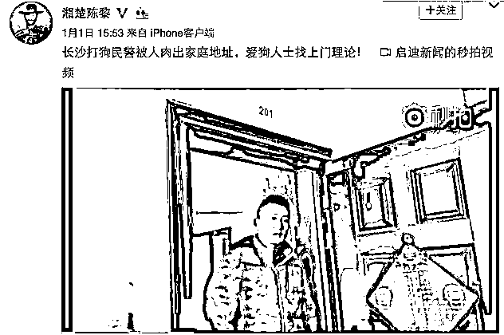

你以为这就算完了吗？没有，狗闹们向长沙警方发动了电话轰炸攻击，试图强迫警方道歉。

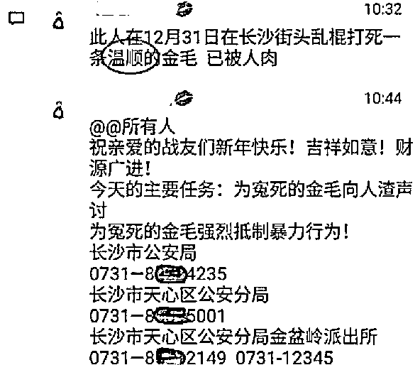

长沙接警电话，24 小时不断，几乎时时刻刻都在被人轰炸式攻击，严重占据了警力资源，并对正常的报警电话形成了碾压式干扰，严重损害了正常的报警公民维护自己生命安全的权利。

围攻派出所这种事都敢做，这已经是狗闹的极限能力了吧，你错了，**他们的能量远远大于你的想象**。

1 月 5 日上午 10 点 30 分，狗霸王们把**湖南省驻京办**给围堵了！这批人以前还因为吉林族吃狗肉的事情围堵过吉林省驻京办**长达 3 天**。

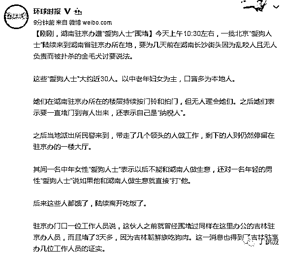

这些狗霸王连湖南省驻京办都敢围堵，还怕一个小小的长沙公安局？讨要说法，讨要什么说法，还不是逼警方道歉那一套。

在此次事件中，长沙警方完全**合法合规**的做法，却引来了滔天大祸，虽然顶住了压力没有开除这位民警，但是任何一位领导都不喜欢惹麻烦的下属，这位民警日后的晋升之路，要比别人困难十倍。

而在此次事件中，狗闹的多种行为均涉嫌严重违法。在本案中，违法狗闹们实施了大规模围攻公安局以及围堵驻京办的行为，轰动全国，而且严重辱警，怎么看都应该属于情节严重，按理应该处以法律规定范围的最高刑罚。

1、根据《治安管理处罚法》第二十三条之规定，扰乱机关、团体、企业、事业单位秩序，致使工作、生产、营业、医疗、教学、科研不能正常进行，尚未造成严重损失的；处警告或者二百元以下罚款；情节较重的，处五日以上十日以下拘留，可以并处五百元以下罚款。

所以，打爆派出所的电话，占用警力资源，影响警方的正常工作的行为是严重违法的，每一个打电话的人，都应处以十日拘留，并处 500 元罚款。

2、根据《治安管理处罚法》第四十二条之规定，多次发送淫秽、侮辱、恐吓或者其他信息，干扰他人正常生活的，可处五日以下拘留或者五百元以下罚款；情节较重的，处五日以上十日以下拘留，可以并处五百元以下罚款。

所以，给执法民警发送辱骂短信的人，每一个人都应处以十日拘留，并处 500 元罚款。

3、根据《最高人民法院、最高人民检察院关于办理侵犯公民个人信息刑事案件适用法律若干问题》，在“人肉搜索”案件中，行为人未经权利人同意即将其身份、照片、姓名、生活细节等个人信息公布于众，实际是向不特定多数人提供公民个人信息，情节严重的，处三年以下有期徒刑或者拘役。

所以，公布执法民警身份、照片、姓名、生活细节等个人信息的人，每一个都应处三年有期徒刑。

如果严肃执法，违法必究，这一波估计要**上万人**进局子里拘留悔过，还有**几十人要进监狱**，但是最终这件事怎么处理的呢。

1 月 7 日，长沙市公安局称，已对涉嫌散布当事民警隐私以及侮辱当事民警的两人拘留 5 日，此事终结。

为什么长沙警方的处罚如此之轻，和狗闹们犯下的罪行相比简直是九牛一毛。因为警察也是人，也有无奈的苦衷。在此次事件中，长沙警方，从基层员工到上级领导，都知道这件事**警方做的一点问题都没有**，所以顶住了巨大的压力拒不向被打死的金毛犬道歉。

但是**聚众闹事**这个狗闹的法宝一旦祭出，警方就不可能对所有的群众一网打尽，甚至不敢从严执法，因为怕激起群体性事件，一旦出现群体性事件，不问青红皂白，地方警局领导首先就要负责任，然后才能开始慢慢处理事情。

在这样的压力下，所有的地方事件，都是**按闹分配**的，政府机关如此，警方也是如此，大事化小，小事化了是各地政府机关以及警方无奈的选择。警察不是不想从严执法，但是**警察也是人**，家里也有老婆小孩要靠他们的工资吃饭，如果因为要严惩狗闹丢掉了自己的饭碗，那自然是没人肯做的。

当年**医闹**的存在，严重伤害了医疗系统和医生的权益，使中国医疗水平严重倒退，侵犯了千千万万的普通中国人权益，如今**狗闹**的存在，也让中国的养狗文明严重倒退，侵犯了千千万万普通中国人的权益。

警方作为**法律的捍卫者**，绝对不允许按闹分配，以和稀泥的手法处理群体事件，否则任何人只要聚众闹事，警方都会束手无策，甚至可能反而被其压制。

所以，我这里提出第一个观点和要求：对于警方应给予特权，爆发群体性事件后，第一个要做的是审核警方的**所作所为是否合法**，而不是无脑责罚。发生群体性事件后，只要警方从头到尾所有的处置流程都愿意曝光，而且全部是**依法办事**，那么无论逮捕多少人，闹出多大的事，所有人都应该表示支持，而且**应该嘉奖**。

法不责众是人治社会的手法，严重损害了警方的威严，而**警方的威严就代表了法律的威严，法律的威严就代表了国家的威严**。

**有法必依，违法必罚，天网恢恢，疏而不漏**。这是我今天的第二个要求，警方的执法威严，必须强化，中国人必须**敬畏法律**，而不是**敬畏能闹事的人**。

什么人算狗霸王

前几天我提出了狗霸王概念后，很多人问什么样的人才算狗霸王，是不是只要养狗的人，都算狗霸王。

当然不是，实际上，大多数养犬人是非常善良并且愿意遵守法律的，我甚至还看到了有人自己就是养狗的，还在小区群内呵斥其他养狗人要求他们栓绳遛狗，这样的人不仅不是狗霸王，还是中国未来文明养狗的希望。

什么样的人算狗霸王，我的态度很明确，满口污言秽语，**不遵守法律法规**，特别喜欢狗霸王四连击**“断章取义、造谣抹黑、人肉攻击、聚众闹事”**的人，全部属于**狗霸王**。

掐头去尾只截取 9 秒视频诬陷长沙警方的人，算不算狗霸王？

造谣长沙警方虐杀 4 小时金毛犬的人，算不算狗霸王？

长沙街头给死亡金毛犬祭奠，无理要求长沙警方道歉的人，算不算狗霸王？

上万条短信辱骂正常执法民警的人，算不算狗霸王？

给执法民警奶奶家送花圈的人，算不算狗霸王？

打爆长沙公安局报警电话，掐断群众生命安全热线的人，算不算狗霸王？

非法围堵湖南省驻京办的人，算不算狗霸王？

结果已经不言自明，任何一个守法的公民，都不会做这种严重违法的事情，做这种事的人就算不是狗霸王，也会是猫霸王，车霸王，**本身是流氓的人，做什么事都流氓**。

为什么他们敢这么做，因为他们知道警察拿他们无可奈何，做这种违法的事情是非常安全的，不用担心遭到惩罚。为什么他们有这样的底气，是因为在过去十几年的战斗中，他们**百战百胜**，在动物保护的旗帜**幌子**之下，害怕引发群体事件的各路政府部门都拿他们没辙。

大家可以自行搜索网络，真的是百战百胜，**从无一次败绩**，气势越打越强，现在很多政府部门都怕了狗霸王了，纷纷**敬而远之**，这也就是杭州市公安局的人以个人身份建议我不要惹他们的原因，因为公安局都**惹不起**。

这种情况合理吗？肯定不合理，是时候来一次全国性的严肃执法来震慑狗霸王的非法行为了。

而绝大多数狗霸王，还有一个特点就是自私自利，只顾自己私欲而不顾他人死活，例如下图这个狗霸王，这是一个派出所警察私信的真实故事。

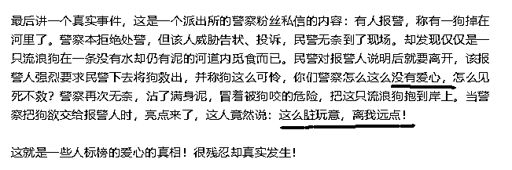

这个故事，同样适用于那些流浪狗，狗霸王们宣称，流浪狗也是生命，理应好好爱护，不然就是没有爱心，就算咬人了，那也是其他人做的不对。但是如果让这些狗霸王们把这些流浪犬**带回家自己养**好体现他们的爱心，他们会众口一词的拒绝，**什么脏玩意，离我远点**。

狗霸王背后的利益链

实际上，在长沙事件中，跟风而来的普通闹事者，他们充其量只能是小狗霸王，而他们背后是一些带头的大狗霸王。

很多人都很疑惑这么一件事情，为什么这些狗闹**如此有组织力号召力**，任何一个城市死了一条流浪狗，都能迅速在当地组织起几十个人聚众闹事，还能经常组织大批人手前往高速或者玉林**定期闹事**。

而对应的，很多地方有儿童被恶犬严重咬伤毁容甚至咬死，狗霸王们却**熟视无睹**，也没有一个动物保护组织**出面解决**，但是如果咬人的狗被打死，他们又会**瞬间冒出来**疯狂的攻击杀狗者。

很多人很疑惑，这批狗霸王**哪来的钱和时间**到处管闲事啊，绝大部分人都深受狗害，怎么就**没有对应的组织**出来保护人类的利益呢。

原因很简单，宠物狗的背后，从种狗繁育、小狗贩卖、宠物服务等已经形成了一个**庞大的利益链条**，他们以此来生活，从中获取了庞大的利益，所以有极强的动力来**维护他们的利益**。而对应的，被咬的人，则没有一个利益链条存在，所以就没有任何利益群体带头出面保护他们。

以带头掀起长沙狗闹事件的宠物帮萌星球为例，他不仅仅是宠物博主，其真实身份其实是开宠物店的，是宠物商业经营者！其公司就是宠物帮领中心！属于宠物狗领域的**绝对获益人群**，他绝对不允许任何对养狗的限制，也绝对不允许养狗规范条例落地执行，那样会**大大减少养狗的人数，从而大大减少他们的利益**。

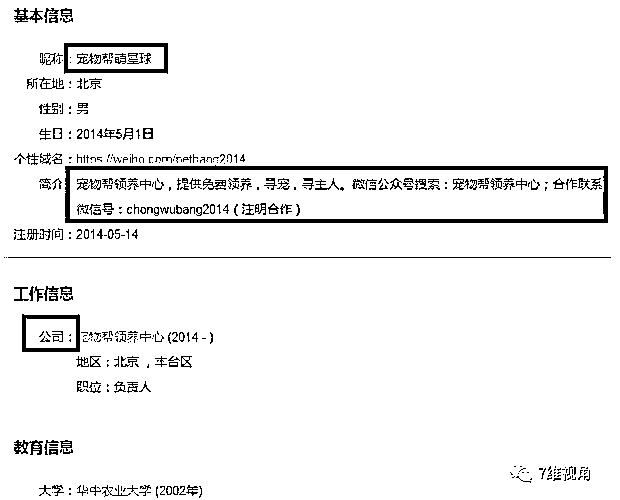

还有人肉长沙民警特别积极的一些人，为什么这么有动力呢，因为他们也是宠物狗利益链条的**既得利益群体**，以一个声称人肉打死金毛辅警的“瑞可鲁”为例，不到 24 个小时，这名“瑞可鲁”就声称已经人肉到了捕杀金毛的辅警。并教唆、煽动狗友前去照顾照顾！

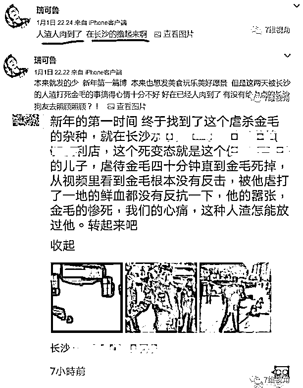

那么他是做什么的，也是**做宠物生意赚钱的**，所以他才如此有动力。

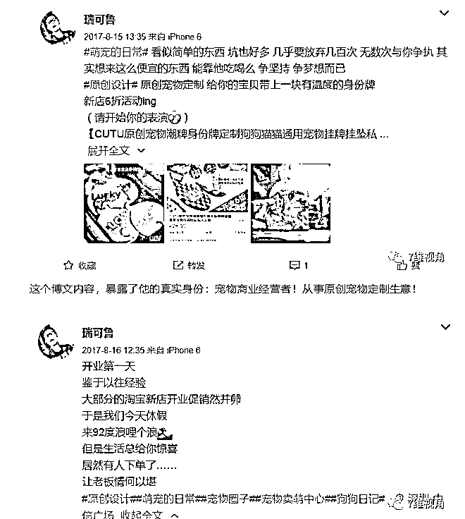

网络上知名的正能量律师“庄志明律师”对这种现象曾作出过解读，宠物狗已经形成了一个巨大的产业链条，附带了太多的利益，**做大狗****产业，****让更多的人养狗**，才符合他们的利益。

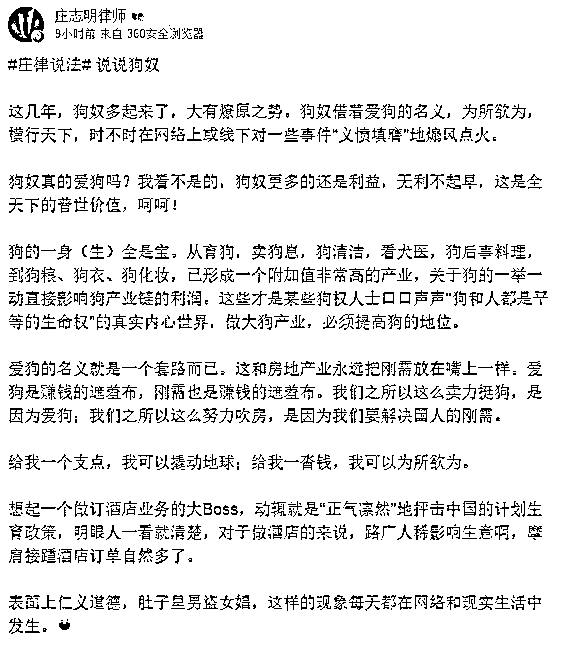

任何试图**规范养狗行为，减****少养狗人数的行为**，都是他们要拼死解决的对象。很多人不理解，不就是死了一条流浪犬吗，怎么跟死了爹妈一样，所以送了狗奴的称号。其实你们错了，他们不是狗奴，他们精着呢，如果真的是狗奴，就不会把狗当货物一样四处贩卖，而是应该当亲人养起来。

之所以他们如此激动，是因为**断人财路犹如杀人父母**，任何**可能打击到养狗产业链的行为**，都等同于杀他们父母的仇人，死的那条流浪犬，只是他们**维护行业利益**的一个**幌子**而已。

拴狗绳带口罩，贯彻执行养犬法律法规？别开玩笑了，要是能让那些东西落地，**得有多少人因为嫌麻烦而放弃养狗，这得损失多少钱**，任何做这种倡议的人，都是他们的杀人父母，**理应被消灭**，不管这个人是**依法办事的警察**，还是**呼吁文明养狗的紫竹张先生**。

为什么这些狗霸王老是盯着一条流浪狗，而故意闹出如此之大的阵仗，道理很简单，这就是美国鼎鼎大名的惩罚性赔偿的逆向代表杰作，**惩罚性闹事**。

连打死一条流浪犬或者咬人犬，你都会遭到如此严厉的攻击和惩罚，你还敢大规模的打击养狗产业吗？一点点小事，我就让你付出巨大的代价，**这种惩罚性威慑**，会让你做任何事情都束手束脚，这样可以用**最小的闹事成本，获取最高的闹事收益**，毕竟闹事的狗霸王，真的是**人群的极少数**，不采用这种办法，他们无法树立优势。

而对应的，被咬的人，却没有产业链可以受益，所以没有人带头冲锋陷阵，人被咬唯一的受益者就是疫苗生产商，他们也巴不得中国的狗越多越好呢。

这也就是为什么这些狗霸王打着“爱狗人士”的名义却在做让狗**污名化、妖魔化**的事情，他们的所作所为是在让全体中国人**厌恶狗狗**。而那些号召文明养狗，要求贯彻落实法律法规，试图让所有中国人都**喜爱狗狗**的人却在被他们疯狂攻击。

道理很简单，他们只考虑中国人养狗的绝对数量，因为这**代表他们的钱**，他们**不在乎**善良的狗被污名化、妖魔化，只要自己能发财就行。那么你说，到底谁才是真正的“爱狗人士”呢。

为了维护自己的行业利益，狗霸王们成群结队组成团体来互相援助，形成集体力量。所以，就出现了这种狗霸王虽然人数极少，但是却占据绝对优势的怪现象。

只有警察才能帮助普通人

所以，没有任何人会愿意出头帮助那些被狗咬的普通人，因为他们不愿意惹这个麻烦，过去几十年是这样，未来也会是这样，我是一个**财经博主**，不是宠物博主，不可能无限制的写文明养犬的话题，这次是被狗霸王的造谣抹黑和谩骂攻击给激怒了才连续多天发文连怼狗霸王，我最多帮你们几天，不可能永远帮下去。

所以，能够持续长久保护普通人的，**只有警方**，因为只有警方才会有这个动力，也有这个**义务和力量去保护普通人**。

而长沙狗闹事件中，长沙警方从头到尾**被彻底压制**的凄惨战况，让其他的公安局都兔死狐悲。这次闹事，狗闹们**用很低的成本，直接瘫痪了国家的暴力机器**，让狗闹们再无一丝压力和障碍，没有了敢于维护法纪的警察，倒霉的一定是普通人，为什么你家小区的人被狗咬了警察不管，因为他们不想惹这个麻烦。

事不关己，高高挂起的中国人心态，直接导致了狗霸王的猖獗，也间接导致了长沙警方失败，如果全国人民当时立刻声援长沙警方，甚至立刻在长沙街头和湖南省驻京办组织起和狗闹**一样人数**的抗议群体，长沙警方何至于承受如此之大的压力。

幸运的是，绝大多数群众的眼睛还是雪亮的，打狗的长沙金盆岭派出所，在 1 月 5 日宣布收到了全国各地送来的锦旗，肯定了出警民警扑杀伤人金毛犬的行为。虽然这些援军远远没有狗闹们迅速且暴力，但是至少说明民心所向，毕竟，这真的是人民**自发的行为**。

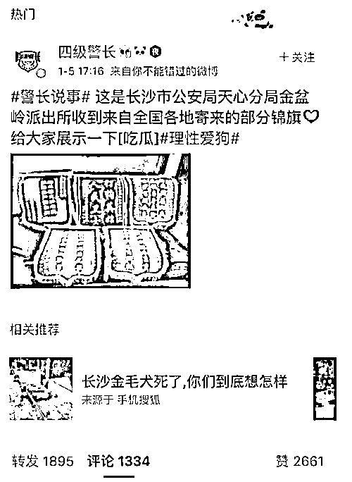

但是这些支持力度是**远远不够的**，我们应当在每一次警方依法办事激发聚众闹事事件后，只要是**依法办事**的，都应立刻予以舆论声援，注意我说的是**每一次依法办事**，绝对不仅仅是和狗相关的事件。因为警方的行为是有惯性的，如果在其他领域惧怕聚众闹事，那么处理狗闹事件里，也**依然会害怕聚众闹事**。

而这次的舆论风波，正是我们聚集力量恢复**警方执法权威**的好时机，按照我上一篇做的民意调查，从 1000 赞开始，48 个小时内数量持续上升，比例始终稳定，5 比 1，表明**84%的中国人**非常厌恶狗霸王。

这是微信的留言区点赞，只要放上墙了，任何人没办法改变点赞数量，这个悬殊的比例，足以宣告如今的**民心大势**，而在各大网站发布帖子的公开留言区里，不管主题是支持我还是反对我，所有的评论也基本呈现一边倒的态势，每一个普通人的评论，体现出的，都是民意，**中国人苦狗霸王久矣**。

呼吁贯彻文明养狗，维护法律法规的尊严，才能真正保护普通人的利益。因为，只有法律的威严得到贯彻，只有各地警察的执法权威得到尊重，普通人的利益才能得到保障，你被狗咬的时候才会有警察来帮你。知道为什么小区里这么多人敢于不栓绳到处纵狗咬人吗？因为对于那些狗霸王而言。

**他们连警察都不怕，难道还会害怕你？**

~~·

按老规矩，所有和倡导文明养狗有关的帖子，我一律放弃版权保护，任何人都可以随意转载，无需开白名单。

