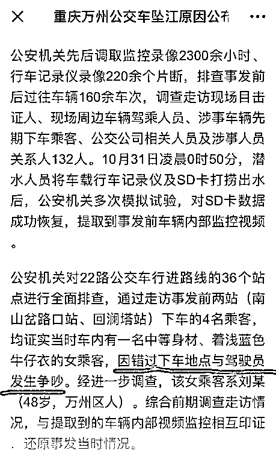
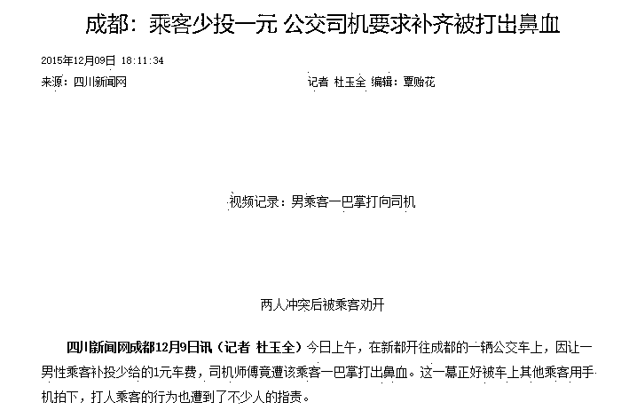
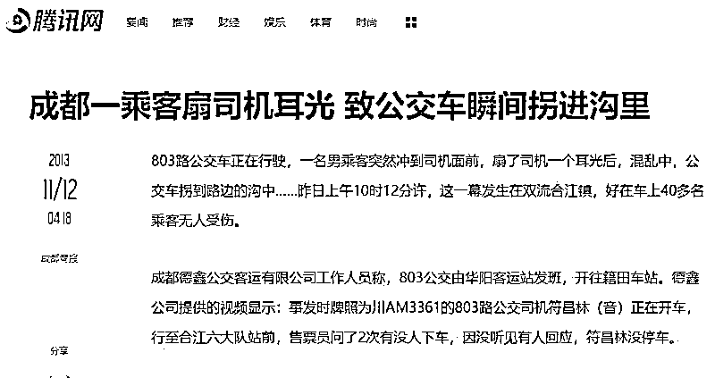
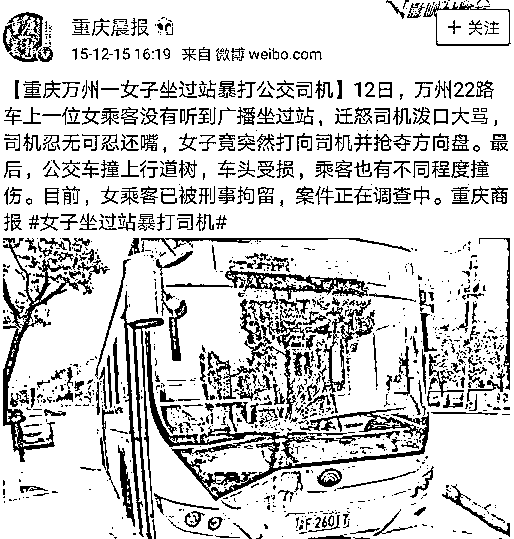
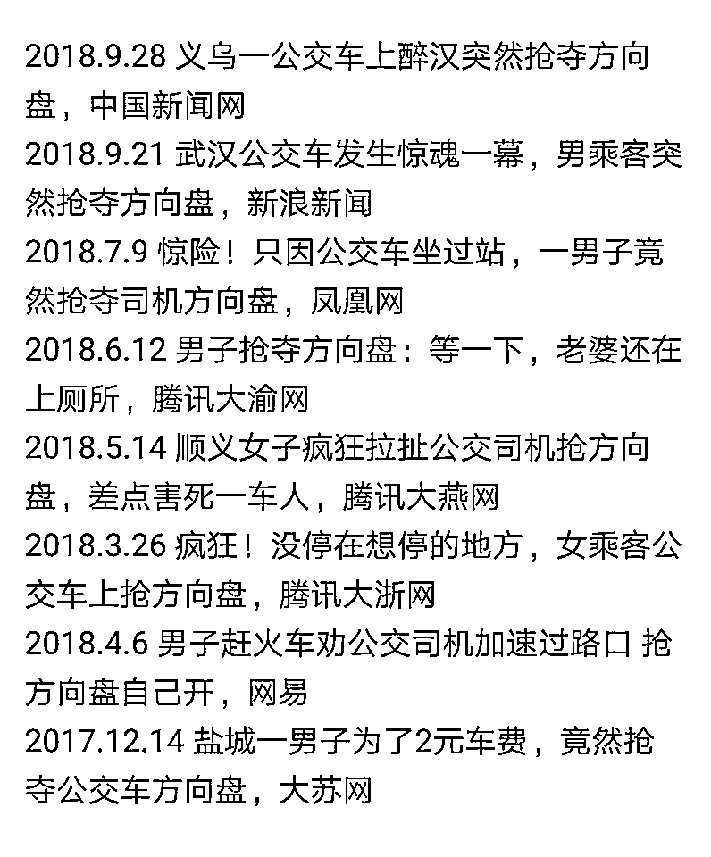
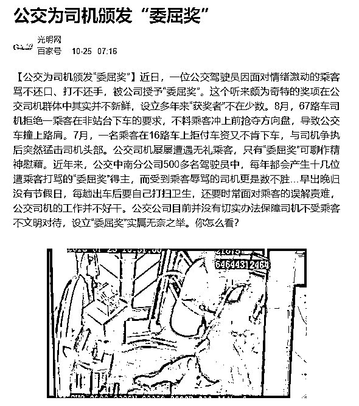
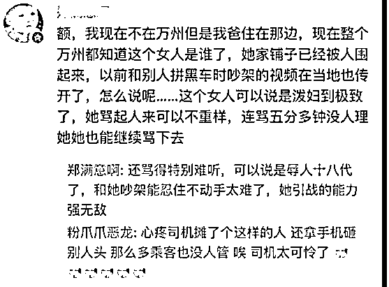
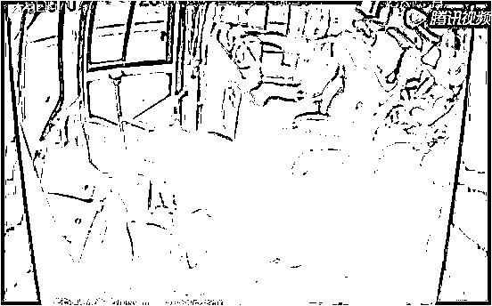

# 敢动司机方向盘的人，都是谋杀犯

喜欢我的都关注我了~

最近几天，重庆万州公交车坠江事件牵动人心，这辆公交车在跨江大桥上行驶的时候突然转向冲入江中，当时的桥面和水面的高差达到 50m，在巨大的冲击力下，可以说是入水瞬间就会被震晕，随后沉入了 70m 深的水底，生存概率几乎为零。

昨天夜里，公交车残骸被打捞出水，警方找到了车上的监控设备并予以还原，这让我们发现，原来这次惨案的诱发原因，竟然是因为司机在行驶过程中被一位女乘客殴打导致方向盘失控。

根据警方大量的走访调查，乘客和司机起冲突的原因，是乘客刘某因为错过站而和司机发生剧烈争吵，进而动手殴打正在驾驶中的司机，在司机还手的过程中方向盘失控，导致车辆剧烈转向掉入江中从而引发悲剧。 

为什么刘某想殴打司机，因为她错过了站要求司机停车，司机恪守规矩就是不停。为什么刘某敢于殴打司机，因为她根本不认为这算个什么事，也吃准了打几下司机也不会有什么惩罚。不信你看这个新闻，把司机打出鼻血，也仅仅只是被指责而已，**指责有用的话，还要法律做什么**。 

但是实际上，在行驶的过程中别说殴打司机，利用言语刺激司机导致其情绪激动都是严重危机行车安全的事情，大家应该都有开车的时候吵架的情况，情绪一激动有时候就猛踩刹车甚至想直接撞前面的车。而这次的公交车司机是在正常行驶过程中被无故殴打，这种情况导致车辆失控的概率非常的高。

成都以前也出过类似的事情，司机挨了一耳光之后，车辆立刻失控直接拐入沟里去了，幸好只是沟，**如果旁边是江，下场不会比重庆万州事件好哪去**。 

重庆万州其实以前就出过类似的事情，一名坐过站的女子大骂驾驶员，司机忍不住还嘴，女乘客竟然突然出手抢夺方向盘，导致车辆直接失控一头撞到旁边的树上，还是那句话，幸好旁边不是江，不然就不会是车头受损了，**全车人直接团****灭。 **

那么这种肆无忌惮对司机动手的事件是不是很罕见呢，当然不是，类似的事件简直铺天盖地，中国人普遍没有**车辆驾驶安全风险意识**，殴打司机的人认为没什么事，只是一次小冲突而已，旁观的乘客也认为没什么事，而且事不关己，那就高高挂起。仅仅 2018 年，类似的乘客干扰司机甚至抢夺方向盘的事故，仅仅上新闻的，就有这么多。 

密密麻麻的数据吓不吓人？还有更吓人的，很多公交车公司都给司机设立了**“委屈奖”**，获奖的司机还挺多的。 

“委屈奖”是个什么鬼，遭到乘客打骂的驾驶员才有资格获奖，而驾驶员一般都是在驾驶状态，罕有在静止状态下和乘客起冲突的司机。那么这哪里是委屈奖锕，这简直是**活命奖**，全车人的生命都处于危险状态，全靠司机忍辱负重才得以活命的。 

有人打骂司机，就等于是在谋杀你

刚才说，很多乘客认为事不关己，所以高高挂起，那么**真的事不关己吗？**

这次公交坠江，共有 15 名遇难者，已经找到 13 具遗体，还有 2 人失踪，这次的悲剧，车上 15 人全都有错，乘客刘某有错，司机有错，其余袖手旁观的人也有错，雪崩发生时，没有一片雪花是无辜的。

视频中公交坠江前车里响起了凄厉而绝望的惨叫，如果能早点制止乘客刘某的违法行为，就不会产生这样的惨剧，**驾驶过程中任何对司机的干扰，都是在威胁全车人所有生命。**

上车之前，司机和乘客都是陌生人，能在短短的时间内产生剧烈冲突并且殴打司机的人，肯定不是什么良善之人，这次的乘客刘某据称就是一个骂大街的高手，凶悍到敢直接拿手机砸司机的头。 

碰到这么凶悍的泼妇，很多人自然不想去惹这么麻烦，中国社会已经极度冷漠，热心帮忙的人没有好下场这是非常普遍的事情。但是在公交或者大巴上，这个冷漠定律就失效了，无论挑事的人再怎么凶悍，你都要立刻上前制止，因为**她威胁的不是司机，而是你的生命**。

今年 4 月 20 日上午，一辆长途大巴在高速公路上遭遇险情，一名中年男子突然冲向驾驶室，与司机发生争执，朝其怒吼，并伸手争夺方向盘，司机牢牢护住了方向盘，但是车辆发生了剧烈摆动，要知道这是在高速上，一旦发生碰撞立刻就是车毁人亡。

紧急关头，杀出一名乘客，**一脚踹飞违法男子**，制止其行为，保住了全车人的性命。 

对于这一脚，我必须说，**踹的好！**按现行法律，抢夺方向盘的男子应该**以危害公共安全罪刑拘**，而踹人男子**无罪**，且属于**见义勇为**。

国外很多国家，对驾驶状态的司机，都是给与严格保护的，因为这是一个特殊的工种，一车人的性命都捏在司机手里。

香港法律规定巴士司机的位置必须安装有护栏，一般人根本无法靠近司机。大巴车上还有警示牌，**和车辆行驶中的司机交流属于违法行为**。司机开车的时候必须全神贯注，你分散他的精力就是拿全车人的生命开玩笑，至于殴打司机，那恶劣程度更是不用多说。

加拿大法律规定，公交车司机一旦受到乘客的干扰，无论是言语还是肢体攻击，**司机必须立刻停车且离开驾驶位**，不允许负气驾驶。公交车上有一键报警系统，直接按钮报警，三五分钟就会有数辆警车将公交车包围并逮捕肇事者。

驾驶员对方向盘的每一次扭动，都是在和你生命直接相关，别以为辱骂殴打驾驶员是什么小事，那是可以直接刑拘的大事，而车上的所有乘客也应该立刻挺身而出，因为他**表面上是在打驾驶员，实际上是在要你的小命。**

**敢动司机方向盘的人，都是谋杀犯**，对于这样的人不需要客气，你的生命不应该被方向盘所掌控，**更不应该被一个流氓乘客所掌控**，这种行为的恶劣性质及可能导致的严重后果必须**普及给大众**，让大家都重视司机的驾驶安全问题。

公交入水的一瞬间，车上所有乘客就和他们的家人就天人永隔了，这样的悲剧发生一次就够了，我不希望再发生第二次。

下次乘车的时候记住了，**有人在干扰驾驶员，就等同于在谋杀你**。

觉得此文的分析有道理，对你有所帮助，请随手转发。

长按下方图片，识别二维码，即可关注我

近期精彩文章回顾（回复“目录”关键词可查看更多）

华为员工都这么穷，怪不得拼多多能火 | 房价跌 20%就会全面崩盘，地产杠杆远比你想的要脆弱 |  为什么碧桂园的质量那么差 | 清醒点，放弃全面开征房产税的幻想 | 央行和财政部隔空掐架，我支持央妈 |中国土地制度源自香港，但是香港却是劏房密布 | 为什么中介哄抢租赁房源，因为贩毒都没它来钱快