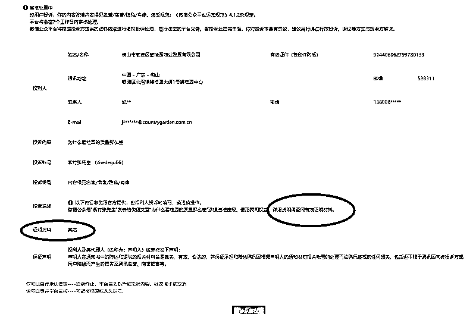
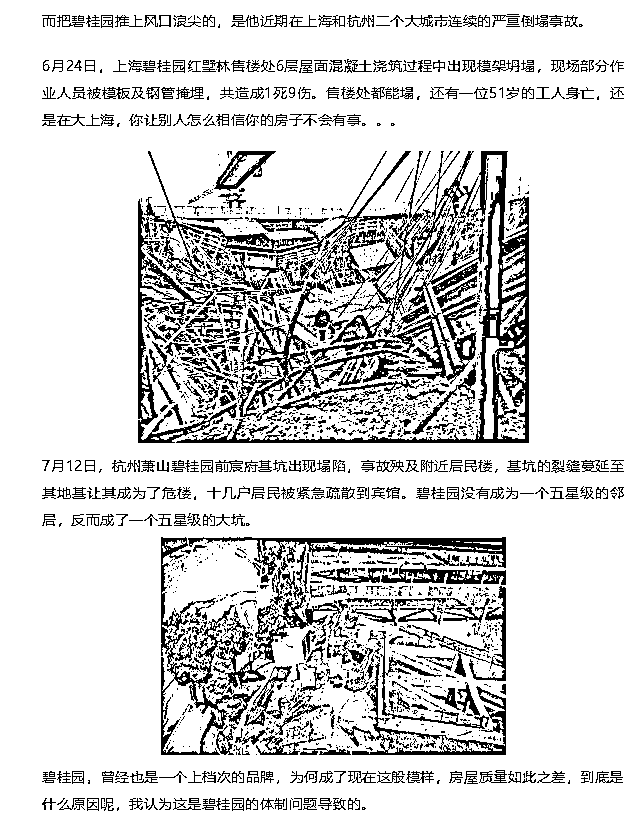
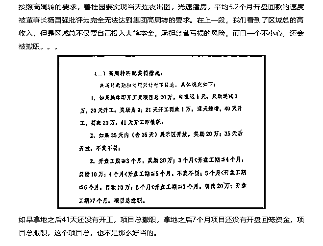
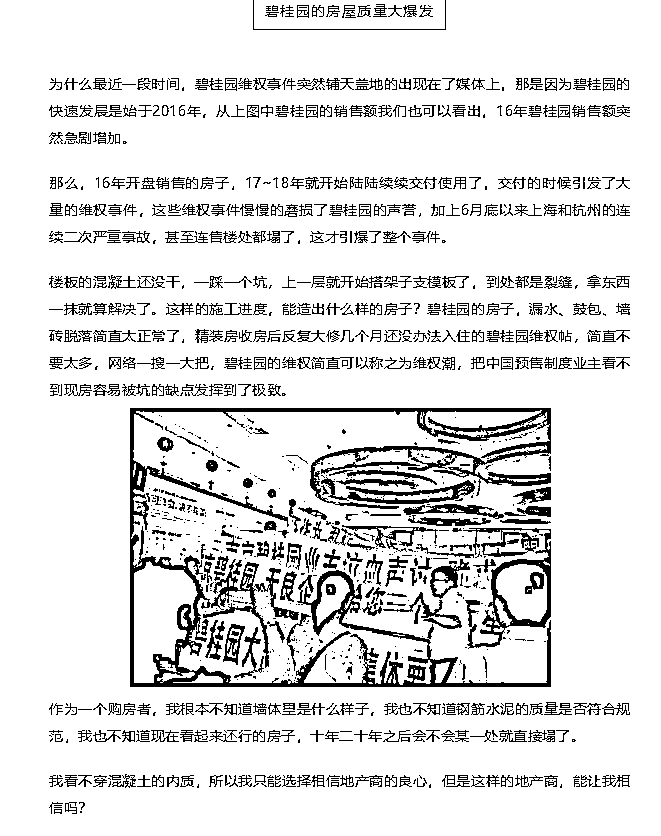

# 今天我收到了碧桂园的侵权投诉

今天写完文章后打开后台，突然看到一条侵权投诉信息，打开一看，原来是碧桂园的侵权投诉信息。

打开一看，原来是佛山碧桂园总部直接发起的投诉，说我发表的微信文章“为什么碧桂园的质量这么差”涉嫌违法违规，侵犯我司权益，详细证据参见证明材料。

我立刻把视线移到证明材料上面去，看看能提供什么证明材料，没想到就二个字“其他”，啥都没看到，我的内心有一万匹草泥马滚滚而过，这是在耍我吗。。。

为什么没有证明材料呢，因为我用的都是真材实料，里面所有内容，都是截取权威媒体的报道，都是已经发生的事实，所有论据都是站得住脚的，所以无懈可击。

我们来回顾下这篇百万级阅读的文章，首先是阐述了碧桂园在上海和杭州出现的严重工程事故，这可是全中国人都知道的事实。

下一段，我阐述了碧桂园的高周转制度，高周转是工程质量难以保证的直接原因。高周转是碧桂园总部直接下文的，文件都被人拍成照片发到网上了。。。

然后，我列举了碧桂园业主的维权事迹，说实话，我这一段已经写的很轻了，这种维权图片网上随便一搜都几十个，我只选了一张图简单的说了一下，还要怎么轻啊。

把全国媒体都报道的事实列在一起，如果这都算侵犯碧桂园权益的话，那所有的媒体是不是都要起诉一遍啊。

我在《知名媒体走进碧桂园，进门就送香奈儿》一文中曾经说过，与其公关媒体，不如提高自身，媒体的笔只能改变短期的舆论，而民众的嘴才能改变长期的舆论。碧桂园的安身立命之本是购房者的口碑和评价，而不是那些媒体和记者。

这些都是金玉良言，可惜碧桂园好像没有听进去，这些天在不断的试图删帖，这都开始以总部名义直接对微信进行投诉了。

对了，关于碧桂园对媒体大送香奈儿的那篇帖子，已经数百万阅读了，碧桂园总部你的投诉侵权什么时候发起啊，我这边接着呢。

除非你没有给这些媒体送香奈儿，**否则就算上法庭**，碧桂园也一定是败诉的。

在前几天发的送香奈儿那篇文章里，曾有粉丝问我，如果碧桂园花一百万我删不删，我明确的回答不删。

现在还可以加一句，给一百万不删，上法庭也不删，就这么看着办把。

如果号被封了，失联了可以来我的复活号找我：紫色后花园。扫描下方二维码即可关注。

